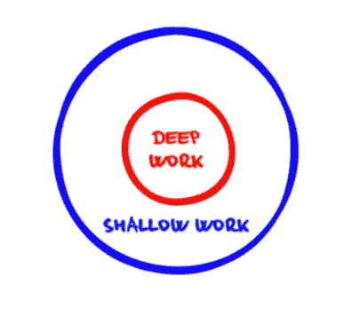
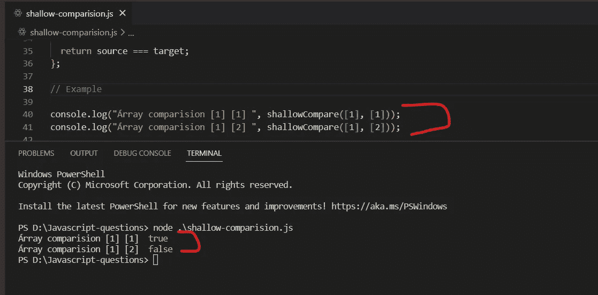
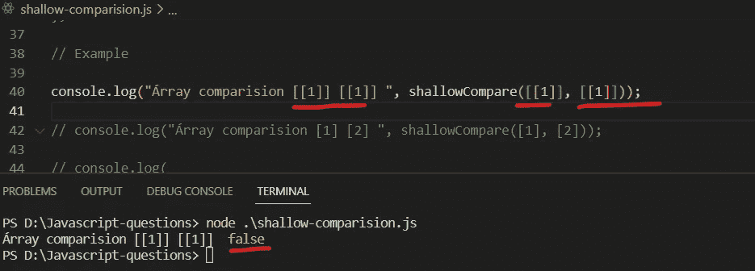
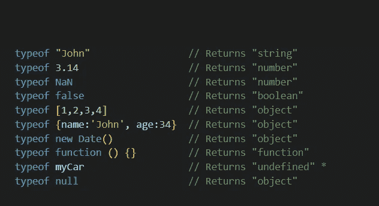
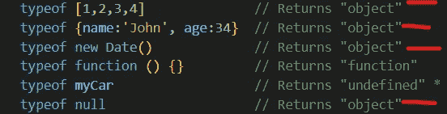
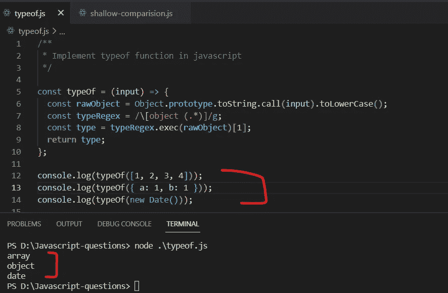
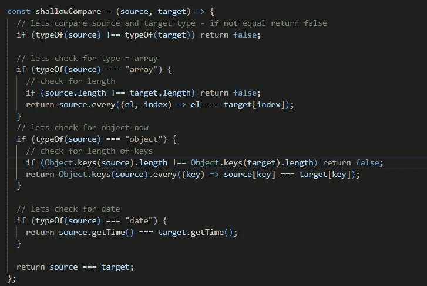
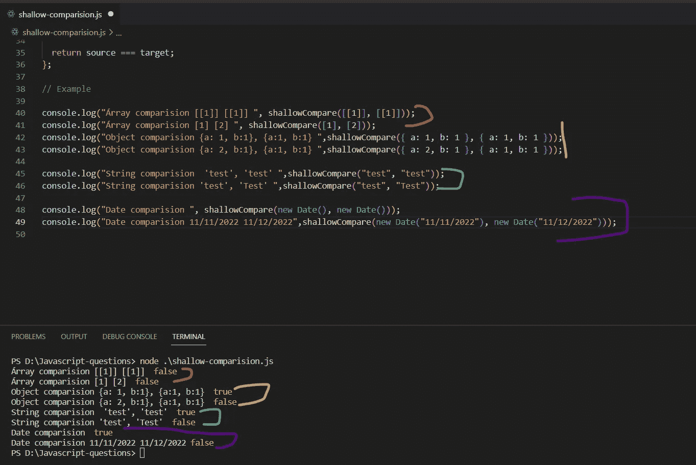
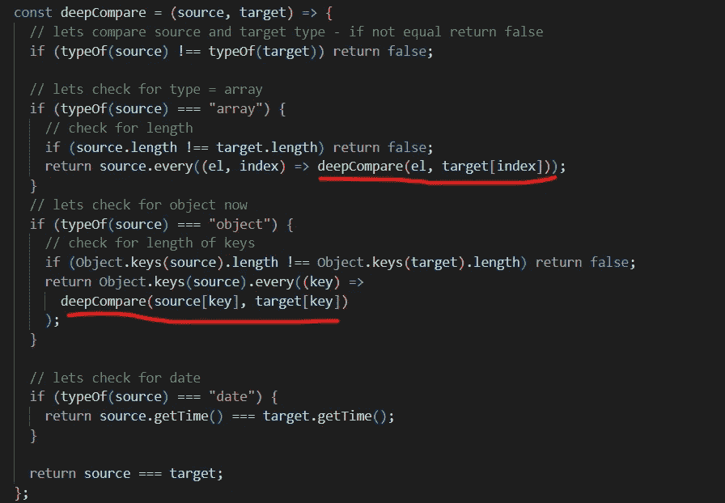
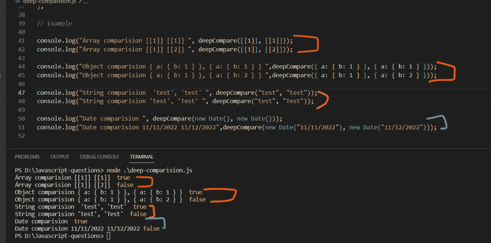

# JavaScript 方法的自定义实现

> 原文：<https://javascript.plainenglish.io/custom-implementation-javascript-methods-part-2-fa9456ca79a4?source=collection_archive---------12----------------------->

## 第 2 部分:用 JavaScript 中的 typeof 运算符自定义实现 shallowCompare()和 deepCompare()。

# Deep/Shallow 与运算符类型的比较

嗨，伙计们，今天我将向你们展示如何使用自定义的 typeof 操作符为浅层和深层拷贝编写自定义的实现。

**我们开始吧。**

首先，我们需要知道什么是浅层比较和深层比较。当我们在采访中被问到这些术语时，它们非常吓人，但是一旦你理解了 JavaScript 运行时环境，它们的意思就变得非常简单了。

让我告诉你，在 JavaScript 中，基本类型和非基本类型之间的比较在某些部分非常令人困惑，但是如果你确切地知道 JavaScript 中基本类型和非基本类型之间的区别，这些将很容易回答并向其他人解释。

## JavaScript 中的原语类型和非原语类型是什么？

*原始数据类型不是任何对象，也没有附加属性或方法的数据类型。*

**有 7 种原始数据类型:**

*   线
*   数字
*   bigint
*   布尔型
*   不明确的
*   标志
*   空

与原语数据类型相关的重要一点是所有原语都是不可变的。也就是说，它们不能被改变。

如果你需要了解更多关于原始数据类型的信息，请访问:[https://developer.mozilla.org/en-US/docs/Glossary/Primitive](https://developer.mozilla.org/en-US/docs/Glossary/Primitive)

*非原始数据类型被称为派生(引用类型),这意味着它仅从原始数据类型派生而来。*

*   数组
*   目标

现在我们对什么是原始数据类型和引用数据类型有了一点了解，让我们继续深入浅出比较的话题。

## 1.浅层比较()

浅层比较是一种检查两个值是否相等的比较。应该在一个级别上检查它，这意味着嵌套对象引用还没有准备好进行比较，只允许在原始和非原始数据类型之间进行一个级别的比较。

Shallow comparison on 1st level

该图表明，如果发生浅层比较，它应该正确地发生在一个级别，而不是嵌套级别。

Shallow comparison is not allowed on nested references.

*在我们跳转到* ***自定义实现浅层比较*** *之前，我们需要再做一个自定义实现* ***typeof 运算符*** *(一个内置的 JavaScript 方法)——你可以使用* `*typeof*` *运算符来查找一个 JavaScript 变量的数据类型。*

Inbuilt type of operator

我认为 JavaScript 的一个主要缺点是，它会返回所有引用类型的对象类型，如数组、对象、日期、空值等。

*所以如果你需要知道它是数组还是对象，那是不可能的。它总是返回一个令人困惑的对象，但毕竟它是由 JavaScript 设计人员设计的，记住数组被当作一个对象，这是因为它在 JavaScript 中具有动态类型的特性。***

***所以，要实现展示它是数组还是对象，还是日期的功能，我们需要编写我们自定义的 typeof 运算符。***

让我给你看看它的样子:

## ***自定义实现—运算符类型***

Custom TypeOf operator

现在，我们得到了所传递的引用数据类型的确切类型，无论是数组、对象还是日期。

在做任何进一步的拖延之前，让我们集中精力进行肤浅的比较。

## **自定义实现— shallowCompare()**

在这个实现中，我们使用了自定义的 typeof 操作符来检查它是数组、对象、日期还是其他什么。该函数将只在一个级别上进行浅层比较，而不是在嵌套级别上。让我们看一个例子:

Examples

# 2.深度比较()

深度比较是一种检查两个值是否相等的比较，应该在所有级别进行检查，这意味着嵌套的对象引用已准备好进行比较。深度比较是在嵌套对象、数组等上测试的。

## **自定义实现— deepCompare()**

Deep comparison

只有一点需要注意的是，在深度比较中，由于多级或嵌套级的比较，需要对同一个函数进行递归调用。因为我们有嵌套的对象和数组，我们需要在多个层次上检查它们。

此外，由于递归调用，深度比较比浅层比较要慢。

让我们看看例子:

Deep comparison examples.

因此，我们已经了解了 JavaScript 中的 typeof 运算符、shallowCompare()和 deepCompare()函数的自定义实现，以及它们是如何用于处理和比较原始和非原始数据类型的。

在定制实现的下一部分中，我们将看到更多的定制实现，这将有助于您理解幕后发生的事情。敬请关注更多内容！

*希望你喜欢，请鼓掌、订阅、分享，并保存以备将来参考。:)*

*谢谢*

*更多内容请看*[***plain English . io***](https://plainenglish.io/)*。报名参加我们的* [***免费周报***](http://newsletter.plainenglish.io/) *。关注我们关于*[***Twitter***](https://twitter.com/inPlainEngHQ)[***LinkedIn***](https://www.linkedin.com/company/inplainenglish/)*[***YouTube***](https://www.youtube.com/channel/UCtipWUghju290NWcn8jhyAw)*[***不和***](https://discord.gg/GtDtUAvyhW) *。对增长黑客感兴趣？检查* [***电路***](https://circuit.ooo/) *。***