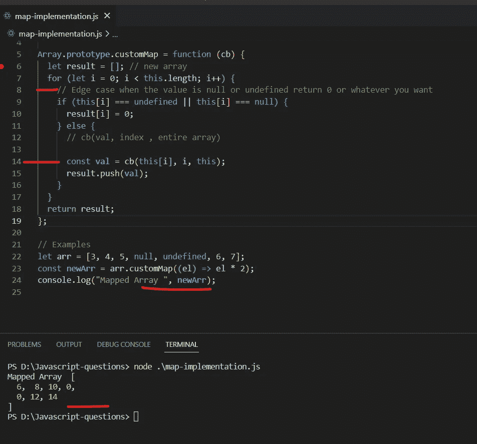
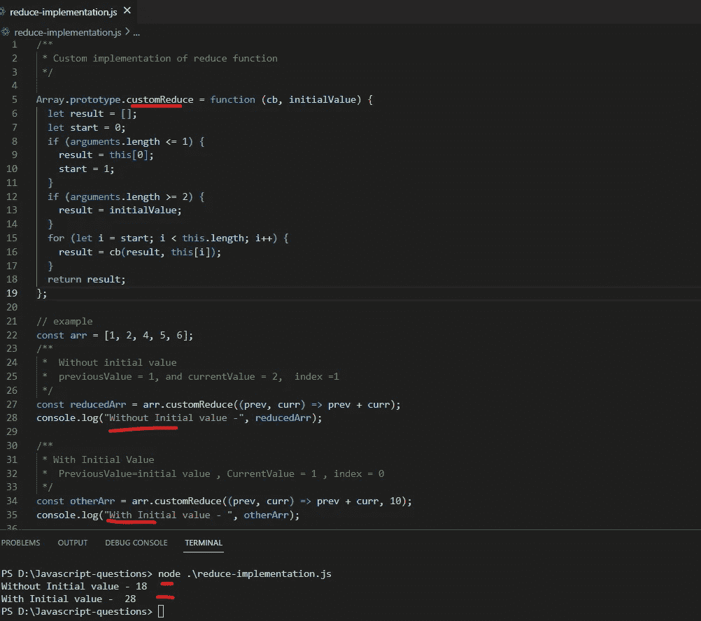
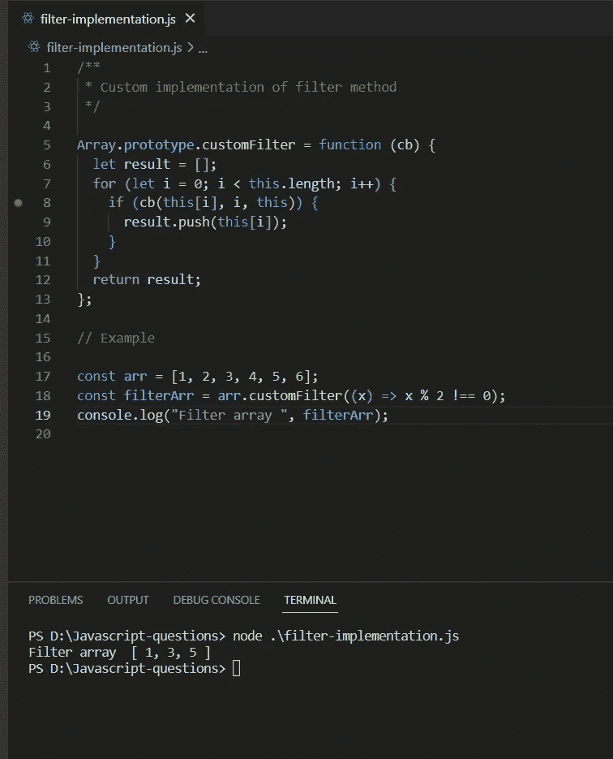

# JavaScript 中数组方法的自定义实现或聚合填充

> 原文：<https://javascript.plainenglish.io/custom-implementation-or-polyfills-in-javascript-7ed7e907d812?source=collection_archive---------14----------------------->

## 第 1 部分:JavaScript 中 map()、reduce()和 filter()方法的自定义实现。

# JavaScript 中的聚合填充

大家好，今天我将向你们展示 3 个广泛使用的著名数组方法的实现，或者我们称之为 Polyfills(自定义实现)。

这是面试官可以要求你写的关于这些方法(映射、减少、过滤)的幕后实现的东西。这些函数是每次为数组的新副本编写的，所以它不会改变你的实际数组。

Photo by [AltumCode](https://unsplash.com/@altumcode?utm_source=medium&utm_medium=referral) on [Unsplash](https://unsplash.com?utm_source=medium&utm_medium=referral)

# 1.地图()

*   map()是一个接受回调函数的方法，该函数为数组的每个元素执行。简单地说，它用于操作/转换数组中的元素。
*   它返回一个新数组(这意味着它不会变异或改变你的实际数组)。
*   从映射中出来的数组是一个变换后的数组，它可能与实际的数组相同，也可能不同。

## 自定义实现

Custom map implementation

map()的自定义实现将返回转换后的数组。

## 为什么需要附上它的原型？

因为数组就像一个对象，它有一些内置的方法。要覆盖或编写我们的自定义方法并使它们对 array 类可用，它需要附加到将在 JavaScript 中进行继承的原型链。因此，要使数组或对象的任何自定义方法可用，您需要在它的原型链上调用您的方法。

# 2.减少()

*   reduce()是一个接受回调函数的方法，这个回调函数叫做 reducer。
*   它在数组的每个元素上被调用，最后累积成一个值。

callbackFunc(reducer)包含以下参数:

1.  **previousValue:** 我们从最后一次函数调用中得到的值。在第一次调用时，如果给定，它将返回' **initialValue** ，否则，它将返回 **arr[0]的值。**
2.  **当前值**:当前元素的值。在第一次调用时，如果给定了 **initialValue** ，则返回 arr[0]的值，否则返回 arr[1]的值。
3.  **currentIndex** :元素的当前索引。如果给定了 **initialValue** ，它必须为 0，否则应该从索引 1 开始。
4.  **数组**:用于遍历的数组。

**用例:**

1.  没有初始值
2.  带初始值

Custom implementation of Reduce()

# **3。过滤器()**

*   filter()方法接受一个回调，该回调对给定数组的每一项执行。
*   同上—它返回一个新数组。
*   它将返回过滤后的真值。

Custom implementation of the filter() function.

这是一些数组方法的自定义实现的工作方式，也是一个很好的起点，在这里您可以学习 JavaScript 如何在幕后创建其内置的方法实现以及它是如何工作的。

您可以像这样创建自己的 Polyfills 或自定义方法，并将其附加到 prototype 链，以使其可用于 JavaScript 环境中使用的引用或抽象类。

希望你喜欢它，请鼓掌，订阅和分享，并保存它以供将来参考。:)

*谢谢*

*更多内容看* [***说白了就是***](https://plainenglish.io/) *。报名参加我们的* [***免费周报***](http://newsletter.plainenglish.io/) *。关注我们关于* [***推特***](https://twitter.com/inPlainEngHQ) ， [***领英***](https://www.linkedin.com/company/inplainenglish/) *，*[***YouTube***](https://www.youtube.com/channel/UCtipWUghju290NWcn8jhyAw)*，以及* [***不和***](https://discord.gg/GtDtUAvyhW) *。对增长黑客感兴趣？检查* [***电路***](https://circuit.ooo/) *。*