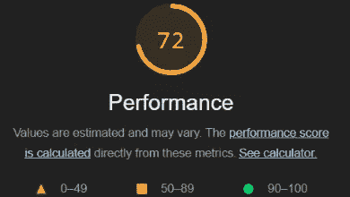

# 角形定制管道——终极指南

> 原文：<https://javascript.plainenglish.io/custom-pipes-in-angular-the-ultimate-guide-e54bb400e3ce?source=collection_archive---------1----------------------->

## 角度定制管道|性能优化

## 如何在 Angular 中创建自定义管道，什么是纯管道和不纯管道，以及如何使用纯管道来提高应用程序的性能。


Photo created using Canva — Angular logo from the [Angular PressKit](https://angular.io/presskit)

[Angular 中的管道](https://angular.io/api/core/Pipe)是在组件模板表达式中使用的函数，用于将值转换成另一种显示格式。Angular 有几个内置管道，比如日期管道、[异步管道](/angular-async-pipe-714dd864adaa)等等。但是，如果这些管道不能满足我们的需求，我们可以创建自己的管道。

在本文中，我们将研究:

*   如何**在 Angular 中创建定制管道(**手动/使用 Angular CLI)
*   如何使用管道和传递额外的参数
*   什么是**纯管道和不纯管道**
*   如何使用纯管道和内存化提高性能

**所以，让我们开始吧！**

# **在角度中创建自定义管道**

**要创建自定义管道，我们需要遵循 3 个简单的步骤:**

****1。创建一个类并用** `[**@Pipe**](https://angular.io/api/core/Pipe)` **装饰器装饰它。装饰器必须包括我们将要用来调用管道的`name`。****

****2。实现** `[**PipeTransform**](https://angular.io/api/core/PipeTransform)` **界面。这个接口有一个我们需要实现的方法:`transform`方法。****

**`value`是管道应用的参数。`...args`称为“休息参数”。它被视为无限数量的可选参数(零个或更多)。如果我们不需要传递任何额外的参数，我们只传递第一个参数。最后，我们返回转换后的值。**

****3。在模块的** `**declaration**` **数组中添加自定义管道。****

**从 [Angular v14](/the-new-features-of-angular-v14-851995870f59) 开始，我们也可以将管道添加到在模板中使用它的任何独立组件的`imports`数组中。**

**这就结束了在角度中创建和注册*定制管道的手动方式。***

# **使用角度 CLI**

**如果这对你来说是一项繁重的工作，不要担心。我们掩护你！**

**Angular CLI 提供了一种快速生成拔模管类的方法。它还在`AppModule`中注册管道。命令是:**

```
ng generate pipe <path-to-directory>/<pipe-name>
```

**或者简称为:**

```
ng g p <path-to-directory>/<pipe-name>
```

**例如，我们通过运行以下命令创建了`mark`管道:**

```
ng g p pipes/mark
```

**CLI 生成了下面的 draft pipe 类，准备将我们想要的任何逻辑放入`transform`方法中。**

# **使用管道**

**使用管道的语法为:**

```
<value> **|** <pipe-name>
```

**例如，`gender`管道接收熊猫的性别并返回一个引导图标类。**

****奖励—** 我们还可以用链条连接管道。执行顺序是从左到右。**

```
<value> **|** <pipe-name1> **|** <pipe-name2> **|**...
```

# **P **辅助额外参数****

**用于传递额外参数的语法是:**

```
<value> **|** <pipe-name>**:** <arg1>, <arg2>, ..., <argN>
```

**在我们的演示中，`mark`管道接收两个字符串值:要转换的值和一个搜索词。如果该值包含搜索词，该词会带有下划线并变成红色。**

**我们还创建 CSS 类来定义样式。**

**最后，我们在模板中使用管道。**

**现在，如果我们寻找一只熊猫:**

****

# **纯管道**

**默认情况下，管道被定义为*纯*。为了清楚起见，我们可以这样明确地设定纯粹属性:**

**属性为`true`的`pure`通知 Angular】方法是纯的。**

**如果一个方法总是为相同的参数返回相同的结果，并且没有副作用，比如修改参数、全局变量或者除了返回值之外的任何其他东西，那么这个方法就被称为纯方法。**

**Angular 知道在这些条件下，除非输入值改变，否则`transform`方法的结果不会改变。因此，只有当它检测到输入值的变化时，它才会执行管道。**

# **不纯净的管道**

**相反，通过将`pure`属性设置为`false`，我们声明了一个*不纯管道。每当 Angular 检测到每一次击键或鼠标移动的变化时，它将执行一个不纯的管道。***

**那为什么会有人想用不纯的烟斗呢？**

**当我们想要[检测复合对象](https://angular.io/guide/pipes#detecting-impure-changes-within-composite-objects)中的不纯变化时，通常使用不纯管道。**

**将对象传递给管道时，Angular 仅检查参照是否有变化。如果物体的某个属性内部发生了任何变化，Angular 将无法判断。**

**在任何情况下，使用不纯的管道都要非常小心。官方文档指出“一个长时间运行的不纯管道会极大地降低您的应用程序的速度”。**

# **提高应用程序性能**

**注意到了吗，当我们在上一个 GIF 的末尾清除搜索输入框时，会有很大的延迟？让我们看看是什么导致了这个问题，以及我们如何使用自定义管道来解决这个问题。**

## **问题是**

**问题的原因在调用`calculatePopularity`方法的`PandaComponent`模板文件中。**

**在组件的类文件中，`calculatePopularity`方法使用当前熊猫的出生年份来计算它的受欢迎程度。出于演示目的，我们使用斐波那契数列和一个未优化的递归实现。**

****为什么调用模板中的方法会导致性能问题？****

**要回答这个问题，我们需要了解 Angular 的变化检测机制的基础。Angular 运行变化检测，以确定当发生变化时，UI 的哪些部分需要重新呈现。被调用方法的结果是 UI 的一部分。**

****Angular 怎么知道一个方法的结果有没有变化？****

**它不能！只有一个方法可以知道:通过再次执行它。换句话说，它将在每次检测到更改时运行该方法，即使该更改是不相关的。**

**这将降低应用程序的性能。多少取决于被调用的方法做什么。在我们的演示中，我们做了一个繁重的、重复的、未优化的计算，因此出现了我们之前观察到的延迟。**

**你也可以通过加载时间判断出问题。我们运行 Lighthouse，它产生了以下分数。**

****

> ****注意:**灯塔报告评分基于页面的加载时间，而不是与页面交互时的时间。**

## **首次改进**

**第一步，我们将组件的`changeDetection`策略更改为 `[OnPush](https://angular.io/guide/change-detection-skipping-subtrees#using-onpush)`。这意味着只有当`@Input`属性改变时，才会触发`PandaComponent`内部的变化检测。**

**这大大减少了加载时间。运行 Lighthouse 证实了改进。**

****

**这改进了加载时间，但没有改进应用程序的交互时间。**

****

**这是因为每次我们输入一些东西，我们都在执行一个搜索，这会改变`filteredPandas`的引用。**

**panda 组件的输入属性也是如此。**

**结果，他们模板中的`calculatePopularity`方法又被调用了。**

## **纯净的管道拯救世界**

**这就是纯管道发挥作用的地方。我们创建一个纯粹的定制管道，仅在管道的输入发生变化时执行所需的计算。**

**然后我们使用管道而不是调用方法。现在，除非传递给管道的值发生变化，否则不会重新计算流行度。简单地说，我们不再计算在结果中仍然可见的熊猫的受欢迎程度。**

**这在很大程度上减少了交互时间，并使应用程序工作顺畅。因为加载时间没变，灯塔评分也没变。**

****

## **纯管道和记忆**

**之前的改进是有的，但是为什么最后应用还是滞后？**

**当我们清空搜索区域时，所有的熊猫都变得可见。因此，以前被隐藏的熊猫现在被重新呈现，它们的受欢迎程度必须被重新计算。**

**我们能做得更好吗？是的，我们可以！**

****如何？**进入记忆化！**

**管道是纯的，因为斐波那契是一个纯函数。既然是这样，我们可以缓存计算结果，而不是从头开始重新计算。为此，我们通过运行以下命令来安装`memo-decorator`包:**

```
npm install memo-decorator
```

**然后我们用`@memo`装饰器装饰我们的`fibonacci`方法。**

**这一句话足以改变现状吗？好吧，你自己看吧！**

**应用程序加载速度更快，这也反映在灯塔评分。**

****

**此外，互动变得尽可能顺畅，没有任何滞后发生。**

****

**如果您得到的 Lighthouse 分数比我们的分数低 50 分，这可能是因为您在开发模式下运行应用程序。您需要将应用程序作为生产版本来提供。为此:**

1.  **安装 [http-server](https://www.npmjs.com/package/http-server) : `npm install http-server -g`**
2.  **构建应用:`ng build`**
3.  **服务于生产构建:`http-server dist/ng-custom-pipe-demo`**

**和往常一样，你可以在下面找到一个 StackBlitz 演示。别忘了[订阅我的简讯](https://vkagklis.medium.com/subscribe)获取更多类似内容！**

# **结论**

**在本文中，我们研究了 Angular 中的自定义管道。我们解释了如何创建、使用和传递额外的参数。我们看到了纯净管道和不纯净管道之间的差异。最后，我们结合了纯管道和内存化来提高应用程序的性能。**

**感谢阅读！我希望你喜欢这篇文章。**

**编码快乐！**

***更多内容请看*[***plain English . io***](https://plainenglish.io/)*。报名参加我们的* [***免费周报***](http://newsletter.plainenglish.io/) *。关注我们关于*[***Twitter***](https://twitter.com/inPlainEngHQ)[***LinkedIn***](https://www.linkedin.com/company/inplainenglish/)*[***YouTube***](https://www.youtube.com/channel/UCtipWUghju290NWcn8jhyAw)*[***不和***](https://discord.gg/GtDtUAvyhW) *。*****