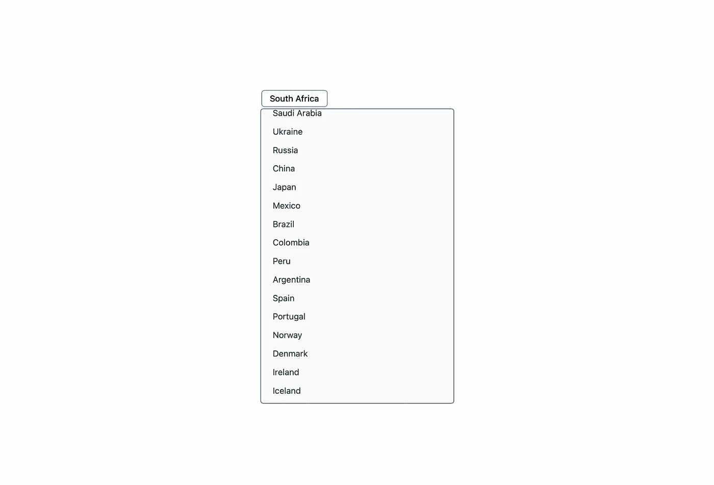
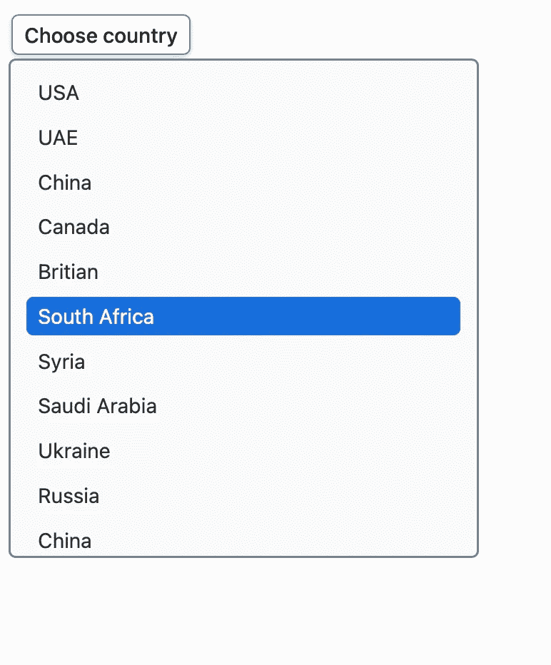

# React 和样式组件中的自定义选择组件

> 原文：<https://javascript.plainenglish.io/custom-select-component-in-react-and-styled-components-e1f3b0a3a287?source=collection_archive---------3----------------------->

## 如何在 React 中创建自定义下拉列表的指南。

如果你想在 HTML 中定制选择元素，大多数时候你不能定制它的风格。这就是我教你在 React 中创建自定义下拉列表的原因。



Custom dropdown

说真的，HTML 中的默认浏览器选择元素糟透了！如果你尝试过定制它，你就会明白。这将是一件很麻烦的事情！因此，让我们用样式化组件库在 React 中创建一个自定义选择组件。

## 重要的事情，首先😁！

使用任何工具设置一个 React 应用程序并安装 styled-components 包。

在 **src** 文件夹中创建一个**组件**目录。然后在里面创建一个名为**的子文件夹，选择**。在此创建一个 index.js 文件。这是我们将要为 select 组件编写必要代码的文件。在大多数情况下，这个组件必须是可重用的，应该像 HTML 中默认的 select 组件一样。

## 让我们开始编码⌨️吧！

好的，首先，创建一个功能性的 react 组件。

*提示:如果您正在使用 VSCode，请继续安装扩展* ***简单反应片段*** *。它有一些对你有用的代码片段，这些会自动为你生成一些代码！*

*所以，现在在文件中键入****RFC****并回车！您将获得一个功能组件，其功能名称作为文件的名称。*

***扩展 UR****L:*[*https://marketplace.visualstudio.com/items?itemName = Burke Holland . simple-react-snippets*](https://marketplace.visualstudio.com/items?itemName=burkeholland.simple-react-snippets)

命名功能**选择**。我们也接受一些道具！

```
const Select = ({label,values,onChange}) => {return ( <div>Select</div>);};
```

我们现在已经宣布了我们的道具！现在让我来解释一下！

*   标签:输入的占位符
*   值:可接受的值
*   onChange:一个事件处理程序，它接受一个带有新值的参数，可以对它做任何事情！

现在，在开始功能之前，让我们创建样式。

它的容器的样式！

```
const SelectContainer = styled.div`position: relative;margin: 0;`;
```

这是将占位符标签放入其中的按钮的样式。

```
const SelectLabelButton = styled.button`padding: 0.3rem 0.5rem;min-width: 7rem;font-size: 0.9rem;font-weight: 500;background-color: #fff;border: none;border-radius: 5px;color: #111;align-items: center;justify-content: space-between;border: 1px solid slategrey;cursor: pointer;box-shadow: 0 1px 4px 0 #ccc;transition: 0.3s ease;&:hover {background-color: #eee;}`;
```

现在，让我们设计下拉元素。为了切换下拉列表的可见性，我们向名为**的元素传递一个属性 isVisible** 。这将把元素的可见性设置为隐藏。并将最大高度切换到 40px。这将有助于创建幻灯片动画效果。

```
const DropdownStyle = styled.div`position: absolute;top: 0;left: 0;max-height: 40vmax;min-width: 10rem;padding: 0.4rem;display: flex;flex-direction: column;border-radius: 5px;background: #fafafa;border: 1.5px solid slategrey;transition: max-height 0.2s ease;overflow: scroll;${(p) =>p.isVisible !== true &&css`max-height: 40px;visibility: hidden;`}`;
```

现在，让我们设计下拉列表中的项目。该组件将接受一个名为**的活动属性**，它需要一个布尔值。如果它是活动的，下拉元素将突出显示。

```
const DropdownItem = styled.div`font-family: -apple-system, BlinkMacSystemFont, 'Segoe UI', Roboto, Oxygen, Ubuntu, Cantarell, 'Open Sans', 'Helvetica Neue', sans-serif;display: flex;align-items: center;width: 90%;margin: 0.15rem 0;padding: 0.3rem 0.5rem;font-size: 0.9rem;font-weight: 400;color: #333;border-radius: 0.3rem;cursor: pointer;${(p) =>p.active &&css`color: #166edc;font-weight: 500;`}&:hover, :focus, :focus:hover {background-color: #166edc;color: #fafafa;outline: none;}`;
```

我们都准备好了！

现在，在函数内部创建一个 useState()钩子。

```
const Select: (props) => { const [currentValue, setCurrentValue] = useState(''); const [open, setOpen] = useState(false); ...}
```

接下来，我们将添加一些处理函数来改变状态，并触发 onChange 回调。

```
const handleOpen = () => { setOpen(true);};const handleClose = () => { setOpen(false);};const handleValueChange = (value) => { setCurrentValue(value);};const handleChange = (value) => { handleValueChange(value); *// call method, if it exists* if (onChange) onChange(value); *// close, after all tasks are finished* handleClose();};
```

这些方法将帮助我们改变下拉列表的可见性，并改变**当前值**变量的值。

现在，我们还将这些方法与组件集成在一起。当我们点击占位符按钮时，我们触发了 **handleOpen** 功能。 **handleClose** 函数调用安装在 handleChange 函数中，这样当值改变时，下拉菜单会自动关闭。

```
return (<SelectContainer> <SelectLabelButton onClick={handleOpen}> {currentValue !== "" ? currentValue : label} </SelectLabelButton> <DropdownStyle isVisible={open}> {values.map((value, index) => ( <DropdownItem onClick={() => handleChange(value)} active={value === currentValue} key={index}> {value} </DropdownItem> ))} </DropdownStyle></SelectContainer>);
```

让我们使用这个组件:

```
import "./styles.css";import Select from "./components/Select"; export default function App() {let countries = ["USA", "Britain", "Germany", "India", "UAE", "Australia", "Switzerland"]; return ( <div className="App"> <Select label="Choose country" values={countries} onChange={(v) => console.log(v)} /> </div> );}
```

现在，继续在浏览器中查看预览。



Custom Select Component made using React and Styles Components

是不是就这么简单神奇！这个组件最好的部分是它是不可靠的！它不需要将任何状态作为属性传入，也可以使用 **onChange** 处理程序让父组件接收值。

所以，今天就到这里吧！

希望你对如何在 React 中创建自定义下拉菜单有一个好主意。

希望你今天学到了更多的东西！

支持我的工作: [Paypal](https://www.paypal.com/paypalme/haneenmahdin) 💰

如果你想了解我更多，这是我的[链接树](https://linktr.ee/haneenmahdin)🌲。

感谢你阅读❤️！

## 进一步阅读

[](https://bit.cloud/blog/introducing-component-compare-easily-review-component-changes-l4qyxtoo) [## 比特博客

### 组件驱动软件的官方博客。围绕现代组件驱动的 web 开发的文章…

比特云](https://bit.cloud/blog/introducing-component-compare-easily-review-component-changes-l4qyxtoo) 

*更多内容请看*[***plain English . io***](https://plainenglish.io/)*。报名参加我们的* [***免费周报***](http://newsletter.plainenglish.io/) *。关注我们关于*[***Twitter***](https://twitter.com/inPlainEngHQ)[***LinkedIn***](https://www.linkedin.com/company/inplainenglish/)*[***YouTube***](https://www.youtube.com/channel/UCtipWUghju290NWcn8jhyAw)***，以及****[***不和***](https://discord.gg/GtDtUAvyhW) *对成长黑客感兴趣？检查* [***电路***](https://circuit.ooo/) ***。*****