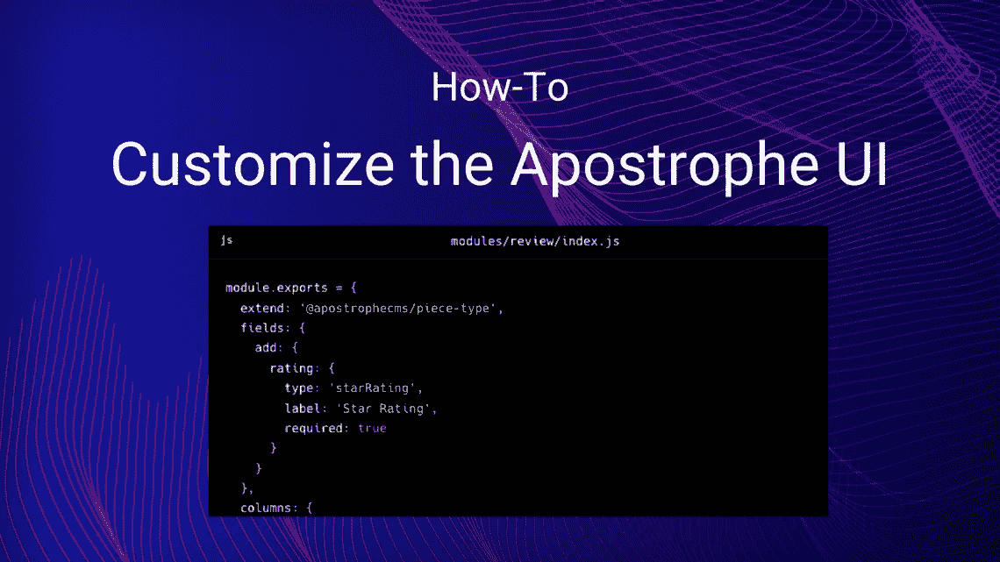
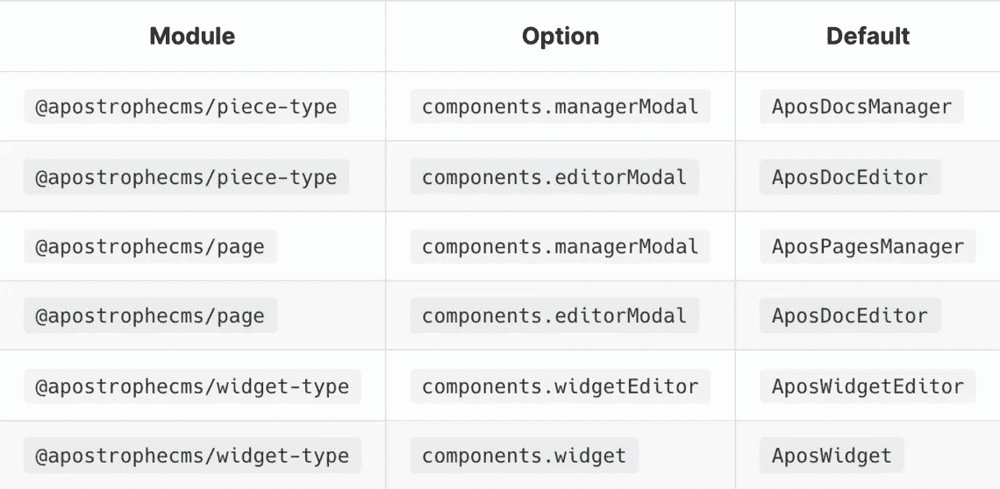

# 自定义撇号管理用户界面

> 原文：<https://javascript.plainenglish.io/customizing-the-apostrophe-admin-ui-e2d5e1929d3b?source=collection_archive---------18----------------------->

## 关于如何定制撇号的管理用户界面的指南。



本指南重点介绍如何定制撇号的管理用户界面或“管理用户界面”内置功能涵盖了大多数情况，但有时您会想要添加或更改功能。

# 警告

*   改变用户界面应该很少，而且要小心。如果可能，添加新功能，如自定义模式字段类型和自定义管理器视图列。除非绝对必要，否则避免完全重写组件。
*   覆盖 UI 组件会阻止项目从将来的 UI 改进和与该组件相关的错误修复中受益。
*   确定没有更好的方法可以达到预期的目标。这包括[不和谐地求助](https://chat.apostrophecms.org/)和[请求](https://portal.productboard.com/apostrophecms/1-product-roadmap/tabs/1-under-consideration)或[为核心贡献](https://github.com/apostrophecms/apostrophe/blob/main/CONTRIBUTING.md#apostrophecms-contribution-guide)新功能。
*   在撇号 3.x 生命周期的某个时刻，我们打算迁移到 Vue.js 3.x。我们将尽可能向后兼容，并让社区了解时间表，但在编写自定义管理 UI 组件时，必须理解将来可能需要进行微小的更改。

# 撇号管理用户界面文件结构

撇号的管理用户界面是用 Vue.js 实现的。它是由跨越各种撇号模块的许多`.vue`文件构建的。这些通常在撇号核心中找到，但是它们可以在项目中的任何地方。这意味着我们可以通过将`.vue`文件添加到任何撇号模块的`ui/apos/components`子目录中，将我们自己的 Vue 组件引入到管理 UI 中。如下所述，还可以通过提供同名组件来覆盖现有组件。

# 当我们做出改变时重建用户界面

出于性能原因，撇号项目没有配置为在每次代码更改时自动重新构建管理 UI。这是有意义的，因为在大多数项目中没有定制的管理 UI 代码，并且需要时间来构建。

然而，我们可以在每次代码更改时“选择”重新构建 UI，就像这样:

```
APOS_DEV=1 npm run dev
```

为方便起见，您可能希望为终端会话的生存期设置此环境变量:

```
**export** APOS_DEV=1
```

当然，在部署时，管理 UI 总是会重新构建。生产使用不需要特殊的更改或环境设置。

# 注册自定义字段类型

撇号的[模式字段类型](https://v3.docs.apostrophecms.org/guide/content-schema.html)涵盖了许多情况，但是我们可能希望添加一个新的。

由于这是一个更大的主题，涉及的不仅仅是 UI，我们已经创建了一篇关于如何添加自定义字段类型的文章[。但是，请注意，如果您先阅读这篇文章，您会发现阅读本文的其余部分会更容易。](https://v3.docs.apostrophecms.org/guide/custom-schema-field-types.html#implementing-the-server-side-part)

# 将自定义列添加到片段类型管理器

另一个常见的扩展是片类型管理器的自定义列。默认情况下，管理器模式显示标题、某些标志和最后一次更新的时间。我们可以扩展它来显示我们的自定义星级。

# 实现服务器端部分

让我们看一个简单的片段类型模块`review`，它利用了我们在另一篇文章中定义的[星号字段类型。我们将为 piece 类型的模式添加一个`rating`字段，并添加一个列以在管理器模式中显示它:](https://v3.docs.apostrophecms.org/guide/custom-schema-field-types.html#implementing-the-server-side-part)

```
module.exports = {
  extend: '@apostrophecms/piece-type',
  fields: {
    add: {
      rating: {
        type: 'starRating',
        label: 'Star Rating',
        required: true
      }
    }
  },
  columns: {
    *// 👇 Columns are a "cascade" just like fields,*
    *// we have an "add" property with a subproperty*
    *// for each column*
    add: {
      rating: {
        *// 👇 Each column has a label property and a*
        *// component property. The component name must*
        *// exist as a Vue component*
        label: 'Rating',
        component: 'ColumnStarRating'
      }
    }
  }
};
```

# 实现浏览器端部分

这段代码引用了一个尚不存在的 Vue 组件`ColumnStarRating`。接下来，我们将介绍该组件:

```
<template>
  <p
    class="apos-table__cell-field"
    :class="`apos-table__cell-field--${header.name}`"
  >
    <span v-if="hasValue">
      <span v-for="index in 5" :key="index" class="rating">{{ isActive(index) ? '☆' : '★' }}</span>
    </span>
    <span v-else>
      None
    </span>
  </p>
</template><script>
**import** AposCellMixin **from** 'Modules/@apostrophecms/ui/mixins/AposCellMixin';**export** **default** {
  name: 'AposCellBasic',
  mixins: [ AposCellMixin ],
  computed: {
    **hasValue**() {
      **return** this.get(this.header.name) != null;
    }
  },
  methods: {
    **isActive**(index) {
      **return** index <= (this.get(this.header.name) || 0);
    }
  }
};
</script>
```

虽然 Vue 组件可以放在任何模块中，但是将它分组到`star-range-field`模块中是最有意义的，因为它可以在任何块类型中用作列，而不仅仅是一个`review`。

这个组件使用`AposCellMixin`来做两件重要的事情:

*   组件通过访问由 mixin 自动声明的`header`属性来访问列的配置。
*   组件可以通过调用带有任何属性名的`this.get`从片段中获取属性。按照撇号的约定，如果存在的话，这个方法自动从文章的出版版本中获取，否则从草稿中获取。

# 按名称覆盖标准 Vue.js 组件

大多数时候，我们不需要覆盖带撇号的管理 UI 组件。但是如果我们有需要，我们可以通过**将一个与标准组件同名的文件放在项目级模块的** `ui/apos/components` **子目录中。**您也可以在定制的 npm 模块中这样做，以实现跨项目的重用。

Apostrophe 将仅使用它在启动期间找到的组件的最后一个版本。一般启动顺序为:

1.  核心单引号模块
2.  已安装模块和项目级模块，按照它们在`app.js`中配置的顺序

例如，如果项目的`app.js`模块列表中的最后一个模块包含一个`ui/apos/components/AposLogPadless.vue`文件，则该徽标将在管理栏中使用，而不是通常从 Apostrophe core 加载的版本或在之前配置的任何模块中使用。

***注*** *有关覆盖现有核心组件所使用的模式、提供的道具和需要的 API 的更多信息，有必要研究原始的源代码。*

# 通过配置覆盖标准 Vue.js 组件

一个项目中只能有一个`AposDocsManager`组件定义，但有时我们需要为特定的块类型定义不同的行为。我们可以通过重写一个核心组件并添加条件逻辑来解决这个问题，但这将导致代码难以维护，同时也意味着我们只能维护一个复杂组件的副本，而错过了 bug 修复和改进。**最好指定一个不同的自定义零部件名称，以在**中用于管理特定的块类型。

下面是一个示例:

```
module.exports = {
  extend: '@apostrophecms/piece-type',
  options: {
    components: {
      managerModal: 'AnnouncementManager'
    }
  }
}
```

在这种配置下，当用户绕过`AposDocManager`从管理栏中选择“notifications”时，Apostrophe 将查找名为`AnnouncementManager`的 Vue.js 组件。

至于真正的 Vue.js 代码，我们将其放在`modules/announcement/ui/apos/components/AnnouncementManager.vue`中。

当然，还有其他一些组件可以用这种方法覆盖，而且这个列表还会随着时间的推移而不断增长。以下是当前可以通过配置覆盖的组件:



为了便于阅读，上表中使用了`.`来分隔选项的子属性(实际配置看起来像什么，请参见上面的示例)。如果`@apostrophecms/piece-type`存在一个选项，则该选项可用于扩展该选项的任何模块。

# 总结说明

由于现有页面的类型可以更改，所有页面只有一个管理器模式和一个编辑器模式，这些组件名称是在`@apostrophecms/page`模块上配置的。块和小部件类型可以有自己的特定于类型的替代。

如果一个选项以`Modal`结尾，则要求该组件嵌入`AposModal`组件。例如，看看上面列出的默认组件的源代码。

`AposWidgetEditor`组件已经提供了一个模态对话框，可以在其中编辑任何小部件的模式，所以我们不需要配置替换组件，除非我们想支持直接在页面上编辑。`AposRichTextWidgetEditor`是如何做到这一点的一个例子。

`AposWidget`组件与典型的网站访问者体验没有任何关系。它仅在页面处于编辑模式时显示我们的小部件时使用。虽然很少覆盖这个组件，但是`@apostrophecms/rich-text-widget`模块这样做是为了给富文本小部件提供“点击文本进行编辑”的体验。如果你只是想用前端 JavaScript 增强你的小部件，你应该写一个[小部件播放器](https://v3.docs.apostrophecms.org/guide/custom-widgets.html#client-side-javascript-for-widgets)来代替。

在重写编辑器模式之前，考虑用[添加一个定制模式字段类型](https://v3.docs.apostrophecms.org/guide/custom-schema-field-types.html#implementing-the-server-side-part)来代替。

*更多内容看* [***说白了。报名参加我们的***](http://plainenglish.io/) **[***免费周报***](http://newsletter.plainenglish.io/) *。在我们的* [***社区不和谐***](https://discord.gg/GtDtUAvyhW) *获得独家获取写作机会和建议。***