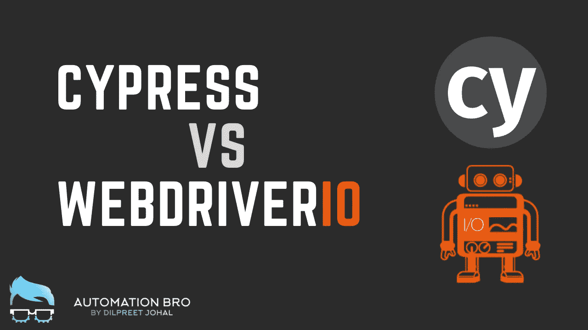
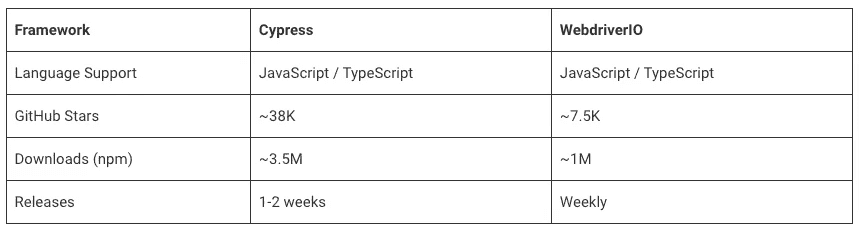
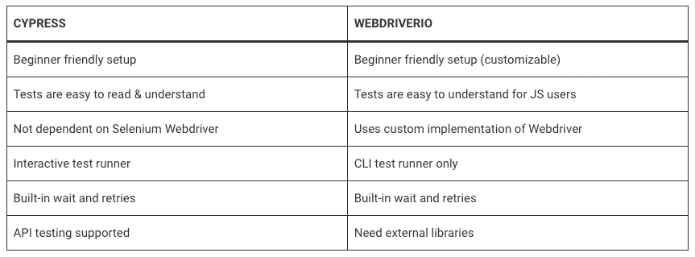
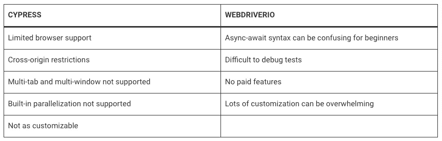
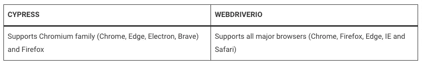
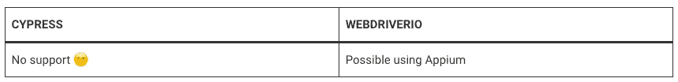
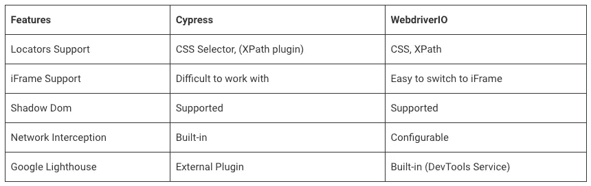
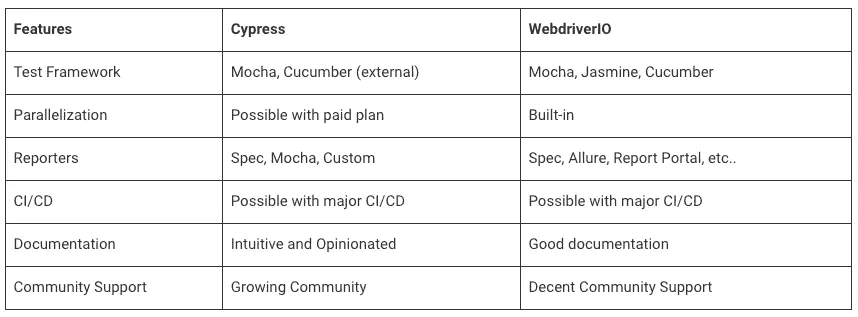

# Cypress vs WebdriverIO:选哪个？

> 原文：<https://javascript.plainenglish.io/cypress-vs-webdriverio-which-one-to-pick-728c911c10e2?source=collection_archive---------5----------------------->

## 为您的需求选择最佳框架所需的一切。

在这篇文章中，我将回顾我被问到的最常见的问题之一，那就是 Cypress 和 WebdriverIO 之间的区别是什么，你应该选择哪一个？我们将涵盖一切，从顶级特性，到框架限制，到浏览器支持等等…

# 语言支持和普及

*   Cypress 和 WDIO 都支持 JavaScript/TypeScript 语言。
*   就受欢迎程度而言，根据 GitHub stars 和 NPM 下载量，Cypress 比 WDIO 做得好一点。
*   Cypress 和 WDIO 都在积极维护，每周/每两周发布一次。

# 关键特征

*   Cypress 和 WDIO 的设置都非常简单。不过，使用 WDIO，在设置项目时，您可以获得更多的定制选项。
*   与 WDIO 相比，Cypress 测试更具可读性。webdrivero async-await 语法可能会让非 JS 用户感到困惑。
*   Cypress 的一个独特之处是它不依赖 Selenium Webdriver，这使得它更快更稳定，而 WebdriverIO 使用 Webdriver APIs 的自定义实现。
*   Cypress 附带了一个交互式测试运行器，它非常用户友好，是它最受欢迎的功能之一。另一方面，WDIO 像许多其他框架一样使用 CLI 测试运行程序。
*   在 DOM 上搜索元素时，Cypress 和 WDIO 都有内置的等待和重试功能。
*   使用 Cypress，您可以获得内置的 API 测试支持，而使用 WDIO，您可以使用外部库来设置它。

# 限制

**柏树:**

*   Cypress 的主要限制之一是有限的浏览器支持*(将在本文后面详细讨论)。*
*   使用 Cypress，每个单独的测试只能在一个超级域上运行，也就是说，你不能在同一个测试中访问 google.com 和 apple.com。
*   Cypress 不同时支持多标签或多浏览器。
*   虽然 Cypress 支持并行化，但这是他们付费计划的一部分。免费选项只有有限的运行次数。
*   与 WDIO *相比，Cypress 通常不太容易定制(这也是为了方便初学者)。*

**网络驱动:**

*   随着新的 WebdriverIO 变化，您需要使用 async-await 编写测试，这可能会让初学者感到困惑。
*   与 Cypress 相比，调试 WebdriverIO 测试有点困难。
*   WebdriverIO 是一个完全开源的项目，不提供任何付费功能或支持。
*   虽然 WebdriverIO 确实支持许多定制选项，但对于初学者来说，设置一切可能会变得难以承受。

# 浏览器支持

*   如前所述，目前 Cypress 的一个主要缺点是它不支持 Safari。虽然它支持所有主要的浏览器。
*   另一方面，web drivero 支持所有主流浏览器，这也是选择 web drivero 而不是 Cypress 的关键原因之一。

# 本地移动支持

*   Cypress 是专为 Web 开发的，不会对本地应用程序提供任何支持，另一方面，WebdriverIO 可以很容易地与 Appium 集成，实现移动应用程序的自动化。
*   如果你有兴趣用 Appium 学习 WebdriverIO，请随时查看我在 [Udemy](https://www.udemy.com/course/appium-webdriverio-mobile-automation/?referralCode=70179964D63962225A04) 上的课程:

# 技术差异

*   Cypress 默认支持 CSS 选择器，但是可以使用外部插件处理 Xpath。默认情况下，WDIO 同时支持 CSS 和 XPath。
*   由于跨源限制，很难在 Cypress 中使用 iFrames。另一方面，使用 WDIO，切换到 iFrames 相当容易。
*   Cypress 和 WDIO 都支持暗影穹顶。
*   Cypress 内置了对网络拦截的支持，通过 WDIO 可以配置外部服务。
*   WDIO 内置了 Google lighthouse 集成，可以使用 DevTools 服务生成性能报告，而对于 Cypress，你可以使用外部插件做同样的事情。

# 杂项差异

*   Cypress 只支持 Mocha 测试框架，但是支持 cumber 作为外部插件。另一方面，WDIO 支持内置的摩卡、茉莉和黄瓜。
*   使用 Cypress 进行并行测试只有付费计划才是可能的，但是使用 WDIO 它是内置的并且是免费的。
*   Cypress 支持 Spec、Mocha 和定制报告，WDIO 支持一系列报告器，如 Spec、Allure、Report Portal 等。
*   Cypress 和 WDIO 都可以很容易地与主要的 CI/CD 工具集成。
*   就文档而言，Cypress docs 非常直观，对初学者非常友好。使用 WDIO，您可以获得不错的文档，但是对于初学者来说可能会感到困惑。
*   Cypress 有一个不断增长的社区，在 Github 和 Gitter 上相当活跃。同样，WDIO 在 Github 和 Gitter 上也有很好的社区支持。

# 选哪个？

这就是 Cypress 和 WebdriverIO 的主要区别和相似之处。现在的问题是为你的下一个自动化项目选择哪一个？嗯，答案是——*视情况而定。*

你应该问的是——*要求是什么？*先了解需求。

例如，如果要求在 Chrome 和 Safari 中运行测试，因为大多数用户都在那里，那么使用 WebdriverIO 可能会更好。或者，也许你有一个用于网络和移动的套件，那么使用 WebdriverIO 是一个更好的选择。

另一方面，如果需求是只在基于 chromium 的浏览器上执行测试，并且您需要一个好的仪表板，可以让您看到所有测试的概览，那么如果团队可以选择付费选项，那么使用 Cypress 可能会更好。

总之，这两个框架都很棒，并且各有利弊，但是您应该根据您的项目需求来看看您的下一个自动化项目到底需要什么，然后参考本文做出相应的决定。

**要详细了解 Cypress 和 WebdriverIO 之间的差异和相似之处，请观看此视频—**

查看我在 Udemy 上的课程，使用 WebdriverIO 开始学习网络和移动自动化

*   [WebdriverIO 完全入门课程](https://www.udemy.com/course/webdriverio-complete-beginner-course/?referralCode=5190D58FC784B9F4E1AD)
*   [采用 Appium 2.0 和 WebdriverIO 的移动自动化](https://www.udemy.com/course/appium-webdriverio-mobile-automation/?referralCode=70179964D63962225A04)

感谢阅读！

*更多内容看* [***说白了就是 io***](https://plainenglish.io/) *。报名参加我们的* [***免费周报***](http://newsletter.plainenglish.io/) *。关注我们关于*[***Twitter***](https://twitter.com/inPlainEngHQ)*和*[***LinkedIn***](https://www.linkedin.com/company/inplainenglish/)*。加入我们的* [***社区***](https://discord.gg/GtDtUAvyhW) *。*