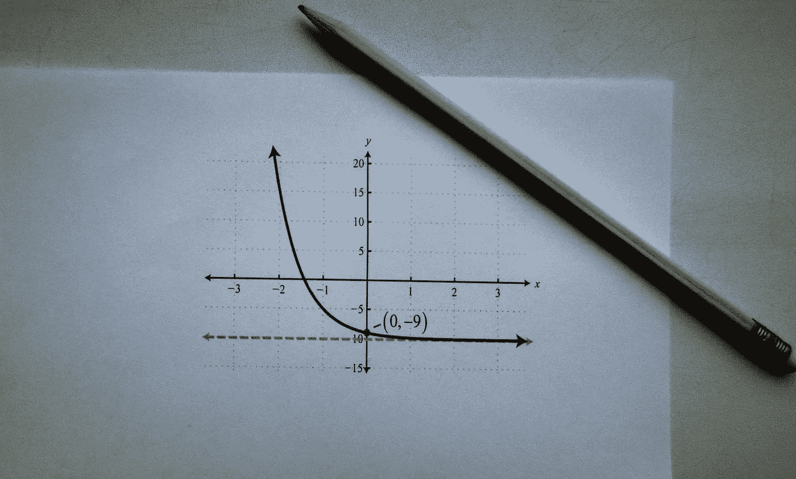
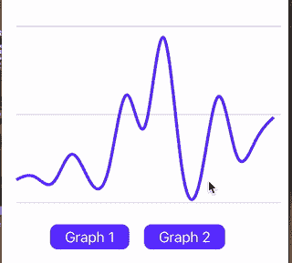
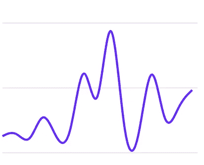

# D3 图表和反应本地 Skia 为初学者

> 原文：<https://javascript.plainenglish.io/d3-charts-and-react-native-skia-for-beginners-d7f418e2e2a1?source=collection_archive---------3----------------------->

## 学习用 React-Native-Skia 绘制漂亮的图表并制作动画。



[Photo by Sergey Meshkov](https://www.pexels.com/photo/a-pencil-and-a-paper-with-printed-math-equation-8482035/)

我以前说过，D3 是 React-Native(甚至可能是所有移动开发)中用于创建图表和数据可视化的最好、最强大的工具📈。在过去，我曾经写过如何将 React-Native 和 D3 与 React-Native SVG 和 Re-Animated 2 一起使用。

自从写了那篇文章之后，React-Native Skia 已经成为展示和制作 D3 的 SVG 图表的更好的库。因此，我想我应该写一篇关于如何用 React-Native Skia 创建 D3 图表并制作动画的新文章。

如果你在任何一点上卡住了，看看我在 Github 上的[代码示例。此外，如果你喜欢视觉学习，请随意查看我在 YouTube 上关于这个主题的教程。](https://github.com/friyiajr/D3SkiaSample)

## 我们在建造什么？

和我的操作指南一样，我喜欢从展示我们正在构建的东西开始。我们将创建您在下面的 GIF 中看到的折线图，并在折线图之间添加动画。



## 入门指南

您首先要做的是使用以下命令生成项目:

```
npx react-native init MyAwesomeProject --template react-native-template-typescript
```

之后，运行以下命令将 D3 和 Skia 添加到您的项目中。

```
yarn add @shopify/react-native-skia
yarn add d3
cd ios && npx pod install
yarn ios
```

我们的项目环境现在已经设置好了，可以开始了！

## 让我们熟悉数据

让我们从熟悉我们的数据结构开始。每个点都有这些值:

```
export type DataPoint = {
  date: string;
  value: number;
};export const originalData: DataPoint[] = [
  {date: '2000-02-01T05:00:00.000Z', value: 250},
  {date: '2000-02-02T05:00:00.000Z', value: 300.35},
  {date: '2000-02-03T05:00:00.000Z', value: 150.84},
  ...
```

这个应用程序的所有数据都可以在[示例项目](https://github.com/friyiajr/D3SkiaSample/blob/master/Data.ts)的`Data.ts`文件中找到。如果您正在跟进，我建议将它复制并粘贴到您的项目中。

## 组织我们的数据

下一部分与使用 React-Native SVG 时几乎相同。为了构建一个图表，我们需要组织我们的数据，以便 D3 可以处理它。我们要做的第一件事是在文件顶部添加高度和宽度常量。

```
const GRAPH_HEIGHT = 400
const GRAPH_WIDTH = 370
```

之后，我们需要创建一个方法，在`App.tsx`文件中返回一个包含已处理图表数据的对象。

```
const makeGraph = (data: DataPoint[]) => {};
```

下一步我们将计算数据集中的最大值和最小值。这些值用于构成我们图表的 y 域。这很容易做到，我们只需将数据值输入到`Math.max`和`Math.min`方法中。

```
const max = Math.max(...data.map(val => val.value));
const min = Math.min(...data.map(val => val.value));
```

之后，创建 y 轴就像调用 D3 库中的`scaleLinear`一样简单。注意范围内`GRAPH_HEIGHT`的使用。这将确保我们所有的数据点都映射到屏幕上的 y 坐标，该坐标不大于图形的高度。

```
const y = scaleLinear().domain([0, max]).range([GRAPH_HEIGHT, 35]);
```

对于 x 轴，我们知道我们的数据总是 15 天，所以我们将分别在每月的第一天和第十五天设置起点和终点。注意范围中`GRAPH_WIDTH`的使用。像 y 轴一样，它将我们的值映射到屏幕上的 x 坐标，并确保它们不大于图形的宽度。

```
const x = scaleTime()
    .domain([new Date(2000, 1, 1), new Date(2000, 1, 15)])
    .range([10, GRAPH_WIDTH - 10]);
```

然后，我们通过使用 D3 的`line`函数创建折线图来结束。

```
const curvedLine = line<DataPoint>()
    .x(d => x(new Date(d.date)))
    .y(d => y(d.value))
    .curve(curveBasis)(data);
```

之后，我们将曲线转换成 Skia 路径。

```
const skPath = Skia.Path.MakeFromSVGString(curvedLine!);
```

我们从函数中返回`max`、`min`和`skPath`值。他们很快就会被用来绘制我们的图表。

```
return {
    max,
    min,
    curve: skPath!,
 };
```

最后，让我们为刚刚创建的经过处理的图形数据定义一个类型。

```
interface GraphData {
  min: number;  
  max: number; 
  curve: SkPath;
}
```

总之，我们的`makeGraph`函数应该是这样的:

## 画一张图

接下来我们要做的是绘制图表。让我们从将第一个数据集添加到`App.tsx`中的组件开始。

```
const graphData = makeGraph(originalData);
```

此时，我们已经准备好将画布添加到我们的应用程序中，并设置其宽度和高度。

```
<Canvas
  style={{
    width: GRAPH_WIDTH,
    height: GRAPH_HEIGHT
  }}
>
</Canvas>
```

对于我们图表上的一些风格点，让我们画一些指南。您会注意到画线的 API 与 SVG 略有不同。不是传递第一个和第二个坐标，而是传递两个点的坐标，Skia 在它们之间画一条线。

我们要做的最后一件事就是绘制图表。我们通过将之前创建的 Skia 路径传递到 React-Native Skia 的`Path`组件中来实现这一点。

```
 <Path
    *style*="stroke"
    *path*={graphData.curve}
    *strokeWidth*={4}
    *color*="#6231ff"
  />
</Canvas>
```

画布代码应该处于这种状态。

此时，您的图表应该如下所示:



## 制作多个图形的动画

终于！我们期待已久的时刻——制作多个图表的动画🙂。如果你习惯了这些库，你会发现 Skia 动画 API 与 ReAnimated 和 ReDash 有很大的不同，但它仍然很容易使用。这个动画是从威廉·坎迪隆关于图表动画[的视频](https://www.youtube.com/watch?v=xeLdmn3se1I&t=185s)中借来的。

首先复制这些按钮，并将它们添加到画布下。我们稍后将使用它们来控制动画。

现在，回到我们的组件，让我们给它一些状态。

```
const transition = useValue(1);
const state = useValue({
  current: 0,
  next: 1,  
});
```

这里的`transition`值的功能类似于布尔值。如果动画完成，这个值是 1，如果我们需要动画，这个值是 0。`state`值是我们想要显示的图表的索引。

现在让我们创建过渡。

正如您在这里看到的，我们首先将当前图形设置为传入的索引，并将之前的图形设置为当前图形。然后将过渡值设置为 0，这样 Skia 就知道需要播放动画。`runTiming`然后通过 0 到 1 之间的多个值来动画显示图形，直到图形动画完成。

接下来，我们使用上面创建的状态，使用`useComputedValue`钩子为转换的所有值创建 SVG 路径。

此时，你会想把`graphData`变成一个数组:

```
const graphData: GraphData[] = [
  makeGraph(originalData),
  makeGraph(animatedData),
];
```

然后将路径传递给 Skia 路径组件

```
<Path *style*="stroke" *path*={path} *strokeWidth*={4} *color*="#6231ff" />
```

最后，将`startTransition`方法添加到我们之前添加的 pressables 中:

```
<Pressable
  *onPress*={() => transitionStart(0)}
  *style*={styles.buttonStyle}>
  <Text *style*={styles.textStyle}>Graph 1</Text>
</Pressable>
<Pressable
  *onPress*={() => transitionStart(1)}
  *style*={styles.buttonStyle}>
  <Text *style*={styles.textStyle}>Graph 2</Text>
</Pressable>
```

我们最终的结果是这张 GIF 中的图表📈！


# 最后的想法

我希望你喜欢这个练习，并通过它能够了解更多关于 D3 图表和 React-Native Skia。作为一名社区成员，我正在尽最大努力提高人们对 D3 力量的认识。当我们有现成的图表库时，就真的不需要它们了。下次再见，快乐编码。

*更多内容看* [***说白了就是***](https://plainenglish.io/) *。报名参加我们的* [***免费周报***](http://newsletter.plainenglish.io/) *。关注我们关于*[***Twitter***](https://twitter.com/inPlainEngHQ)*和*[***LinkedIn***](https://www.linkedin.com/company/inplainenglish/)*。查看我们的* [***社区不和谐***](https://discord.gg/GtDtUAvyhW) *加入我们的* [***人才集体***](https://inplainenglish.pallet.com/talent/welcome) *。*