# 日常编程笑话

> 原文：<https://javascript.plainenglish.io/daily-programming-jokes-7140406b597e?source=collection_archive---------0----------------------->

## 最佳编程迷因汇编 2022 系列

Photo by [Lidya Nada](https://unsplash.com/@lidyanada?utm_source=medium&utm_medium=referral) on [Unsplash](https://unsplash.com?utm_source=medium&utm_medium=referral)

***模因和快乐有什么联系吗？*** 如果你是我这种类型的人，那么你可能也爱在下班后查看手机。猜猜我在那里看到了什么？

我主要是在互联网上看到**视频、抖音和模因**。我不知道为什么，但这有助于我提神醒脑，减轻工作压力。这就是为什么我相信*笑是人类最好的刷新按钮。*

在这篇文章中，我收集了一些我喜欢的网络迷因。

# 当你拓宽你的求职范围去探索一个新的市场时…

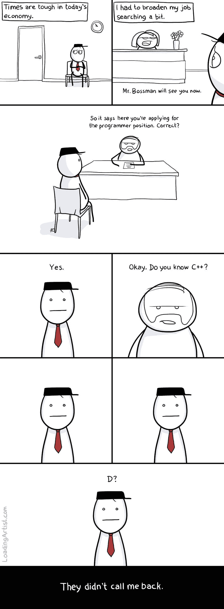

[https://www.reddit.com/r/ProgrammerHumor/comments/vhvwwe/he_confused_pre_and_postincrement/](https://www.reddit.com/r/ProgrammerHumor/comments/vhvwwe/he_confused_pre_and_postincrement/)

# 当我的经理问我为什么写这 4 行代码花了这么长时间

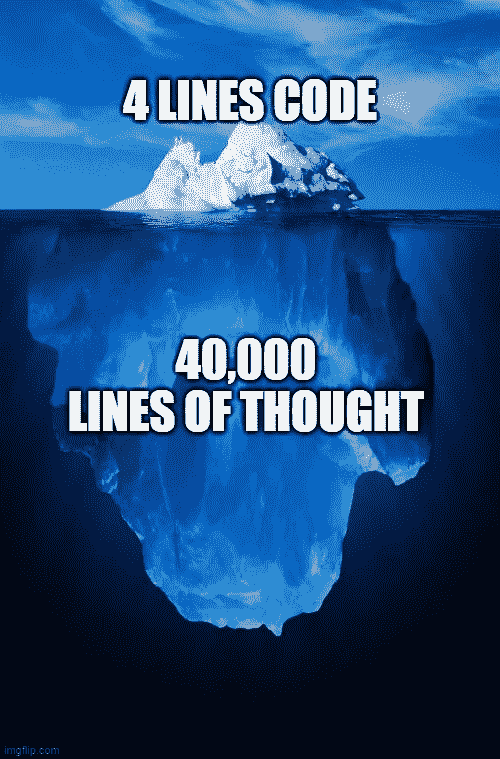

Picture Credit:[https://www.reddit.com/r/ProgrammerHumor/](https://www.reddit.com/r/ProgrammerHumor/)

# 希望你能理解我想说的话…

Picture Credit:[https://www.reddit.com/r/ProgrammerHumor/](https://www.reddit.com/r/ProgrammerHumor/)

# 当 VS 代码问我这个问题的时候…

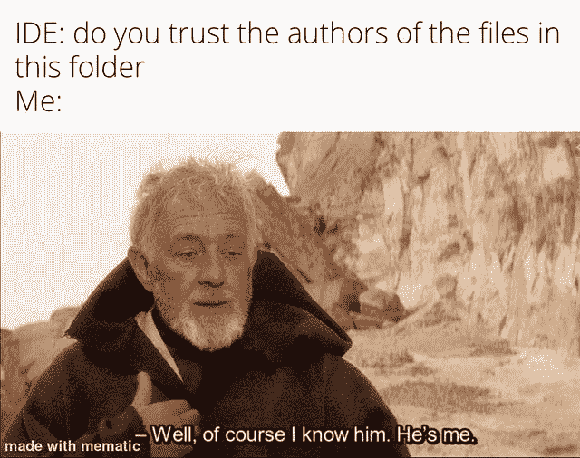

Picture Credit:[https://www.reddit.com/r/ProgrammerHumor/](https://www.reddit.com/r/ProgrammerHumor/)

# 你想要的结果，所以我专注于…

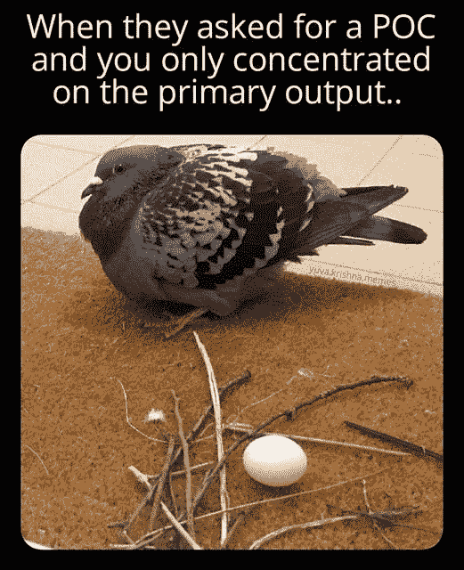

Picture Credit:[https://www.facebook.com/yuva.krishna.memes](https://www.facebook.com/yuva.krishna.memes)

# 开发网站的最佳工具…绝对…

Picture Credit:[https://www.reddit.com/r/ProgrammerHumor/](https://www.reddit.com/r/ProgrammerHumor/)

# 当你想写可重用的代码，但你的经理给你很短的时间…

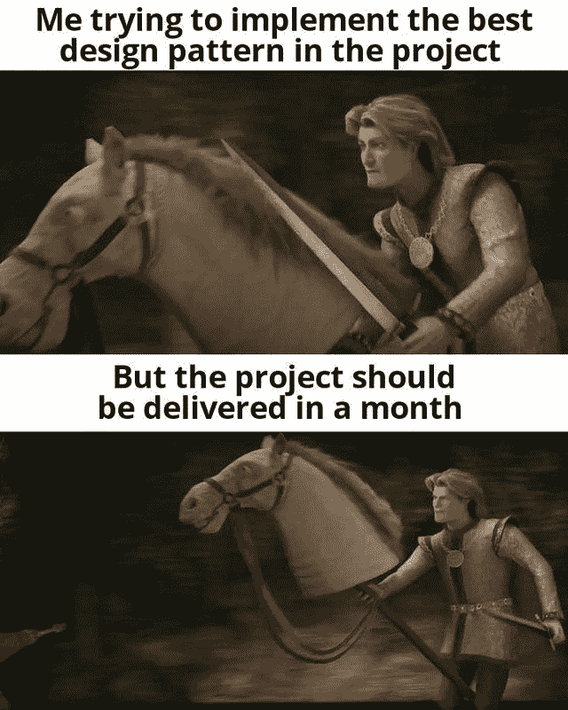

Picture Credit:[https://www.reddit.com/r/ProgrammerHumor/](https://www.reddit.com/r/ProgrammerHumor/)

# 你能想到的其他句子…？

Picture Credit:[https://www.facebook.com/javascriptJS](https://www.facebook.com/javascriptJS/?ref=page_internal)

# 我们及时完成了…但是…没有测试…

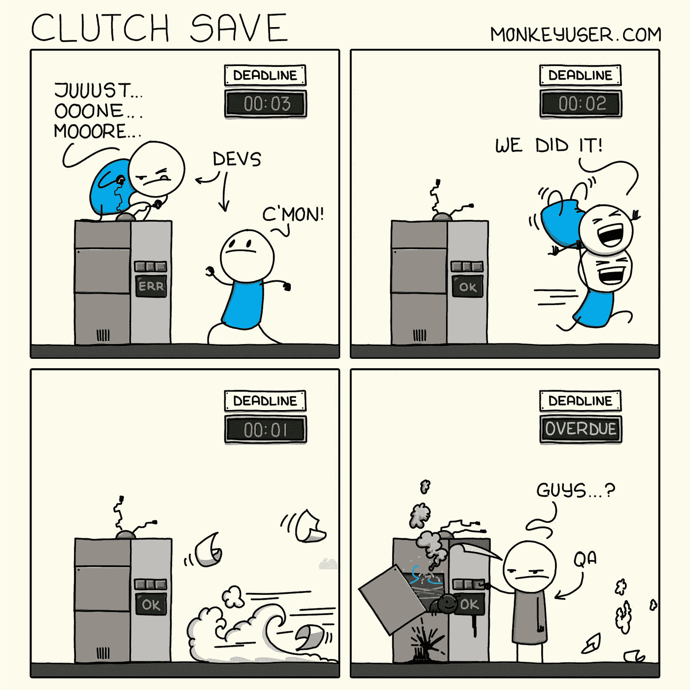

Picture Credit:[https://www.monkeyuser.com/](https://www.monkeyuser.com/)

# 当你让开发者指点迷津的时候…

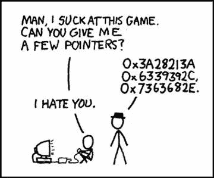

Picture Credit:[https://www.reddit.com/r/programmingmemes/](https://www.reddit.com/r/programmingmemes/)

# 看着别人的代码:这是什么废话？为什么会这样写呢？

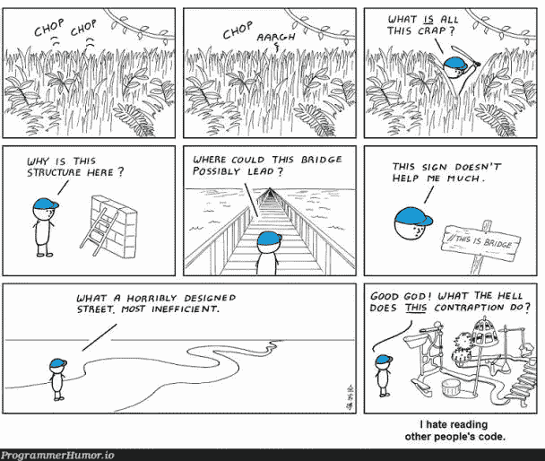

Picture Credit:[https://programmerhumor.io/](https://programmerhumor.io/)

# 是的，这个选项正确地定义了我…

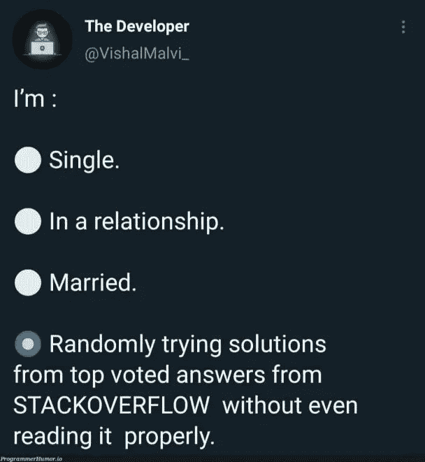

Picture Credit:[https://programmerhumor.io/](https://programmerhumor.io/)

# 当你有 2 年以上的工作经验并申请高级职位时…

Picture Credit:[https://programmerhumor.io/](https://programmerhumor.io/)

# 调试器在这里…现在不用担心了

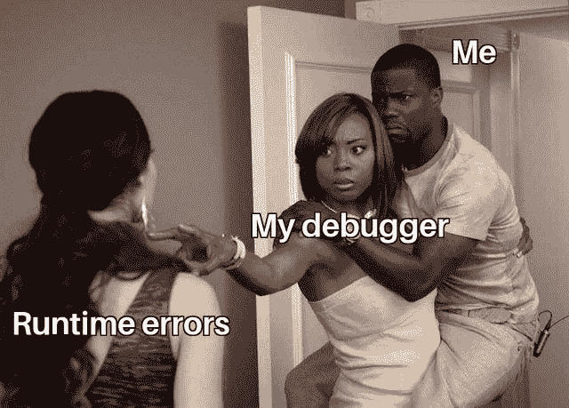

Picture Credit:[https://www.reddit.com/r/ProgrammerHumor/](https://www.reddit.com/r/ProgrammerHumor/)

# 奖金时间

# 在这种在家工作的环境中，这是一件日常的事情…

[https://www.facebook.com/photo/?fbid=1242842096154148&set=gm.6657168974308830](https://www.facebook.com/photo/?fbid=1242842096154148&set=gm.6657168974308830)

**来源:**[https://www.facebook.com/groups/it.humor.and.memes](https://www.facebook.com/groups/it.humor.and.memes)

# 为什么要担心长期…虽然是坏习惯…

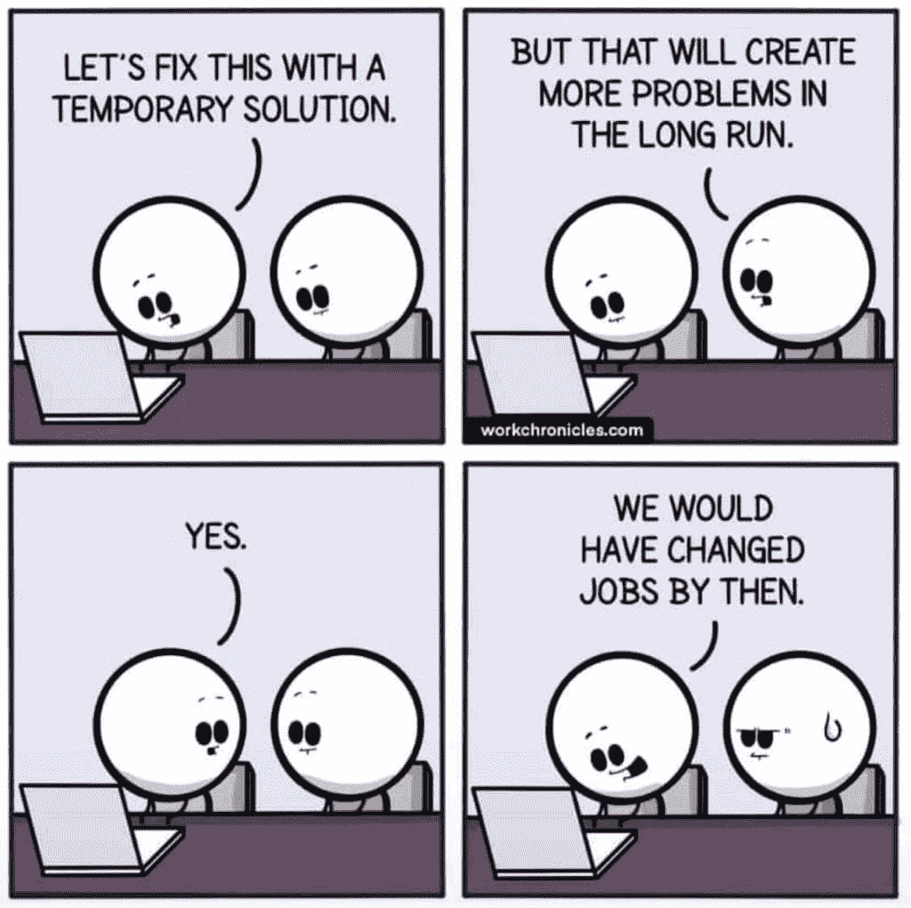

[https://www.facebook.com/photo/?fbid=10220125108430376&set=gm.6656120821080312](https://www.facebook.com/photo/?fbid=10220125108430376&set=gm.6656120821080312)

**来源:**[https://www.facebook.com/groups/it.humor.and.memes](https://www.facebook.com/groups/it.humor.and.memes)

# 当你看到 JD 拥有所有技术堆栈并为大型机工作时，这种情况经常发生…

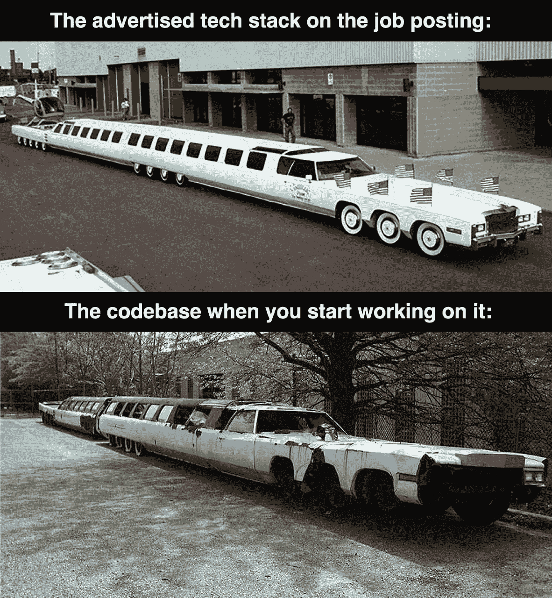

[https://www.facebook.com/jokesvala/photos/a.2330223400336101/6458422107516189/](https://www.facebook.com/jokesvala/photos/a.2330223400336101/6458422107516189/)

**来源:**[https://www.facebook.com/groups/151139362111349](https://www.facebook.com/groups/151139362111349)

# 当比萨饼师傅从开发商那里得到具体指示时…

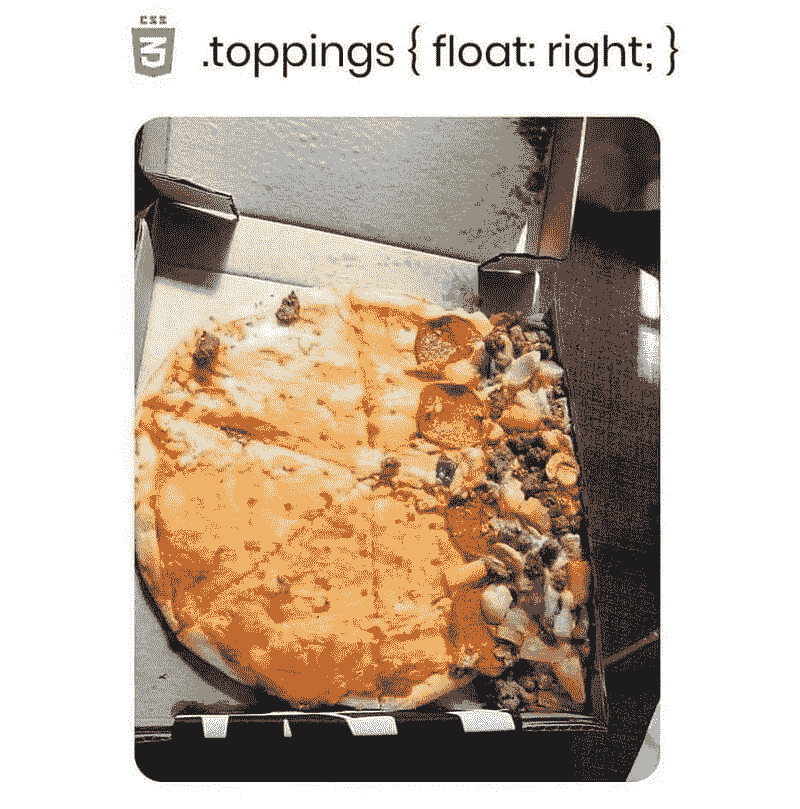

[https://www.facebook.com/photo?fbid=558024112082117&set=gm.959718131253464](https://www.facebook.com/photo?fbid=558024112082117&set=gm.959718131253464)

**来源:**[https://www.facebook.com/groups/151139362111349](https://www.facebook.com/groups/151139362111349)

# 同样的事情但是不同的结果…

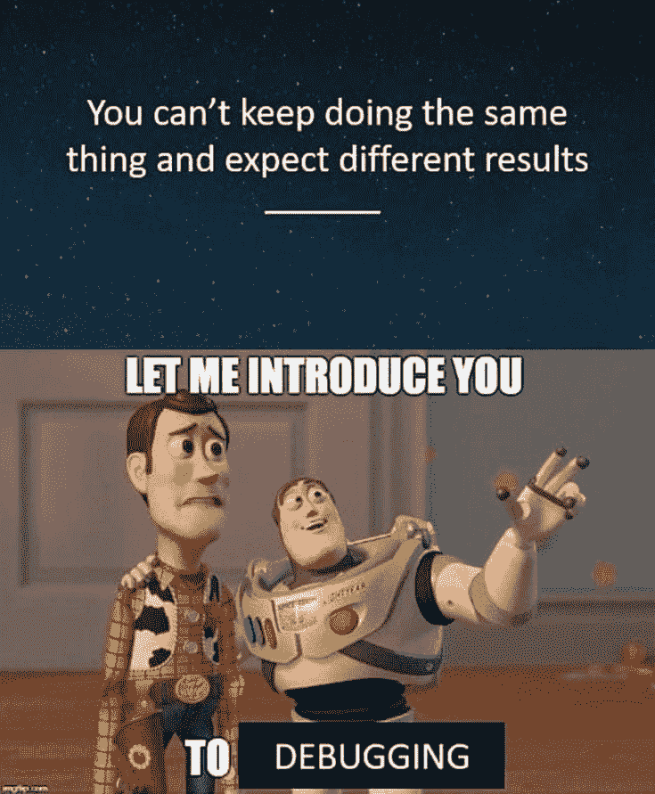

[https://www.facebook.com/techwithcodex/photos/a.137007467972178/356285432711046/](https://www.facebook.com/techwithcodex/photos/a.137007467972178/356285432711046/)

**来源:**[https://www.facebook.com/techwithcodex/](https://www.facebook.com/techwithcodex/photos/a.137007467972178/356285432711046/)

# 当我的合并破坏了代码…哈哈

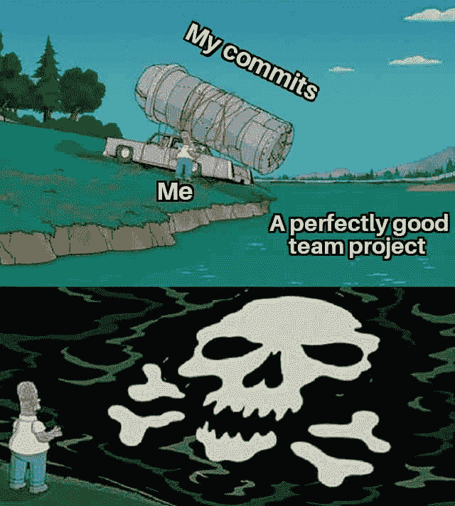

[https://www.facebook.com/jokesvala/photos/a.2330223400336101/6458379167520483/](https://www.facebook.com/jokesvala/photos/a.2330223400336101/6458379167520483/)

**来源:**【https://www.facebook.com/jokesvala/】T2

# 你最常用的借口是什么？

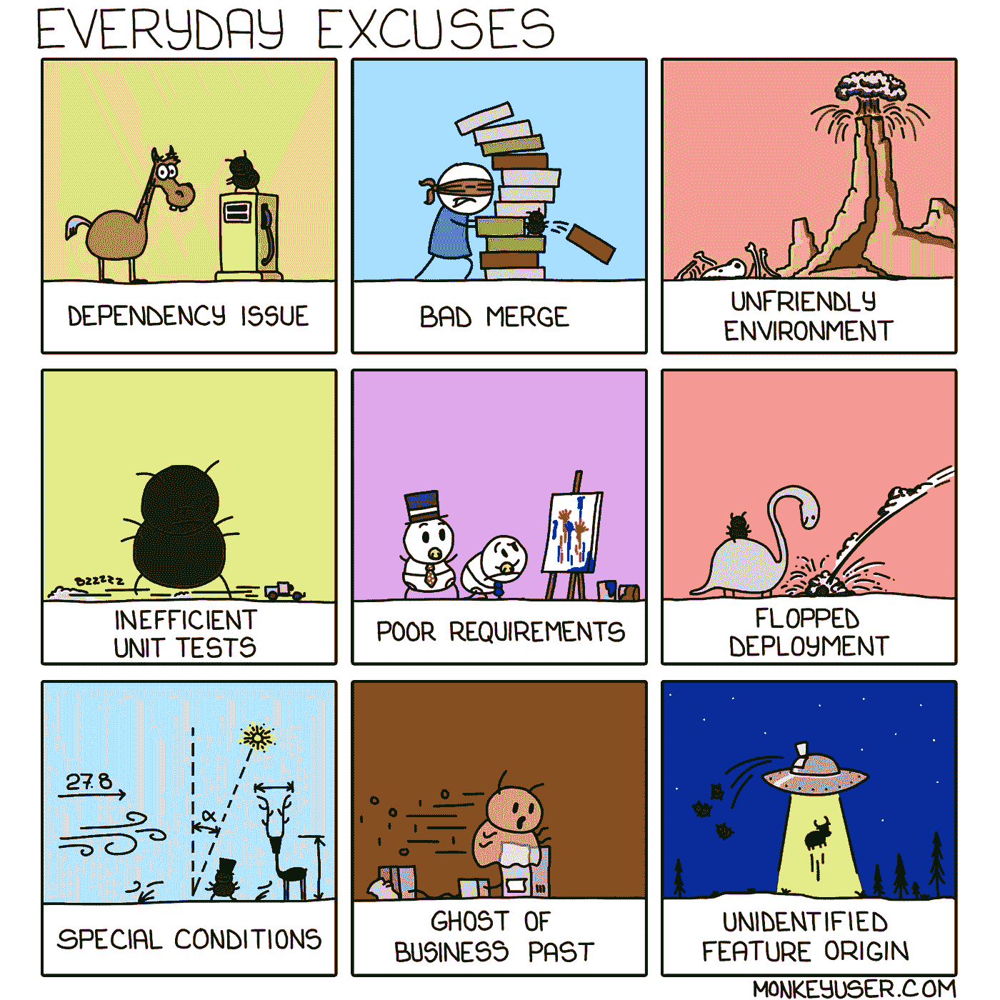

[https://www.monkeyuser.com/2019/everyday-excuses/?sc=true&dir=random](https://www.monkeyuser.com/2019/everyday-excuses/?sc=true&dir=random)

【https://www.monkeyuser.com/】来源:

# 啊…

[https://www.reddit.com/r/ProgrammerHumor/comments/pdv03s/you_guys_agree_with_me/](https://www.reddit.com/r/ProgrammerHumor/comments/pdv03s/you_guys_agree_with_me/)

**来源:**[https://www.reddit.com/r/ProgrammerHumor/](https://www.reddit.com/r/ProgrammerHumor/comments/pdv03s/you_guys_agree_with_me/)

# 软件开发周期的现实…

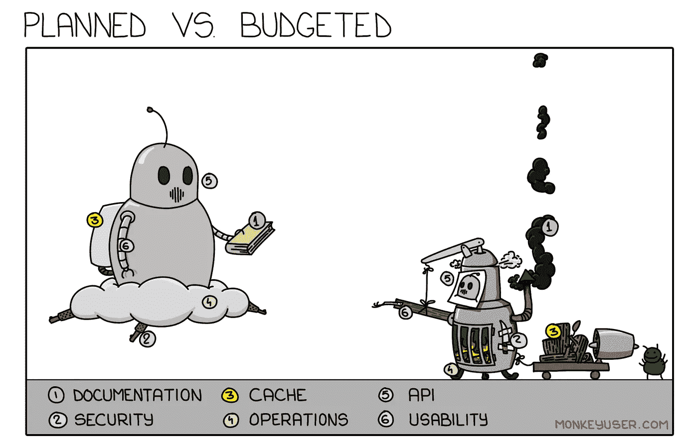

[https://www.monkeyuser.com/2020/planned-vs-budgeted/?sc=true&dir=random](https://www.monkeyuser.com/2020/planned-vs-budgeted/?sc=true&dir=random)

**来源:**[https://www.monkeyuser.com/](https://www.monkeyuser.com/2019/everyday-excuses/?sc=true&dir=random)

# 你有使用多种语言的实践经验吗？是的，事实上，我用所有的…

[https://programmerhumor.io/programming-memes/page/5/](https://programmerhumor.io/programming-memes/page/5/)

**来源:**[https://programmerhumor.io/programming-memes/](https://programmerhumor.io/programming-memes/page/5/)

# 希望你笑得开心！

*更多内容请看* [***说白了就是***](https://plainenglish.io/) *。报名参加我们的* [***免费每周简讯***](http://newsletter.plainenglish.io/) *。关注我们*[***Twitter***](https://twitter.com/inPlainEngHQ)*和*[***LinkedIn***](https://www.linkedin.com/company/inplainenglish/)*。查看我们的* [***社区不和谐***](https://discord.gg/GtDtUAvyhW) *加入我们的* [***人才集体***](https://inplainenglish.pallet.com/talent/welcome) *。*