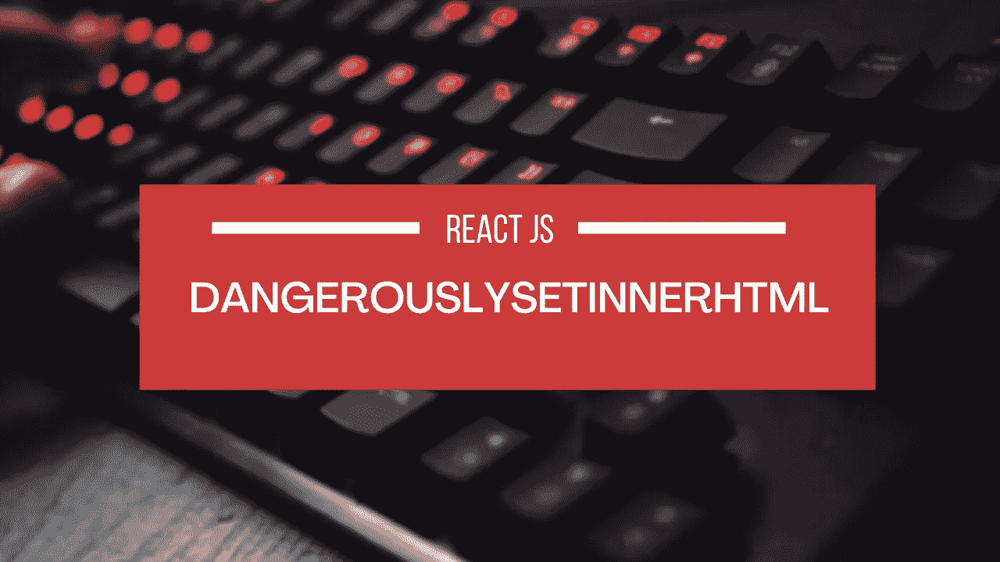
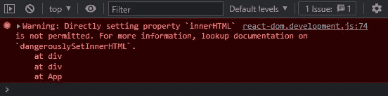
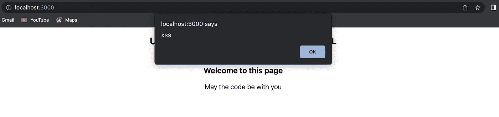

# 解释了反应中的危险

> 原文：<https://javascript.plainenglish.io/dangerouslysetinnerhtml-in-react-js-explained-4dfc3b80be82?source=collection_archive---------0----------------------->



**dangerouslySetInnerHTML** 是 React 中 DOM 元素下的一个属性。
根据[官方文档](https://reactjs.org/docs/dom-elements.html#dangerouslysetinnerhtml)，dangerouslySetInnerHTML 是 React 的替代品，用于在浏览器 DOM 中使用 InnerHTML 以编程方式或从外部源设置 HTML。

# 语法和需要使用 dangerouslySetInnerHTML

在简单的普通 JS 中，我们使用 innerHTML 属性将 HTML 插入网页，如下所示。

```
<div innerHTML=<p>A sample paragraph</p></div>ordocument.querySelector(".testClass")= '<p>A sample paragraph</p>';
```

但是如果我们试图在 React 中做同样的事情。我们将得到如下所示的错误:



使用 dangerouslySetInnerHTML 的语法非常简单。代替 innerHTML，你必须键入 dangerouslySetInnerHTML 并传递一个带有 __html 键的对象。例如:

```
<div dangerouslySetInnerHTML={{__html: '<p>lorem ipsum</p>'}}></div>
```

但是为什么叫***dangerouslysettinnerhtml 呢？*** 那是因为这个属性是**危险的**，一不小心就可能在你的应用中制造 XSS 漏洞。我们简单了解一下。


# 为什么叫 dangerouslySetInnerHTML？

名字***dangerouslySetInnerHTML***是故意选来吓人的。这不是命名错误。

一般来说，从代码中设置 HTML 是有风险的，因为它可能会将你的用户暴露给一个[跨站脚本(XSS)](https://en.wikipedia.org/wiki/Cross-site_scripting) 攻击。你可以直接从 React 设置 HTML，但是你必须键入`dangerouslySetInnerHTML`并传递一个带有`__html`键的对象，以提醒你自己这是危险的。

如果你允许用户直接在你的网页中插入 HTML，他们可以在技术上嵌入脚本和恶意代码，当你在 react 应用程序中显示 HTML 时，这些脚本可能会执行。下面是一个例子。

```
import React from "react";
import './App.css';const App = () => {const data = `
  <h3>Welcome to this page</h3>
  <p>May the code be with you</p>
  
  `;return (
    <div className="App">
      <h2>Understanding dangerouslySetInnerHTML</h2>
      <div
        style={{ padding: "10px", fontSize: '17px', textAlign: 'center' }}
        dangerouslySetInnerHTML={{ __html: data }}
      ></div>
    </div>
  );
}export default App;
```



这就是为什么你需要确保你的 HTML 在插入到你的 react 应用之前已经被清理了。您可以使用像 [dompurify](https://www.npmjs.com/package/dompurify) 这样的库来实现。

如何使用 dompurify 净化您的代码的例子如下所示:

# 表演

当你使用 dangerouslySetInnerHTML 时，在幕后，我们知道组件内部的 HTML 不是它关心的东西，因为它来自另一个来源。

因为 React 使用虚拟 DOM，所以当它与真实 DOM 进行比较时，它可以简单地跳过与虚拟 DOM 的比较，以获得一些额外的性能。

如果只是使用 innerHTML，React 无法知道 DOM 节点已经被修改。

# 结论

总之，`dangerouslySetInnerHTML`不过是 React 中`innerHTML`的替代品，应该小心使用。名称***dangerouslySetInnerHTML***是有意选择的，以提醒你这是危险的，可能会导致 XSS 漏洞，以便你确保在将 HTML 插入 react 应用程序之前对其进行清理。

# 视频解释:

*更多内容看* [***说白了就是 io***](https://plainenglish.io/) *。报名参加我们的* [***免费周报***](http://newsletter.plainenglish.io/) *。关注我们关于*[***Twitter***](https://twitter.com/inPlainEngHQ)*和*[***LinkedIn***](https://www.linkedin.com/company/inplainenglish/)*。加入我们的* [***社区***](https://discord.gg/GtDtUAvyhW) *。*