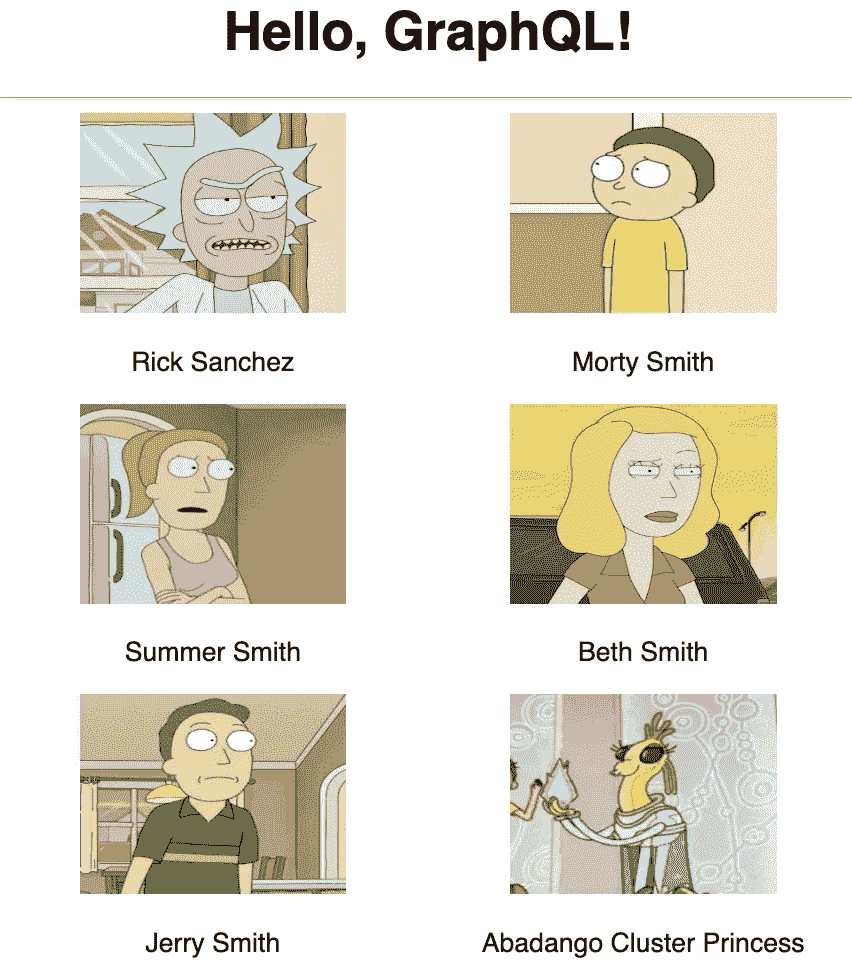
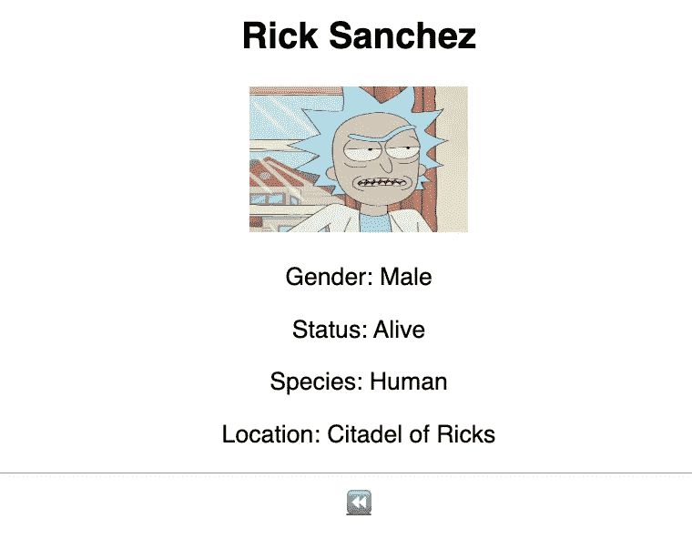
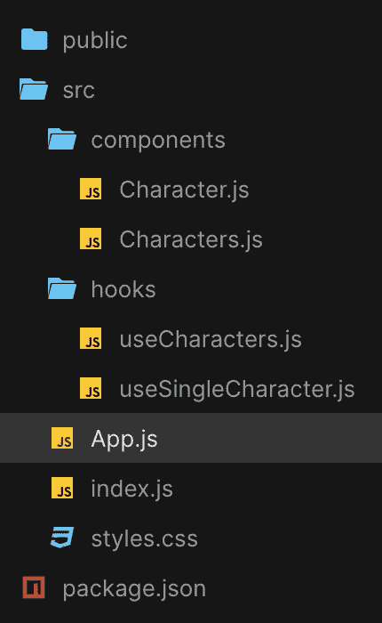
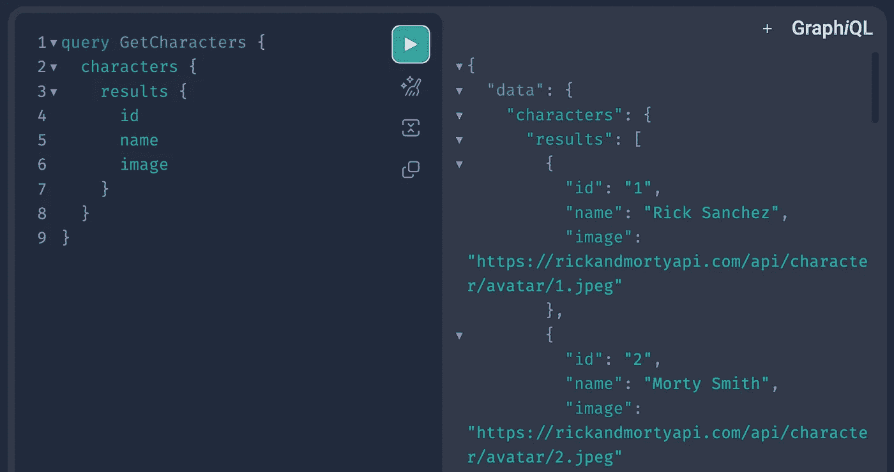

# React 中使用 Apollo 客户端获取 GraphQL 数据

> 原文：<https://javascript.plainenglish.io/data-fetching-with-apollo-client-in-react-graphql-207aaaec2cfe?source=collection_archive---------4----------------------->

## 使用带有 GraphQL 查询的 Apollo 客户端在 React 应用程序中检索数据


有志者，事竟成 — Where there is a will ,there is a way

学习东西总是需要时间的，不弄脏手很难把握技术的细微差别。GraphQL 正在成为在现代 web 和移动应用程序中使用 API 的一种流行方式。

我在 2 年前开始学过一次 GraphQL，但是因为某些原因我没有机会继续下去。很快我将使用 GraphQL 开始一个新的公司项目，考虑到这一点，我创建了一个简单、有趣的 React 应用程序来更新我的知识。在本文中，我将与您分享如何使用带有 GraphQL 查询的 Apollo 客户端来检索数据。

**什么是 GraphQL？**

*graph QL***是一种面向数据的 API 查询风格，它是由脸书开发的一种更高效获取数据的解决方案。**

***什么是阿波罗客户端？***

**Apollo Client 是一个全面的 JavaScript 状态管理库，使我们能够使用 GraphQL 管理本地和远程数据。*👉🏼*简单解释:前端将 GraphQL* ***查询******阿波罗客户端*** *处理查询并向 GraphQL* ***服务器、*** *服务器请求数据，然后服务器将数据发送回* ***阿波罗客户端*** *哪个**

***为什么要使用 GraphQL？***

**传统的*[*REST API*](https://restfulapi.net/)*存在过蚀刻或欠蚀刻的局限性。例如，如果端点持有关于用户的数据，我们可以点击* `*/user*` *端点，而不是* ***仅*** *获得我们感兴趣的* `*name*` *，我们可以获得端点必须提供的一切——包括*`*age*`*`*title*`*`*address*`*等。，所以很难设计出能够为客户提供准确数据需求的 API。****

***使用 GraphQL，我们能够准确地指定我们需要从服务器获得什么，并以可预测的方式接收数据。GraphQL 还为 API 维护人员提供了在不影响现有查询的情况下添加或删除字段的灵活性，开发人员可以使用任何方法创建 API。***

**够了，让我们开始动手吧。**

****如果你懒得用* [*创建 React App*](https://create-react-app.dev/) *在本地创建一个新的 React 项目，直接跳到这个* [*沙箱*](https://codesandbox.io/s/relaxed-fast-v1okx9?file=/src/App.js) *里摆弄一下就行了。***

**这个应用程序非常简单，我们将使用 [Rick 和 Morty API](https://rickandmortyapi.com/graphql) 来获取和显示一些角色，我们也可以通过点击每张图片来显示个别角色。👇🏼**

****

**all Characters**

****

**display one Character by clicking on one image**

****因为这篇文章是关于数据获取的，所以没有使用很多 CSS***

****设置:****

**第一步是安装以下软件包**

**`npm install **@apollo/client** **graphql**`**

*   **`@apollo/client`:包含设置 Apollo 客户端所需的几乎所有内容。它包括内存缓存、本地状态管理、错误处理和基于 React 的视图层。**
*   **`graphql`:提供解析 GraphQL 查询的逻辑。**

**然后，初始化 **ApolloClient** ，从`@apollo/client`中导入我们需要的符号**

```
**// index.js
import { **ApolloClient, InMemoryCache, ApolloProvider** } from “@apollo/client";**
```

**接下来，我们将传递给它的构造函数一个带有`uri`和`cache`字段的配置对象**

```
**const client = new **ApolloClient**({
    uri: “https://rickandmortyapi.com/graphql",
    cache: new **InMemoryCache**() });**
```

*   **`uri`指定我们的 GraphQL 服务器的 URL。**
*   **`cache`是`InMemoryCache`的一个实例，Apollo 客户端用它来缓存获取后的查询结果。**

**最后一步是用 **ApolloProvider** 将 Apollo 客户端连接到我们的 React 应用程序。ApolloProvider 类似 React 的`[Context.Provider](https://reactjs.org/docs/context.html#contextprovider)`。它包装了我们的 React 应用程序，并将客户端放在上下文中，这允许我们从组件树中的任何位置访问它。**

```
**root.render(
  <StrictMode>
    <**ApolloProvider** **client** = {client}>
       <App />
    </**ApolloProvider**>
  </StrictMode>**
```

**完美！这就是设置，现在让我们创建组件并添加检索数据的功能！**

****

**App structure**

**我们的组件应该看起来像下面这样👇🏼**

```
**// characters
const Characters = () => {
  ...// some data
  return (
    <div>
       {data.map(({ ... }) => {
          return ( 
            <div key={id}>
               
               <p>{...}</p>
            </div>
       )})}
    </div>
)}
export default Characters;// single character
const Character = () => {
  ...// some single data
  return (
    <div>
       <h2>{...}</h2>
       
       <p>Gender: {...}</p>
       <p>Status: {...}</p>
       <p>Species: {...} </p>
       <p>Location: {...}</p>
    </div>
)};
export default Character;**
```

**为了从服务器获取我们的字符，我们需要编写查询来请求我们想要的**精确字段**，在我们的例子中，我们期望默认显示图像和名称。**

*** *你可以前往* [*瑞克和莫蒂 API*](https://rickandmortyapi.com/graphql) *试一试*👐**

****

**[Rick and Morty](https://rickandmortyapi.com/graphql) GraphQL API**

**让我们创建一个 fetch 查询并执行它。通常在一些较大的项目中，为了在组件之间共享逻辑，我们想要创建一个[自定义钩子](https://beta.reactjs.org/learn/reusing-logic-with-custom-hooks)，所以我们也为我们的应用程序这样做，即使它很小，为什么不呢？🎈**

**在 *src:* `src/hooks/useCharacters.js,`中添加一个 *hooks* 文件夹和一个 *useCharacters* 文件**

```
**import { useQuery, gql } from "@apollo/client";const **GET_CHARACTERS** = **gql**`
  query **GetCharacters** {
    characters {
      results {
        id
        name
        image
      }
    }
  }
`;// export custom hook 
// executing a query
export const **useCharacters** = () => {
  const { loading, error, data } = **useQuery**(GET_CHARACTERS);
    return { error, data, loading };
};**
```

**上面的代码意味着:**

*   **我们创建一个名为 **GetCharacters** 的 GraphQL 查询，将其包装在 **gql** 函数中，并为它们分配一个变量 **GET_CHARACTERS****
*   **`useQuery`钩子是在 Apollo 应用程序中执行查询的主要 API。要运行一个查询，调用`useQuery`并向其传递一个 GraphQL 查询字符串(在我们的例子中: **GET_CHARACTERS** )。**
*   **当我们的组件呈现时，`useQuery`从 Apollo 客户端返回一个对象，该对象包含我们可以用来呈现 UI 的`loading`、`error`和`data`属性。**

**就这样，现在转到 Characters.js，导入我们的自定义钩子并检索响应，让我们更新 Characters 组件:**

```
**import { useCharacters } from "../hooks/useCharacters";
const Characters = () => {
  const { **loading**, **error**, **data** } = **useCharacters**();   if (loading) return <p>Loading...</p>;
  if (error) return <p>Error :(</p>; return (
   <>
     {**data**?.characters.results.map(({ id, name, image }) => {
       return (
        <div key={id}>
          
          <p>{name}</p>
        </div>
      )})}
   </>
)};
export default Characters;**
```

**当我们的查询执行并且`loading`、`error`和`data`的值改变时，`Characters`组件可以根据查询的状态智能地呈现不同的 UI 元素:**

*   **只要`loading`为`true`(例如查询仍在进行中)，组件就会显示`Loading...`。**
*   **当加载为`false`且没有`error`时，查询完成。**
*   **该组件呈现服务器返回的字符。**

**我们可以用我们的单个字符组件做同样的逻辑，创建一个查询，得到我们需要的一切(* *)当然我们也可以使用上面相同的数据，并过滤出我们需要的单个字符的数据，但是让我们看看如何用查询参数*得到准确的数据:**

```
**// custom Hook useSingleCharacter
import { useQuery, gql } from "@apollo/client";const GET_CHARACTER = gql`
  query **GetCharacter**(**$characterId: ID!**) {
    character(**id: $characterId**) {
      name
      image
      gender
      status
      species
      location {
          name
      }
     }
    }
  `;export const useSingleCharacter = (**characterId**) => {
  const { loading, error, data } = useQuery(GET_CHARACTER, {
    ** variables: { characterId },**
  });
  return { error, data, loading };
};**
```

**🍎上面的`query`操作使用了带有一个参数的名称`GetCharacter`。这个参数有一个`$characterId`变量，一个**类型的**的`ID`。`!`意味着这个操作是必需的，GraphQL 不会执行这个操作，除非我们传递一个类型为`ID`的`characterId`变量。**

> ***GraphQL 的默认标量**类型**有:**
> 
> **`Int`:有符号 32 位整数**
> 
> **`Float`:有符号双精度浮点值**
> 
> **`String`:UTF‐8 字符序列**
> 
> **`Boolean` : `true`或`false`**
> 
> **`ID`(序列化为`String`):一个惟一的标识符，通常用于重新提取对象或作为缓存的键。虽然它被序列化为`String`，但是`ID`并不适合人类阅读。**

**注意，这次我们为`useQuery`钩子提供了一个配置选项(`variables`👇**

```
**variables: { characterId }**
```

**这个`variables`选项是一个对象，它包含了我们想要传递给 GraphQL 查询的所有变量，在我们的例子中，我们想要传递当前选择的 ***字符化的*** ，这发生在带有钩子执行的单字符组件内部。**

**现在，让我们更新我们的 Character.js**

```
**import { useSingleCharacter } from “../hooks/useSingleCharacter”;const Character = () => {
 ** const characterId = 1;** // fake id
  const { loading, error, data } = **useSingleCharacter**(**characterId**); 
  if (loading) return <p>Loading…</p>;
  if (error) return <p>Error :(</p>; const {name, image, gender, status, location, species} =    data.character; // destructure data return (
    <div>
      <h2>{name}</h2>
      
      <p>Gender: {gender}</p>
      <p>Status: {status}</p>
      <p>Species: {species} </p>
      <p>Location: {location.name}</p>
      <Link to={“/”}>
         <span role=”img” aria-label=”back”>⏪</span>
      </Link>
    </div>
   )};
export default Character;**
```

**请注意，我们现在使用的是一个假的 **characterId = 1** ，因为这个单个字符组件将通过单击 image(在 Characters.js 中)来显示，我们将很快实现它。**

**最后一步，让我们通过点击图片来实现两个组件的交互，我们将使用 [*react-router*](https://reactrouter.com/en/main) ，首先更新我们的 index.js 文件👇🏼**

```
**...// same
**import { BrowserRouter, Routes, Route } from “react-router-dom”;** import App from “./App”;
import Character from “./components/Character”;const rootElement = ...;
const root = ...;
const client = new ApolloClient(...);root.render(
  <StrictMode>
    <ApolloProvider client={client}>
      <**BrowserRouter**>
        <Routes>
          <Route path=”/” element={<App />} />
          <Route path=”**character/:characterId**” 
                 element={<**Character** />} />
          </Routes>
      </BrowserRouter>
    </ApolloProvider>
  </StrictMode>
);**
```

****如果我们导航到“…/character/1”我们应该会看到关于角色 1 的完整信息，数据来自我们的* ***使用单个字符*** *钩子*👐🏼**

**然后，让我们实现具有*真实特征*的可点击图像，我们只需要将图像包装在 [*链接*](https://reactrouter.com/en/main/components/link)*(*[*react-router*](https://reactrouter.com/en/main)*)***

```
**// Characters.js
// same ...
<Link to={`character/${**id**}`}>
    
</Link>**
```

**最后一步，更新 Character.js，用*真实人物*代替之前的*假 id***

```
**// use [*useParams*](https://reactrouter.com/en/main/hooks/use-params) from [*react-router*](https://reactrouter.com/en/main) *to* get *CharacterId* import { useParams } from "react-router-dom";
const { **characterId** } = **useParams**();
const { loading, error, data } = useSingleCharacter(**characterId**);**
```

****总结**以上步骤:**

*   **创建组件**
*   **使用 GraphQL API，并通过 React 自定义挂钩中的查询请求数据**
*   **从组件执行钩子并获得数据响应，使用*假 id* 进行快速测试**
*   **用 react-router 定义客户端路由，实现两个组件的交互**
*   **使用 react*-*router*和中的 useParams 获得*表征****
*   **使用动态*特征化*和*完成我们的应用程序***

**就是这样！🙌🏼**

**还有更多的操作，如突变，订阅，重新提取，缓存，修改缓存数据，乐观的用户界面和分页等**

**在本文中，我只触及了查询的表面，掌握 Apollo 客户机和 GraphQL 需要不断的练习，在我的下一篇文章中(希望很快🤞🏻)，我们将了解变异、缓存、保持缓存同步和更新缓存。**

**希望这是有趣的，对你有帮助，如果你也对我的其他文章感兴趣，这里有一些链接，谢谢你的时间🌹**

**[](https://xiaominzhu.medium.com/test-a-react-app-with-jest-and-react-testing-library-da9b59860051) [## 用 Jest 和 React- Testing-Library 测试 React 应用程序

### 在开发 React 应用程序时，有一部分我们有时没有认真对待:测试。

xiaominzhu.medium.com](https://xiaominzhu.medium.com/test-a-react-app-with-jest-and-react-testing-library-da9b59860051) [](/suspense-with-lazy-axios-react-471a43113e4b) [## 反应:与懒惰和 Axios 的悬念

### 等等，悬疑不仅仅是代码分裂

javascript.plainenglish.io](/suspense-with-lazy-axios-react-471a43113e4b) [](https://xiaominzhu.medium.com/common-use-cases-of-react-hook-form-b7cf961a42f6) [## React-Hook-Form 库|常见用例

### 因为绝对没有人喜欢创建和重建带有验证的复杂表单

xiaominzhu.medium.com](https://xiaominzhu.medium.com/common-use-cases-of-react-hook-form-b7cf961a42f6) [](/a-shopping-list-with-react-hook-usereducer-310a3b6578) [## 用 React Hook useReducer 创建购物清单

### 带有 useReducer React 挂钩的购物清单——一个让 useReducer 更容易理解的小练习。

javascript.plainenglish.io](/a-shopping-list-with-react-hook-usereducer-310a3b6578) [](/create-a-simple-react-custom-hook-fc733d7b977a) [## 创建一个简单的 React 自定义挂钩

### 关于如何创建一个简单的 React 自定义钩子的教程

javascript.plainenglish.io](/create-a-simple-react-custom-hook-fc733d7b977a) [](/create-a-simple-express-server-node-js-for-react-application-e2b2bd0c7e93) [## 为 React 应用程序创建一个简单的 Express 服务器(Node.js)

### 关于如何创建一个简单的 Express 服务器(Node.js)、将其连接到 React 应用程序以及解决错误的教程…

javascript.plainenglish.io](/create-a-simple-express-server-node-js-for-react-application-e2b2bd0c7e93) [](https://xiaominzhu.medium.com/react-functional-components-using-refs-a5ad1d2817d4) [## 使用引用对功能组件进行反应

### forwardRef 和 useImperativeHandle 的示例

xiaominzhu.medium.com](https://xiaominzhu.medium.com/react-functional-components-using-refs-a5ad1d2817d4) [](https://medium.com/geekculture/update-parent-state-from-child-component-with-react-context-api-a56cf3742428) [## 用 React 上下文将状态从子节点更新到父节点

### — React Context 提供了一种通过组件树传递数据的方法，而不必在…

medium.com](https://medium.com/geekculture/update-parent-state-from-child-component-with-react-context-api-a56cf3742428) 

*更多内容请看*[***plain English . io***](https://plainenglish.io/)*。报名参加我们的* [***免费周报***](http://newsletter.plainenglish.io/) *。关注我们上*[***Twitter***](https://twitter.com/inPlainEngHQ)[***LinkedIn***](https://www.linkedin.com/company/inplainenglish/)*[***YouTube***](https://www.youtube.com/channel/UCtipWUghju290NWcn8jhyAw)**和* [***不和***](https://discord.gg/GtDtUAvyhW) *对成长黑客感兴趣？检查* [***电路***](https://circuit.ooo/) ***。*******