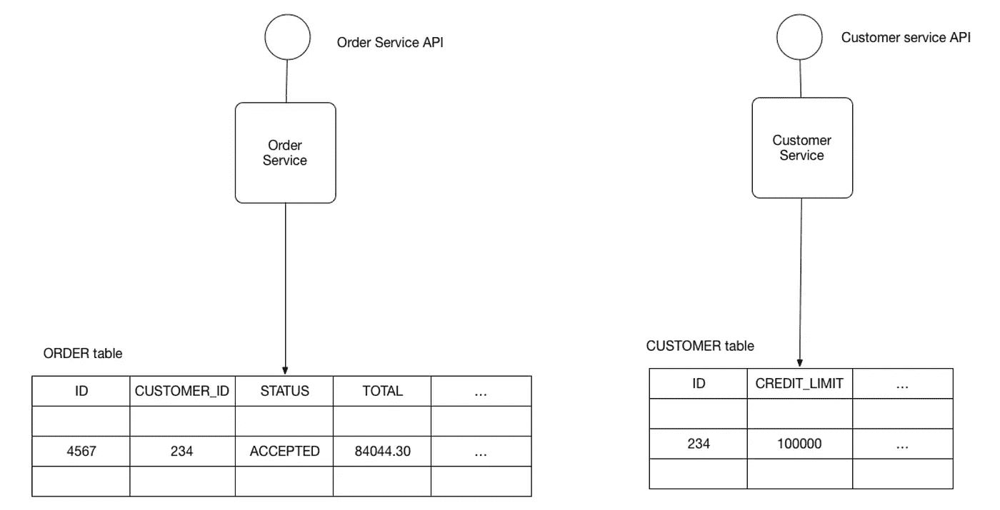

# 微服务中的数据管理

> 原文：<https://javascript.plainenglish.io/data-management-in-microservices-3779cf67d22d?source=collection_archive---------0----------------------->

如何在微服务架构模式下管理和持久化数据？

在本文中，我们将讨论如何保存和检索数据。

## 语境

假设我们开始开发一个电子商务应用程序。我们需要将客户的数据存储在系统中，并在客户试图下订单时使用相同的数据。或者，当我们试图下订单时，我们需要来自物流、客户和支付服务的数据，以便确认订单是否成功。

这就给我们带来了一个问题，即我们应该如何计划我们试图持久化的数据，以及如何检索这些数据。

## 数据库架构模式

## ***1。每个服务模式的数据库***

a.我们试图让每个服务都有独立的数据库，这样每个服务都可以有自己的数据格式和数据库存储类型的选择。

b.每个微服务的持久数据都是该服务的私有数据，只能通过其 API 访问。

c.一个服务事务只涉及到它的数据库。

d.任何服务数据库都不能通过架构中的任何其他外部服务直接访问。

**如何缓解每个服务都有数据库服务器的情况**

例如，如果您正在使用一个 ***关系数据库*** ，那么选项有:

*   **Private-tables-per-service**—每个服务拥有一组只能由该服务访问的表。
*   **每服务模式** —每个服务都有一个数据库模式，它是该服务的私有模式。

**优点**

**缺点**

## 2.共享数据库模式

a.我们尝试跨多个服务共享一个通用的数据库存储类型。

b.所有服务在公共数据库中记录/输入它们的业务交易。

c.如果我们试图同时对同一个数据库表进行更改，我们就使用锁定机制。*(不久将添加锁定机制的类型文章)*

d.数据可能不遵循 CAP 定理惯例。

e.它们遵循当地的酸性。

## **优势**

*   开发人员使用熟悉而简单的 ACID 事务来加强数据一致性。
*   单个数据库操作起来更简单。

## 不足之处

*   开发时间耦合——例如，开发`OrderService`的开发人员需要与访问相同表的其他服务的开发人员协调模式更改。这种耦合和额外的协调会减慢开发速度。
*   运行时耦合——因为所有服务都访问同一个数据库，所以它们可能会相互干扰。例如，如果长时间运行的`CustomerService`事务持有`ORDER`表上的锁，那么`OrderService`将被阻塞。
*   单个数据库可能无法满足所有服务的数据存储和访问要求。

***如需更多内容，请关注我！我最近开始看系统设计视频，不久将继续分享这样的内容。***

**你也可以联系我** [**这里**](https://www.linkedin.com/in/gaurang-mittal-a65a6a170/) **(Linkedin)**

参考

1.  [https://micro services . io/patterns/data/database-per-service . html](https://microservices.io/patterns/data/database-per-service.html)
2.  [https://microservices.io/patterns/data/shared-database.html](https://microservices.io/patterns/data/shared-database.html)

*更多内容看* [***说白了就是***](https://plainenglish.io/) *。报名参加我们的* [***免费每周简讯***](http://newsletter.plainenglish.io/) *。加入我们的* [***不和谐***](https://discord.gg/GtDtUAvyhW) *社区，关注我们的*[***Twitter***](https://twitter.com/inPlainEngHQ)[***LinkedIn***](https://www.linkedin.com/company/inplainenglish/)*和**[***YouTube***](https://www.youtube.com/channel/UCtipWUghju290NWcn8jhyAw)*

****用*** [***电路***](https://circuit.ooo/?utm=publication-post-cta) *学习如何为你的创业建立认知和采用。**