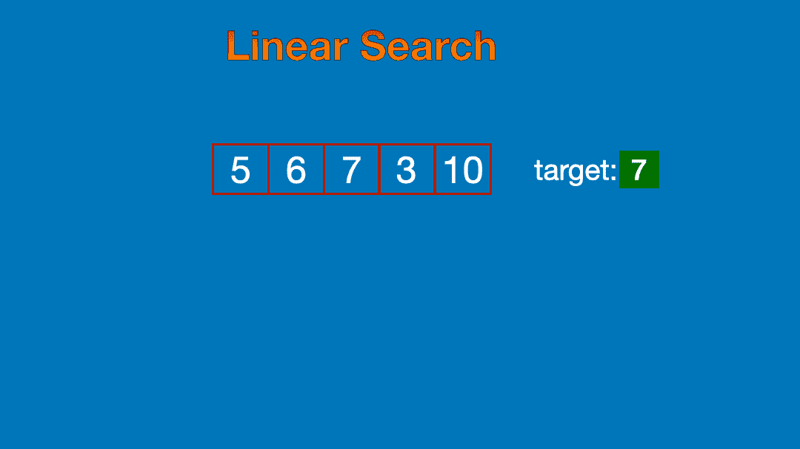
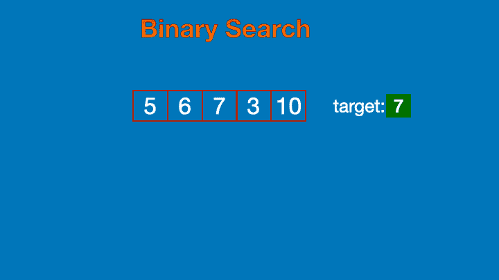
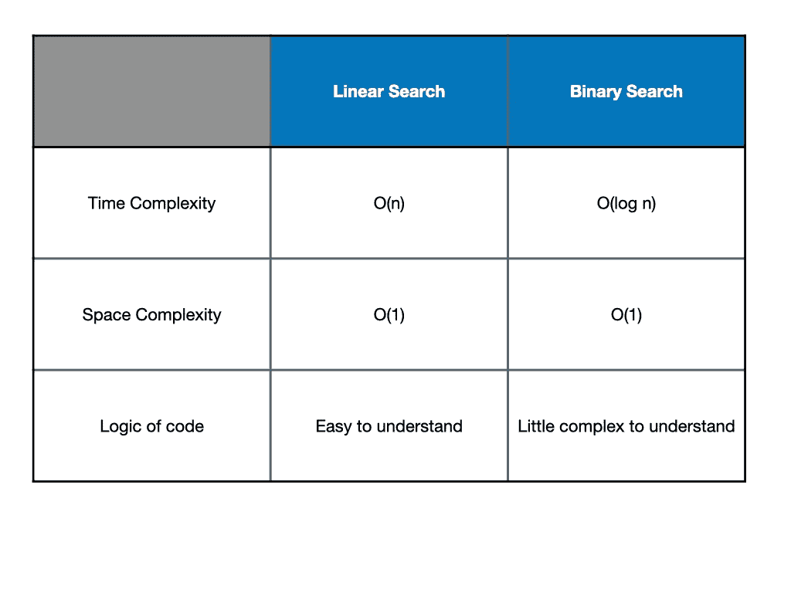

# 数据结构算法—搜索

> 原文：<https://javascript.plainenglish.io/data-structure-algorithm-searching-13b4c7563e10?source=collection_archive---------12----------------------->

Photo by [Evgeni Tcherkasski](https://unsplash.com/@evgenit?utm_source=medium&utm_medium=referral) on [Unsplash](https://unsplash.com?utm_source=medium&utm_medium=referral)

顾名思义，搜索是在数组(或列表)中搜索值的模式。搜索有两种模式。

*   线性搜索
*   二进位检索

## 线性搜索

线性搜索是顺序搜索元素的模式。在这种模式中，将搜索一个元素，直到它在数组中找到该元素。

Linear Search

Code for Linear Search in JavaScript

## 二进位检索

二分搜索法是通过分割数组来搜索元素的模式。在这种模式中，

*   数组应该是有序的。
*   如果数组未排序，它将不起作用。
*   数组将根据大小一分为二，并设置查找元素的边界，剩余的元素将被跳过。

Binary Search

Code for Binary Search in JavaScript

比较:

结论:

比起简单的方法，我更喜欢快速的方法。所以我最喜欢的搜索方法是二分搜索法。

*更多内容请看*[***plain English . io***](https://plainenglish.io/)*。*

*报名参加我们的* [***免费每周简讯***](http://newsletter.plainenglish.io/) *。关注我们关于* [***推特***](https://twitter.com/inPlainEngHQ)[***LinkedIn***](https://www.linkedin.com/company/inplainenglish/)*[***YouTube***](https://www.youtube.com/channel/UCtipWUghju290NWcn8jhyAw)*[***不和***](https://discord.gg/GtDtUAvyhW) ***。*****

*****对缩放您的软件启动感兴趣*** *？检查* [***电路***](https://circuit.ooo?utm=publication-post-cta) *。***