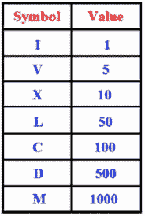

# 数据结构和算法:将罗马数字转换为整数

> 原文：<https://javascript.plainenglish.io/data-structures-and-algorithms-convert-roman-numerals-to-integer-267c1be470ff?source=collection_archive---------4----------------------->

## 逻辑解决常见面试问题指南

Photo by [Oskar Yildiz](https://unsplash.com/@oskaryil?utm_source=medium&utm_medium=referral) on [Unsplash](https://unsplash.com?utm_source=medium&utm_medium=referral)

有些面试问题是为了看申请人是否理解特定的概念。相比之下，其他人并不特别关注记忆、递归或链表等概念。相反，这些是用来测试人的批判性思维，他们解决问题的方法，以及他们如何利用这些来提出一个合乎逻辑的解决方案。一个常见的问题是罗马数字转换问题。

给定一个罗马数字，将其转换为整数

## 准备

要准备这个问题，首先要知道组成罗马数字的符号。

接下来，有几个涉及罗马数字的条件需要了解。

*   我可以放在 V 和 X 前面做成 IV(4)和 IX(9)。
*   x 可以放在 L 和 C 前面，组成 XL(40)和 XC(90)。
*   c 可以放在 D 和 M 前面做成 CD(400)和 CM(900)。

在函数中使用这一点的情况下，我们可以将其进一步简化为以下规则:

1.  如果一个较低值的数字在一个较高值数字的左边，它就被减去。
2.  如果较低值位在较高值位的右边，则将其相加。

例如 **IV** 等于 **4** ，因为 **I** (1)在 **V** (5)的左边，所以它被减去。 **XV** 为 **15** 是因为下限值 **V** (5)在 **X** (10)的右边，所以增加了它。

有了这些信息，我们现在可以解决这个问题了。

## 解决方案

是时候开始编写代码了。我们需要一张所有罗马数字符号的地图。一个对象是完美的。

接下来，我们需要创建一个函数，它接受字符串形式的罗马数字作为参数。因为我们将查看输入字符串的每个符号，辨别其值，并将其加到总数中，所以我们需要一个初始值为`0`的变量。我们还需要包括前面提到的正确计算符号的条件。

看一下代码，我们有一个包含所有符号及其对应值的对象，以及一个接受字符串输入并遍历它的函数。它将当前符号值与它旁边的符号值进行比较，我们从前面的条件中获取正确的数量并将其添加到总数中。如果当前符号的值小于下一个符号，则从`next`的值中减去`current`的值，然后将该值加到`total`。然后增加迭代值，以便在下一次迭代中，我们正确地向前跳跃两个符号，确保相同的符号不会被再次计数。否则，如果`current`的值等于或大于`next`，则当前值被加到总数中，循环正常继续。一旦计算完所有符号，返回`total`。

最终结果正确地将罗马数字转换成整数。

这是一个很好的学习问题，因为它在面试中很流行。它证明了一个人可以采用一组规则和条件，并正确地将它们转换成工作代码。解决这样的问题证明了商业中所追求的批判性思维水平。希望你会发现这很有用，感谢你的阅读！

*更多内容看* [***说白了就是 io***](https://plainenglish.io/) *。报名参加我们的* [***免费周报***](http://newsletter.plainenglish.io/) *。关注我们关于*[***Twitter***](https://twitter.com/inPlainEngHQ)*和*[***LinkedIn***](https://www.linkedin.com/company/inplainenglish/)*。查看我们的* [***社区不和谐***](https://discord.gg/GtDtUAvyhW) *加入我们的* [***人才集体***](https://inplainenglish.pallet.com/talent/welcome) *。*