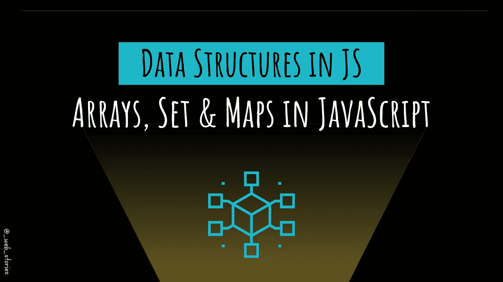

# JavaScript 中的数据结构

> 原文：<https://javascript.plainenglish.io/data-structures-in-js-9a13f7aa82b3?source=collection_archive---------11----------------------->

## **数组，在 JavaScript 中设置&地图**



By FAM

## 你好👋

上一次，我们学习了 [JS 对象](https://famzil.medium.com/objects-in-javascript-64fa3e82765f?source=your_stories_page-------------------------------------)。现在，是时候采用更现代的方法来操作数据和管理复杂的数据结构了:

*   ***阵列***
*   ***贴图***
*   ***设置***

让我们得到这个！

# ***数组***

> ***数组*** 用于存储有序集合。

数组是一种适合存储和管理有序数据项的特殊对象。

我们可以通过以下操作将数组用作队列:

*   `push(...items)`在末尾加上`items`。
*   `pop()`从末尾移除元素并返回。
*   `shift()`从开始处删除元素并返回它(对于性能问题，不建议使用)。
*   `unshift(...items)`在开头添加`items`(由于性能问题，不建议使用)。

## 💻例子

```
let techs= ["React", "Angular", "VueJS"];// Access elements
alert( techs**[0]** ); // React 
alert( techs**[1]** ); // Angular 
alert( techs**[2]** ); // VueJS//Replace element
techs**[2]** = 'Svelte'; // now ["React", "Angular", "Svelte"]//Add new element with push
techs.***push***("Ember"); // now ["React", "Angular", "Svelte", "Ember"]
```

要循环数组的元素:

*   `***for (let i=0; i<arr.length; i++)***`–运行速度最快，兼容旧浏览器。
*   `***for (let item of arr)***`–仅用于项目的现代语法。

# **图*图*图**

> ***Map*** 是键控数据项的集合。

键控数据项的集合，就像一个`***Object***`。但主要区别在于`***Map***`允许 ***的按键任意类型*** 。

*   `new Map()`–创建地图。
*   `map.set(key, value)`–通过按键存储数值。
*   `map.get(key)`–如果`key`在地图上不存在，则通过`undefined`键返回值。
*   `map.has(key)`–如果`key`存在，则返回`true`，否则返回`false`。
*   `map.delete(key)`–通过按键删除数值。
*   `map.clear()`–从地图上移除所有东西。
*   `map.size`–返回当前元素计数。

```
const **famBlog** = **new Map**([
    ['name', 'Web stories'],
    ['type', 'Web developement'],
    ['age', 2],
]);famBlog.**set**('Techs', 'React, Angular, JS, VueJS, NodeJS, ...');
console.log(famBlog.**has**('type')); // returns truefor(const [key, value] of famBlog) {
  console.log(`${key}: ${value}!`);
}//Outputs
// "name: Web stories!"
// "type: Web developement!"
// "age: 2"
// "Techs: React, Angular, JS, VueJS, NodeJS, ...!"
```

# 一组

> 集合是“值集合”的一种特殊类型的集合。

一个`***Set***`是一组值(没有键)。每个值只能出现一次。

*   `new Set(iterable)`–创建器械包。
*   `set.add(value)`–向集合添加一个值。
*   `set.delete(value)`–删除该值，如果`***value***`在调用时存在，则返回`***true***`，否则返回`***false***`。
*   `set.has(value)`–如果集合中存在该值，则返回`***true***` ，否则返回`***false***`。
*   `set.clear()`–清空器械包。
*   `set.size`–是元素计数。

## 💻例子

```
let usersSet = **new Set();** 
let user1 = { name: "John", email: "[john@mail.com](mailto:john@mail.com)" }; 
let user2 = { name: "Pete", email: "[pete@mail.com](mailto:pete@mail.com)" }; 
let user3 = { name: "Mary", email: "[mary@mail.com](mailto:mary@mail.com)" }; 
usersSet.**add**(user1); 
usersSet.**add**(user2); 
usersSet.**add**(user3);
console.log(usersSet);***//Outputs*** // [object Set] (3)
{// [object Object] 
{
  "name": "John",
  "email": "john@mail.com"
},// [object Object] 
{
  "name": "Pete",
  "email": "pete@mail.com"
},// [object Object] 
{
  "name": "Mary",
  "email": "mary@mail.com"
}}
```

今天就到这里，看阿雅🙋

如果您有任何问题或反馈，请点击评论或通过 LinkedIn 联系我— **我洗耳恭听！**

[**想请我喝杯咖啡吗？☕️**](https://www.buymeacoffee.com/fatimaamzil)

> 让我们为 2022 年打造一个更好的‘我们’！

## 了解有关 2022 年网络快车计划的更多信息:

I- [通用网络知识](https://medium.com/geekculture/2022-web-program-chapter-n-1-is-done-499fb0707220?source=your_stories_page----------------------------------------)

[II-网页框架:HTML](https://famzil.medium.com/your-html-essentials-69d9b2349355?source=your_stories_page----------------------------------------)

[III-网页样式:CSS](https://medium.com/geekculture/recap-of-the-css-chapter-ae388d51e564?source=your_stories_page----------------------------------------)

## IV- Web 交互:JavaScript

*   [异步代码](/can-the-web-live-without-asynchronous-code-7f61fe2e862e?source=your_stories_page----------------------------------------)
*   [这个](https://medium.com/geekculture/this-for-developers-5dc91d499677?source=your_stories_page----------------------------------------)
*   [变量](https://medium.com/codex/js-variables-what-you-need-to-know-fb8994ed9d0d?source=your_stories_page-------------------------------------)
*   [范围&吊装](/js-mechanism-you-should-know-12431e094103?source=your_stories_page-------------------------------------)
*   [操作员](/js-operators-3511c8545719?source=your_stories_page-------------------------------------)
*   [关闭](https://famzil.medium.com/js-closures-99666fe36a6a?source=your_stories_page-------------------------------------)
*   [高阶函数](https://famzil.medium.com/whats-hof-in-javascript-9fb68a9c3f6f?source=your_stories_page-------------------------------------)
*   [对象&方法](https://famzil.medium.com/objects-in-javascript-64fa3e82765f?source=your_stories_page-------------------------------------)

> **数组，设置&贴图**

*   功能和箭头功能
*   超时和间隔
*   …

[](https://medium.com/geekculture/2022-web-program-is-launched-f38a3280af1a) [## 2022 网络计划启动！

### 改变来自心态和习惯

medium.com](https://medium.com/geekculture/2022-web-program-is-launched-f38a3280af1a) 

与想成为 web 开发人员的人分享该程序！这将有助于保持进步，并在旅途中互相帮助。

> 如果你喜欢我的文章， [**订阅**](https://famzil.medium.com/subscribe) 获取我的最新。如果你自己喜欢体验媒介，可以考虑通过[**注册**](https://famzil.medium.com/membership) 会员来支持我和其他成千上万的作家。它每个月只需要 5 美元，它支持我们，作家，你也有机会用你的作品赚钱。当然，你可以随时取消会员资格。通过注册[这个链接](https://famzil.medium.com/membership)，你将直接用你的一部分费用来支持我，不会花你更多的钱。如果你这样做了，万分感谢！

让我们在 [**上**取得联系****](https://medium.com/@famzil/)**[**Linkedin**](https://www.linkedin.com/in/fatima-amzil-9031ba95/)**[**脸书**](https://www.facebook.com/The-Front-End-World)**[**insta gram**](https://www.instagram.com/the_frontend_world/)**[**YouTube**](https://www.youtube.com/channel/UCaxr-f9r6P1u7Y7SKFHi12g)**或**[](https://twitter.com/FatimaAMZIL9)********

******[](https://famzil.medium.com/membership) [## 通过我的推荐链接——FAM 加入 Medium

### 作为一个媒体会员，你的会员费的一部分会给你阅读的作家，你可以完全接触到每一个故事…

famzil.medium.com](https://famzil.medium.com/membership) 

*更多内容看* [***说白了就是***](https://plainenglish.io/) *。报名参加我们的* [***免费周报***](http://newsletter.plainenglish.io/) *。关注我们关于*[***Twitter***](https://twitter.com/inPlainEngHQ)*和*[***LinkedIn***](https://www.linkedin.com/company/inplainenglish/)*。加入我们的* [***社区不和谐***](https://discord.gg/GtDtUAvyhW) *。*******