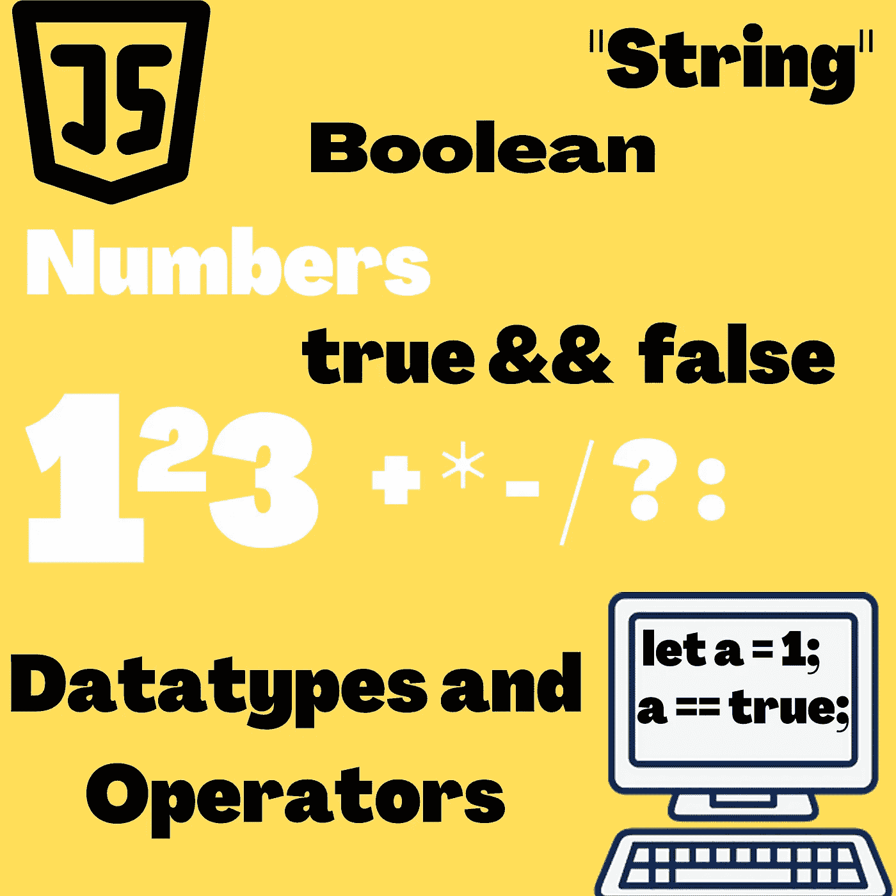

# JavaScript 中的数据类型和运算符

> 原文：<https://javascript.plainenglish.io/datatypes-and-operators-in-javascript-49229b81ef56?source=collection_archive---------17----------------------->

The above image is created by Divyojyoti Ghosh(me) on [www.canva.com](http://www.canva.com/) using different elements available for making designs.

我们大多数人都知道计算机以 0 和 1 的形式存储数据，也称为**位**。例如，数字 12 以二进制形式存储，这与十进制数字系统非常相似。唯一的区别是在十进制数字系统中，从 0 到 9 有 10 个数字，而在二进制数字系统中，只有 0 和 1 两个数字。所以，数制 **0，1，2，3，4，5，6…十进制中的**变成了二进制中的 **0，1，10，11，100，101，110…** 。

## 价值观念

在现代计算机的易失性数据存储器(工作存储器)中，通常存储有 3000 万比特的数据。并且，在诸如硬盘的非易失性数据存储器中，易失性数据存储器中有几个数量级。这需要管理大量数据。为了存储不同的信息，我们对每种信息使用数据块，并将这些数据块命名为。这些块被称为*值*。

值有不同的类型，有些可以是数字，有些可以是文本，有些可以是运算符，等等。在编程领域，我们称这些类型为“数据类型”。每种计算机语言都有自己的一套数据类型。

# 数据类型

## 数字

值类型 **numbers** 存储各种数值。Javascript 提供 64 位来存储数值。在这 64 位中，1 位用于存储数字的负号或正号，另外，在小数的情况下，一些位用于存储小数的位置。可以存储的最高数字在千万亿(15 个零)的范围内，这实际上是一个很大的数字。

使用没有任何小数的整数进行计算会产生精确的值，但不幸的是，当计算涉及具有小数值的数字时，结果会失去其精度，因为有时 64 位不足以存储精确的小数值。

## 特殊号码

有三个特殊的号码-

1.  无穷
2.  -无限
3.  圆盘烤饼

前两个代表数学中的正负无穷大。最后一个 NaN 代表“不是一个数”。每当我们进行任何不能产生有意义结果的数学运算时，结果都是 NaN。例如— 1/0、无穷大—无穷大、无穷大/无穷大、2/ 'A '等。

## 用线串

字符串数据类型用于存储和操作 Javascript 中的文本。写在引号内的任何内容都具有数据类型 string。字符串可以写在双引号`"abcd"`、单引号`'abcd'`和反斜线``abcd``中。

为了将字符串存储为位，Javascript 使用 Unicode，UNICODE 为我们需要的所有字符提供一个数字，然后这些数字以位的形式存储在二进制格式中。

字符串的操作符不多，但是我们可以使用****+**操作符添加两个或更多的字符串**

**`"My name is " + "Divyojyoti Ghosh"`**

**这导致了—**

**`"My name is Divyojyoti Ghosh"`**

**有许多专门针对字符串的方法，可用于对字符串执行许多操纵和操作。**

**字符串的一个重要属性是**长度，**这给出了字符串中的字符数。比如说—**

****《大卫》。长度**导致 5 个字符。**

## **布尔值**

**拥有一个值来单独区分两个选项，例如“是”和“否”或者“开”和“关”，通常是有利的。JavaScript 包括一个专门用于这种用途的布尔类型，它只有两个值 true 和 false。**

**我们可以通过比较两个值来产生布尔值，例如-**

**`console.log(2 < 3);` // *这将产生* **真。****

**`console.log(5 < 4);` // *这会产生* **假。****

**`>`和`<`符号用于数学中，分别表示“大于”和“小于”。**

**还有其他类似的运算符，如-**

**`>=`(大于等于)、`<=`(小于等于)、`==`(等于)、`!=`(不等于)。**

**`console.log("Apple" != "Orange");` // *这将产生* **真**两个字符串不相等并且`!=`操作符检查不相等**。****

**`console.log(1 == 4);` // *这将产生* **假**两个字符串不相等并且`==`操作员检查相等**。****

## **空值**

**当缺少有效值时，有两个特殊值— *null* 和 *undefined* 用于表示这一点。**

**`undefined`通常表示变量根本没有声明，而`null`表示没有任何有意义的值。此外，null 是 Javascript 中的原始值，而 undefined 是 ECMAScript1 的一个特性。**

# **经营者**

**javascript 中的运算符用于将数据用于特定目的或操纵数据本身。**

**JavaScript 中有几种基本的运算符——**

1.  **一元运算符—这些运算符需要单个值来运算，例如，递增运算符`++` /递减运算符`--`。递增运算符用于将数值增加 1，递减运算符用于将数值减少 1。**
2.  **二元运算符—这些运算符需要一个二进制值来进行运算，例如，加法、减法、乘法、除法等算术运算符。**
3.  **三元运算符——非常明显，它需要 3 个值来运算。有一个三元运算符，也称为条件运算符，它接受三个操作数:一个条件，一个条件为真时执行的表达式，以及一个条件为假时执行的表达式。**

## **算术运算符**

**数字之间可以进行各种算术运算，如加、减、乘、除等。**

**1 + 5 * 3**

**这可以用与数学中非常相似的方法来计算，我们首先将 5 和 3 相乘，然后将结果加 1。需要首先执行的操作是根据运算符的优先级决定的。当有优先级相同的运算符时，选择从左到右的顺序进行运算。此外，我们可以添加括号，就像我们在数学中做的那样，以避免任何混淆。例如，2 * 3/6–3 可以写成((2*3)/6) — 3。**

## **逻辑运算符**

**布尔值本身也可以进行一些处理。And、or 和 not 是 JavaScript 实现的三个逻辑运算符。你可以用它们来“推理”布尔。**

**逻辑**和**由 **& &** 运算符表示。它是一个二元运算符，因此，只有当两个输入值都为真时，结果才会为真。**

**`console.log(true && false);`//这将返回 false，因为只有当两个输入值都为真时，结果才能为真。**

**逻辑**或**由运算符||表示。如果传递给它的任何一个值为 true，它将返回 true。`console.log(true || false);` //当其中一个值为真时，将返回 false。**

**当写逻辑**不是**时，一个感叹号(！)被使用。它是一元运算符。！真创造假和！false 产生 true，它反转传递给它的值。**

**我们也可以混合任何运算的运算符，例如—**

**`console.log((1+1 == 2) || (3+3 == 9) ? "correct" : "wrong");`**

**在这里，我使用了条件(三元)运算符，其中`?`之前的第一个表达式是条件，它检查 or 条件是否为真，然后返回`"correct"`，否则，它返回`"wrong"`。显示其他两个值中的哪一个取决于问号左侧的值。当值为真时，它选择中间的值，当值为假时，它选择右边的值。**

# **参考文献—**

** [## 值、类型和运算符::雄辩的 JavaScript

### 在机器表面之下，程序移动。不用努力，它就会膨胀和收缩。非常和谐地…

eloquentjavascript.net](https://eloquentjavascript.net/01_values.html)  [## JavaScript 教程

### 欢迎来到 JavaScriptTutorial.net 网站！这篇 JavaScript 教程帮助你学习 JavaScript 编程…

www.javascripttutorial.net](https://www.javascripttutorial.net/)  [## JavaScript 教程

### JavaScript 是世界上最流行的编程语言。JavaScript 是网络的编程语言…

www.w3schools.com](https://www.w3schools.com/js/) 

*更多内容尽在* [***说白了. io***](https://plainenglish.io/) *。报名参加我们的* [***免费周报***](http://newsletter.plainenglish.io/) *。关注我们关于* [***推特***](https://twitter.com/inPlainEngHQ) ， [***领英***](https://www.linkedin.com/company/inplainenglish/) ***，***[***YouTube***](https://www.youtube.com/channel/UCtipWUghju290NWcn8jhyAw)***，以及****[***不和***](https://discord.gg/GtDtUAvyhW) *对成长黑客感兴趣？检查出* [***电路***](https://circuit.ooo/) ***。******