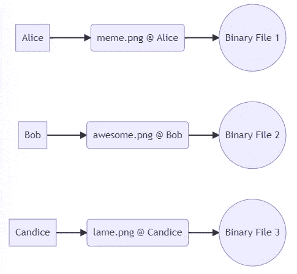
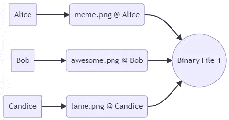
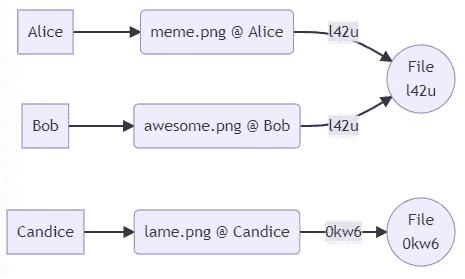

# 如何不存储同一个文件两次(使用 JavaScript 和 PouchDB)

> 原文：<https://javascript.plainenglish.io/de-duplicating-data-storage-i-3ed467afc528?source=collection_archive---------18----------------------->

## 消除重复数据存储


Photo by [Jeremy Bezanger](https://unsplash.com/@unarchive?utm_source=unsplash&utm_medium=referral&utm_content=creditCopyText) on [Unsplash](https://unsplash.com/s/photos/repeating-lemons?utm_source=unsplash&utm_medium=referral&utm_content=creditCopyText)

很多年前，我读到一篇关于谷歌内部实验室设法在两个 PDF 文档之间创建`sha1`哈希[冲突的文章。这些文档是非常不同的文档，但是通过巧妙的位操作，产生了相同的`sha1`代码。在周五下午，这是一篇引人入胜的阅读，但在周末，我开始问自己一个问题:谷歌为什么在乎？](https://shattered.io/)

这将影响谷歌的一个重要方面是他们的存储平台 Google Drive。考虑到他们代表大量的人存储着大量的文件，很可能会有大量的重复文件。

从逻辑上讲，我们可以通过它的用法看到这可能是真的。假设我正在从事一项房地产交易，交换带有扫描签名的电子邮件 pdf 并不少见。假设每个人都在使用 Google Drive 备份他们的文档，那么有四个人拥有完全相同文档的副本:买方、买方代理、卖方代理、卖方。不要忘记在这个过程的后面加上律师和贷款人。

我曾为主要业务涉及数据交换和存储(石油/天然气生产、电信或数据仓库)的组织工作过，在每种情况下，我们解决问题的方法都很简单:向客户收费。向客户收取每字节费用:他们占用的驱动器空间*复制空间*服务器成本*电费*租金*加价。向客户收费是抵消成本的一个好方法，谷歌也确实向客户收费，但通过重复数据删除，可以保持相同的收入，同时大幅减少物理存储量。


Viral Memes were always a fun way to watch a poorly configured communication network burst into flames

拿我参与的一个聊天服务来说。 [GSMA-RCC](https://www.gsma.com/futurenetworks/wp-content/uploads/2019/10/RCC.07-v11.0.pdf) 规定图像可以在客户端设备之间互换；它还指定这些图像应该保留在服务器上，供以后提取。因此，如果一个迷因像病毒一样传播，成千上万的人可能会互相转发该图像，导致该图像的成千上万个副本在网络上传播，并存储在服务器驱动器上。

此外，如果这是一个好的迷因，人们会把它转发给他们认识的人；已经收到的人。图像如此周而复始，直到理论上它被发送到每一对人之间可能的通信中才会停止。

在[这个星球上](https://technative.io/digital-devices-are-the-backbone-of-every-organisation-are-you-managing-them-properly/#:~:text=Statista%20estimates%20that%20as%20of,us%20roughly%20three%20to%20one.)有 100 亿个设备，这比[需要跨越的 7 座桥梁](https://en.wikipedia.org/wiki/Seven_Bridges_of_K%C3%B6nigsberg)还要多。

如果某个混蛋将该迷因作为`bitmap`发送，每个图像实例将占用大约 1079KB。

```
assume
- $1.00 per MB revenue
- $0.90 per MB cost
- 1,000,000 user interactions (transfer)
- 1024KB file= 1 MB * 1M transfers * ($1 - $0.9)
= 1TB of storage
**= $100,000 profit**
```

我们可以明智地要求所有内容都转换成 PNG 格式(注意 Google 要求 Google Photos 这样做),将大小减少到 615KB (60%)。这在处理固定收入时是有用的，但不是承诺的数据存储的真实拷贝。



Storing the object once per person is how the users perceive a file system

为每个接收图像的人存储一次图像是对资源的低效利用。另一方面，如果我们可以识别出它实际上是同一个图像，我们可以将成本降低到只存储一个实例的**，但是对每次传输收费**。

```
= (1MB * 1M transfers * $1) - (1 unique file * 1MB * $0.9)
= 1MB of storage
**= $999,999.10 profit**
```

每笔交易的成本为 90 和 90 是有很大区别的。



Identifying that everyone is storing the same data, allows us to significantly reduce the amount of space we consume while giving the same level of service to our users.

然而，重复数据消除并不是一个容易解决的问题。

首先，我们从不同的人那里以不同的名字接收彼此独立的文件。考虑到大量的大型文件，将这些文件与我们存储的所有其他文件进行逐字节比较将需要大量的处理能力。在大规模系统中，这是不可行的。

这让我们回到了开始的地方:谷歌在实验室中设法引起了`sha1`之间的碰撞。为什么他们会关注研究二进制文档中冲突的极端可能性？因为它们使用散列来帮助识别文件的唯一性。



We can use large hashes as primary keys for the files.

# 一个工作实例

借鉴过去使用 CouchDB 解决这个问题的经验，我们可以使用 JavaScript 和 PouchDB 实现一个浏览器内演示。如果你不熟悉 PouchDB 和使用它的 DB 接口，我建议阅读诺兰·劳森的[权威介绍。](https://pouchdb.com/2014/05/01/secondary-indexes-have-landed-in-pouchdb.html)

我们将创建一个简单的例子，三个用户(Alice、Bob 和 Carol)分享他们刚刚看过的[新剧](https://youtu.be/i1gt1yvUC-s?t=1850)中最喜欢的台词。

```
let db = new PouchDB('filestore');async function main(){
  await db.destroy();
  db = new PouchDB('filestore');
  await CreateIndex();await save(
    'alice',
    'gilbert.txt',
    'I am the very model of a modern major general'
  );
  await save(
    'bob',
    'sullivan.txt',
    'I am the very model of a modern major general'
  );
  await save(
    'carol',
    'gilbert.txt',
    'I have knowledge of things animal, vegetable and mineral'
  );
  await save(
    'alice',
    'sullivan.txt',
    'I have knowledge of things animal, vegetable and mineral'
  ); let data = await db.allDocs({include_docs:true});
  console.log(`DB Size: ${JSON.stringify(data).length}`);

  console.log(await dload('alice'  ,'gilbert.txt'));
  console.log(await dload('bob'    ,'sullivan.txt'));
  console.log(await dload('carol','gilbert.txt')); let peruser = await db.query('allfiles',{
    reduce:true,
    group:true,
    group_level: 1
  });
  console.log(peruser);
}main();
```

这个过程相对简单:三个人将两行文本中的一行存储到他们的帐户中，然后从数据库中检索它们。

感兴趣的是存储的总大小，以及每用户大小(可计费大小)的使用情况:

```
DB Size: 1813 bytes| User  | Files | Size |
| ----- | ----- | ---- |
| alice |     2 |  101 | 
| bob   |     1 |   45 |
| carol |     1 |   56 |
```

程序的真正内容发生在`save`和`dload`中，它们抽象出了与数据库的交互。进一步的`CreateIndex`定义了搜索和检索的机制。

```
async function CreateIndex(){
  return await db.put({
    _id: '_design/allfiles',
    views: {
      'allfiles': {
        map: function (doc) {
          var userpath = [doc.user,doc.path];
          emit(userpath,doc.size);
        }.toString(),
        reduce:'_stats'
      }
    }
  });async function save(user,filename,blob){
  return db.put({
    _id: [user,filename].join('@'),
    user:user,
    path:filename,
    size:blob.length,
    _attachments: {
      '0': {
        content_type: 'text/plain',
        data: window.btoa(blob)
      }
    }
  });
}async function dload(user,filename){
  let recs = await db.query('allfiles',{
    reduce: false,
    include_docs: true,
    attachments: true,
    key: [user,filename]
  });
  let blob = recs.rows[0].doc._attachments['0'].data;
  blob = window.atob(blob);
  return blob;
}
```

保存和下载功能基于这样的假设，即我们将为每个人存储一份记录的副本，而索引管理用户及其文件的列表。

A JSFiddle giving an example of the working demonstration

## 减少存储

要修改这个例子来减少我们的存储，我们必须首先修改 save 函数，不要盲目地为每个用户保存，而是将每个`blob`保存为主要对象，并跟踪观察它的用户作为次要项。

```
async function save(user, filename, blob) {
  let hash = new TextEncoder().encode(blob);
  hash = await crypto.subtle.digest('SHA-256', hash);
  hash = Array.from(new Uint8Array(hash));
  hash = hash
    .map(b => b.toString(16).padStart(2, '0'))
    .join('')
    .substr(0,4);
  let userpath = [user, filename].join('@');
  let rec = null;
  try {
    rec = await db.get(hash);
  } catch (e) {
    if (e.status !== 404) throw e;
    // create the object, with a list of user's using it
    rec = {
      _id: hash,
      userpaths: [],
      size: blob.length,
      _attachments: {
        '0': {
          content_type: 'text/plain',
          data: window.btoa(blob)
        }
      }
    }
  }
  if (!rec.userpaths.includes(userpath)) {
    rec.userpaths.push(userpath);
  }
  // finally save the record
  return db.put(rec);
}
```

这确保了我们只存储一个 blob 一次。

使用散列作为记录标识符意味着不管它被提交多少次，我们只是继续使用现有的记录。新用户只是被添加到使用该项目的用户列表中。用户甚至可以通过用不同的名字提交相同的项目来复制它；我们只是不断地添加注释，让用户知道记录的名称。

自然，这破坏了我们使用的查找索引。最初的索引使用记录的名称(用户名+路径)来查找文件，但是文件不再使用它作为它的记录名称。相反，我们需要创建一个查找索引，该索引由使用同一个文件的所有用户构成。

```
async function CreateIndex(){
  return await db.put({
    _id: '_design/allfiles',
    views: {
      'allfiles': {
        map: function (doc) {
 **for (let userpath of doc.userpaths) {
            userpath = userpath.split('@');
            emit(userpath, doc.size);
          }**
        }.toString(),
        reduce:'_stats'
      }
    }
  });
}
```

通过遍历每个用户路径，我们已经更新了索引，以便为文件的每次使用返回文件。这意味着我们的下载功能没有改变，因为视图的界面没有改变。

注意，我们已经在视图中包含了文件大小，并使用了`stats` reduce 方法。这意味着，当需要计费时，我们可以简单地将用户引用的 blobs 数量相加，以及将它们的总大小相加。

重新运行`main`为我们提供了新的总规模和计费数据:

```
DB Size: 1109 bytes| User  | Files | Size |
| ----- | ----- | ---- |
| alice |     2 |  101 | 
| bob   |     1 |   45 |
| carol |     1 |   56 |
```

即使在我们的小例子中，由于内容非常小，我们的数据库大小(因此我们的业务费用)**减少了 39%** 。随着更多的数据结构被内容占用，而更少的被元数据占用(想想 MP3、MP4 和 PNG)，可以看到更好的回报。

另外，请注意，可计费的大小从未改变。

The same example as previously presented but with the changes to make the storage smaller.

## 完成解决方案

毕竟，我们不能忘记谷歌证明了冲突是恶意的，因此不能绝对信任。我们必须执行完整的逐字节比较。散列函数是确定二进制对象之间不相似性的有用工具，而不是确定相似性的有用工具。

> 散列函数是确定二进制对象之间不相似性的有用工具

这是一个非常有用的功能。通过使用一个大散列，我可以很快地将所需的比较缩小到几乎没有。有一个很好的机会，我将不会有超过一个匹配需要检查，这是少得多的努力比百万。一旦我缩小了范围，就必须用一个额外的标记来检查整个文件，以区别于我们已经有的文件。


[Found this useful or interesting? Consider leaving a tip … it helps.](https://www.buymeacoffee.com/jeffereycave)

第二个问题是，我们需要在某个时候删除记录。在这种情况下，我们可以简单地删除用户对该对象的引用，尽管我们还必须观察没有用户引用该对象的时间。当对象的所有引用都被移除时，对象本身也应该被移除。类似地，如果记录被重命名，我们需要确保在创建新的引用之前删除旧的引用。

我把这些作为练习留给读者。

# 进一步阅读

这个演示使用了 JavaScript 和 PouchDB。我喜欢浏览器内演示，因为它们是如此的可移植:你总是有一个可用的 IDE 和运行时环境。

PouchDB 是 CouchDB 的一个 JavaScript 实现，为了将该解决方案扩展到企业级有用的东西，一个大规模的 CouchDB 实现将是一个良好的开端。

同样值得一提的是，这种技术并不局限于任何特定的系统。同样的技术可以在操作系统级别使用[符号或硬链接](https://www.howtogeek.com/287014/how-to-create-and-use-symbolic-links-aka-symlinks-on-linux/)来实现。事实上，数据库和 FS 存储的某些组合可能是一种优化的方式。

*   手册: [Apache CouchDB](https://docs.couchdb.org/en/stable/) ， [IBM CloudAnt](https://www.ibm.com/cloud/cloudant) ， [CouchBase](https://docs.couchbase.com/home/index.html)
*   创建索引:[二级索引已经在 PouchDB](https://pouchdb.com/2014/05/01/secondary-indexes-have-landed-in-pouchdb.html) 中登陆
*   [如何在 Linux 上创建和使用符号链接](https://www.howtogeek.com/287014/how-to-create-and-use-symbolic-links-aka-symlinks-on-linux/)
*   [什么是 ZFS？](https://itsfoss.com/what-is-zfs/)内置了重复数据删除功能的文件系统

续集还讨论了随着时间的推移，如何有效地存储相同的数据集。

> [删除重复数据存储 II:将(几乎)相同的文件存储两次](https://jefferey-cave.medium.com/not-storing-almost-the-same-file-twice-9a44e3179a6a)

*更多内容请看*[***plain English . io***](https://plainenglish.io/)*。报名参加我们的* [***免费周报***](http://newsletter.plainenglish.io/) *。关注我们关于*[***Twitter***](https://twitter.com/inPlainEngHQ)*和*[***LinkedIn***](https://www.linkedin.com/company/inplainenglish/)*。加入我们的* [***社区不和谐***](https://discord.gg/GtDtUAvyhW) *。*