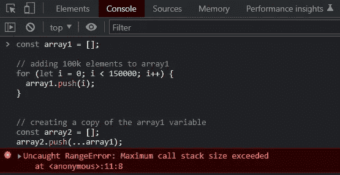
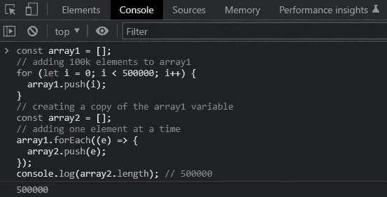

# 处理 JavaScript 中的“超出最大调用堆栈大小”错误

> 原文：<https://javascript.plainenglish.io/deal-with-maximum-call-stack-size-exceeded-error-in-javascript-45c035161a78?source=collection_archive---------6----------------------->

## 关于如何避免 JavaScript 数组中“超过最大调用堆栈大小”错误的教程。

Photo by [Eaters Collective](https://unsplash.com/@eaterscollective?utm_source=medium&utm_medium=referral) on [Unsplash](https://unsplash.com?utm_source=medium&utm_medium=referral)

我最近不得不开发一个 Node.js 脚本，它处理几个数组，每个数组包含 100k 个以上的元素。在用`push()`函数和 JavaScript spread 操作符合并这些数组时，我遇到了“超出最大调用堆栈大小”错误。

这让我有机会深入研究这个问题，并找出如何处理它。现在让我们来看看这个错误是什么，为什么会发生，以及如何避免它。

# 为什么会出现“超出最大调用堆栈大小”错误

让我们考虑下面的例子:

如果您在浏览器控制台中运行此代码片段，您将获得以下结果:

Getting the RangeError

发生这种情况是因为当您使用 spread 运算符时，源数组的所有元素都存储在堆栈中并添加到参数列表中。因此，在处理大量元素(一般> 135K)时，会得到“超出最大调用栈大小”的错误。

因此，当使用 spread 操作符时，可以处理的元素数量受到堆栈大小的限制。注意，使用`[apply()](https://developer.mozilla.org/en-US/docs/Web/JavaScript/Reference/Global_Objects/Function/apply)`函数时也会发生同样的事情。

看看“【JavaScript 函数可以接受的最大参数数量是多少？ " StackOverflow 问题，了解有关堆栈大小限制的更多信息。

# 如何避免数组出现“超出最大调用堆栈大小”错误

处理“超出最大调用堆栈大小”错误很容易。你所要做的就是避免使用扩展操作符或`apply()`函数。例如，您可以迭代所有数组元素，并对每个元素调用`push()`，如下所示:

这将根据需要填充`array2`。

请注意，JavaScript 可以在几分之一秒内执行这个代码片段。因此，即使您正在执行 500k 次`push()`操作，您也不必担心性能。

在浏览器控制台中运行此代码片段，您将获得以下结果:

Populating array2 successfully

瞧啊！您将学习如何处理 JavaScript 数组中的“超出最大调用堆栈大小”错误。

# 结论

在本文中，您了解了什么是“超出最大调用堆栈大小”JavaScript 错误，为什么会出现这种错误，以及如何避免这种错误。处理这个错误并不难，但前提是您知道它被触发的原因。在这里，您有机会了解关于这个错误的更多信息。

感谢阅读！我希望这篇文章对你有所帮助。请随意留下任何问题、评论或建议。

*更多内容请看*[***plain English . io***](https://plainenglish.io/)*。报名参加我们的* [***免费周报***](http://newsletter.plainenglish.io/) *。关注我们关于*[***Twitter***](https://twitter.com/inPlainEngHQ)[***LinkedIn***](https://www.linkedin.com/company/inplainenglish/)*[***YouTube***](https://www.youtube.com/channel/UCtipWUghju290NWcn8jhyAw)*[***不和***](https://discord.gg/GtDtUAvyhW) *。***