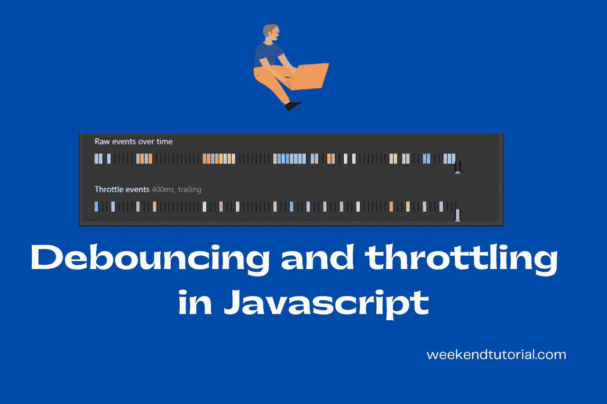
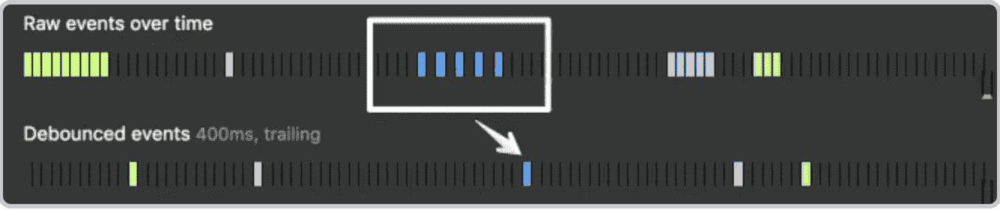
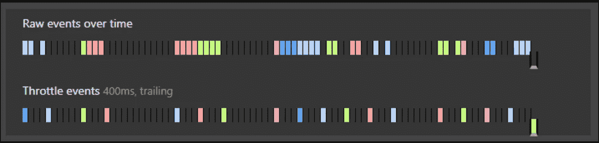

# 去抖和节流——取消 JavaScript 性能装箱

> 原文：<https://javascript.plainenglish.io/debounce-and-throttle-unboxing-js-perf-495fb7c7c214?source=collection_archive---------4----------------------->

## 解释 JavaScript 中的去抖动和节流。

debouncing and throttling — weekendtutorial.com

如果你是一个前端开发人员，你必须通过事件处理器处理各种事件，如按钮点击、表单提交和窗口滚动事件等。

有些事件是轻量级的，不会干扰 UX 行为，但有些正好相反，例如，*强烈建议不要在窗口滚动事件或调整大小事件上附加任何事件处理程序。*

原因是与其他事件相比，取决于浏览器和设备，滚动事件可以触发很多次，这将大量的*滚动回调*放入回调队列和调用堆栈。因此，页面变得无响应且不可滚动。

解决上述问题的两种广为人知的技术是—

1.  去抖动
2.  节流

## 去抖—

去抖技术可以通过定时器来理解。按下按钮时，计时器开始计时。如果在定时器到期前再次按下按钮，定时器将复位。这确保了按钮在每个去抖周期只能被记录为按下一次。

debounce

再举一个例子， ***电梯***

想象你在一部电梯里，电梯门即将关闭。但是，就在另一个人进来之前，电梯门再次打开。现在它等待另一个人一段特定的时间，如果没有人来，门就关闭。因此，我们看到新调用的计时器重置，并将多个连续调用“组合”成一个调用。

其他使用案例—

1.  SearchBar —不想在用户每次按键时都进行搜索？希望在用户停止输入 1 秒后进行搜索。按键时使用`debounce` 1 秒。
2.  自动完成功能
3.  自动保存用户输入
4.  点击进行 API 调用的按钮

您可以查看代码:

创建 index.html 文件-

index.html

还有 debounce.js —

debounce.js

如果您检查控制台，您会发现事件处理程序调用的次数远远小于实际的输入大小。这就是巨大的性能提升！

## 节流—

计数器可以理解节流技术。当按下按钮时，计数器增加。现在，直到计数器达到某个阈值，所有的按钮按下都被忽略。这限制了在给定时间段内按钮被注册为按下的次数。

Throttle

其他使用案例—

1.  射击游戏——手枪每次射击间隔 1 秒，但用户需要多次点击鼠标。点击鼠标时使用`throttle`。
2.  无限滚动

throttle.js

同样，按钮处理程序将在每 500 毫秒调用一次，该窗口中的所有按钮点击都将被忽略。

我们已经看到了使用去抖和节流的性能优势，基于您的用例，您可以在您的代码库中使用它。

***注:***

**下划线**和 **Lodash.js** 库也有去抖和节流方法，你也可以检查一下。

请阅读我博客上的其他文章【https://weekendtutorial.com/ 

*更多内容看* [***说白了就是 io***](https://plainenglish.io/) *。报名参加我们的* [***免费周报***](http://newsletter.plainenglish.io/) *。关注我们关于* [***推特***](https://twitter.com/inPlainEngHQ) ， [***领英***](https://www.linkedin.com/company/inplainenglish/) *，*[***YouTube***](https://www.youtube.com/channel/UCtipWUghju290NWcn8jhyAw)*[***不和***](https://discord.gg/GtDtUAvyhW) *。对增长黑客感兴趣？检查* [***电路***](https://circuit.ooo/) *。**