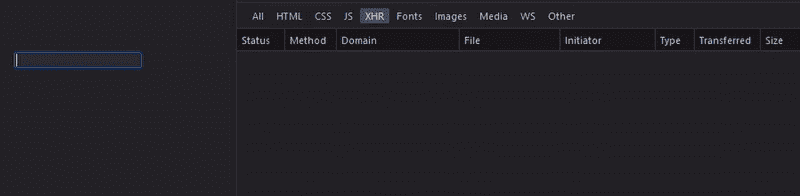
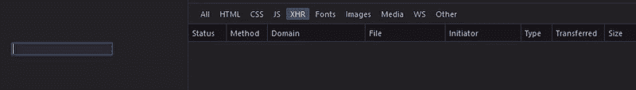

# React 中的去抖搜索功能

> 原文：<https://javascript.plainenglish.io/debounce-search-feature-in-react-46dfc31aede2?source=collection_archive---------3----------------------->

## 在 React 应用中实现去抖动 API 调用的各种方法和去抖动概述。


[**什么是去抖？**](#d751)

[**去抖方法**](#beb5)

*   [**从头去抖**](#04a6)
*   [**创建一个**](#edd4) `[**useDebounce**](#edd4)` [**钩子**](#edd4)
*   [**去抖库**](#3ecb)

[**结论**](#a83a)

# 什么是去抖？

去抖是一个高阶函数*，即*一个返回另一个函数的函数——限制该函数的执行速率。去抖是一种类似于节流的技术，其中代码处理的事件数量是有限的。这两种技术都提高了应用程序的性能。尽管它们的结果可能相似，但它们的实现却不同。去抖功能不会被再次调用，直到经过了一定的时间而没有被调用*，例如*只有当`500ms`自上次被调用以来已经过去了，功能`func`才会被调用。这与限制在给定时间内调用函数的最大次数相比较*，即* `func`每`500ms`最多调用一次。

如果没有去抖请求，性能会降低，因为在很短的时间内会发送太多的请求。我们可以在下面的例子中观察到这一点，当向 [nationalize.io](https://nationalize.io/) 的 API 发出一个请求时，它返回一个被查询名称的民族起源的概率。输入字段中的每个变化都会发送一个请求。



API request without debounce

# 去抖方法

## 1.从头开始去抖

```
debounce(func, [wait=0])
```

自特定事件或最后一次调用去抖动功能起`wait`毫秒后，执行功能`func`。如果未提供值，则`wait`默认为`0`。下面的 Repl 演示了使用上面使用的 API 的去抖实现。

[](https://replit.com/@StRL/typeahead-demo) [## 提前输入-演示

### 演示 React 中的去抖

replit.com](https://replit.com/@StRL/typeahead-demo) 

下面提供了代码的简化版本:

App.jsx

*   `debounce`函数接受 2 个参数:`func`，去反跳的函数；和`wait`，在调用`func`之前的毫秒延迟。
*   `timeout`变量最初设置为`undefined`，用于保存设置定时器的 ID 值。
*   调用`debounce`时返回一个箭头函数。`clearTimeout`被执行并清除正在运行的去抖的当前`timeout`值。
*   执行`setTimeout**()**`，返回值是一个`timeoutID`，然后赋给`timeout`变量。这是传递给`clearTimeout`以取消超时的值。
*   使用 spread 语法将参数`args`应用于`func`，在本例中为`inputVal`。该功能在`wait`毫秒后被调用。
*   `useRef`钩子用于创建一个引用对象`inputElem`。这允许我们通过 DOM 元素的`.current`属性直接访问它。`inputElem`然后被传递给输入字段的`ref`属性。属性`.current`是最新的变量，其属性`value`作为参数传递给`handleSearch()`。
*   `fetchNameResults`作为参数传递给`debounce`。使用 spread 语法将`inputVal`的值应用于`fetchNameResults`，因此在`fetchNameResults`定义中作为参数显式传递。
*   `handleSearch`将去抖函数封装在`useCallback`钩子中，以实现[引用相等](https://www.freecodecamp.org/news/better-react-performance-usecallback-vs-usememo/#whatisreferentialequality)。该函数依赖于`inputVal`，一旦改变，将触发组件重新呈现，并导致`handleSearch`被重新声明。依赖数组是空的，所以`handleSearch`只运行一次。
*   然后，`handleSearch`被调用作为输入字段的`onChange`事件处理程序。`fetchNameResults()`在`inputElem.current.value`不再发生变化*后，即*用户停止输入后`500ms`去抖。结果是对 API 的单个查询:



A debounced API call

## 2.创建一个`useDebounce`钩子

我们可以更进一步，创建一个定制钩子— `useDebounce`。

useDebounce.jsx

*   类似于上面的去抖函数，我们实例化一个变量`timeout`。使用`useRef`钩子的原因同上，我们可以通过`.current`属性访问`timeout`的最新值。
*   `debounce`功能定义同上，除了使用`timeout.current`因为它是一个`ref`对象。
*   如果去抖仍在运行，则`useEffect`钩子用于通过清除`timeout`的`.current`值来取消对`timeout`的订阅。
*   最后，我们返回将在`App.jsx`中使用的`debounce`函数:

App.jsx

## 3.**去抖库**

去抖请求最简单的方法是依靠外部库，比如`[Lodash](https://lodash.com/docs/4.17.15#debounce)`或`[throttle-debounce](https://www.npmjs.com/package/throttle-debounce)`。最常用的是`Lodash`。该函数还接受一个可选的`options`对象，用于修改去抖行为。

```
import { debounce } from 'lodash';
```

注释掉上面演示中定义的`debounce`函数，运行 app，效果也是一样的。

# 结论

去抖是一种提高性能的有用技术。它防止 UI 代码不必要地处理每个事件，或者减少在一定时间内发出的 API 请求的数量。常见的反跳实现包括`scroll`事件，每当用户滚动时触发，导致多次昂贵的重新渲染；除了`resize`和`keyup` / `keydown`事件，还有 API 调用。实现去抖或节流功能也是一个常见的面试问题。创建自己的脚本演示了对以下 JavaScript 概念的理解:[回调](https://developer.mozilla.org/en-US/docs/Glossary/Callback_function)、[范围](https://developer.mozilla.org/en-US/docs/Glossary/Scope)、[闭包](https://developer.mozilla.org/en-US/docs/Web/JavaScript/Closures)、& [异步编程](https://developer.mozilla.org/en-US/docs/Learn/JavaScript/Asynchronous/Introducing)。

快乐黑客✌🏾

*更多内容请看* [***说白了。***](https://plainenglish.io/)

*报名参加我们的* [***免费每周简讯***](http://newsletter.plainenglish.io/) *。关注我们* [***推特***](https://twitter.com/inPlainEngHQ) ， [***领英***](https://www.linkedin.com/company/inplainenglish/) ***，***[***YouTube***](https://www.youtube.com/channel/UCtipWUghju290NWcn8jhyAw)***，****[***不和谐***](https://discord.gg/GtDtUAvyhW)*

****想扩大你的软件创业规模*** *？检查* [***电路***](https://circuit.ooo/?utm=publication-post-cta) *。**