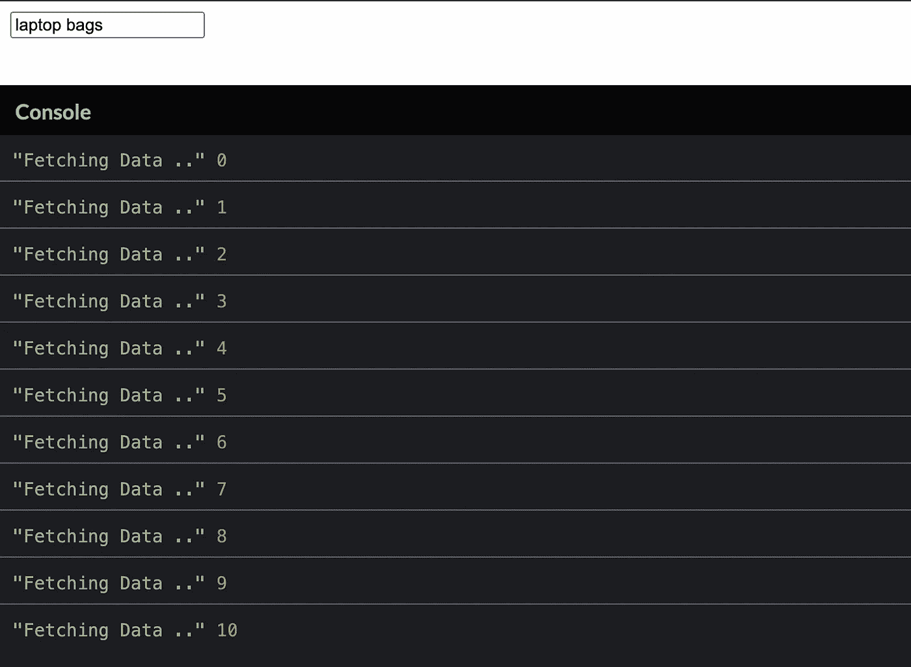
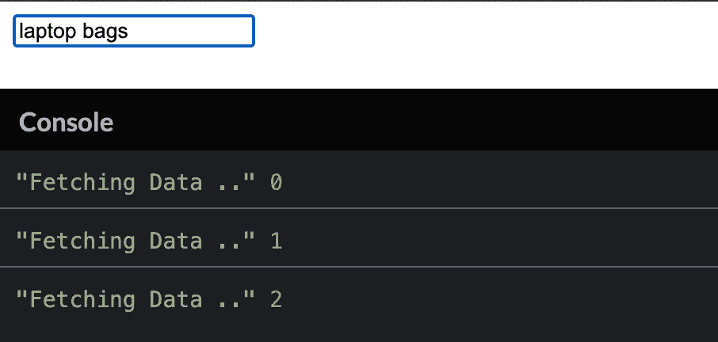
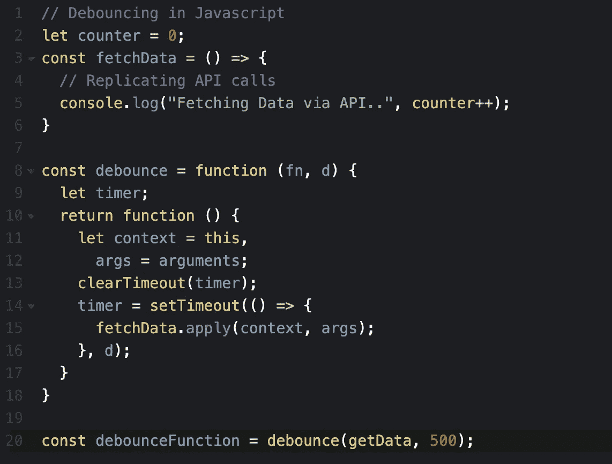
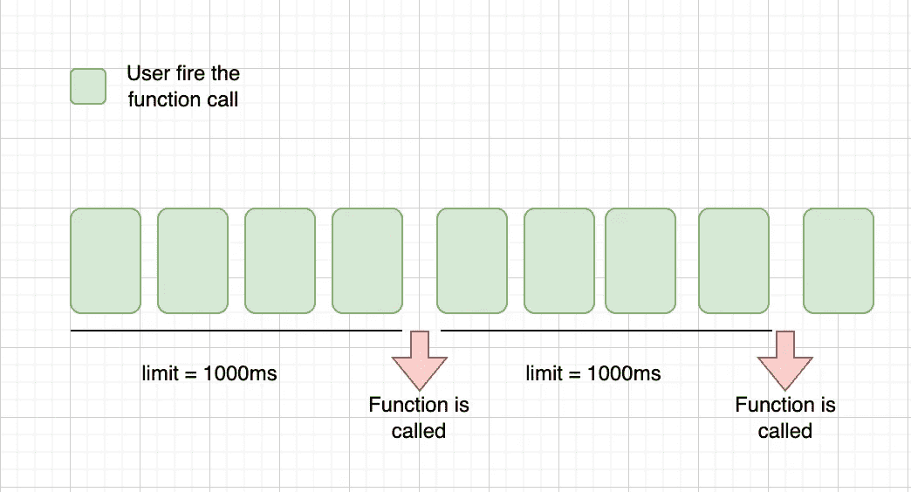
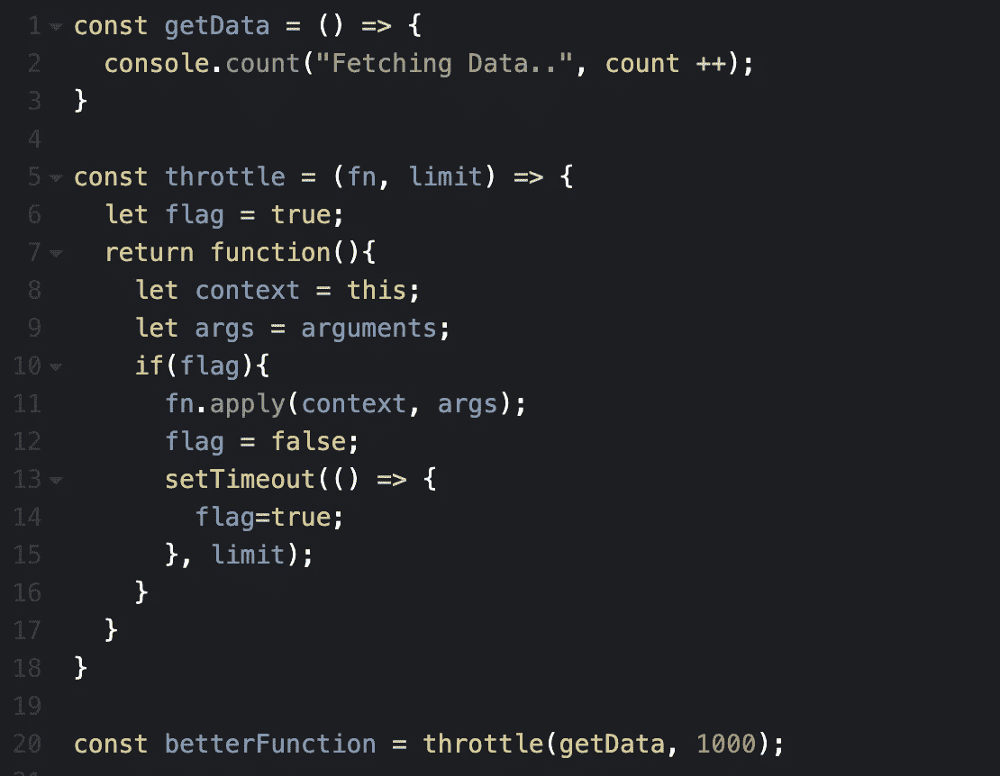

# 理解 JavaScript 中的去抖动和节流

> 原文：<https://javascript.plainenglish.io/debouncing-and-throttling-in-javascript-3c8f8cf5e645?source=collection_archive---------7----------------------->

Photo by [Blake Connally](https://unsplash.com/@blakeconnally) on [Unsplash](https://unsplash.com/)

去抖动和节流都用于通过限制事件被触发的次数来增强网站性能。JavaScript 不提供去抖动和节流功能。它们只是可以使用`setTimeout` web API 实现的概念。

# 什么是去抖

我们举个例子。您打开了一个电子商务网站来搜索笔记本电脑包。

如果没有应用去抖，你可以在下图中看到每次击键时调用的次数。

实现去抖后，我们已经显著减少了调用次数。现在，只有当用户在指定时间后再次输入时，才会发出呼叫。只有当用户再次输入的时间等于我们提供的延迟时，才会执行该功能。

自定义去抖功能

# 什么是节流

节流还用于限制函数调用的速率。节流将在 1000 毫秒内仅触发一次函数调用(这是我们提供的限制)，无论用户触发函数调用多少次。

自定义节流功能

# 结论

我希望在读完这篇文章后，javascript 的这两个概念都清楚了。

可以实现节流和去抖动来增强搜索功能、无限滚动和调整窗口大小。

> 如果我错过了什么，或者你有什么建议，请在评论区告诉我。
> 
> *你也可以联系我【https://www.linkedin.com/in/akhatun/】*
> 
> *[*https://github.com/amnahkhatun*](https://github.com/amnahkhatun)*

*快乐的 coding✌️*

**更多内容请看*[***plain English . io***](https://plainenglish.io/)*。报名参加我们的* [***免费周报***](http://newsletter.plainenglish.io/) *。关注我们关于*[***Twitter***](https://twitter.com/inPlainEngHQ)[***LinkedIn***](https://www.linkedin.com/company/inplainenglish/)*[***YouTube***](https://www.youtube.com/channel/UCtipWUghju290NWcn8jhyAw)***，以及****[***不和***](https://discord.gg/GtDtUAvyhW) *对成长黑客感兴趣？检查* [***电路***](https://circuit.ooo/) ***。******