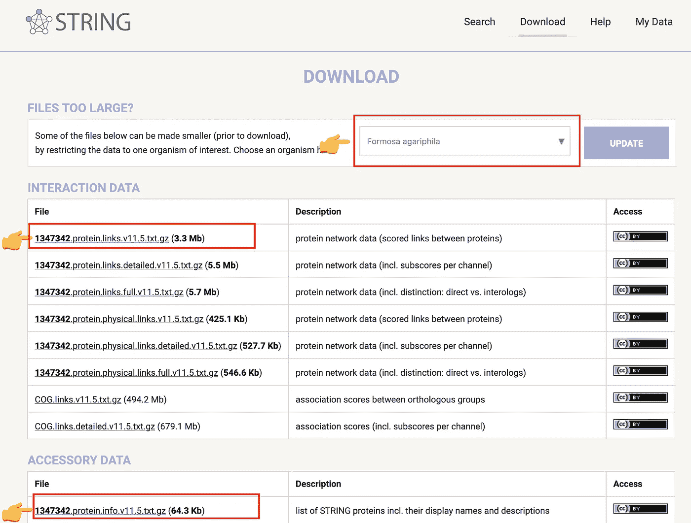
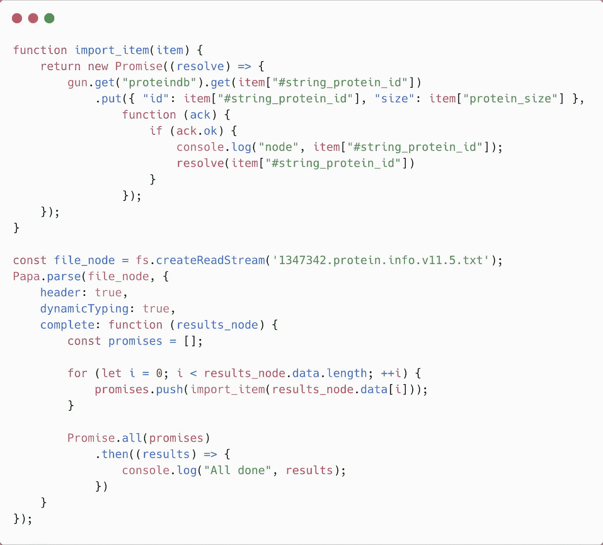
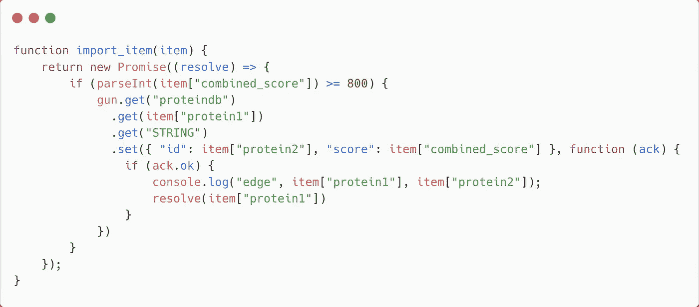

# 带枪分散知识图

> 原文：<https://javascript.plainenglish.io/decentralize-knowledge-graph-with-gun-9e4b0b10a400?source=collection_archive---------13----------------------->

## 建立一个分散的蛋白质相互作用字符串数据库

Photo by [Shubham Dhage](https://unsplash.com/@theshubhamdhage?utm_source=medium&utm_medium=referral) on [Unsplash](https://unsplash.com?utm_source=medium&utm_medium=referral)

> 狡兔三窟。
> 
> —中国习语

这句古老的中国习语说明了一切:不要把所有的鸡蛋放在一个篮子里。对一只狡猾的兔子来说是真的。对于我们这些数据科学家来说也是如此。

在我们的电子健康记录(EHR)聊天机器人 Doctor.ai ( [这里](https://towardsdatascience.com/doctor-ai-an-ai-powered-virtual-voice-assistant-for-health-care-8c09af65aabb)、[这里](https://neo4j.com/blog/doctor-ai-a-voice-chatbot-for-healthcare-powered-by-neo4j-and-aws/)、[这里](https://towardsdatascience.com/transfer-knowledge-graphs-to-doctor-ai-cc21765fa8a6)和[这里](https://medium.com/geekculture/from-symptoms-and-mutations-to-diagnoses-doctor-ai-as-a-diagnosis-tool-5b31ac7a16c3))的开发过程中，出现了一个问题:我们应该把这些私人病历放在哪里？第一个选择是云。然而，随之而来的隐私泄露风险让患者权益倡导者感到不安。此外，云提供商有一天可能会关闭他们的业务，并带走我们的数据。

第二种选择是将数据存放在 P2P 网络中。也就是说，我们将数据分发到许多独立和自愿的计算机上。这与 BitTorrent 的工作方式非常相似。因此，没有人能够单独控制数据。拥有入口点和凭证的每个人都可以访问数据。

这是一个有趣的想法。所以我想尝试一下。因为 Doctor.ai 的后端数据库是 Neo4j 图，所以我四处搜索了一个 P2P 图数据库。而我被奖励了[枪](https://gun.eco/docs/Introduction)。以下是官方描述:

> 它是一个图形数据库，可以存储[类似 SQL 的表、类似 JSON 的文档](https://gun.eco/docs/Graphs)、文件和直播视频，以及关系和超图数据！…通用枪图分布在参与网络的所有对等点上。浏览器对等体使用 localStorage 或 IndexedDB 来仅存储他们订阅的图的子集，使用 WebRTC、Websockets 或其他传输来同步。相同的浏览器代码也运行在 NodeJS 中，带有用于`fs`的适配器插件、S3 式存储备份、UDP 多播和其他功能，这些功能使其仅处于“中继”模式或存储所有内容。

查看 Fireship 在 YouTube 上的两个介绍视频(另一个是[这里是](https://www.youtube.com/watch?v=J5x3OMXjgMc)):

这整个概念让我兴奋不已。尽管我对 JavaScript 非常生疏，但我还是亲自尝试了一下 GUN，看看它是否是 Doctor.ai 的一个好后端。在本教程中，我将向您展示我自己的 GUN 之旅:我从 STRING 中导入了一种细菌的蛋白质-蛋白质相互作用—[*Formosa agariphila*](https://pubmed.ncbi.nlm.nih.gov/16403882/)*。我实现了一个示例查询脚本。所有这些都是用 JavaScript 编写的。本教程的代码在我的 GitHub 页面上:*

* [## GitHub - dgg32/gun_STRING

### 这个存储库包含我的文章“用枪分散知识图”的代码和数据。import_node.js 和…

github.com](https://github.com/dgg32/gun_STRING) 

# 1.将 CSV 文件导入 GUN

事实证明，将正常大小的 CSV 文件导入 GUN 并不简单。首先从 STRING [这里](https://string-db.org/cgi/download?sessionId=bDOqitWZB5WC&species_text=Formosa+agariphila)下载这个项目的两个 CSV 文件，或者你可以这样做:

Figure 1\. Download the CSV files for Formosa agariphila. Image by author.

“链接”文件包含蛋白质-蛋白质相互作用，而“信息”文件包含每个蛋白质的信息。经过一些实验，我决定用两个脚本分别导入。

我们只需要三个包裹。经过一些尝试和错误之后，我发现 Papa Parse 可以完成这项工作:

接下来是进口。原来 GUN 中的 getters 和 setters 是异步的。如果没有特殊措施，主事件循环将在导入完成之前结束。在这个项目中，我使用了承诺。例如，以下代码导入节点:

`import_item`用它的`gun.get().put()`链进行实际的导入。`get()`函数返回一个指向节点的指针，而`put()`函数设置该节点中的值。但是这个函数链是异步的。因为这个原因，我把它包在一个承诺周围。主循环`Papa.parse`收集所有这些承诺，并通过`Promise.all`等待它们的完成。因此，可以正确导入节点。

链接导入的脚本类似。在 GUN 中，关系可以理解为节点的属性。在我们的例子中，这个属性是一个名为`STRING`的集合。它包含了连接到这个特殊蛋白质节点的所有蛋白质的`ids`和`scores`。在这个项目中，只有结合分数高于 800 分的链接被保留。这里是`import_edge.js`的`import_item`功能。

# 2.查询数据库

数据导入后，我们可以在节点 CLI 或 JavaScript 中查询数据库。

## 2.1 统计概述

首先，我希望看到所有综合得分高于 900 的蛋白质-蛋白质相互作用。在控制台中键入`node`打开节点 CLI。然后逐一键入以下命令:

前两行初始化 GUN。第三行查询数据库。它首先使用`map`函数获取`proteindb`中的所有蛋白质。`once`函数进入每个蛋白质，获取它们的`STRING`属性，并使用`map`函数打印出那些得分高于 900 的连接。

您可以看到这样的输出:

## 2.2 检查一种蛋白质

我们也可以只检查一种特定的蛋白质`1347342.BN863_5660`及其连接:

控制台应该显示如下内容:

## 2.3 聚合

最后，让我们得到所有连接到`1347342.BN863_5170`的蛋白质，并计算平均蛋白质大小:

因为函数链是异步的，我们无法提前知道数据何时会从对等点到达，所以我们只能在有数据点可用时对其求和并求平均值。结果是这样的运行记录:

有趣的是，虽然我们可以将最后一行作为我们的最终答案，但我们不能 100%确定它是这个实现中的正确答案！所以如果你有更好的解决办法，请告诉我。

# 3.分散

枪的主要卖点是它的 P2P 特性。它在我的电脑上跨两个不同的文件夹工作。不幸的是，当我根据官方[指令](https://elements.heroku.com/buttons/amark/gun)在 Heroku 或 AWS EC2 上设置中继对等体，并与它们连接 GUN 时，数据同步失败——只同步了一两片。* 

# *结论*

*尽管我没能在这个项目中实现数据分散化，但这是一个非常吸引人的想法。在优化部署时，这种模式意味着高数据可用性。没有人可以完全控制数据集。尽管许多人都可以访问这些数据，但 GUN 可以通过其用户系统控制数据编辑。我在本文中还没有触及这个主题，但是我鼓励您进一步探索。*

*作为图形数据库，GUN 在我看来比 Neo4j 更难用。Neo4j 有一个非常有表现力的查询语言，叫做 Cypher。它的 ASCII 艺术风格语法简洁易懂。此外，Neo4j 拥有大量的聚合函数、机器学习实用程序和可视化工具。它们使用户能够快速浏览数据并获得新的见解。这些特征是 GUN 所没有的。最后，对于同步思维来说，GUN 的异步特性需要一些时间来适应。*

*在其官网上，可以看到很多有趣的带枪项目。网上社区非常活跃，反应也很快。但是我还是觉得这个好库的例子太少了。所以我希望你能继续学习它，并在你的项目中使用它。*

# *许可证*

*[*字符串是在一个‘知识共享 4.0’许可下免费提供的*](https://string-db.org/cgi/access) *。**

* [## 加入媒介与我的介绍链接-黄思兴

### 作为一个媒体会员，你的会员费的一部分会给你阅读的作家，你可以完全接触到每一个故事…

dgg32.medium.com](https://dgg32.medium.com/membership) 

*更多内容看* [***说白了就是 io***](http://plainenglish.io/) *。报名参加我们的* [***免费周报***](http://newsletter.plainenglish.io/) *。在我们的* [***社区获得独家访问写作机会和建议***](https://discord.gg/GtDtUAvyhW) *。**