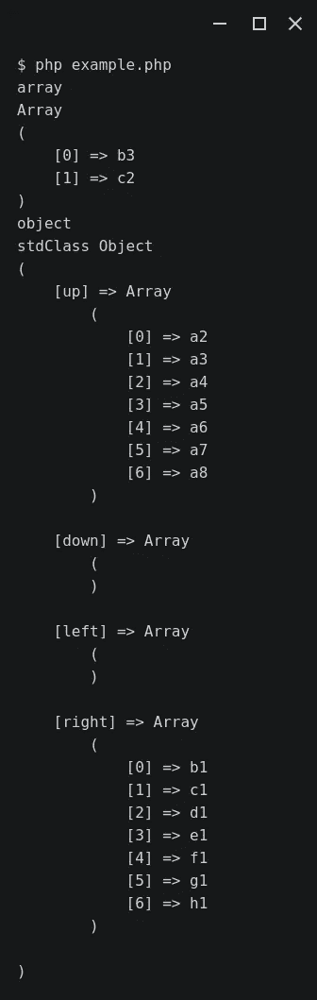
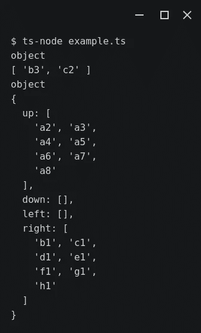

# 如何声明自定义联合类型的属性

> 原文：<https://javascript.plainenglish.io/declaring-custom-union-typed-properties-284db577118d?source=collection_archive---------15----------------------->

## 在 TypeScript 抽象类中


Photo by [Christina @ wocintechchat.com](https://unsplash.com/@wocintechchat?utm_source=unsplash&utm_medium=referral&utm_content=creditCopyText) on [Unsplash](https://unsplash.com/s/photos/tech-diversity?utm_source=unsplash&utm_medium=referral&utm_content=creditCopyText)

嗨，web devs，今天的帖子是题为“为什么 TypeScript 和 PHP 是好朋友”的系列文章中的另一篇，在这篇文章中，我们将现实世界中的代码库从 PHP 转换成 TypeScript。我们正在学习顶尖的软件开发技术，这会让你得到一份理想的工作。

[](https://medium.com/geekculture/why-typescript-and-php-are-good-friends-964360fb75f6) [## 为什么 TypeScript 和 PHP 是好朋友

### 完整指南

medium.com](https://medium.com/geekculture/why-typescript-and-php-are-good-friends-964360fb75f6) 

PHP 和 TypeScript 之间值得注意的一个区别是，前者允许很容易地用联合类型声明类属性，而后者则不允许——至少没有一点欺骗。让我向您展示一种在接口的帮助下使用自定义联合类型声明 TypeScript 类属性的酷方法。

一个表示有理数的抽象类是一个很好的例子，说明了为什么您可能想要混合几种不同的数据类型。为什么？一个有理数表现出双重性质。它同时是一个整数和一个浮点值。

# 那么用哪个呢？

棋子是用联合类型声明类属性的另一个很好的例子。让我向您展示一个有用的代码示例。

棋子的移动性可以定义为它在空棋盘上可以移动到的方格。a1 上骑士的机动性是 b3 和 c2，而 e4 上骑士的机动性是 c3、c5、d2、d6、f2、f6、g3 和 g5。因此，表示骑士机动性的一种自然方式是用字符串数组。

同样，a1 上的车的移动性向上是 a2、a3、a4、a5、a6、a7 和 a8，向右是 b1、c1、d1、e1、f1、g1 和 h1。表示车的移动性的一个方便的方法是用一个数组对象而不是一个字符串数组，因为车可以向四个方向移动。

# (用以缓和语气)虽然这么说

用 PHP 编写以下面向对象类的层次结构非常简单。

AbstractPiece.php

```
abstract class AbstractPiece
{
    protected array|object $mobility; abstract protected function mobility(): AbstractPiece; public function getMobility(): array|object
    {
        return $this->mobility;
    }
}
```

Knight.php

```
class Knight extends AbstractPiece
{
    public function __construct()
    {
        $this->mobility = []; $this->mobility();
    } protected function mobility(): AbstractPiece
    {
        $this->mobility = ['b3', 'c2']; return $this;
    }
}
```

Rook.php

```
class Rook extends AbstractPiece
{
    public function __construct()
    {
        $this->mobility = (object) [
            'up' => [],
            'down' => [],
            'left' => [],
            'right' => [],
        ]; $this->mobility();
    } protected function mobility(): AbstractPiece
    {
        $this->mobility = (object) [
            'up' => ['a2', 'a3', 'a4', 'a5', 'a6', 'a7', 'a8'],
            'down' => [],
            'left' => [],
            'right' => ['b1', 'c1', 'd1', 'e1', 'f1', 'g1', 'h1'],
        ]; return $this;
    }
}
```

如您所见，`$mobility`在`AbstractPiece.php`中使用联合类型定义，然后在子类的构造函数中初始化，没有太多麻烦。

```
protected array|object $mobility;
```

当然，`mobility()`方法仍将在`Knight.php`和`Rook.php`中实现，为了简单起见，我们暂时只对值进行硬编码。

就是这样！

下面附上的是由`example.php`脚本生成的输出。

```
include 'AbstractPiece.php';
include 'Knight.php';
include 'Rook.php';$knight = new Knight();
$rook = new Rook();echo gettype($knight->getMobility()) . PHP_EOL;
print_r($knight->getMobility()) . PHP_EOL;echo gettype($rook->getMobility()) . PHP_EOL;
print_r($rook->getMobility()) . PHP_EOL;
```



很有道理，不是吗？骑士的机动性是一个字符串数组，而车的机动性是四个字符串数组的对象:上、下、左、右。

# 发现差异

这是用 TypeScript 编写的相同的类层次结构。

抽象作品. ts

```
import RookMobility from './RookMobility';abstract class AbstractPiece {
  protected mobility: object|RookMobility; constructor() {
    this.mobility = {};
  } protected abstract calcMobility(): AbstractPiece; getMobility(): object|RookMobility {
    return this.mobility;
  }
}export default AbstractPiece;
```

骑士. ts

```
import AbstractPiece from './AbstractPiece';class Knight extends AbstractPiece {
  protected mobility: string[] = []; constructor() {
    super();
    this.calcMobility();
  } protected calcMobility(): AbstractPiece {
    this.mobility = ['b3', 'c2']; return this;
  }
}export default Knight;
```

Rook.ts

```
import AbstractPiece from './AbstractPiece';
import RookMobility from './RookMobility';class Rook extends AbstractPiece {
  protected mobility: RookMobility = {
    up: [],
    down: [],
    left: [],
    right: []
  }; constructor() {
    super();
    this.calcMobility();
  } protected calcMobility(): AbstractPiece {
    this.mobility = {
      up: ['a2', 'a3', 'a4', 'a5', 'a6', 'a7', 'a8'],
      down: [],
      left: [],
      right: ['b1', 'c1', 'd1', 'e1', 'f1', 'g1', 'h1']
    }; return this;
  }
}export default Rook;
```

RookMobility.ts

```
interface RookMobility {
  up: string[],
  down: string[],
  left: string[],
  right: string[]
}export default RookMobility;
```

下面附上的是由`example.ts`脚本生成的输出。

```
import Knight from './Knight';
import Rook from './Rook';let knight = new Knight();
let rook = new Rook();console.log(typeof(knight.getMobility()));
console.log(knight.getMobility());console.log(typeof(rook.getMobility()));
console.log(rook.getMobility());
```



同样，骑士的机动性是一个字符串数组，而车的机动性是四个字符串数组的对象。

然而，TypeScript 中的实现有点复杂。

一方面，`mobility`必须在`AbstractPiece`的构造函数中初始化为空对象`{}`，否则会遇到 TS2564 错误。

*属性“mobility”没有初始值设定项，也没有在构造函数中明确赋值。*

[](https://github.com/Microsoft/TypeScript-Vue-Starter/issues/36) [## 错误 TS2564:属性“name”没有初始值设定项，并且没有在构造函数中明确赋值…

### 此存储库已由所有者存档。它现在是只读的。此时您不能执行该操作。你…

github.com](https://github.com/Microsoft/TypeScript-Vue-Starter/issues/36) 

这之所以成为可能，是因为数组是 JavaScript 中的一个对象。

```
constructor() {
  this.mobility = {};
}
```

另一方面，在`Rook.ts`中创建并使用`RookMobility.ts`接口来初始化`mobility`属性。

```
protected mobility: RookMobility = {
  up: [],
  down: [],
  left: [],
  right: []
};
```

在`AbstractPiece.ts`中使用新的自定义类型来声明`mobility`属性。

```
protected mobility: object|RookMobility;
```

嗯，如前所述，在这种特殊情况下，联合类型的属性甚至是不必要的，因为在 JavaScript 中数组是对象，而`RookMobility`也是对象。

因此，`AbstractPiece.ts`可以被重写，如下所述。

```
import RookMobility from './RookMobility';abstract class AbstractPiece {
  protected mobility: object; constructor() {
    this.mobility = {};
  } protected abstract calcMobility(): AbstractPiece; getMobility(): object {
    return this.mobility;
  }
}export default AbstractPiece;
```

# 结论

今天我们了解到 PHP 允许用 union 类型非常直接地定义抽象类中的属性。基本上，属性需要在子类中进行相应的初始化。

不过，在 TypeScript 中，创建和使用自定义接口很方便。

属性在子类中的初始化与 PHP 类似，但是，在所示的示例中，TypeScript 联合类型的属性也必须在超类中初始化为空对象`{}`。

希望这对更好的理解 PHP 和 TypeScript 的区别有所帮助。有关棋子如何实现的更多详情，请点击下面的链接:

[](https://github.com/chesslablab/ts-chess/tree/master/src/piece) [## ts-chess/src/master chess lab 的棋子/ts-chess

### 打字稿的国际象棋库。通过在 GitHub 上创建一个帐户，为 chess lab/ts-chess 开发做出贡献。

github.com](https://github.com/chesslablab/ts-chess/tree/master/src/piece) 

非常感谢您的阅读！

*更多内容请看*[***plain English . io***](https://plainenglish.io/)*。报名参加我们的* [***免费周报***](http://newsletter.plainenglish.io/) *。关注我们关于*[***Twitter***](https://twitter.com/inPlainEngHQ)*和*[***LinkedIn***](https://www.linkedin.com/company/inplainenglish/)*。查看我们的* [***社区不和谐***](https://discord.gg/GtDtUAvyhW) *加入我们的* [***人才集体***](https://inplainenglish.pallet.com/talent/welcome) *。*