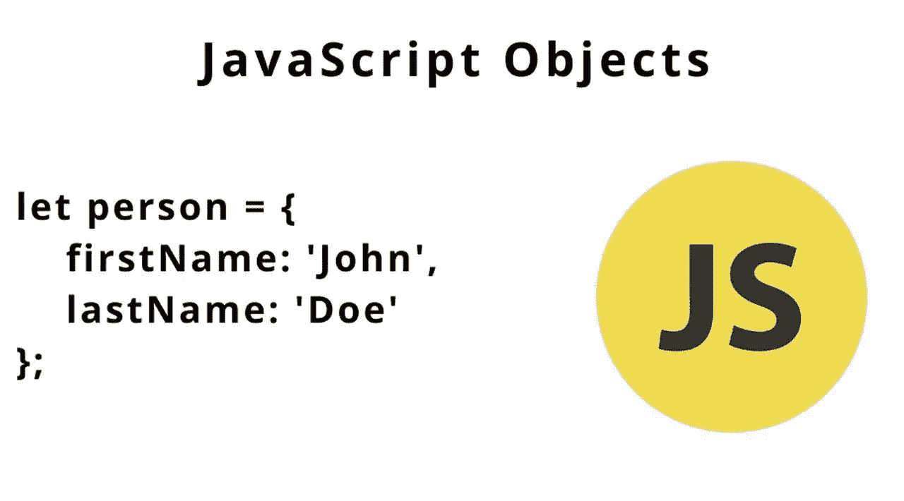
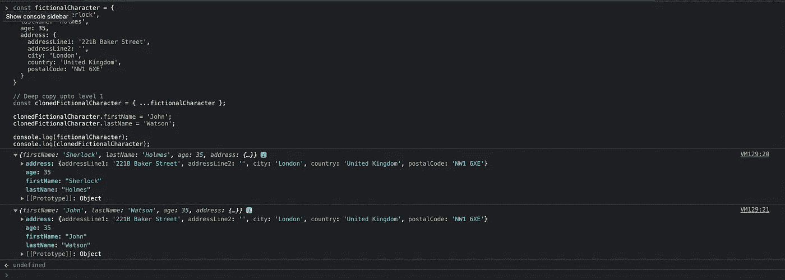
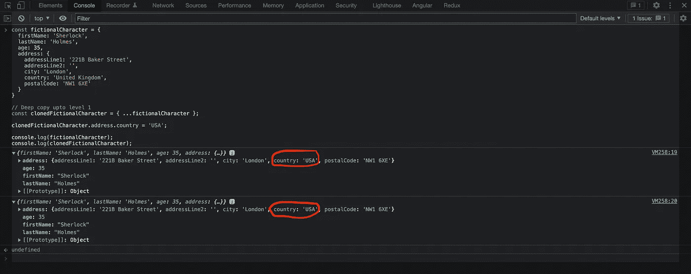
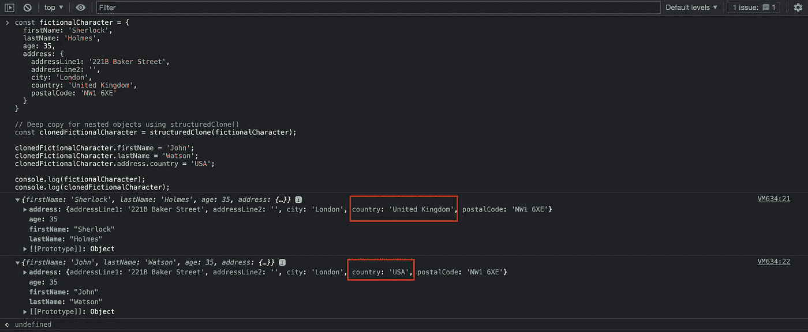

# 用 JavaScript 中的 structuredClone()进行深度克隆

> 原文：<https://javascript.plainenglish.io/deep-cloning-with-structuredclone-in-javascript-f94a106914b1?source=collection_archive---------1----------------------->

普通 JavaScript 中的 [***深度克隆***](https://developer.mozilla.org/en-US/docs/Glossary/Deep_copy) 由来已久，在 JavaScript 中深度克隆对象的下一个最佳方法是使用[***spread***](https://developer.mozilla.org/en-US/docs/Web/JavaScript/Reference/Operators/Spread_syntax)`(...)`操作符。spread `(...)`操作符只会创建对象的深度副本，直到级别 1。另一方面，嵌套对象遵循了 [***的概念，浅层复制了***](https://developer.mozilla.org/en-US/docs/Glossary/Shallow_copy) ***。***

下图是使用扩展`(...)`操作符深度克隆一个对象的例子:

在上面的例子中， ***名字*** 和 ***姓氏*** 得到了对两个对象具有不同值的深层副本——***虚构字符*** 和 ***克隆的虚构字符。***

Deep copy with level 1 object keys

然而，**地址**对象中的 ***国家*** 键得到一个浅拷贝，这意味着只有引用被拷贝，但它指向内存中的相同位置。因此，两个对象中的 ***国家*** 都改为 ***美国*** 。

Shallow Copy with nested objects

虽然我们有深度克隆方法，如第三方 JS 库提供的[***cloneDeep***](https://lodash.com/docs/#cloneDeep)，如[***loadash***](https://lodash.com/docs/)*或通过编写`JSON.parse(JSON.stringify(originalObject))`使用基于 JSON 的 hack，它们支持嵌套对象的深度克隆，但这是有代价的， 现在，我们可以使用现成可用的 [***结构克隆***](https://developer.mozilla.org/en-US/docs/Web/API/structuredClone) 作为 JavaScript 的一部分，而不必在任何 JS 应用程序中安装额外的依赖项，如[***loadash***](https://lodash.com/docs)*。**

**根据[***MDN***](https://developer.mozilla.org/en-US/docs/Web/API/structuredClone)网站上的定义，**

> **全局`structuredClone()`方法使用*[***结构化克隆算法***](https://developer.mozilla.org/en-US/docs/Web/API/Web_Workers_API/Structured_clone_algorithm) ***创建给定值的 [***深度克隆***](https://developer.mozilla.org/en-US/docs/Glossary/Deep_copy) 】。它兼容所有的现代浏览器。******

**下图是使用`structuredClone()`方法深度克隆一个对象的例子:**

**克隆的结果是:**

****

**Output using structuredClone**

*****structured clone()***方法也允许 [***可转移对象***](https://developer.mozilla.org/en-US/docs/Glossary/Transferable_objects) 中的原始值被*转移*而不是克隆到新对象中。转移的对象从原始对象分离并附加到新对象；它们在原始对象中不再可用。**

**使用`structuredClone()`可以复制大部分内置值。将这种方法用于一些原始类型(如 RegExp)仍然有一些缺点。更多请参考本 [***MDN 链接***](https://developer.mozilla.org/en-US/docs/Web/API/structuredClone)**

**然而，在大多数情况下，就像上面举例说明的那样，它应该工作得很好。**

# **结论**

**现在我们有了。我希望这篇文章对你有用。感谢您的阅读。请随时提供您的意见、建议和任何其他可能有帮助的反馈。**

***更多内容看* [***说白了。报名参加我们的***](https://plainenglish.io/) **[***免费周报***](http://newsletter.plainenglish.io/) *。关注我们关于*[***Twitter***](https://twitter.com/inPlainEngHQ)*和*[***LinkedIn***](https://www.linkedin.com/company/inplainenglish/)*。加入我们的* [***社区***](https://discord.gg/GtDtUAvyhW) *。*****