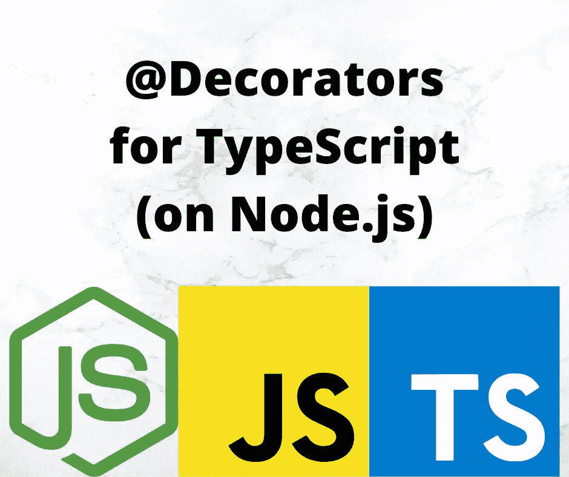

# 如何使用和实现 TypeScript 装饰器

> 原文：<https://javascript.plainenglish.io/deep-introduction-to-using-and-implementing-typescript-decorators-a9e876ad0d43?source=collection_archive---------11----------------------->

## Decorators 要编写脚本，就像注释对于 Java 一样——附加到类和方法上的额外信息和功能。



Image by Author with logo’s of corresponding projects

**decorator 允许我们向 TypeScript 中的类或方法添加额外的信息。它们类似于 Java 中的注释。有了 decorators，我们可以用非常简洁的符号添加各种各样的功能。按照计划，decorators 将成为 JavaScript 的标准部分，因此了解它们的工作方式非常重要。**

装饰器是可以附加到类或方法上的标记。有了它们，我们可以在 JavaScript 中将信息或功能附加到类、方法、参数、属性或访问器上。它们很容易实现，但是有很多细节，并且文档有时很弱。

TypeScript 文档这样描述 Decorators:

*……Decorators 提供了一种为类声明和成员添加注释和元编程语法的方法。装饰器是 JavaScript 的第二阶段提案，是 TypeScript 的一个实验性特性。*

*装饰器是一种特殊的声明，可以附加到*类声明*、*方法*、*访问器*、*属性*或*参数*上。装饰者使用* `*@expression*` *的形式，其中* `*expression*` *必须计算出一个函数，该函数将在运行时使用关于被装饰声明的信息来调用。*

虽然 decorators 是第 2 阶段的提议，但似乎 TypeScript 实现早于这一阶段。换句话说，在适当的时候，这个特性应该成为 JavaScript 的一部分，到那时 TypeScript 应该进行相应的修改。因此，TypeScript 中的 decorators 是一个必须显式启用的实验性功能。

有关详细描述，请参见:

*   https://github.com/tc39/proposal-decorators——在适当的时候，装饰器有望成为 ECMAScript 语言的标准部分。ECMAScript 委员会正致力于实现这一目标。

TypeScript 实现远远落后于正在进行的提议。这意味着，如果/当 ECMAScript 委员会完成它的工作时，我们应该期待 TypeScript 实现进行相应的更改。

有一个相关的特性，反射元数据 API，它意味着与 decorators 协同工作。它将是对反射 API 的补充，增强了使用反射来操作描述对象的数据的能力。这个 API 也在开发过程中。

因为装饰者正在成为 JavaScript 的标准部分，所以很值得我们花时间去了解他们做什么，甚至如何实现他们。它们看起来可能很神奇，但是每个装饰器都是由一个函数实现的，只要对装饰器和反射 API 有足够的了解，我们也可以开始实现它们。

对于我们这些花时间编写 Java 或 C#代码的人来说，我们可能有过注释的经历。这些装饰器看起来非常类似于注释，并且服务于大致相同的目的。

本文是系列文章的一部分:

*   **装修工介绍**本文
*   [类装修工](https://itnext.io/deep-introduction-to-class-decorators-in-typescript-23005ea5d035)
*   [物业装修工](/a-deep-introduction-to-property-decorators-in-typescript-8ef011169ec)
*   [访问器装饰器](/typescript-accessor-decorators-in-depth-take-control-over-get-and-set-accessor-methods-8b85c95124f9)
*   [参数装饰器](/introduction-to-parameter-decorators-in-typescript-b0042b5474ed)
*   [方法装饰者](/a-deep-introduction-to-method-decorators-in-typescript-6045d52e10a6)
*   [混合装修工](/implement-hybrid-decorator-functions-in-typescript-f6d24bc5abb0)
*   [带装饰器的反射和反射 API](/using-the-reflection-and-reflection-metadata-apis-with-typescript-decorators-c56ba9c690c7)
*   [使用装饰器和反射元数据在 TypeScript 中进行运行时数据验证](/runtime-data-validation-in-typescript-using-decorators-and-reflection-metadata-3219fdf5dfb5)

# 为 TypeScript decorators 设置 Node.js 项目

建立一个项目目录只需要安装 TypeScript 编译器，并添加一个包含编译器配置指令的`tsconfig.json`文件。

```
$ npm init -y
$ npm install typescript @types/node --save-dev
$ npm install reflect-metadata --save
```

这用一个`package.json`初始化目录，并安装最少需要的文件。大多数装饰者都需要`reflect-metadata`包，它包含一个实现反射元数据 API 的 polyfill。

似乎有一个用于编译包含 decorators 的 JavaScript 代码的 Babel 插件。见:[https://www . npmjs . com/package/@ babel/plugin-proposal-decorators](https://www.npmjs.com/package/@babel/plugin-proposal-decorators)

# 为装饰者启用 TypeScript 中的实验特性

正如我们所说的，decorators 是一个实验性的特性，因为人们认为如果/当这个特性成为 JavaScript 的标准部分时，实现将会改变。

在您的`tsconfig.json`文件中进行这些设置:

```
{
    "compilerOptions": {
        ...
        "experimentalDecorators": true,
        "emitDecoratorMetadata": true,
        ...
    }
}
```

第一个是`experimentalDecorators`，打开装饰器支持。

第二个是`emitDecoratorMetadata`，发出`reflect-metadata`包所需的数据。这个包通过记录关于类、属性、方法和参数的元数据，使我们能够在 decorators 中做强大的事情。

# GitHub 上的配套资源库

本文展示的代码也可以在 GitHub 上找到:[https://github.com/robogeek/typescript-decorators-examples](https://github.com/robogeek/typescript-decorators-examples)

在这个库中有一个包，`[decorator-inspectors](https://www.npmjs.com/package/decorator-inspectors)`。它的装饰器对于调查或检查你正在装饰的东西很有用。

在撰写本系列文章期间，已经开发了另一个用于自动运行时数据验证的包。GitHub 库是:[https://GitHub . com/robogeek/runtime-data-validation-typescript](https://github.com/robogeek/runtime-data-validation-typescript)

国家防范机制储存库中的清单是:[https://www.npmjs.com/package/runtime-data-validation](https://www.npmjs.com/package/runtime-data-validation)

# 打字稿中的五种装饰者

有五种装饰类型:

*   *类装饰者*被附加到类上
*   *属性装饰器*被附加到属性定义上
*   *访问器装饰器*被附加到与属性相关联的`get`或`set`方法
*   *方法装饰者*依附于方法
*   *参数装饰器*被附加到方法参数上

它们看起来像这样:

```
@ClassDecorator()
class A {

    @PropertyDecorator()
    name: string;

    @MethodDecorator()
    fly(
        @ParameterDecorator()
        meters: number
    ) {
        // code
    }

    @AccessorDecorator()
    get egg() {
        // code
    }
    set egg(e) {
        // code
    }
}
```

换句话说，就是`@`符号，后面跟一个函数名，有时候还有函数的参数。不是装饰器名看起来像函数名，是函数名。括号是可选的，取决于装饰器的类型及其功能。装饰者可以接收参数，在这种情况下括号是必需的。

每个装饰器都是由同名的函数实现的。

# 为 TypeScript 寻找装饰包/库

虽然我们可以实现自己的 decorator，但是如果有人已经创建了一个涵盖您需求的 decorator 包，那就简单多了。

有用的 npm 搜索:

*   [https://www.npmjs.com/search?q=decorator](https://www.npmjs.com/search?q=decorator)
*   [https://www.npmjs.com/search?q=typescript 装潢师](https://www.npmjs.com/search?q=typescript%20decorator)

选定的装饰包:

*   [类记录器](https://www.npmjs.com/package/class-logger) —记录类创建和方法调用
*   [类验证器](https://www.npmjs.com/package/class-validator) —数据验证装饰器
*   [typescript-memoize](https://www.npmjs.com/package/typescript-memoize) —记录方法或访问器调用的值，以避免重新计算昂贵的值
*   [类转换器](https://www.npmjs.com/package/class-transformer) —普通数据和类实例之间的转换
*   [装饰者](https://www.npmjs.com/package/fastify-decorators)——装饰
*   [Catch-finally-decorator](https://www.npmjs.com/package/catch-finally-decorator)—从方法中捕捉异常
*   [lynx-framework](https://www.npmjs.com/package/lynx-framework) —应用程序框架由几个现有组件构建而成，广泛使用装饰器
*   核心装饰者(core-decorator)——几个广泛有用的装饰者——以及装饰者标准化的实际状态的讨论
*   [@ loopback/metadata](https://www.npmjs.com/package/@loopback/metadata)—`@Loopback`的一部分，一个帮助构建装饰者的装饰者库
*   [路由控制器](https://github.com/typestack/routing-controllers)——“结构化的、声明性的、组织良好的基于类的控制器，在 Express / Koa 中使用大量的装饰器，使用类型脚本和路由控制器框架。”
*   [validator js-decorator](https://www.npmjs.com/package/validatorjs-decorator)—validator js 作为装饰者
*   [通宵](https://github.com/seanpmaxwell/overnight) —快递的打字装璜工
*   [@ reflet/Express](https://www.npmjs.com/package/@reflet/express)—Express 的打字稿装饰者

结构

*   [TS。ED](https://tsed.io/)——宣称是一个成熟的应用框架，广泛使用装饰器
*   type ORM——用于 TypeScript/JavaScript 的全功能 ORM，广泛使用了装饰器

# 开发你自己的装饰器和使用现有的装饰器包

在上一节中，我们注意到 npm/yarn 存储库中的许多包提供了用于各种用途的预开发包。通常我们会选择已经开发好的包，这样我们就可以继续做我们需要做的事情。希望包的作者已经测试了他们的代码，花了一些时间仔细地设计它，等等，然后我们可以回到我们的应用程序开发。

但是当然，情况并不总是这样。您的需求可能不同，或者可能没有满足您需求的软件包。

本系列的文章着重于理解如何开发在 TypeScript 应用程序中使用的 decorators。

# 定义和使用装饰者的一般模式

虽然每个装饰器都是由一个函数实现的，但是每个装饰器类型都需要一个具有特定签名的函数。也就是说，对于每个 decorator 类型，decorator 函数接收一组不同的参数，TypeScript 仔细地将 decorator 函数与所需的签名进行匹配。

紧跟在`@`字符之后的必须是一个*表达式*，它计算出一个函数，具有正确的签名，将在运行时被调用。被调用的函数将被赋予参数，这些参数给出关于被修饰的事物的信息。

典型用途是:

```
function DecoratorName(parameters) {
    // decorator code
}

class ClassName {
    @DecoratorName
    methodName(methodParameters) {
        // method code
    }
}
```

也就是说，您定义一个函数，并在装饰器中使用函数名。在这种情况下，*表达式*就是函数名。只要这个函数有正确的签名，它就能很好地工作。

另一个典型的模式是装饰工厂:

```
function OtherDecorator(parametersForDecorator) {
    // preprocessing of parameters
    return (decorator function parameters) => {   // actual decorator function
        // decorator code
    }
}

class OtherClass {

    @OtherDecorator(param1, param2)
    methodName(methodParameters) {
        // method code
    }
}
```

在这种情况下，`OtherDecorator`函数返回一个带有正确签名的函数作为装饰器。本例中的*表达式*是调用`OtherDecorator(param1, param2)`，该表达式的结果是内部函数。为此，内部函数必须实现正确的签名。这种模式用于需要额外数据的情况。

所发生的是，外部函数 *OtherDirector(param1，param2)* 的调用是一个表达式，它返回一个具有正确签名的函数作为类装饰器。这使得内部函数成为装饰函数，外部函数成为生成装饰函数的工厂。

装饰器什么时候需要括号？这与每个装饰定义的性质有关。对于具有正确签名的装饰函数，不能使用括号。对于遵循工厂模型的每个 decorator，括号是必需的，并且必须使用，以便对函数调用进行求值，从而返回内部函数。

同样，decorator 是`@`，后跟一个*表达式*，用正确的签名计算一个函数。为了更清楚地说明这一点，可以考虑在被修饰的代码中定义一个内嵌的装饰器:

```
@((constructor: Function) => {
    console.log(`Inline constructor decorator `, constructor);
})
class InlineDecoratorExample {
    // properties and methods
}
```

这是一个`@`字符，后跟一个*表达式*，即一个内嵌箭头函数，它计算出一个具有正确签名的函数。这个例子包含了一个类装饰器的正确签名。

很难找到使用内嵌装饰器的理由。decorators 的一个目的是代码共享，并使用简洁的符号实现功能。没有任何关于内联装饰器的内容支持这两个目标，但是 TypeScript 编译器允许这样做。

# 有多个装饰者时的评估顺序

允许使用多个装饰器:

```
@decorator1 @decorator2 @decorator4
@decorator3(param1, param2)
class MultiDecoratorClass {
    // methods and properties
}
```

每行文本可以有多个装饰器，并且在计算机的内存或计算限制范围内，可以有任意多个装饰器。

评估多个 decorators 的规则(执行顺序)是:

1.  每个装饰器的表达式都是自顶向下计算的。
2.  然后从下到上将结果作为函数调用。

表达式“*每个装饰器的表达式*”指的是跟在`@`字符后面的是一个计算为装饰器函数的表达式。对于不需要括号的装饰器，装饰器名直接映射到装饰器函数，因此*表达式*就是函数名。对于装饰工厂，*表达式*意味着评估外部函数的调用，它返回内部函数。

这是按照它们在文本中出现的顺序从上到下发生的。

实际的装饰函数是从下到上执行的。

# 每种装修工的评估顺序

评估附加到一个类的 decorators 按照规定的顺序进行:

1.  *参数修饰器*，后面跟着*方法*、*访问器*，或者*属性修饰器*被应用于每个实例成员——也就是通常的方法。
2.  *参数修饰器*，接着是*方法*、*访问器*，或者*属性修饰器*被应用于每个静态成员——也就是静态方法。
3.  *参数修饰器*应用于构造函数。
4.  *班级装修工*申请班级。

# TypeScript decorators 可以用在独立的函数、类型或接口上吗？

装饰器只能在类中使用。每种装饰类型要么应用于一个类，要么应用于一个类的成员。为了验证这一点，让我们做一个小实验，用类外声明的东西来尝试 decorators。让我们从装饰一个简单的函数开始:

```
function Decorator() {
    console.log('In Decorator');
}

@Decorator
function decorated() {
    console.log('in decorated');
}
```

在 Visual Studio 代码中，您将得到答案——`@`下面的红线和 decorators 在那里无效的消息。并且，使用编译器:

```
$ npx tsc function.ts 
function.ts:6:1 - error TS1206: Decorators are not valid here.

6 @Decorator
  ~

Found 1 error.
```

很明显，装饰器不能用在裸函数上。错误不是装饰者的签名无效，而是装饰者在这个位置无效。即使您为方法装饰器使用了正确的签名，编译器也会给出相同的错误消息。

```
function foo(@logParameter x:number) {
    // function
}
```

这是试图在独立函数的参数上使用参数装饰器。并且，我们再次得到同样的错误，装饰器在这里无效。

```
@Decorator
interface XyzzyInterface {
    x: number;
    y: number;
    zzy: number;
}

@Decorator
type XyzzyType = {
    x: number;
    y: number;
    zzy: number;
};
```

您将会看到同样的错误消息，当将 decorator 附加到`interface`或`type`定义时，这里不允许 decorator。

# 关于作者

[***大卫·赫伦***](https://davidherron.com) *:大卫·赫伦是一名作家和软件工程师，专注于技术的明智使用。他对太阳能、风能和电动汽车等清洁能源技术特别感兴趣。David 在硅谷从事了近 30 年的软件工作，从电子邮件系统到视频流，再到 Java 编程语言，他已经出版了几本关于 Node.js 编程和电动汽车的书籍。*

*原载于*[*https://techsparx.com*](https://techsparx.com/nodejs/typescript/decorators/introduction.html)*。*

*更多内容请看* [***说白了就是***](http://plainenglish.io/) *。报名参加我们的* [***免费每周简讯***](http://newsletter.plainenglish.io/) *。在我们的* [***社区不和谐***](https://discord.gg/GtDtUAvyhW) *获取独家写作机会和建议。*