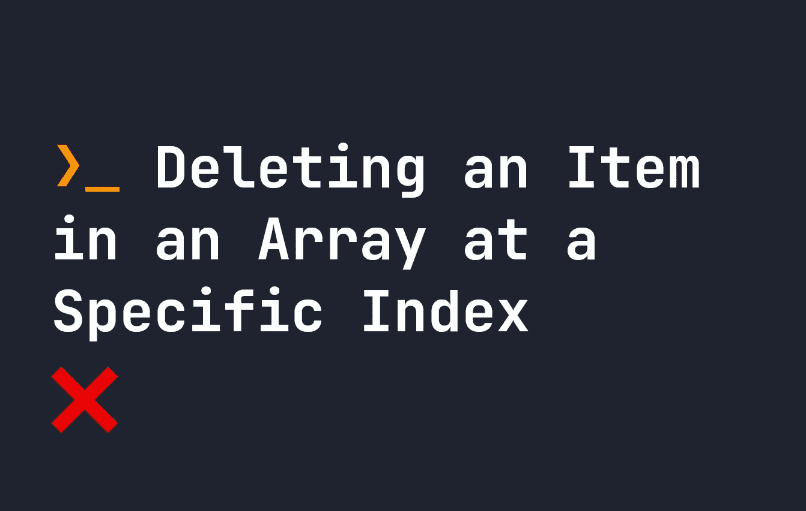

# 删除数组中特定索引处的项

> 原文：<https://javascript.plainenglish.io/delete-an-item-in-an-array-at-a-specific-index-671dd8c842ec?source=collection_archive---------8----------------------->

## 如何从 JavaScript 数组中的任意位置删除项目的快速指南。



在上一篇文章中，[我介绍了如何在一个数组中的特定索引](https://fjolt.com/article/javascript-how-to-insert-at-index-array)处插入条目，所以现在让我们看看如何**删除**条目。数组是 Javascript 中常见的数据结构，看起来有点像这样:

```
let myArray = [ 'some', 'array', 'content' ];
```

它们是存储数据的一种方式，在整个 Javascript 中普遍使用。如果我们想从数组中删除项目，我们可以使用所有数组都有的`splice`方法。让我们看看它是如何工作的。

# 从数组中删除项目

如果你只想从数组中删除一个条目，你只需要使用带有两个参数的`splice`。第一个是你要开始的索引，第二个是你要删除多少项。例如，如果我们想从数组的索引 0 开始删除 2 个项目，我们应该执行以下操作:

```
let myArray = [ 'some', 'array', 'content' ];myArray.splice(0, 2);// Will return [ 'content' ]
console.log(myArray);
```

正如你可能已经注意到的，`splice`实际上改变了原来的数组。所以在这样做的时候要小心，因为不会复制原件！这里有一些其他的例子可以考虑:

```
myArray.splice(3, 1); // Removes one item, at index 3
myArray.splice(0, 5); // Removes 5 items, at index 0 (i.e. from the start of the array);
```

# 通过值从数组中删除项

同样，我们也可以通过值从数组中删除一个项，但是这要稍微复杂一点。为此，我们必须同时使用`indexOf`和`splice`:

*   首先，我们使用`indexOf`通过值获取我们想要删除的项目的索引。
*   然后，我们使用该数字删除数组项。

这里有一个例子。我们想从下面的数组中删除项目 **ravioli** 。首先，我们使用`arr1.indexOf('ravioli')`获取该项目的索引。这将返回`2`，因为这是数组中**饺子**的索引。然后，我们使用这个数字，使用`splice(itemIndex, 1)`在那个索引处拼接出一个元素。现在，**馄饨**从我们的数组中移除了！

```
let arr1 = [ 'potato', 'banana', 'ravioli', 'carrot' ];
let itemIndex = arr1.indexOf('ravioli');// Returns [ 'potato', 'banana', 'carrot' ], since ravioli has an index of 2
arr1.splice(itemIndex, 1);
console.log(arr1);
```

# 删除数组中的最后一项

如果您想在 Javascript 中删除数组的最后一项，请使用`pop`。`pop()`方法是删除数组中最后一个元素的简单方法。就像`splice`一样，它改变了你的原始数组，所以你的原始数组的副本不会被保留:

```
let arr1 = [ 'potato', 'banana', 'ravioli', 'carrot' ];// Returns 'carrot'
console.log(arr1.pop()); // Returns  [ 'potato', 'banana', 'ravioli' ]
console.log(arr1);
```

这个题目到此为止。感谢您的阅读。

*更多内容请看*[***plain English . io***](https://plainenglish.io/)*。报名参加我们的* [***免费周报***](http://newsletter.plainenglish.io/) *。关注我们关于*[***Twitter***](https://twitter.com/inPlainEngHQ)[***LinkedIn***](https://www.linkedin.com/company/inplainenglish/)*[***YouTube***](https://www.youtube.com/channel/UCtipWUghju290NWcn8jhyAw)*[***不和***](https://discord.gg/GtDtUAvyhW) *。对增长黑客感兴趣？检查* [***电路***](https://circuit.ooo/) *。***