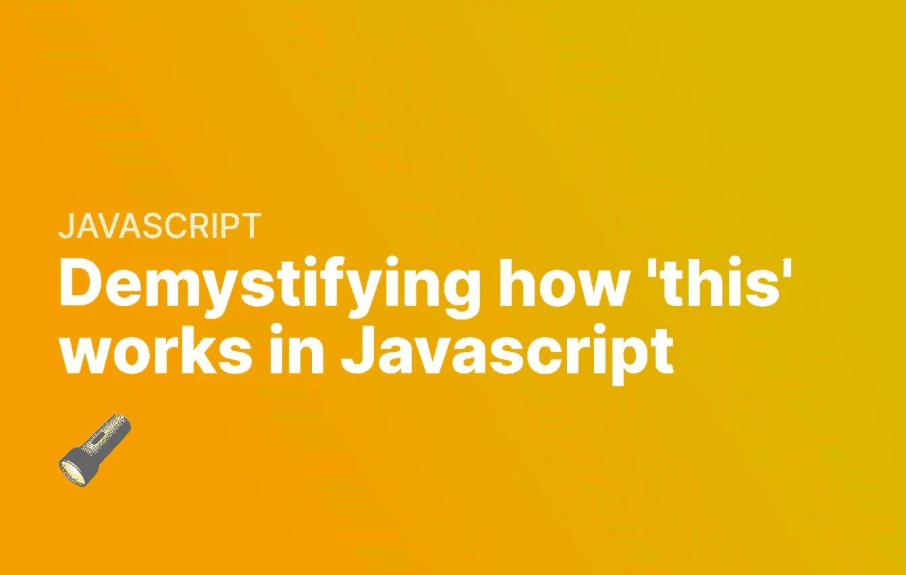

# 揭开 JavaScript 中“this”的神秘面纱

> 原文：<https://javascript.plainenglish.io/demystifying-this-in-javascript-369a1dcb881?source=collection_archive---------17----------------------->

## 了解“this”关键字在 JavaScript 中的实际工作方式。



它是 JavaScript 中经常使用的东西，但它所指的通常是一个谜。在 JavaScript 中，`this`的工作方式与其他编程语言非常不同——它的工作方式取决于您是否使用了严格模式。

如果你发现这很难，你并不孤单。让我们看看`this`到底是如何工作的，并消除它在各种上下文中的含义。

# JavaScript 中的“this”是什么

`this`是 JavaScript 中的一个关键字，指的是某个上下文中的一个属性或一组属性。我们使用它的上下文改变了它的属性。在全局上下文中，这指的是全局对象——在浏览器中是一个窗口，但在 Node.js 和其他 JavaScript 实现中是`globalThis`。

```
console.log(this); // The same as console.log(window);
```

在任何函数或代码之外，情况总是如此。然而，在不同的地方，这意味着不同的事情。

# 这是 JavaScript 中的函数

在函数中，这仍然是指全局对象。如果我们在函数中引用它，默认情况下，它会引用窗口或`globalThis`对象:

```
console.log(this); // The same as console.log(window);function myFunction() {
    console.log(this); // The same as console.log(window);
}myFunction();
```

然而，在严格模式下，函数内部的`this`是未定义的。

```
"use strict"
console.log(this); // The same as console.log(window);function myFunction() {
    console.log(this); // This is undefined!
}myFunction();
```

# 使用 call()求解

起初这有点令人困惑，但这样做的原因是因为我们需要在 myFunction 上添加一个`this`对象——严格模式下的 JavaScript 不会将其默认为全局对象。为此，我们必须使用 call()。在下面的例子中，我将 myObject 转换成了我们的`this`变量:

```
"use strict"
console.log(this); // The same as console.log(window);let myObject = {
    firstName: "John",
    lastName: "Doe",
    age: 76
}
function myFunction() {
    console.log(this.firstName);
}myFunction.call(myObject); // this.firstName is defined as "John", so it will console log John
myFunction(); // this.firstName will be undefined, and this will throw an error.
```

`call()`运行`myFunction`并将`myObject`附加到`this`关键字。如果我们不使用 call，只是简单地运行`myFunction()`，那么函数将返回一个错误，因为`this.firstName`将是未定义的。您还可以使用空 this 调用函数，然后可以将数据追加到函数内部。

这给了我们一个新的空间来定义我们的`this`对象上的变量，而不是被来自全局 This 对象的数据所污染:

```
"use strict"
console.log(this); // The same as console.log(window);function myFunction() {
    this.firstName = 'John';
    console.log(this.firstName); // This will be "John"
}myFunction.call({});
```

# 严格模式下的不同行为

正如您所看到的，根据我们是否使用严格模式，行为是非常不同的——所以在两种模式之间更改代码之前做一些测试是很重要的。

# 打电话申请

你有时会看到`call()`和一个叫做`apply()`的函数互换使用。这两个函数非常相似，因为它们都使用指定的上下文来调用函数。唯一的区别是，`apply()`在函数有参数时接受一个数组，而`call()`逐个接受每个参数。

例如:

```
"use strict"
let otherNumbers = {
    a: 10,
    b: 4
}
function multiplyNumbers(x, y, z) {
    return this.a * this.b * x * y * z
}// Both will return the same result, the only difference
// being that apply() uses an array for arguments.
multiplyNumbers.call(otherNumbers, 1, 2, 3);
multiplyNumbers.apply(otherNumbers, [ 1, 2, 3 ]);
```

# 使用 bind()简化这个过程

实现与`call()`相似行为的另一种方法是使用`bind()`。类似于`call()`，`bind()`，改变一个函数的 this 值，只是它是永久性的。这意味着你不必经常使用`bind()`——你只需使用一次。

这里有一个例子，我们将对象永久地绑定到函数上，从而永久地更新它——我们只需要将它定义为一个新函数。在下面的例子中，我们定义了一个名为`boundFunction`的新函数，它是我们的`myFunction`和与之永久绑定的`myObject`。

因此，当我们调用控制台日志时，它将显示“John”。这与 call 不同，call 需要在我们每次使用函数时使用。

```
"use strict"
console.log(this); // The same as console.log(window);let myObject = {
    firstName: "John",
    lastName: "Doe",
    age: 76
}
function myFunction() {
    console.log(this.firstName);
}let boundFunction = myFunction.bind(myObject); // this will bind this to myObject permanently.
boundFunction(); // since we used bind, this will now be set to myObject, every time we call boundFunction() - so it will return John.
```

# 箭头符号函数和这个

JavaScript 中箭头符号函数的一个关键特性是它们不包含`this`上下文。这意味着他们从父母那里继承了`this`。例如，假设我们处于严格模式，并且定义了一个箭头函数和一个“普通”样式的函数。对于箭头功能，`this`将被继承，但对于其他功能，`this`将保持未定义！

```
"use strict"
console.log(this); // The same as console.log(window);function myFunction() {
    console.log(this.name); // This will be "John"
    let myArrowFunction = () => {
        console.log(this.name); // This will be "John"
    } let myNormalFunction = function() {
        console.log(this.name); // This will throw an error, since this is undefined!
    } myArrowFunction();
    myNormalFunction();
}myFunction.call({
    name: "John"
});
```

# 构造函数和这个

关于`this`的另一个有趣的事情是，当在构造函数中使用时(这是一个使用 new 关键字的函数)，构造函数的返回基本上覆盖了它。例如，如果我们运行下面的代码，尽管我们将`this.name`设置为 John，但 name 的返回值是 Jack:

```
let functionA = function() {
    this.name = "John";
}let functionB = function() {
    this.name = "John";
    return {
        name: "Jack"
    }
}let runFunctionA = new functionA();
console.log(runFunctionA.name); // Returns "John";
let runFunctionB = new functionB();
console.log(runFunctionB.name); // Returns "Jack";
```

# 这在对象上下文中

在对象上下文中，使用 this 是指对象。例如，假设我们在一个名为`obj`的对象中运行一个函数，它引用了`this.aProperty`——在本例中，它引用了`obj`:

```
let obj = {
    aProperty: 15,
    runFunction: function() {
        console.log(this.aProperty); // Refers to 15
    }
}obj.runFunction(); // Will console log 15, since this refers to obj
```

如果使用 get()/set()符号，也是如此:

```
"use strict"
let obj = {
    aProperty: 15,
    runFunction: function() {
        console.log(this.aProperty); // Refers to 15
    },
    set updateProp(division) {
        this.aProperty = this.aProperty / division; // this.aProperty refers to 15
        console.log(this.aProperty); 
    }
}obj.updateProp = 15; // Will divide aProperty by 15, and console log the result, i.e. 1
```

# 将它与事件侦听器一起使用

JavaScript 的`this`的另一个怪癖是，当使用事件监听器时，它指的是事件被添加到的 HTML 元素。在下面的例子中，我们向 ID 为“hello-world”的 HTML 标签添加了一个点击事件:

```
document.getElementById('hello-world').addEventListener('click', function(e) {
    console.log(this);
});
```

如果我们点击我们的`#hello-world` HTML 元素，我们将在控制台日志中看到:

```
<div id="hello-world"></div>
```

# 将此用于类

在本节中值得注意的是，JavaScript 中的类只是幕后的函数。这意味着我们在函数中看到的许多功能对类来说都是真实的。

默认情况下，类会将此设置为类实例本身。在下面的例子中，我们可以看到这一点——T2 和 T3 都返回了约翰。

```
class myClass { 
    whatsMyName() {
        return this.name;
    }
    get name() {
        return "John";
    }
}const runClass = new myClass();
console.log(runClass.name);        // Returns "John"
console.log(runClass.whatsMyName); // Returns "John"
```

唯一的例外是静态项不会添加到此。所以如果我们定义一个函数，在它前面有关键字 static，它就不会在`this`上:

```
class myClass { 
    getMyAge() {
        return this.whatsMyAge();
    }
    static whatsMyAge() {
        return this.age; 
    }
    get name() {
        return "John";
    }
    get age() {
        return 143
    }
}const runClass = new myClass();
console.log(runClass.whatsMyAge()); // Throws an error, since runClass.whatsMyAge() is undefined
console.log(runClass.getMyAge()); // Throws an error, since this.whatsMyAge() is undefined
```

值得注意的是，默认情况下，类总是处于严格模式——因此这将与类中默认的严格函数的行为方式相同。

# 结论

在 JavaScript 中，这可能意味着各种事情。在本文中，我们讨论了它在不同上下文中的含义——函数、类和对象。我们已经介绍了如何使用`bind()`、`call()`和`apply()`向您的函数添加不同的`this`上下文。

我们还介绍了如何在严格模式和非严格模式下使用`this`。在此之后，希望`this`稍微去神秘化。

*更多内容看* [***说白了。报名参加我们的***](https://plainenglish.io/) **[***免费周报***](http://newsletter.plainenglish.io/) *。关注我们关于*[***Twitter***](https://twitter.com/inPlainEngHQ)*和*[***LinkedIn***](https://www.linkedin.com/company/inplainenglish/)*。加入我们的* [***社区***](https://discord.gg/GtDtUAvyhW) *。***