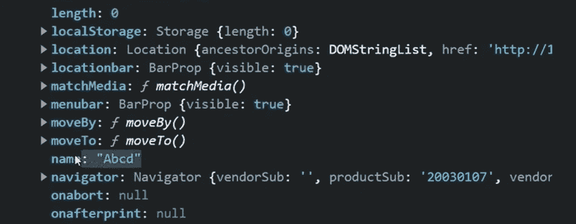

# 揭开 JavaScript 中“this”的神秘面纱

> 原文：<https://javascript.plainenglish.io/demystifying-this-in-javascript-5a38d920f216?source=collection_archive---------7----------------------->

## 了解 JavaScript 中“这”是如何工作的


在面向对象编程中，你通常用属性和方法创建这个蓝图，称为**类**，基于这个类，你能够创建新的对象。现在，从一个类派生的每个对象都将具有相似的结构，但是它们的值可能不同。例如，你和我都来自于一个 **Person** 类，我们每个人都有一个行走、交谈和进食的方法。但是有一些属性，比如姓名、年龄或性别，对我们两个来说可能相同，也可能不同。

*你可以在这里观看这篇文章的视频版本:*

```
class Person {
    constructor(name, age, gender) {
        this.name = name;
        this.age = age;
        this.gender = gender;
    } eat() { console.log(`${this.name} is eating`) }
    walk() { console.log(`${this.name} is walking`) }
    talk() { console.log(`${this.name} is talking`) }
}const johnObj = new Person("John", 20, "Male");
johnObj.eat()  //John is eating
```

所以，在这个例子中，所有的方法中都有一个`**this**`关键字。`**this**`这里的关键字指的是该类的一个实例，即一个将从该类中创建的对象。
当你使用`**new**`关键字从一个类中创建一个对象时，它调用构造函数并创建一个新的对象。
现在，如果我们试图在类实例上运行 eat 方法，`**this**`关键字将指向 john 对象。所以`**this.name**`基本上会看起来像`**johnObj.name**` ，在这里就是**约翰**。所以我们得到**约翰正在吃**作为输出。

因此，简而言之，`**this**`关键字代表了该类的一个实例。但是，由于我们使用的是 Javascript，显然还有更多的东西。`**this**`在不同的场景中表现不同，虽然在开始时看起来有点混乱，但在这篇博文的结尾，一切都变得有意义了。所以让我们开始吧。

## 1.全球语境中的“这个”

在全局上下文中，`this`总是指窗口对象。仅此而已。

```
//Global context
console.log(window == this)  //true
```

## 2.函数中的“这个”

函数内部是事情变得有点棘手的地方。函数内`**this**`的值将取决于**该函数如何被调用**。如果一个函数是一个方法，即一个对象的一部分，那么`this`将引用调用该方法的对象。

```
let person = {
  name : "John",
  walk : function(){ console.log(**this.name** + " walking") }
}person.walk(); //John walking 
```

相反，如果我们有一个简单的函数而不是方法，那么默认情况下，`this`将被设置为**窗口的**对象。

```
function test(){
   console.log(this);    //Returns the window object   
   return this;
}test() === window;  //true
```

如果您在**严格模式**下运行相同的测试功能，这将被设置为`**undefined**`。

```
function test(){
   'use strict'; 
   console.log(this);  //undefined
   return this;
}test() === window;  //false
```

它返回`undefined`的原因是该函数被直接调用，而不是作为一个对象的属性，在本例中，该对象是**窗口**对象。
因为它是在严格模式下运行的，所以你需要调用方法的对象被完美地映射到上下文中(`this`)。所以当`test() === window`可能返回 false 时，`**window.test()** == window`将返回 true。

## 3.“这个”在一个类里面

类内部的`this`的行为几乎类似于函数的行为，因为类本质上是幕后的函数。在一个类构造函数中，`this`将是创建的实例，就像我们在这篇博文的第一个例子中看到的一样。

如果用关键字`new`调用，你在下面的例子中看到的函数将作为一个构造函数。因此，虽然它在这里看起来不像一个类，但它会产生相同的结果。

我之所以在这里包含这个类函数的例子，而不是一个合适的类，是因为当你使用和不使用`new`关键字调用这个函数时，`this`的值会改变。对于一个类，没有`new`关键字就不能运行它。JS 引擎将抛出一个错误。

```
function Employee(name) {
    this.name = name;
}  //implicitly returns the object instance if called with the new keywordlet e1 = new Employee("Abcd");   //{ name : "Abcd" }
```

如果调用 Employee 函数时没有使用`new`关键字，那么`this`值将不会是类实例。而是将`this`的值设置为默认值，即**窗口**对象。

```
function Employee(name) {
    this.name = name;
}  //implicitly return the object instance if called with the new keywordlet e1 = Employee("Abcd");  //undefined because the function only implicitly returns an object if called with the new keyword
```

您可以通过在窗口对象中查找**名称属性**来验证`this`是否引用了窗口对象。



name property attached to the window object

## 4.“这个”内部箭头功能

arrow functions 中的`this`关键字是指包含该函数的词法范围。所以如果你在全局范围内创建箭头函数，`this`将总是被设置为全局(窗口)对象。

```
//Global scope 
let global = this  //window object inside this variable
var foo = () => this;
foo() == global //true 
```

如果你看下面的例子，我们有一个箭头函数作为对象内部的方法。现在，当这个方法试图寻找`this.model`时，`this`值寻找封闭的词法范围，在本例中是全局范围。所以它将`this`的值设置为窗口对象。它还返回 undefined，因为没有将**模型**属性附加到窗口对象。

```
const car = {
  model : "BMW",
  start : () => console.log(`${this.model} go brrr`)
}car.start()  //undefined go brrr
```

解决这个问题的一个方法是对 arrow 函数使用一个包装函数，然后在包装函数内部调用它。

```
const car = {
  model : "BMW",
  **start(){
   const f = () => console.log(`${this.model} go brrr`);
   f();
  }** 
}
car.start()  //BMW go brrr
```

因此，当您调用 arrow 函数时，它将查看其父级的词法范围，在本例中是 start 方法，由于 start 方法的上下文指向 car 对象，您的方法将返回`this.model`的预期值。

## 结论

这主要总结了`this`在 JavaScript 中的工作方式。你可以看到，它不仅仅是一个类实例的引用，就像 Java 一样。这不是你马上就能理解的话题之一。尝试在不同的场景中使用它，以便更好地掌握它。

[**如果你通过看视频学得更好，我有这篇博文的视频版，你可以在 youtube 上看。**](https://youtu.be/KLq5nihWRVg)

如果你有任何其他疑问或建议，你可以在评论中提出，或者通过我的任何社交媒体渠道与我联系。干杯！

[YouTube](https://www.youtube.com/channel/UCaktnqx_IENyT5T2lJ3F09w)
[LinkedIn](https://www.linkedin.com/in/akilesh-rao-610357137/)
[Twitter](https://twitter.com/themangalorian)
GitHub

*更多内容请看*[***plain English . io***](https://plainenglish.io/)*。报名参加我们的* [***免费周报***](http://newsletter.plainenglish.io/) *。关注我们关于*[***Twitter***](https://twitter.com/inPlainEngHQ)*和**[***LinkedIn***](https://www.linkedin.com/company/inplainenglish/)*。加入我们的* [***社区***](https://discord.gg/GtDtUAvyhW) *。**