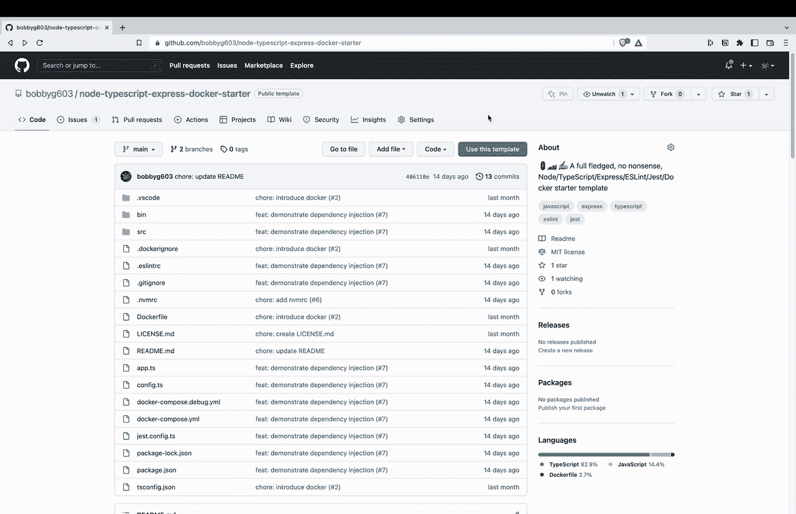
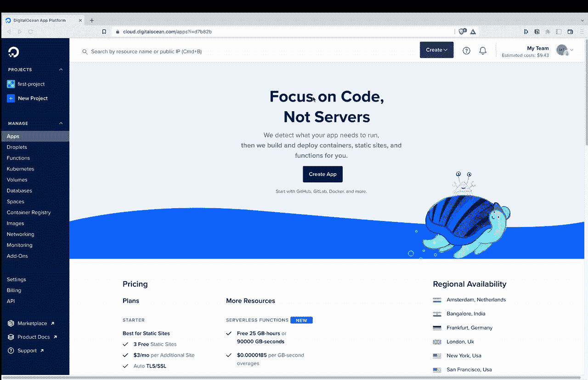
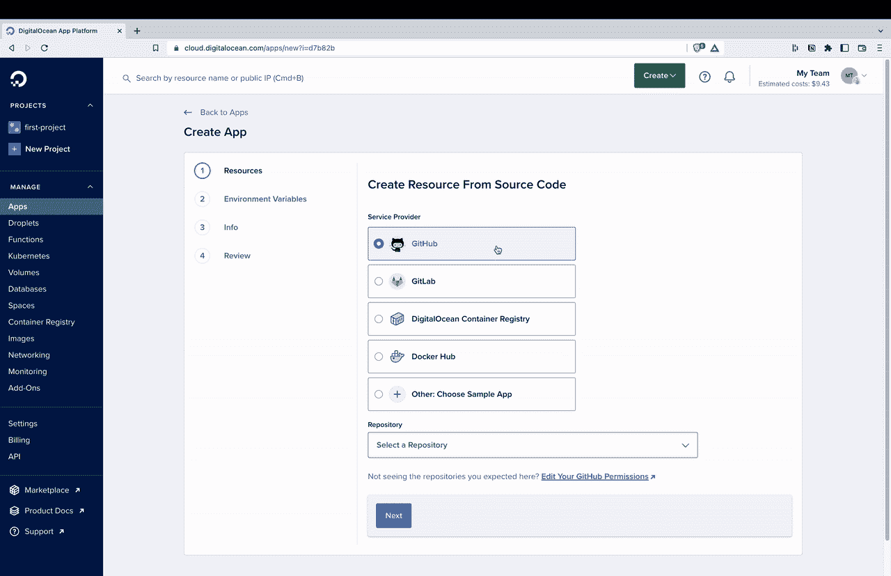
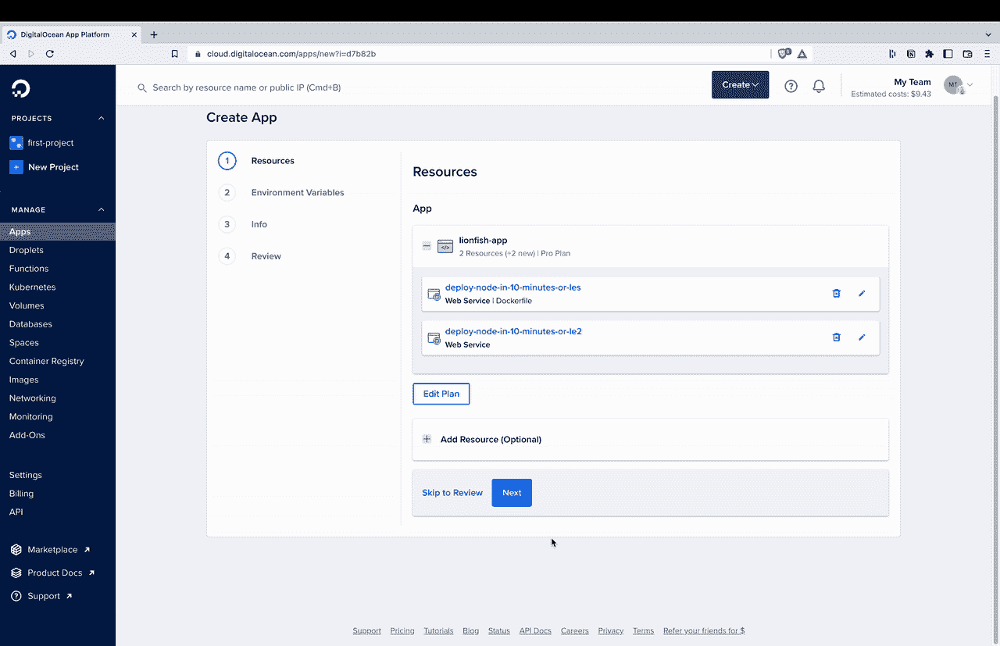
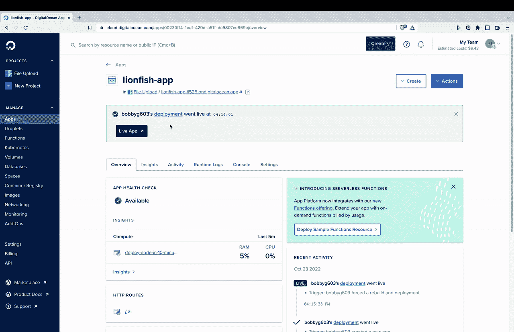
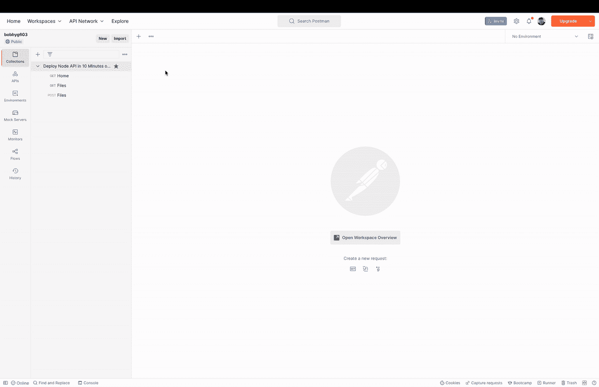
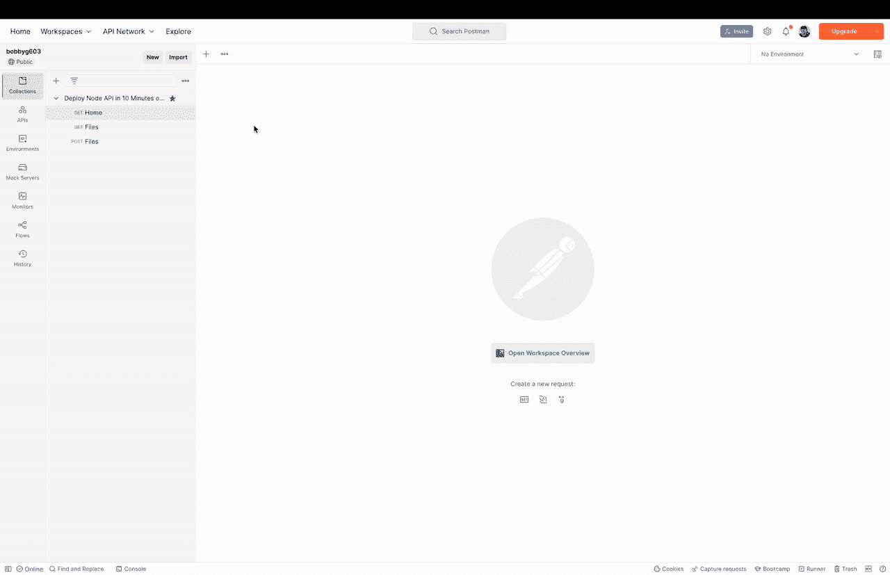
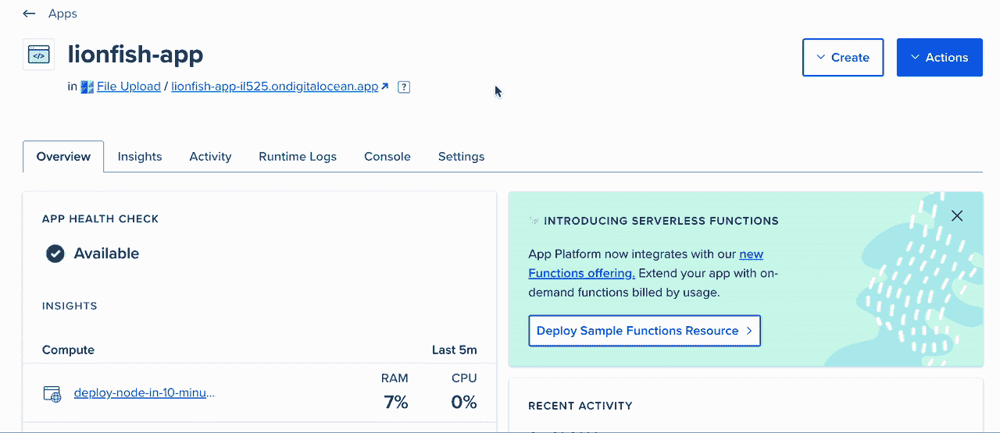

# 在 10 分钟或更短时间内部署 Node.js API

> 原文：<https://javascript.plainenglish.io/deploy-a-node-js-api-in-10-minutes-or-less-33eae4afb46d?source=collection_archive---------7----------------------->

## 创建 CI/CD 管道，该管道将使用 DigitalOcean App Platform、Node.js、Express、TypeScript 和 Docker 部署微服务。


Grab a Cup of Coffee and Set Sail to Better Deployments! 📷: [marcoiacobucci](https://www.shutterstock.com/image-photo/cup-coffee-sailboat-alarm-clock-morning-1625946913)

“时间是免费的，但它是无价的。你不能拥有它，但你可以使用它。你不能留着它，但你可以花它。一旦你失去了它，就再也找不回来了。” —哈维·麦凯

# 准备起航☀️

单独的开发人员和小团队不能花几天时间幻想基础设施的最佳实践和部署管道。毫无结果的[羊毛收集](https://www.merriam-webster.com/dictionary/woolgathering)浪费时间，并阻止商业运输有价值的功能和销售软件。除非您的企业拥有足够的资源来雇佣大批开发人员，否则您需要一个平台来快速投入生产并频繁部署更新。

在本教程中，我们将创建一个 [CI/CD 管道](https://www.redhat.com/en/topics/devops/what-cicd-pipeline)，它将使用 [DigitalOcean App Platform](https://www.digitalocean.com/products/app-platform) 、 [Node.js](https://nodejs.org/en/) 、 [Express](https://expressjs.com/) 、 [TypeScript](https://www.typescriptlang.org/) 和 [Docker](https://www.docker.com/) 部署一个[微服务](https://en.wikipedia.org/wiki/Microservices)。如果您还没有注册 DigitalOcean，您可以使用此[链接](https://m.do.co/c/dc728031e191)获得一些免费计算。当提示登录或创建帐户时，选择 GitHub 选项以简化部署。

# 升起桅杆⛵️

要开始本教程，我们需要一个用 Node.js 和 Docker 构建的服务，托管在 GitHub 的 repo 中。你可以使用自己的服务，或者使用[这里](https://github.com/bobbyg603/node-typescript-express-docker-starter)提供的回购模板在你的 GitHub 账户中创建一个新的回购。



Create a New Repo from a Template

一旦在 GitHub repo 中有了一个工作的 Node.js 服务，就该配置数字海洋应用平台了！该应用平台“允许开发人员直接向数字海洋服务器发布代码，而无需担心底层基础设施”。

要部署新的应用程序，请登录 DigitalOcean，单击仪表板左侧的**应用程序**选项卡，然后单击**创建应用程序**按钮。



DigitalOcean Create App

假设你已经用你的 GitHub 账户登录，在**服务提供商**部分选择 **Github** 选项。接下来，在**存储库**部分中选择您的 repo 的名称。如果您的回购未显示在列表中，请单击**编辑您的 GitHub 权限**链接，并授予 DigitalOcean 访问您的回购的权限。

一旦您选择了您的回购，请确保选中了**自动部署**字段，然后单击**下一步**。



Allow DigitalOcean Permission to your GitHub Repo

您将被要求指定您的 API 将使用的资源。如果您使用提供的模板 repo，请删除 DigitalOcean 因开发 docker 文件而建议的额外服务。点击**编辑计划**按钮，暂时选择**基本**。可以放心点击**下一个**直到结束。

> *⚠️* ***如果您没有任何点数，您将为此服务器付费。***



Creating Your Resource

几分钟后，您的 API 将被部署，并可从世界任何地方访问！要验证您的 API 已启动并正在运行，请单击 **Live App** 按钮。



Home Route for the Live App

您已经成功地将您的 API 部署到了云中！当你推送至 GitHub repo 的`main`分支时，DigitalOcean 也会自动部署你的应用。

# 探索海洋🐳

让我们使用 [Postman](https://www.postman.com/) 与 API 进行交互。Postman 是一个帮助你原型化 API 请求的工具。已经为模板回购创建了一个样本集合，可以通过下面的链接转移到您的帐户。

 [## 收藏网页视图|邮递员

### 有困难吗？安装最新的桌面应用程序或 Chrome 扩展。如需帮助，请访问支持中心。

app.getpostman.com](https://app.getpostman.com/run-collection/591801-d40f15ef-00ba-46ca-b51a-86b7f5f629c3?action=collection%2Ffork&collection-url=entityId%3D591801-d40f15ef-00ba-46ca-b51a-86b7f5f629c3%26entityType%3Dcollection%26workspaceId%3D5b17848c-5889-43d3-ae5c-0ae918c08357) 

一旦你分叉了邮差收藏，点击收藏文件夹，选择**变量**选项卡，并通过点击 **Live App** 按钮用你在浏览器中导航到的 URL 更新`base_url`。



Updating Postman Base URL

我们现在可以上传一个文件到 API 了！在 Postman 中，点击 **Deploy Node API 中的 **POST 文件**请求，在 10 分钟内**集合。选择**主体**选项卡，并检查**表单数据**单选按钮。在**键下的**列输入`file`并将鼠标悬停在该列的右侧，在下拉菜单中选择**文件**。在**值**栏下，点击**选择文件**按钮，选择系统上小于 20 MB 的任何文件。最后点击**发送**。



如果一切正常，您应该能够对`/files`端点执行 GET 请求，并在上传文件列表中看到您的文件。你也可以在 DigitalOcean 中打开你的应用控制台，它会给你一个外壳，你可以用它来运行各种终端命令，比如`[ls](https://www.freecodecamp.org/news/the-linux-ls-command-how-to-list-files-in-a-directory-with-options/#the-linux-ls-command)`。



Viewing Uploaded Files in the App Console

厉害！您已经使用 DigitalOcean 的应用程序平台正式将微服务部署到了云中。将这个 API 与一个[数据库](https://docs.digitalocean.com/products/app-platform/how-to/manage-databases/)、一个[工作器](https://docs.digitalocean.com/products/app-platform/how-to/manage-workers/)和一个[前端](https://docs.digitalocean.com/products/app-platform/how-to/manage-static-sites/)结合起来，你就在构建世界下一个[独角兽](https://en.wikipedia.org/wiki/Unicorn_(finance))的路上了！

# 附加学习🧑‍🏫

一个健壮的 CI/CD 管道需要贡献者评审所有提议的代码变更。在 GitHub 中，这些类型的预合并需求被称为[分支保护规则](https://docs.github.com/en/repositories/configuring-branches-and-merges-in-your-repository/defining-the-mergeability-of-pull-requests/about-protected-branches)。

查看 [GitHub 状态检查和分支保护变得简单](https://betterprogramming.pub/github-status-checks-and-branch-protection-made-easy-b70d6d9ffc76)，了解如何将分支保护配置为 CI/CD 管道的一部分。

[](https://betterprogramming.pub/github-status-checks-and-branch-protection-made-easy-b70d6d9ffc76) [## GitHub 状态检查和分支保护变得简单

### 使用分行保护规则，以确保您的回购协议的质量贡献

better 编程. pub](https://betterprogramming.pub/github-status-checks-and-branch-protection-made-easy-b70d6d9ffc76) 

此外，在合并变更之前，CI/CD 管道应该需要运行并通过一些测试。一般来说，包含[单元测试](https://en.wikipedia.org/wiki/Unit_testing)的应用程序架构更好，包含的错误更少，并且随着复杂性的增加更容易更改。

要了解如何开始编写单元测试，请阅读 2022 年的[单元测试软件入门。](https://betterprogramming.pub/unit-testing-software-in-2022-b3ac00962c65)

[](https://betterprogramming.pub/unit-testing-software-in-2022-b3ac00962c65) [## 2022 年单元测试软件入门

### 以荒唐的速度开发顶级软件

better 编程. pub](https://betterprogramming.pub/unit-testing-software-in-2022-b3ac00962c65) 

感谢阅读！

```
**Want to Connect?**If you found the information in this tutorial useful please subscribe on [Medium](http://bobbyg603.medium.com/), follow me on [Twitter](https://twitter.com/bobbyg603), and/or subscribe to my [YouTube](https://www.youtube.com/c/bobbyg603) channel.
```

*更多内容看* [***说白了就是***](https://plainenglish.io/) *。报名参加我们的* [***免费周报***](http://newsletter.plainenglish.io/) *。关注我们关于* [***推特***](https://twitter.com/inPlainEngHQ) ， [***领英***](https://www.linkedin.com/company/inplainenglish/) *，*[***YouTube***](https://www.youtube.com/channel/UCtipWUghju290NWcn8jhyAw)*，以及* [***不和***](https://discord.gg/GtDtUAvyhW) *。对增长黑客感兴趣？检查* [***电路***](https://circuit.ooo/) *。*