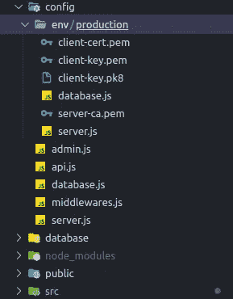
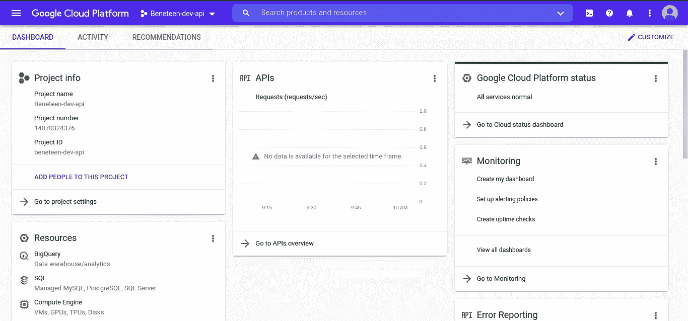
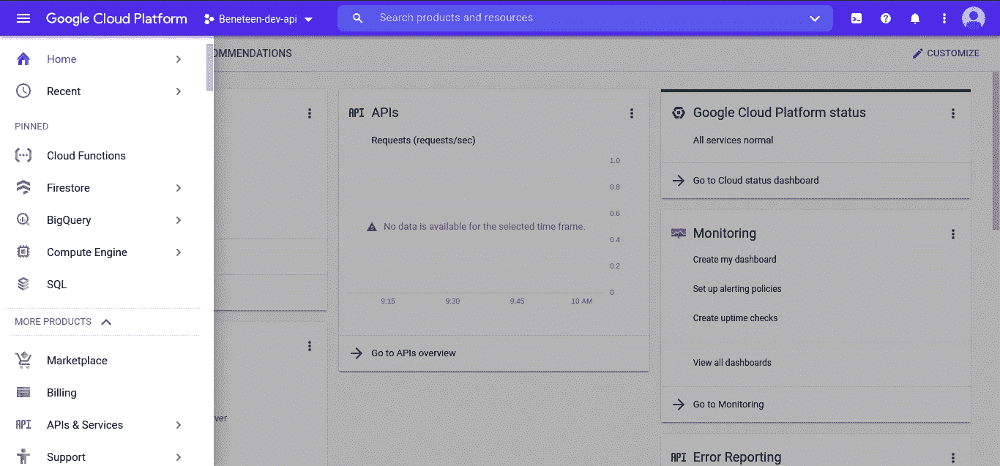
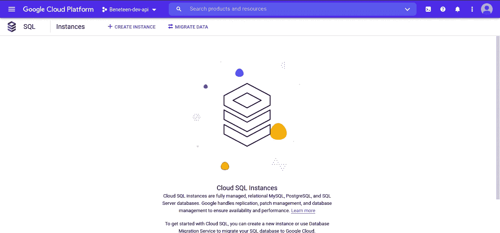
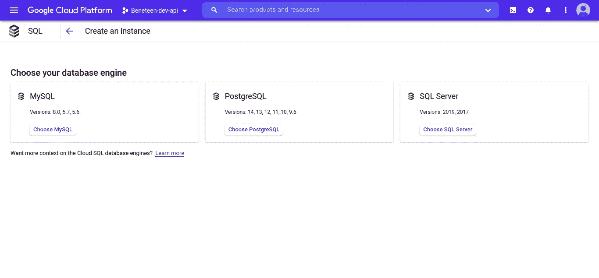
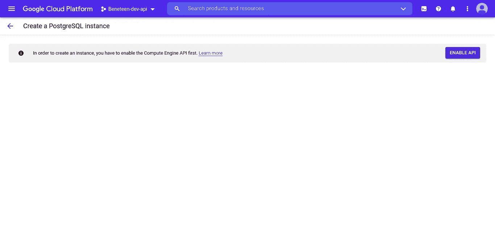
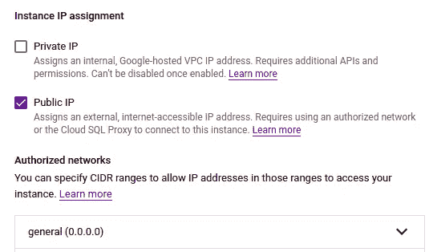

# 在 Heroku 上部署一个 Strapi V4 应用程序，同时连接到 Google Cloud SQL (PostgreSQL)

> 原文：<https://javascript.plainenglish.io/deploy-a-strapi-v4-app-on-heroku-also-connected-into-google-cloud-sql-postgresql-f4c4ad8f2fa5?source=collection_archive---------6----------------------->


Photo by [Sigmund](https://unsplash.com/@sigmund?utm_source=medium&utm_medium=referral) on [Unsplash](https://unsplash.com?utm_source=medium&utm_medium=referral)

嗨，伙计们，欢迎来到我的博客。我是潘杜，我是一名软件工程师。

之前我写过一篇文章《如何在 Heroku 上部署 NestJS App，接入 Google Cloud SQL》。现在，我又在用 Strapi v4 写几乎一样的东西，可部署到 Heroku 和 Cloud SQL。

# 斯特拉皮

Strapi v4 是去年发布的。我认为它仍然需要调整以变得更加成熟。但是当我知道 Strapi 向公众公布了一个新版本时(巧合的是，我的 CMS 需要开发，这需要时间)，我决定使用它。我用的是新版本，第 4 版。

当你用 Strapi 开发时，用最少的代码真的很快很容易。它与我的项目兼容。最后我很开心。之前进入部署，我没那么开心，更多的是恐慌。啊哈。我真的很难在 Heroku 中部署同步到云 SQL，因为在文档中，你不能找到如何在 v4 中部署。你应该加入不和谐的斯特拉皮小组，并询问它。

简而言之，我成功地将我的 Strapi v4 应用程序部署到了云中。


你可以在官方网站上查看详情。[https://strapi.io/](https://strapi.io/)

## 云 SQL


Cloud SQL 是 Google 的产品，以原生格式为您提供云服务。您不需要先创建一个虚拟机来使用您正在使用的数据库。在云 SQL 中，有 MySQL、PostgreSQL 和 SQL Server。你可以在官方网站上查看详情。[云 SQL 站点](https://cloud.google.com/sql/?utm_source=google&utm_medium=cpc&utm_campaign=japac-ID-all-en-dr-skws-all-super-trial-e-dr-1009882&utm_content=text-ad-none-none-DEV_c-CRE_505011853132-ADGP_Hybrid%20%7C%20SKWS%20-%20EXA%20%7C%20Txt%20~%20Databases%20~%20Cloud%20SQL_SQL-cloud%20sql-KWID_43700028140250606-aud-970366092687%3Akwd-297124208290&userloc_9072594-network_g&utm_term=KW_cloud%20sql&gclid=CjwKCAiA_omPBhBBEiwAcg7smaKIE4HOSOEj2sbJ6ayFrQ7hsCaNwhUEIRut6bj3PAlncUwRNyI1fxoC_o0QAvD_BwE&gclsrc=aw.ds)

## 赫罗库


## Heroku 平台

> Heroku 是一个基于托管容器系统的平台即服务，具有[集成数据服务](https://www.heroku.com/managed-data-services)和强大的生态系统，用于部署和运行现代应用。Heroku 开发者体验是一种以应用为中心的软件交付方式，集成了当今最流行的开发工具和工作流。

如果你懒得设置和构建 VM，我推荐你使用这个工具。

让我们进入正题。

第一步，绝对你要有一个 Strapi app。运行此命令。

```
npx create-strapi-app@latest my-project
```

向上移动到您的项目目录。

```
cd my-project
```

详情可以看文档。

创建一个目录和文件，就像这样。



如果您的数据库使用 SSL，请将认证添加到该文件夹中。

并且，在`config/env/production/database.js`中创建文件。复制并粘贴此脚本。

```
const fs = require("fs");
module.exports = ({ env }) => ({
    connection: {
        client: 'postgres',
        connection: {
            host: process.env.DATABASE_HOST,
            port: process.env.DATABASE_PORT || 5432,
            database: process.env.DATABASE_NAME || 'postgres',
            user: process.env.DATABASE_USERNAME || 'postgres',
            password: process.env.DATABASE_PASSWORD || '123456789',
            // ssl: env.bool('DATABASE_SSL', false),
            ssl: {
                ca: fs.readFileSync('./config/env/production/server-ca.pem').toString(),
                cert: fs.readFileSync('./config/env/production/client-cert.pem').toString(),
                key: fs.readFileSync('./config/env/production/client-key.pem').toString(),
                rejectUnauthorized: false,
            },
        },
        debug: false
    },});
```

接下来，**在云 SQL** 中设置实例一。**转到谷歌控制台**。我假设您已经在那里创建了项目。



然后，转到 SQL 菜单。



点击`Create instance`。



选择一个所需的数据库。我选 PostgreSQL。



注意:如果你还没有打开计算引擎 API，请在进入主设置之前先点击。从这里，我直接进入我现有的数据库。

接下来，进入`Connection`菜单，点击`Networking`选项卡。Intermezzo，因为云 SQL 将与 Heroku 连接，所以这就是为什么他们有公共 IP。因此，请仅在您的云 SQL 实例中单击公共 IP。



如上图所示，选择`0.0.0.0/0`进入授权网络部分。(如果您将用于生产模式，则不建议使用)。

是的，你已经完成了在云 SQL 中的配置。

在控制台中运行，以确保它是否工作。

```
npm run build && npm run start:dev
```

好了，如果您的连接成功，现在让我们在 Heroku 中创建应用程序。

1.  在 Heroku 中创建新应用程序
2.  通过 GitHub 连接您的 Strapi v4 应用程序，您必须将 GitHub 帐户授权给 Heroku 平台。
3.  然后将您的代码部署到 Heroku。

对于其他问题，您可以参考堆栈溢出上的“我的问题”。

[](https://stackoverflow.com/questions/70690879/how-to-integrate-heroku-with-google-cloud-sql-native-gcp-in-nestjs-typeorm) [## 如何在 Nestjs/Typeorm 中集成 Heroku 和 Google Cloud SQL(原生— GCP)？

### 我目前真的很沮丧，因为无法将我的应用程序部署到 Heroku，也无法将我的数据库连接到 Google Cloud SQL。我是什么…

stackoverflow.com](https://stackoverflow.com/questions/70690879/how-to-integrate-heroku-with-google-cloud-sql-native-gcp-in-nestjs-typeorm) 

是的，您已经成功地将您的应用程序部署到 Heroku 并连接到云 SQL。

附加说明:这真的不建议用于生产模式。如果您想应用此方法，请通过 Heroku CLI 将 Cloud SQL Auth Proxy 添加到您的`dyno`中。

好的，祝你好运，编码愉快！

# 警惕！

如果你们来自印度尼西亚，想要支持我越来越多的写作，希望你们能从钱包里拿出一点来。你可以通过一些方式分享你的天赋，

## 萨韦里亚

[https://saweria.co/pandhuwibowo](https://saweria.co/pandhuwibowo)


## 特拉克特尔

[https://trakteer.id/goodpeopletogivemoney](https://trakteer.id/goodpeopletogivemoney)


*更多内容请看*[***plain English . io***](http://plainenglish.io/)*。报名参加我们的* [***免费周报***](http://newsletter.plainenglish.io/) *。在我们的* [***社区***](https://discord.gg/GtDtUAvyhW) *获得独家获得写作机会和建议。*