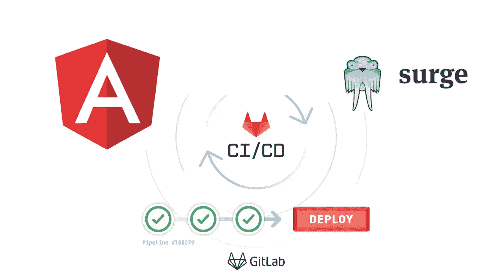
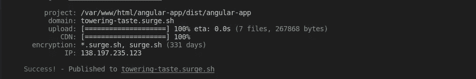
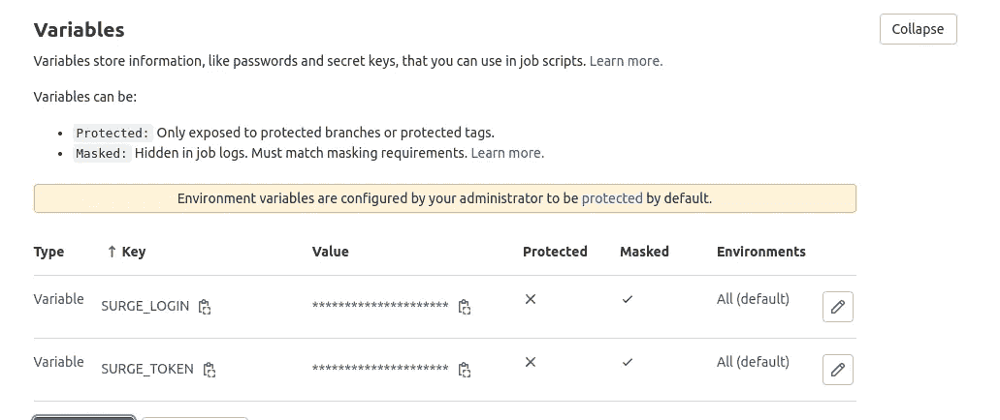

# 使用 GitLab CI/CD 部署带有 Surge 的角度应用程序

> 原文：<https://javascript.plainenglish.io/deploy-an-angular-application-with-surge-using-gitlab-ci-cd-dc34aad1f7e3?source=collection_archive---------4----------------------->

## 本文将帮助您为 Angular 项目设置 GitLab CI/CD 管道，并通过 Surge 部署它



# 浪涌(。sh)


**Surge** 是一个用于免费部署静态网站的 npm 包。为此，你需要有一个帐户与浪涌部署时，他们为你提供一个自定义域或你可以使用你的域无论你的要求。

# 先决条件

1.  你需要准备一个有角度的项目。如果你是 Angular 的初学者，你可以点击这个[链接](https://medium.com/@jaykishan.khemani/how-to-setup-your-first-angular-app-77c1d6aa65f6)。
2.  一个 GitLab 帐户，其存储库与 Angular 项目相关联。您可以从[这里](https://gitlab.com/)创建一个账户。
3.  确保您拥有最新版本的 [Node.js](http://nodejs.org/) 。
4.  **(可选)**你也可以将你之前的角度项目 Dockerize。这将使您的设置更容易。不熟悉的可以看一下[这里](/how-to-dockerize-angular-application-3cd67e963832)。我正在使用一个带有 Dockerized 环境的 Angular 项目。

# 步伐

1.  在您的项目中安装 Surge。
2.  为部署设置 Gitlab CI/CD。
3.  将您的更改推送到 GitLab。
4.  GitLab 会自动将您的更改部署到 Surge 上

# 安装电涌

1.  使用此命令将 surge 安装到您的项目中:

```
npm install --global surge
```

2.现在，从任何目录中运行`surge`，将该目录发布到 web 上。如果你是第一次运行它，它会要求你的电子邮件密码和其他细节。对于域部分，如果您没有任何域，请将该字段留空，它会自动为您分配一个域。



对于项目选项，您需要在 dist 文件夹中提供角度构建的路径。此外，要构建您的项目，您可以使用以下命令:

```
npm run build
```

在我的情况下，我收到了这个域名[http://towering-taste.surge.sh/](http://towering-taste.surge.sh/)。

3.保存这个域名和电子邮件，让我们找到令牌。使用以下命令:

```
surge token
```

这将为您提供一个令牌，并保存它。在接下来的步骤中，您将需要所有这些。

现在，您的项目必须已经手动部署。我们需要使用 CI/CD 来自动化所有这一过程。

# GitLab 设置

在项目的根目录下创建一个 gitlab.yml 文件。以下是其内容:

```
image: node:14.15.4
cache:
  paths:
    - node_modules/deploy_stage:
  stage: deploy
  only:
    - master
  script:
    - rm ./package-lock.json
    - npm install
    - ./node_modules/@angular/cli/bin/ng build --progress false --prod --base-href [http://towering-taste.surge.sh/](http://towering-taste.surge.sh/)
    - ./node_modules/.bin/surge -p dist/angular-app/ --domain [http://towering-taste.surge.sh/](http://towering-taste.surge.sh/)
```

现在在 GitLab 中设置两个环境变量:

存储库>设置> CI/CD >变量



SURGE_LOGIN =<email used="" on="" surge=""></email>

SURGE_TOKEN =

# **将您的更改推送到 GitLab**

现在使用以下命令提交并推送到主分支:

```
git add .
git commit -m "added gitlab.yml"
git push origin master
```

# 最后一步

现在 GitLab 将使用 gitlab.yml 中提供的脚本自动部署，您可以在 Repository > CI/CD 中检查其过程。此外，您可以通过在管道中单击此选项来检查日志。


像这样:


# 收尾工作

现在您的项目已经设置为自动部署。每次你推入主分支时，代码会自动部署到服务器上。这可以使用任何服务器来完成。这里我们使用的是浪涌。自己尝试，如果你有任何错误，你可以在下面评论，不要忘记与那些有需要的人分享这篇文章。感谢您宝贵的时间。🍻

[](https://www.linkedin.com/in/jaykishan-khemani-a0452850/) [## Jaykishan Khemani -解决方案工程师- GAMMASTACK | LinkedIn

### 查看 Jaykishan Khemani 在世界上最大的职业社区 LinkedIn 上的个人资料。Jaykishan 列出了 3 个工作…

www.linkedin.com](https://www.linkedin.com/in/jaykishan-khemani-a0452850/) 

*更多内容请看*[***plain English . io***](https://plainenglish.io/)*。报名参加我们的* [***免费周报***](http://newsletter.plainenglish.io/) *。关注我们关于*[***Twitter***](https://twitter.com/inPlainEngHQ)*和*[***LinkedIn***](https://www.linkedin.com/company/inplainenglish/)*。查看我们的* [***社区不和谐***](https://discord.gg/GtDtUAvyhW) *加入我们的* [***人才集体***](https://inplainenglish.pallet.com/talent/welcome) *。*