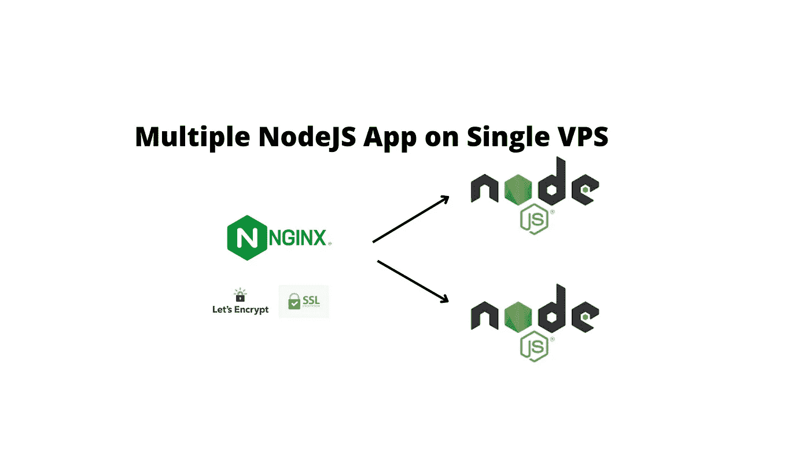

# 如何用 SSL、Nginx、PM2 在一台服务器上部署多个 Node.js 应用

> 原文：<https://javascript.plainenglish.io/deploy-multiple-nodejs-apps-on-a-single-server-with-ssl-nginx-pm2-part-1-7758e290f597?source=collection_archive---------8----------------------->

## 第 1 部分:用 SSL 在一台服务器上部署多个 Node.js 应用程序，Nginx，PM2

# 动机



你好。假设您完成了准备部署到服务器的出色 Node.js 应用程序的编码，并希望将其托管在 VPS 上，或者您有多个应用程序要托管到单个 VPS 上。你会怎么做？

# 介绍

**Nginx:**web 服务器或反向代理来处理传入请求。

**PM2:** 流程管理器，管理你的 Node.js 应用。就像确保它一直在运行，即使它捕捉到错误，或者确保创建同一应用程序的多个实例，以利用应用程序可用的核心/线程(集群模式)最后一部分是可选的。

**Certbot:** 免费使用 Let's Encrypt SSL 为您的域管理应用 SSL。

# 先决条件

具有 SSH 访问权限的 Ubuntu 20.04 服务器和具有 Sudo 权限的非 root 用户。

# 步骤 01 —安装 Node.js

首先，要安装 Node.js，我们需要为最新的 LTS 版本添加 PPA:

```
cd ~
curl -sL https://deb.nodesource.com/setup_16.x -o nodesource_setup.sh# and then sudo bash nodesource_setup.sh
```

添加 PPA 后，我们可以简单地安装 Node.js:

```
sudo apt install nodejs
```

要检查我们安装的节点的版本，请键入:

```
node -v
```

它会显示安装的确切版本，在我的例子中是`16.17.0`。

最有可能的是，我们将需要`build-essentials`来从源代码编译任何包，所以让我们也安装它。

```
sudo apt install build-essential
```

# 步骤 02 —克隆项目并安装依赖项

```
git clone awesomeproject.gitcd awesomeproject
npm install
npm start (or whatever your start command)
# stop app
ctrl+C
```

或者你可以创建一个简单的应用程序:

```
cd ~
nano app.js
```

将以下内容插入文件:

```
const http = require('http');const hostname = 'localhost';
const port = 3000;const server = http.createServer((req, res) => {
  res.statusCode = 200;
  res.setHeader('Content-Type', 'text/plain');
  res.end('Hello Everyone!\n');
});server.listen(port, hostname, () => {
  console.log(`Server running at http://${hostname}:${port}/`);
});
```

然后运行它:

```
node app
```

您将收到以下输出:

```
Output
Server running at [http://localhost:3000/](http://localhost:3000/)
```

# 步骤 03 —设置 PM2

首先，我们需要安装 PM2:

```
sudo npm i pm2 -g
```

要启动该应用程序:

```
pm2 start app  #(or whatever your file name)#for Cluster mode 
pm2 start app -i max 
#it will create an instance for every available thread 
#optionally you can also pass Number like 2,3 for instances count# Other pm2 commands
pm2 show app
pm2 status
pm2 restart app
pm2 stop app
pm2 logs (Show log stream)
pm2 flush (Clear logs)# To make sure app starts when reboot
pm2 startup ubuntu
```

该应用程序应该可以使用定义的 IP 和端口访问。

# 步骤 04 —设置 UFW 防火墙

现在，我们希望设置一个防火墙来阻止该端口，并将 NGINX 设置为反向代理，这样我们就可以使用端口 80 (http)或端口 443 (https)直接访问它。

```
sudo ufw enable
sudo ufw status
sudo ufw allow ssh (Port 22) # for SSH
sudo ufw allow http (Port 80)
sudo ufw allow https (Port 443)
```

# 步骤 05 —安装 NGINX 并进行配置

安装 Nginx 非常简单，只需输入以下命令:

```
sudo apt install nginx
```

并打开默认配置进行编辑:

```
sudo nano /etc/nginx/sites-available/default
```

将以下内容添加到服务器块的**位置**部分:

```
server_name yourdomain.com www.yourdomain.com; location / {
        proxy_pass http://localhost:3000; #whatever port your app runs on
        proxy_http_version 1.1;
        proxy_set_header Upgrade $http_upgrade;
        proxy_set_header Connection 'upgrade';
        proxy_set_header Host $host;
        proxy_cache_bypass $http_upgrade;
    }
```

然后检查并重启 NGINX:

```
# Check NGINX config
sudo nginx -t# Restart NGINX
sudo service nginx restart
```

你现在应该能够访问你的 IP 没有端口(端口 80)，并看到你的应用程序。

# 步骤 06 —添加域

向任何 VPS 添加域在每个提供商上都有很大的不同。首先，您需要注册并添加一个**和一个**记录以指向 VPS 的 IP 地址，或者如果您的 VPS 提供商支持，您也可以添加**自定义名称服务器**，这可能需要一段时间才能显示。

# 步骤 07 —添加带有加密的 SSL

让加密提供免费的 SSL 与`certbot`包，所以首先我们需要安装软件包:

```
sudo add-apt-repository ppa:certbot/certbot
sudo apt-get update
sudo apt-get install python3-certbot-nginx
```

然后为我们添加的域添加证书:

```
sudo certbot --nginx -d yourdomain.com -d [www.yourdomain.com](http://www.yourdomain.com)
```

你的应用应该在[https://yourdomain.com](https://yourdomain.com/)直播。

请注意，我们必须每隔 90 天更新这些证书。要续订，请运行:

```
certbot renew
```

我们将在下一部分添加另一个应用程序，敬请期待！😃

*更多内容看* [***说白了。报名参加我们的***](https://plainenglish.io/) **[***免费周报***](http://newsletter.plainenglish.io/) *。关注我们关于* [***推特***](https://twitter.com/inPlainEngHQ)[***LinkedIn***](https://www.linkedin.com/company/inplainenglish/)*[***YouTube***](https://www.youtube.com/channel/UCtipWUghju290NWcn8jhyAw)*[***不和***](https://discord.gg/GtDtUAvyhW) *。*****