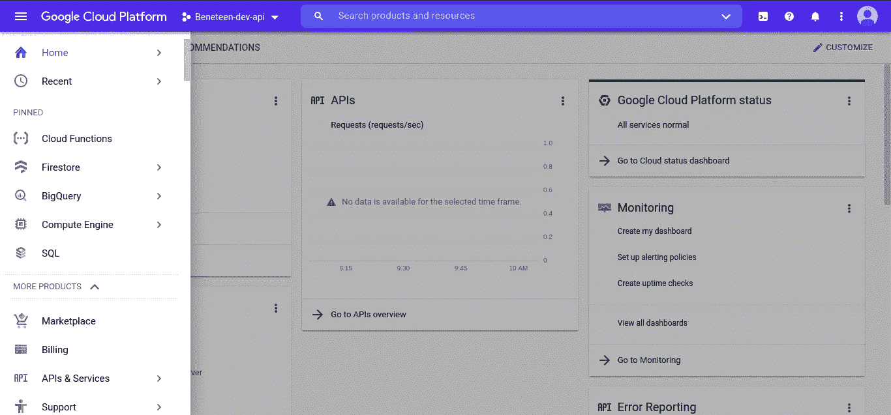
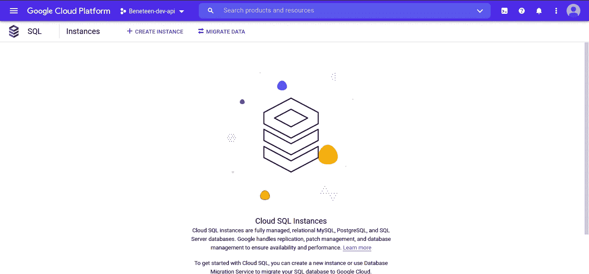
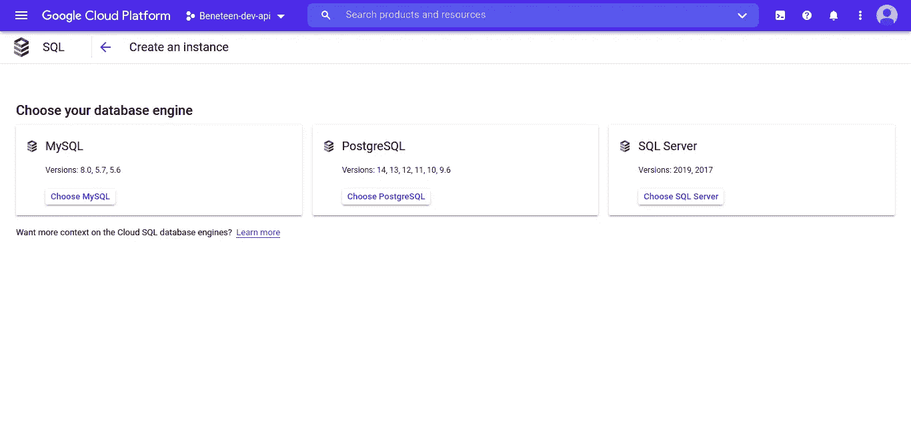

# 在 Heroku 上部署 NestJS 应用程序，同时连接到 Google Cloud SQL (PostgreSQL)

> 原文：<https://javascript.plainenglish.io/deploy-nestjs-app-on-heroku-also-connected-to-google-cloud-sql-postgresql-f0a085fea4be?source=collection_archive---------12----------------------->

## 如何在 Heroku 上部署您的 NestJS 应用程序并将其连接到 Google Cloud SQL (PostgreSQL)的指南。


Photo by [Caleb Williams](https://unsplash.com/@callys_corner?utm_source=medium&utm_medium=referral) on [Unsplash](https://unsplash.com?utm_source=medium&utm_medium=referral)

大家好，我成功地将我的 NestJS 应用程序部署到 Heroku，并连接到 Google 云平台的 Cloud SQL。

## 现在，我将与你们所有人分享。希望我能帮到你们。看看这个。

通常，当您构建 web 应用程序时，比方说 web 服务或前端站点，那么它将连接到数据库。软件工程师将选择应用程序、主机(当您部署它时)和数据库之间的简单连接方式。今天，你将读到如何连接 Heroku 和 Cloud SQL 以便在你的应用中协同工作，在我的例子中，我用 NestJS 开发了我的应用。

## NestJS


如果你知道 PHP 框架中的 Laravel，为了便于理解，你可以说出来。NestJS 到底是什么？NestJS 是 Express 支持的 Node.js 框架。它也支持类型脚本。更多信息，你可以访问官方来源:[https://nestjs.com/](https://nestjs.com/)。

## 字体


TypeORM 是连接应用程序和数据库的驱动程序。您可以使用许多选项。我通常总是为我的 PostgreSQL 和 MySQL 使用这个驱动程序。要了解更多信息，你可以访问官方来源。https://typeorm.io/#/

## 云 SQL


A guide on how to deploy your NestJS app on Heroku and connect it to Google Cloud SQL (PostgreSQL).

Cloud SQL 是 Google 的一个产品，为你提供原生格式的云服务。您不需要先创建一个虚拟机来使用您正在使用的数据库。在云 SQL 中，有 MySQL、PostgreSQL、SQL Server。详情可以去官方网站查看:[云 SQL 站点](https://cloud.google.com/sql/?utm_source=google&utm_medium=cpc&utm_campaign=japac-ID-all-en-dr-skws-all-super-trial-e-dr-1009882&utm_content=text-ad-none-none-DEV_c-CRE_505011853132-ADGP_Hybrid%20%7C%20SKWS%20-%20EXA%20%7C%20Txt%20~%20Databases%20~%20Cloud%20SQL_SQL-cloud%20sql-KWID_43700028140250606-aud-970366092687%3Akwd-297124208290&userloc_9072594-network_g&utm_term=KW_cloud%20sql&gclid=CjwKCAiA_omPBhBBEiwAcg7smaKIE4HOSOEj2sbJ6ayFrQ7hsCaNwhUEIRut6bj3PAlncUwRNyI1fxoC_o0QAvD_BwE&gclsrc=aw.ds)。

## 赫罗库


# Heroku 平台

Heroku 是一个基于托管容器系统的平台即服务，具有[集成数据服务](https://www.heroku.com/managed-data-services)和强大的生态系统，用于部署和运行现代应用。Heroku 开发者体验是一种以应用为中心的软件交付方式，集成了当今最流行的开发工具和工作流。

如果你懒得设置和构建 VM，我推荐你使用这个工具。

让我们进入正题。

首先，在 NestJS 应用程序中安装 NestJS 和 TypeORM。

```
// install nestjs cli as globally
npm install -g @nestjs/cli// create new project
nest new my-nest-project// come to the project
cd my-nest-project// install typeorm as driver in order to connect to cloud sql of postgresql
npm install --save typeorm pg
```

接下来，**在云 SQL** 中设置实例一。**转到谷歌控制台**。我假设您已经在那里创建了项目。


然后，转到 SQL 菜单。



点击`Create instance`。



选择所需的数据库。我选 PostgreSQL。


注意:如果你还没有打开计算引擎 API，请在进入主设置之前先点击。从这里，我直接进入我现有的数据库。

接下来，进入`Connection`菜单，点击`Networking`选项卡。Intermezzo，因为云 SQL 将与 Heroku 连接，所以这就是为什么他们有公共 IP。因此，请仅在您的云 SQL 实例中单击公共 IP。


如上图所示，将`0.0.0.0/0`放到授权网络部分(如果用于生产模式，不推荐使用)。

是啊，你们已经在 Cloud SQL 中完成了配置。返回到 NestJS 应用程序，并连接到您的数据库。创建一个文件，命名为 **ormConfig.ts.**

```
import { TypeOrmModuleOptions } from "@nestjs/typeorm"
const fs = require("fs");
require('dotenv').config()
export class OrmConfig {
    // Config TypeOrm
    getConfig() {
        const ormConfig: TypeOrmModuleOptions = {
            type: 'postgres',
            host: process.env.POSTGRESQL_HOST,
            port: Number(process.env.POSTGRESQL_PORT) || 5432,
            username: process.env.POSTGRESQL_USER || 'postgres',
            password: process.env.POSTGRESQL_PASSWORD ||       '123456789',
            database: process.env.POSTGRESQL_DB || 'potsgres',
            entities: ['dist/**/*.entity{.js,.ts}'],
            synchronize: false,
            migrationsRun: true,
            logging: false,
            logger: 'file',
            migrations: ['dist/database/migrations/**/*{.js, .ts}'],
            cli: { migrationsDir: 'database/migrations' },
            ssl: true,
            extra: {
                // ssl: true
                ssl: {
                    ca: fs.readFileSync('./src/config/server-ca.pem').toString(),
                    cert: fs.readFileSync('./src/config/client-cert.pem').toString(),
                    key: fs.readFileSync('./src/config/client-key.pem').toString(),
                    rejectUnauthorized: false
                } } }
        return ormConfig }
}
export default new OrmConfig().getConfig()
```

然后，在`app.module.ts`呼叫它。

```
import { MiddlewareConsumer, Module, NestModule } from '@nestjs/common';
import { ConfigModule } from '@nestjs/config';
import { TypeOrmModule } from '@nestjs/typeorm';
import OrmConfig from './ormConfig';@Module({
    imports: [
        /**
        * ================================
        * Typeorm Config
        * ================================
        */
        ConfigModule.forRoot(),
        TypeOrmModule.forRoot(OrmConfig),
    ]
})export class AppModule implements NestModule {}
```

在控制台运行，以确保它的工作与否。

```
npm run build && npm run start:dev
```

好了，如果您的连接成功，现在让我们在 Heroku 中创建一个应用程序。

1.  在 Heroku 中创建新应用程序
2.  通过 GitHub 连接你的 Nestjs App，你必须将 GitHub 账号授权给 Heroku 平台。
3.  然后将您的代码部署到 Heroku。

对于额外的情况，您可以将您的问题提交给我在 StackOverflow 中的问题。

[](https://stackoverflow.com/questions/70690879/how-to-integrate-heroku-with-google-cloud-sql-native-gcp-in-nestjs-typeorm) [## 如何在 Nestjs/TypeORM 中集成 Heroku 和 Google Cloud SQL(原生- GCP)？

### 我目前真的很沮丧，因为无法将我的应用程序部署到 Heroku，也无法将我的数据库连接到 Google Cloud SQL。我是什么…

stackoverflow.com](https://stackoverflow.com/questions/70690879/how-to-integrate-heroku-with-google-cloud-sql-native-gcp-in-nestjs-typeorm) 

现在，您已经成功地将您的应用程序部署到 Heroku，并连接到云 SQL。

附加说明:这真的不建议用于生产模式。如果您想应用此方法，请通过 Heroku CLI 将 Cloud SQL Auth Proxy 添加到您的`dyno`中。在下一篇文章中，我将分享如何将我的 Strapi v4 部署到 Heroku 和 Cloud SQL。

好的，祝你好运，编码愉快！

# 多读我的文章

[](/what-is-void-0-in-javascript-bdd4b3eb19a7) [## JavaScript 中的“void 0”是什么？

### 类似于未定义吗？到底该不该回避？

javascript.plainenglish.io](/what-is-void-0-in-javascript-bdd4b3eb19a7) [](/how-to-use-as-const-in-typescript-const-assertions-4ed34921ac51) [## 如何在 TypeScript 中使用“as const ”( const 断言)

### 我们应该什么时候使用它？

javascript.plainenglish.io](/how-to-use-as-const-in-typescript-const-assertions-4ed34921ac51) [](https://pandhuwibowo.medium.com/understanding-how-to-naming-restful-api-endpoints-c6d2b58360a9) [## 了解如何命名 RESTful API 端点

### 我们将知道如何确定资源命名

pandhuwibowo.medium.com](https://pandhuwibowo.medium.com/understanding-how-to-naming-restful-api-endpoints-c6d2b58360a9) [](https://pandhuwibowo.medium.com/ngomongin-kenapa-harus-menulis-4a3a492266a1) [## 恩戈蒙金:肯纳帕·哈鲁斯·梅努利斯？

### 嗨，欢迎来到我的博客。我的名字叫 Pandhu，是一个人的名字。

pandhuwibowo.medium.com](https://pandhuwibowo.medium.com/ngomongin-kenapa-harus-menulis-4a3a492266a1)  [## 人们为成为一名优秀的软件工程师做了什么？

### 嗨，欢迎来到我的博客，今天我将谈论一些不同的，但仍然有趣的东西

pandhuwibowo.medium.com](https://pandhuwibowo.medium.com/what-people-do-for-being-a-good-software-engineer-434c74955d9e) 

# 警惕！

如果你们来自印度尼西亚，想要支持我写更多的东西，希望你们能从钱包里拿出一点来。你可以通过一些方式分享你的天赋，

## 萨韦里亚

https://saweria.co/pandhuwibowo


## 特拉克特尔

【https://trakteer.id/goodpeopletogivemoney 


*更多内容看* [***说白了就是 io***](http://plainenglish.io/) *。报名参加我们的**[***免费周报***](http://newsletter.plainenglish.io/) *。在我们的* [***社区不和谐***](https://discord.gg/GtDtUAvyhW) *获得独家获取写作机会和建议。**