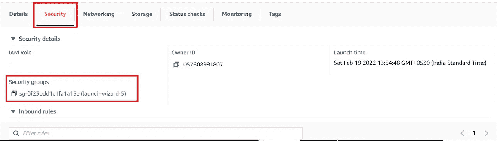

# 如何在 AWS 上部署 Node.js 应用——完整教程

> 原文：<https://javascript.plainenglish.io/deploy-node-js-apps-on-aws-from-scratch-c227c44eeb2?source=collection_archive---------2----------------------->

## 关于在 AWS 上部署 Node.js 应用程序的全面指南。

这篇文章将是一个完整的教程，我将涵盖以下几点。

*   创建和启动 EC2 实例。
*   通过 SSH 和 Putty 连接到 EC2。
*   转换中。pem 到. ppk。
*   配置 ec2 操作系统(这里是 Ubuntu)。
*   正在安装 NodeJS 和 Git。
*   克隆存储库/ Git 配置。
*   运行节点应用程序。
*   配置网络安全组


Photo by [Sigmund](https://unsplash.com/@sigmund?utm_source=medium&utm_medium=referral) on [Unsplash](https://unsplash.com?utm_source=medium&utm_medium=referral)

# TEP 1:创建和启动 EC2 实例

## 创建和部署 EC2 实例

登录您的 AWS 控制台。搜索 EC2，然后在仪表板上单击“启动实例”。


在 Choose a Amazon Machine Image(AMI)上，选择您希望的实例类型。我会选择 Ubuntu Server 20.04。然后单击选择。


在第 2 步中，您可以选择您所选择的 CPU 类型和内存。然后点击下一步。对于我的例子，我将使用免费的 t2.micro 层实例进行演示。

在第 3 步和第 4 步中，您可以保持原样，不做任何修改，除非您知道自己在做什么。

在第 5 步，你可以给标签。当您想要为同一个组织部署多个 EC2 实例时，这些会很有用。默认情况下，由于各种原因，密钥对非常有用。

在步骤 6 中，您可以看到类似这样的内容。这意味着您的 EC2 实例是易受攻击的，可以从世界上的任何地方被访问。最佳实践包括只添加已知的 IP 地址。这不是在前端公开的东西，您可以部署代理服务器。代理服务器 IP 可以作为源添加到这里。


我将暂时将其留空，并在第 7 步启动我的实例。

*   **重要一步**

现在将要求您选择键-值对。这些对保持安全极其重要。选择一个现有对或创建一个新对。我将为这个例子创建一个新的。


# 步骤 2:安装和使用油灰

您可以访问下面的链接并下载 PuTTY

 [## 下载 PuTTY:最新版本(0.76)

### 该页面包含最新发布的 PuTTY 版本的下载链接。目前这是 0.76，发布于…

www.chiark.greenend.org.uk](https://www.chiark.greenend.org.uk/~sgtatham/putty/latest.html) 

安装后，您需要转换您的。pem to .ppk .要在安装腻子后执行此操作，请打开腻子并按照指示操作。

单击加载并打开。pem 文件


单击打开


此外，您可以添加密码短语。但是这里要记住的一点是—

添加密码时，由于需要人工干预，因此无法实现自动化。如果您需要自动部署，请确保探索可用的选项。

现在，当一切都完成后，设置点击“保存私钥”。

# 步骤 3:连接到 EC2 实例

打开 EC2 仪表板上的实例，单击要连接的实例，然后单击 connect。


保持此窗口活动，因为您将需要此处的信息。

有两个选项可以连接到您的实例。一个是直接从终端，可以遵循上述 4 个程序。另一种方法是使用油灰。使用油灰的人可以跟着做，否则可以进入下一部分。

在以 ubuntu@ec-2…开头的最后一行，你的用户名是 **ubuntu** ，主机名是 **ec2…**

*   开放式油灰应用
*   在会话选项卡中，如上所述输入主机名。
*   在连接->数据中输入自动登录作为您的用户名
*   在连接-> SSH -> Auth 中，浏览您在上一步中生成的 ppk 密钥。


单击 Open，现在您将能够登录到您的 EC2 实例。


# 步骤 4:安装 Node.js 和 Git

在您的终端中执行以下语句:

*   ***须藤 apt 更新*** //更新所有 ubuntu 核心包
*   ***sudo apt Install node . js//Install node . js 默认版本(v10.19.0)***
*   执行 ***节点-v*** //检查是否安装
*   如果您想要使用任何其他节点版本，请安装 nvm，如下所示

```
1). sudo apt install curl
2). curl https://raw.githubusercontent.com/creationix/nvm/master/install.sh | bash
3). source ~/.profile
4). nvm install 12.18.3
5). nvm use 12.18.3
```

按如下方式安装 git:

```
sudo apt install git
git version // Verify the installation
```


## **步骤 5:克隆一个存储库**

最近 GitHub 禁用了基于密码的认证，所以你要么需要通过 SSH 克隆，要么需要基于令牌的认证。我将对其执行基于令牌的身份验证。您可以在 EC2 实例上为 GitHub 并行设置 ssh。

要添加令牌，请重定向到您的 GitHub 帐户并打开设置。在侧边栏的底部，您可以找到开发者选项


单击生成新令牌。


选择适当的值，然后单击生成。保存生成的令牌。

现在克隆一个存储库，使用用户名作为您的 GitHub 用户名，使用密码作为生成的新令牌。


现在跟随 cd 进入您的目录。运行 npm install(您可能需要安装 npm)。


最后，运行您的节点项目。


这就是如何将 Node.js 应用程序部署到 EC2 实例的方法。

但是在您开始访问您的 web 服务器之前，您需要做的最后一件事是配置网络访问。

# 最后一步:启用 HTTP 访问

在“实例详细信息”页面中，搜索“安全”选项卡，并打开包含安全组的链接。



点击链接，它会将你重定向到另一个页面。单击编辑入站规则。


添加一个新记录，其中包含您的应用程序正在其上运行的端口的详细信息。


现在，尝试从公共 IPv4 DNS 访问您的 web 应用程序，并在链接末尾添加您的端口号，如下所示:

```
ec2-13-......YOUR_VALUES_compute.amazonaws.com:YOUR_PORT_NUMBER
```

现在，您已经准备好部署您的应用程序，并从它们那里获得响应。

*更多内容请看*[***plain English . io***](http://plainenglish.io/)*。报名参加我们的* [***免费周报***](http://newsletter.plainenglish.io/) *。在我们的* [***社区***](https://discord.gg/GtDtUAvyhW) *获得独家获得写作机会和建议。*