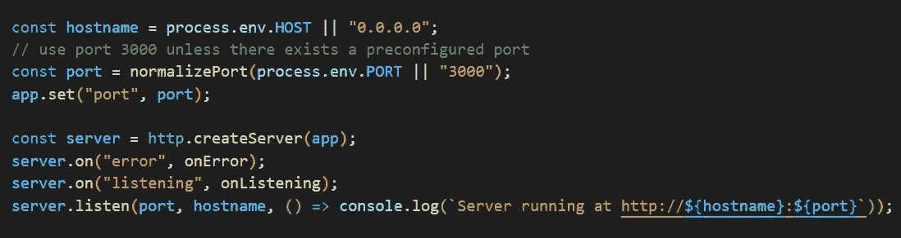
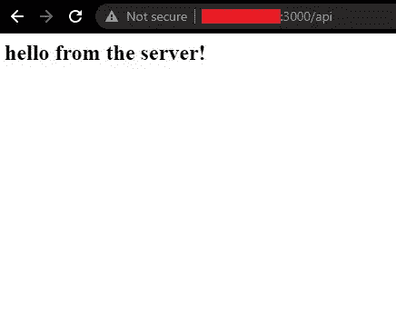

# 在 Ubuntu 22.04 上使用 Apache 部署 Node.js 应用程序

> 原文：<https://javascript.plainenglish.io/deploy-nodejs-app-with-apache-on-ubuntu-22-04-518fa548132a?source=collection_archive---------0----------------------->


## 项目设置

首先，让我们在 Node.js 应用程序中配置服务器主机名。更改为 **0.0.0.0，**如下图所示。



## **使用代理设置 Apache2，以便公开我们的 Node.js 应用**

首先，获取最新版本的包并检查更新:

```
sudo apt update
```

安装 apache2:

```
sudo apt install apache2
```

## 安装 **Node.js** 和 **npm**

1.)安装 curl(如果尚未安装)并通过 NodeSource 的官方 PPA 安装脚本为特定的 Node.js 版本添加**个人包存档(PPA)** 。

```
sudo apt install curlcurl -sL [https://deb.nodesource.com/setup_16.x](https://deb.nodesource.com/setup_16.x) | sudo -E bash -
```

> 根据您所需的版本，用 **17.x** 、 **12.x** 或 **11.x** 替换 **16.x**

2.)从 PPA 安装最新的 Node.js:

```
sudo apt install nodejs
```

npm 通常作为一个依赖项自动**安装**，不需要单独安装。但是，安装它的命令是:

```
sudo apt install npm
```

> ⚠当我们用 snap 安装 Node.js 和 npm 时，遇到了 pm2 的问题，守护进程无法启动，在我们完全卸载并重装 Node.js 后才修复，问题描述:`[PM2] Spawning PM2 daemon with pm2_home=/home/user/.pm2`。所以，一般来说，我们建议不要用 Snap 安装 Node.js，尽管我们并不讨厌 Snap:)

## 启动您的服务器

有两种方法可以启动服务器。您可以简单地通过在命令行上写`node server.js`来启动它。你也可以使用一个守护进程管理器，比如 PM2，它可以帮助你管理你的应用程序，并让它一直在线。

*   如果您想使用进程管理器，请跳到下一节，这一节将解释如何安装和设置 pm2。
*   如果你**不想**安装 pm2，你可以**跳过**下一节，从你的终端，转到你的 app 的**根文件夹，运行命令:**

```
node server.js ( or app.js – generally insert app name here )
```

## 全局安装 pm2(可选)

下面是安装它的命令:

```
sudo npm install -g pm2
```

> ⚠ PM2 用于启动我们应用程序的守护进程，并在机器重启时自动启动我们的应用程序

如果您安装了 pm2，请执行以下 4 个命令

1.)在您的终端中，转到您的应用程序的**根文件夹并运行命令:**

```
pm2 start server.js ( or app.js – generally insert app name here )
```

2.)然后，我们应该设置自动启动以防重启。为此，请运行以下命令:

```
pm2 startup
```

3.)复制打印的 env 并将其粘贴到终端中。在我们的案例中:

```
sudo env PATH=$PATH:/usr/bin /usr/lib/node_modules/pm2/bin/pm2 startup system -u george --hp /home/george
```

4.)启动所有需要的应用程序后，保存应用程序列表，以便在重新启动后可以使用以下命令恢复它:

```
pm2 save
```

然后，我们需要启用以下两个模块:

*   代理人
*   代理 _http

在终端中运行以下命令:

```
sudo a2enmod proxysudo a2enmod proxy_http
```

在下一步中，转到/etc/apache2/sites-available

```
cd /etc/apache2/sites-available
```

在这个目录中，你需要创建一个名为 myapp.conf.
的文件，你可以使用 touch 命令，这个命令只在文件不存在时才创建一个文件。所以运行这个命令:

```
sudo touch myapp.conf
```

用编辑器(vim、nano 等)打开文件。).要使用 nano 打开文件，请键入:

```
sudo nano myapp.conf
```

最后复制并粘贴<virtualhost>……</virtualhost>下面的文字

***myapp.conf***

```
<VirtualHost *:3000>
  ServerName 192.240.64.48 #fake IP, Insert your IP or domain here
  ProxyPreserveHost on
  ProxyPass / [http://localhost:3000/](http://localhost:3000/)
  ProxyPassReverse / [http://localhost:3000/](http://localhost:3000/)
 </VirtualHost>
```

> 注意，在 **ProxyPass** 和 **ProxyPassReverse** 字段中，必须键入 Node.js 应用程序中使用的相同端口。

在下一步中，启用虚拟主机:

```
sudo a2ensite myapp.conf
```

最后，重新启动 apache2(使用以下两个命令中的任意一个)，以使您的操作生效:

```
sudo systemctl restart apache2.servicesudo service apache2 restart
```

键入您的 IP 或域地址以查看您的应用程序正在运行！



下一步是什么？[在 Medium 上关注我](https://medium.com/@gthanos)成为第一个阅读我的故事的人。