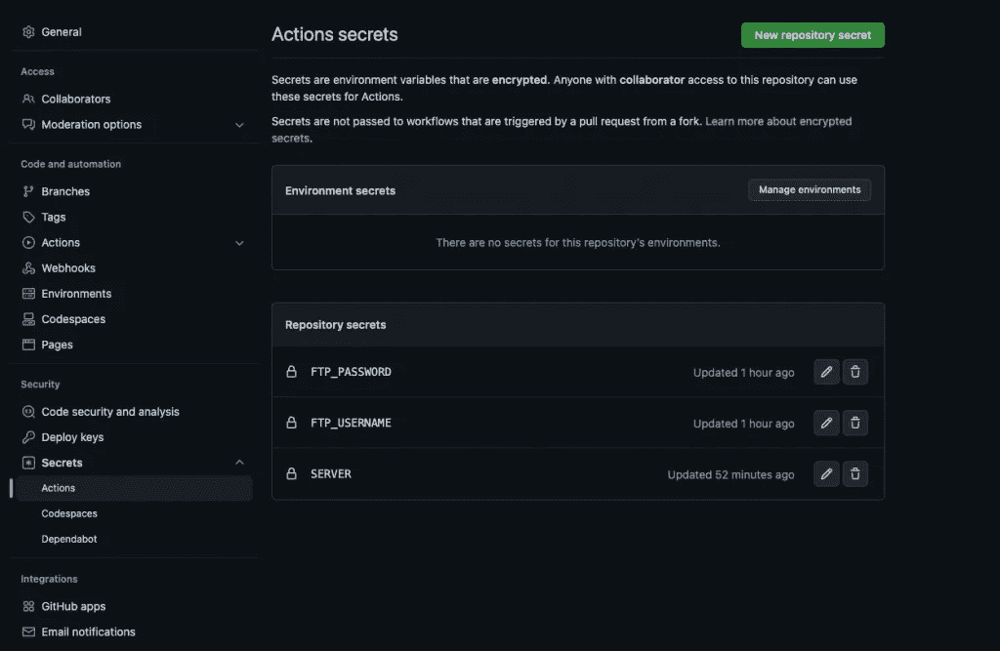
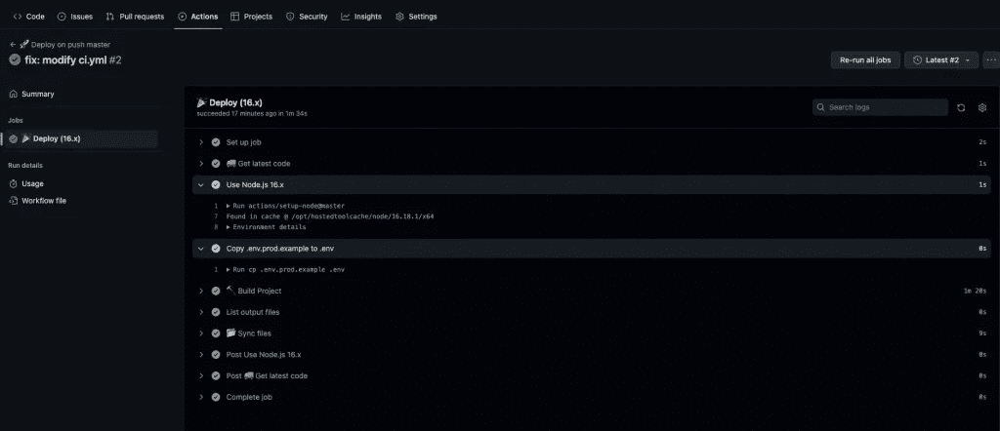

# 在共享主机上部署使用 GitHub 操作的 React

> 原文：<https://javascript.plainenglish.io/deploy-react-with-github-actions-on-shared-hosting-d950fcf27685?source=collection_archive---------0----------------------->


让我们看看用 FTP Deploy GitHub Action 在共享主机上部署 React app 的流程。

**先决条件:**

*   在 cPanel 中设置一个 FTP 帐户。
*   在 GitHub 中设置 React 项目。

开始吧！

**设置 GitHub 动作:**

选项 1:

在项目目录的根目录下运行下面的命令。在 workflows 文件夹中创建 ci.yml 文件，该文件可以有任何名称，但应以. yml 扩展名结尾。将下面的配置代码片段写入 ci.yml 文件。

```
mkdir .github/ 
mkdir .github/workflows/ 
touch .github/workflows/ci.yml
```

选项 2:

在 GitHub 存储库中，点击**动作>自己设置一个工作流**，并将下面的配置代码片段写入 ci.yml 文件。该文件可以有任何名称，但应以. yml 扩展名结尾。

让我解释一下每个部分的功能。

```
name: 🚀 Deploy on push master
```

只是为工作流指定一个名称。

```
on: 
  push:
    branches:    
      - master
```

当一个人推送到*主*分支时，上面的代码片段触发工作流。

```
jobs:
  web-deploy:
    name: 🎉 Deploy
    runs-on: ubuntu-latest
```

*作业* —将工作流中运行的所有作业组合在一起。指定和设置一个 *web-deploy* 作业。

*runs-on:ubuntu-latest*—配置使用最新版本的 Ubuntu 运行工作流。

```
strategy:
      matrix:
        node-version: [16.x]
```

伴随节点版本的*矩阵*告诉工作流在指定的节点版本上运行 *web-deploy* 。

```
steps:
    - name: 🚚 Get latest code
      uses: actions/checkout@v2
```

*步骤* —将 *web-deploy* 作业中运行的所有步骤组合在一起。

*使用:actions/checkout@v2* —签出存储库，以便工作流可以访问它。

```
 - name: Use Node.js ${{ matrix.node-version }}
      uses: actions/setup-node@master
      with:
        node-version: ${{ matrix.node-version }}
```

*用途:actions/setup-node @ master*—在 CI 环境中安装指定的节点版本(16)。

```
- name: Copy .env.prod.example to .env
      run: cp .env.prod.example .env
```

运行:cp .env.prod.example。env —用所需的环境变量创建一个. env。(重要是因为。env 总是被添加到。gitignore)。

```
- name: 🔨 Build Project 
      run: |
        npm install
        npm run build
```

*运行:npm 安装* —使用 npm 安装程序包节点依赖项。

*运行:npm 运行构建* —构建 React 项目。

```
- name: 📂 Sync files
      uses: SamKirkland/FTP-Deploy-Action@4.3.3
      with:
        server: ${{ secrets.SERVER }}
        username: ${{ secrets.FTP_USERNAME }}
        password: ${{ secrets.FTP_PASSWORD }}
        local-dir: build/
```

使用 FTP 凭证将文件从*构建*文件夹传输到共享托管服务器。

**添加 GitHub 秘密:**

转到 GitHub 存储库的**设置**选项卡，点击**机密** > **动作** > **新建存储库机密**添加 FTP 服务器、帐号用户名和密码。

例如，对于 FTP 用户名: **FTP_USERNAME** 作为名称，**zon@zon.com**作为值。

要访问管道中的变量，请使用以下格式:

```
${{ secrets.SERVER }} 
${{ secrets.FTP_USERNAME }} 
${{ secrets.FTP_PASSWORD }}
```



现在，每当有人推送到主分支时，管道就开始运行 *web-deploy* 作业，该作业构建并部署 react 应用程序。

转到**操作**选项卡，监控它是正在运行、成功部署还是失败。



GitHub 上的 CI/CD 管道到此结束。感谢阅读！

*原载于 2022 年 12 月 28 日*[*【https://anlisha.com.np】*](https://anlisha.com.np/blog/deploy-react-with-github-actions-on-shared-hosting/)*。*

*更多内容看* [***说白了。***](https://plainenglish.io/)

*报名参加我们的* [***免费每周简讯***](http://newsletter.plainenglish.io/) *。关注我们上* [***推特***](https://twitter.com/inPlainEngHQ) ， [***领英***](https://www.linkedin.com/company/inplainenglish/) ***，***[***YouTube***](https://www.youtube.com/channel/UCtipWUghju290NWcn8jhyAw)***，以及****[***不和***](https://discord.gg/GtDtUAvyhW)*

***想扩大你的软件创业规模*** *？检查出* [***电路***](https://circuit.ooo/?utm=publication-post-cta) *。*