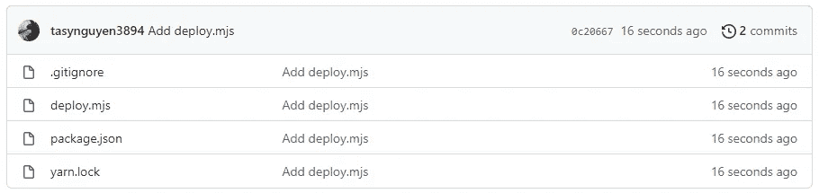

# 用 zx.js 将源代码部署到 GitHub 页面

> 原文：<https://javascript.plainenglish.io/deploy-source-code-to-github-pages-with-zx-js-8c5136595956?source=collection_archive---------17----------------------->

## 将静态页面部署到 Github 页面的简单方法。


Photo by [A C](https://unsplash.com/@animeshchatterjee?utm_source=unsplash&utm_medium=referral&utm_content=creditCopyText) on [Unsplash](https://unsplash.com/s/photos/js?utm_source=unsplash&utm_medium=referral&utm_content=creditCopyText)

在开始谈论这篇文章的主要观点之前，我将谈一谈让我有机会与 **zx.js** 合作的原因。我有一个用 Gulp 建立的个人页面，我把它放在了 GitHub 页面上。因为我没有为我的页面设置目录，所以我需要处理两个分支。一个用于开发，一个用于部署。

在开发分支，我设置了一些构建工具，如 Gulp、Webpack 等。来编译我的源代码。在部署分支中，我只需要用开发分支的输出替换它的内容，并将其推送到 GitHub。下面是我的**手动**流程:


我真的不喜欢这种流量。然后我找到了一个支持我轻松完成这项工作的库。这是`gulp-gh-pages`。这个库可以帮助我将所有内容从输出目录推到部署分支，而无需复制和签出…

# 出事了

这是过去的事了。这个库运行良好。最近，当我升级我的 Node.js 版本并对我的个人站点进行一些更改时，我在使用`gulp-gh-pages`部署流程时遇到了一些问题。它抛出了一些关于它们的依赖库的错误。我试图用一些正常的方法来修复它，比如升级版本，改变依赖库的版本…但是它仍然不起作用。我决定以我的方式处理我的部署流程。经过一番研究后，我选择了 **zx.js** 作为我的工作，我只需要几行代码来处理它。下面几行，我就说说我是怎么完成的。

# 需求和规划

在开始编码之前，我们需要再看一下需求。我们有一个包含两个分支的存储库(开发分支和部署分支)。在开发部门，我们将在。在这个部门，我们可以做任何我们想做的事情。只需要确保我们可以将想要部署的内容放在一个目录中。第二个分支是我们想要包含开发分支的所有输出的地方。要求是生成一个命令或类似的东西，将开发分支中的输出自动带到部署分支。

在我们开始自动执行之前，我会制定一个手动执行的计划。首先，我真的不喜欢我上面说的步骤(构建，将输出目录复制到另一个地方，签出到部署分支)。我建议采取其他步骤，让我们在当前目录中完成我们的工作。以下是步骤:


将那些步骤转换成。 **js** 文件，我们将有一个带有注释和函数的文件，如下所示:

在下一部分中，我们将使用 **zx.js.** 来完成此功能

# 让我们编码

让我们从第一部分开始。

**检查临时目录是否已经存在。**

在这一部分，我们需要临时目录的名称。我的选择是`temp`。你可以用任何你喜欢的名字。要检查这个目录是否已经存在，我们只需要通过方法`existsSync`使用库`fs`。如果该目录已经存在，我们需要删除该目录。下面是我们将对文件进行的更改，以完成这一步:

在我们上面添加的行中，我们可以使用 **xz.js 轻松删除一个目录。**让我们移动到下一部分。

**克隆并替换部署分支中的源代码。**

在下一部分中，我们将在 deployment 分支中克隆我们的存储库，并用我们之前构建的输出目录中的源代码替换该分支中的所有源代码。为了克隆我们的存储库，我们需要获得当前的远程主机。我们可以用下面的 git 命令得到这个结果:

```
git config --get remote.origin.url
```

有了这个命令的结果，我们只需要运行一个普通的带参数`--branch`的`git clone`部署分支来克隆我们的库。然后我们只需要做两件事:删除临时目录中的所有源代码，并将输出目录中的所有源代码复制到临时目录中。很简单，下面我就展示一下:

**检查 gdfgdf 中的文件更改。**

在这一步中，我们需要检查输出的源代码和部署分支中的当前源代码之间的任何变化。Git 将使用带有参数`-d` `-m` `--others`的命令`git ls-file`来帮助我们完成这项工作。如果任何文件被更改，我们将向用户显示一条消息。如果源代码被更改，我们将把这些更改推送到部署分支。我想我们都知道三个命令`git add` `git commit`和`git push`来完成这项工作。让我们看看在这一步中我们做了什么:

我忘了告诉你一个小步骤来改变目录到临时目录的内部。为此，我们可以非常容易地使用 **zx.js** 中的函数`cd(<path>)`。完成我们的工作后，不要忘记将目录更改为外部。

**清理**

这一步很简单，删除临时目录即可。

# 我们跑吧

我们已经用 **zx.js** 完成了一个从开发分支输出到部署分支自动部署代码的文件。现在，让我们用一个简单的例子来运行这个文件。我有一个包含两个分支的存储库，`master`用于部署，`develop`用于开发。在`master`中，我添加了一个文件`first.txt`，内容为“第一个文件”,如下所示:


在`develop`，我们将为它设立一个小点。首先，我们需要安装 **zx.js** 。很简单:

```
yarn add -D zx
```

其次，我们将使用上面完成的文件中的内容创建`deploy.mjs`。最后，只需要添加一个`.gitignore`来忽略`node_module`和`dist`(输出目录的名称)。下面是我们在`develop`中看到的:



现在，我们将创建一个目录`dist`来存放内容`first.txt`。但是这个文件的内容并不是像`master`那样的“第一个文件”。我们需要将该文件的数据更改为“编辑的第一个文件”。然后我们创建一个内容为“second”的新文件`second.txt`。以下是我们在`dist`中看到的内容:


现在，让我们使用以下命令来尝试我们的 **deploy.mjs** :

```
zx deploy.mjs
```

下面是我从这个命令中得到的结果:


我看到`temp`被移除了，也许这是个好结果。让我们在`master`打开 Github 查看一下:


那有效！增加了`second.txt`，修改了`first.txt`。

# 结论

在本文中，我已经向您展示了如何一步一步地使用 **zx.js** 将源代码部署到 Github 页面。这很简单，我认为从 zx.js 开始是个好方法。希望这篇文章对你有帮助。我真的不太擅长 Git 和终端命令，所以我使用的命令非常简单。我认为你能比我做得更好。让我们试一试。你可以在他们的文档中了解更多关于 zx.js 的信息:

[](https://github.com/google/zx) [## GitHub - google/zx:编写更好脚本的工具

### Bash 很棒，但是在编写脚本时，人们通常会选择更方便的编程语言…

github.com](https://github.com/google/zx) 

以下是我的示例存储库:

[](https://github.com/tasynguyen3894/zx_simple_example) [## GitHub-tasynguyen 3894/zx _ simple _ example

### 此时您不能执行该操作。您已使用另一个标签页或窗口登录。您已在另一个选项卡中注销，或者…

github.com](https://github.com/tasynguyen3894/zx_simple_example) 

在我做了一些优化之后，这个流的要点文件如下:


Photo by [Mike Kononov](https://unsplash.com/@mikofilm?utm_source=unsplash&utm_medium=referral&utm_content=creditCopyText) on [Unsplash](https://unsplash.com/s/photos/building-window?utm_source=unsplash&utm_medium=referral&utm_content=creditCopyText)

感谢您的阅读。

通过 [Linkedin](https://www.linkedin.com/in/thaisangnguyen3894/) 或 [Twitter](https://twitter.com/tasyit) 与我联系。

*更多内容看* [***说白了就是***](https://plainenglish.io/) *。报名参加我们的* [***免费周报***](http://newsletter.plainenglish.io/) *。关注我们关于*[***Twitter***](https://twitter.com/inPlainEngHQ)*和*[***LinkedIn***](https://www.linkedin.com/company/inplainenglish/)*。查看我们的* [***社区不和谐***](https://discord.gg/GtDtUAvyhW) *加入我们的* [***人才集体***](https://inplainenglish.pallet.com/talent/welcome) *。*