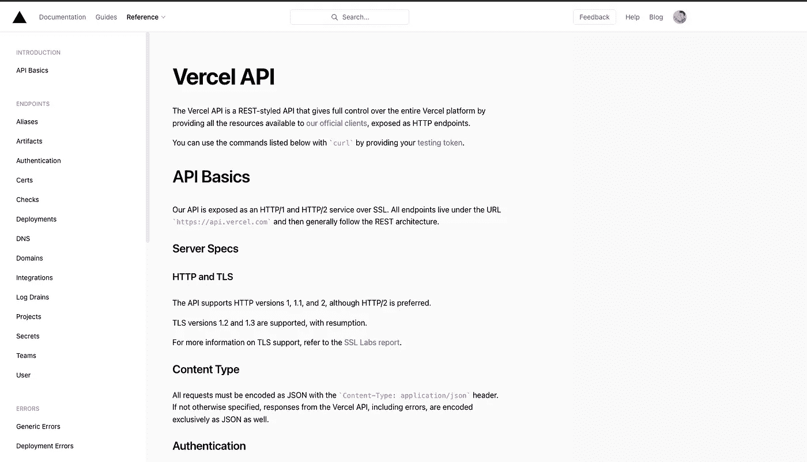
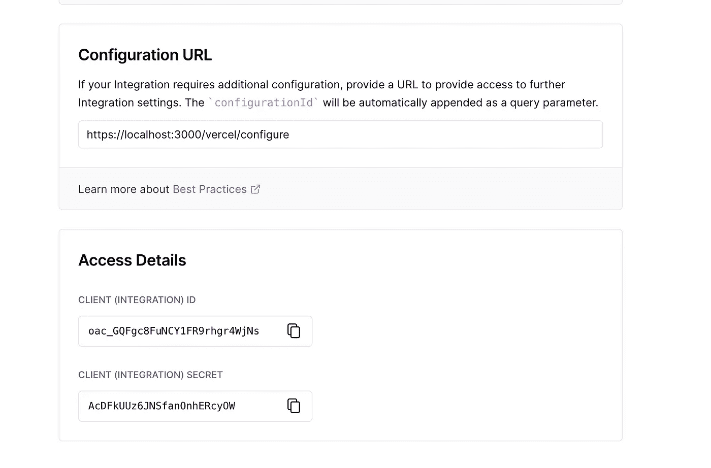
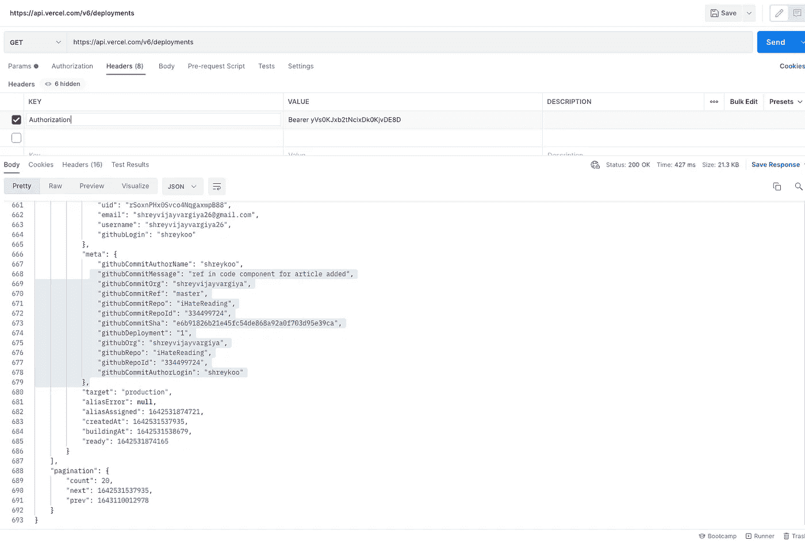

# 只需一次点击即可部署前端存储库

> 原文：<https://javascript.plainenglish.io/deploying-frontend-repositories-in-a-single-click-e7ab8c25fe75?source=collection_archive---------12----------------------->

## 关于如何使用 Vercel API 部署前端存储库的指南



Vercel API documentation website screenshot

## 在后台

当我们想要部署我们的定制存储库来为我们的用户预览部署链接时，故事就开始了。我们最终使用代码沙盒 API，但是它显示了在浏览器的框架内运行容器的一个问题，所以我们最终移除了部署预览。在今天的故事中，我们将解决同样的问题，但使用 Vercel API 而不是代码沙箱。

## 入门指南

如果你是 Vercel 的新手，那么[在这里](https://medium.com/nerd-for-tech/5-reasons-why-vercel-is-the-best-for-application-deployment-92009b17e601)阅读更多细节。我们有一个自定义存储库部分，为用户提供现成的存储库。用户可以下载、查看、保存和共享资源库，共同成长。每个自定义存储库都需要一个部署，以便在成功运行时预览存储库的结果，作为参考，查看右侧代码沙箱中代码的结果。它几乎看起来像一个浏览器，干净，简单，易于使用。

我们的议程是提供一个界面来预览用户在网站上查看的每一个自定义存储库的结果。

## 解决方案一

经过大量的研究，我们决定使用代码沙盒 API，它对我们来说很成功，但它也有自己的局限性。每个部署的存储库都在容器中运行，然后显示存储库的结果。

如果您部署一个简单的 Next.js 存储库，只显示 h1 标记，代码沙箱将使用 yarn run dev 等命令在容器中运行存储库，然后显示存储库的结果。

## 限制

以下是我们对代码沙箱部署 API 不满意的原因:

*   代码沙箱运行容器中每个已部署的存储库，而不是直接部署存储库。
*   在容器中构建和运行存储库既费时又耗费网络资源。
*   有时存储库部署失败了，却没有给出任何错误，这使得调试变得非常困难。

## 解决方案二

当然，我们确实有一个想法来创建我们的自定义部署 API，为此，我们需要一些时间，因为我们必须围绕码头工人工作。既然我们已经使用一个接口在 Vercel 上部署了我们的存储库，为什么不在创建我们的定制部署之前尝试一下 Vercel API 呢？

## 部署方法

我们的方法可以概括为以下几个字

*   创建一个简单易用的存储库。
*   为我们的存储库架构创建一个 JSON 数据结构(我将在本文后面详细解释这一部分)。
*   为部署创建一个端点，将存储库 JSON 传递给 Vercel API，并将其部署到自定义链接。

在 3 个步骤内，我们可以部署我们的存储库。

## 执行

让我们从创建一个简单的 next js 存储库开始。我没有创建一个，因为我们有一个自定义的回购部分，它一次性提供了所有现成的存储库。您可以从这里下载您的存储库。

一旦存储库准备就绪，我们就可以使用 next js 提供的无服务器功能来创建部署端点。如果您不熟悉这种无服务器功能，这里有文章链接。

然后，我们为我们的存储库创建 JSON 数据结构，并将其传递给我们的无服务器部署端点。我们的无服务器部署端点将使用 Vercel 提供的 POST /deployment 端点来部署我们简单的下一个 js 存储库。

## 创建集成

在我们开始使用 Vercel API 之前。我们需要获取访问令牌，每个对 Vercel 服务器的 API 请求都需要这个令牌。

您可以将访问令牌视为 JWT 令牌或授权令牌。在 Vercel 网站上，打开您的集成控制台，通过填写所有必填字段来创建一个集成。

添加您的产品详细信息并创建您的集成只需不到 5 分钟的时间。

一旦集成成功创建，集成控制台将显示我们需要存储的客户端 id 和客户端密码，因为我们将需要它们来获取我们的访问令牌。

🔗[链接到 Vercel 集成控制台](https://vercel.com/dashboard/integrations/console)



My integration of client id and client secret

请不要使用我的客户 id 和密钥，因为它不会为你工作。每个用户都有一个唯一的客户端 id 和密钥。

## 安装集成

我们现在将安装刚刚创建的集成。实现安装的两种方式—

*   外部方式——向 Vercel 服务器发出 API 请求，在您的应用程序中安装集成
*   内部方式——直接从 Vercel 网站上的集成市场安装集成。

我们将遵循外部方式，因为我们将处理我们的应用程序本身的集成。

在我们的应用程序中，我们将创建一个按钮来添加我们的集成。该按钮将触发对端点的 POST 请求，在 API 的参数中使用我们的应用程序的 slug 名称。

```
https://vercel.com/integrations/:slug/new
```

在参数中传递您的集成段名称，并在浏览器中打开链接以连接集成。

成功添加集成后，您将被重定向到回调或重定向 URI，代码附加在 API 的参数中

保存代码值，因为我们将需要它来创建访问令牌。

## 根据客户端 Id 和密码创建访问令牌

下一个也是最后一个部分是通过向 Vercel 端点发出另一个 API 请求来获取访问令牌，在 params 中传递客户机 id 和秘密，params 的响应将为我们提供访问令牌以交换代码。

对[https://api.vercel.com/v2/oauth/access_token](https://api.vercel.com/v2/oauth/access_token)端点的 post 请求将返回用户 id 和令牌。

## 列出已部署的存储库

Vervel API 提供了一个端点来查看所有已部署存储库的列表。我们将发出请求的端点是`/v6/deployments`,访问令牌开始在头中传递。

我附上了邮递员的 API 响应截图，请确保您使用了您的访问令牌，否则它会抛出一个未经授权的错误。



Deployments API response

一旦用户在您的应用程序中连接了 Vercel，您就可以获取他/她部署的所有项目，并在您的应用程序中查看它们，以获得更好的进一步特性。

## 部署

我们已经到了最后一个阶段，每个存储库都可以使用它的 API 部署在 vervel 子域上。我们需要一个访问令牌作为每个 Vercel 部署 API 头中的授权令牌。

在带有请求数据的头中添加令牌，Vercel API 将部署我们的存储库，并返回我们部署的链接和部署的项目 id。

下次见，祝你愉快。
继续发展
Shrey
IHA tereading

*更多内容看* [***说白了。报名参加我们的***](https://plainenglish.io/) **[***免费周报***](http://newsletter.plainenglish.io/) *。关注我们关于* [***推特***](https://twitter.com/inPlainEngHQ) ，[***LinkedIn***](https://www.linkedin.com/company/inplainenglish/)*，*[***YouTube***](https://www.youtube.com/channel/UCtipWUghju290NWcn8jhyAw)*，以及* [***不和***](https://discord.gg/GtDtUAvyhW) *。对增长黑客感兴趣？检查* [***电路***](https://circuit.ooo/) *。***