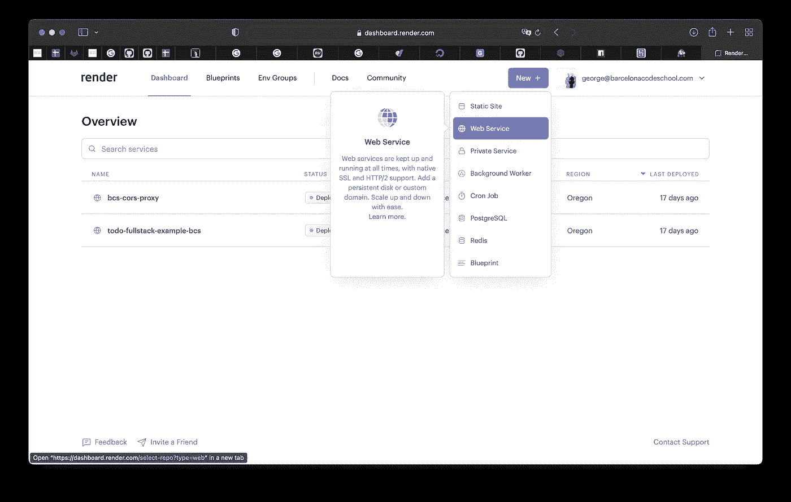
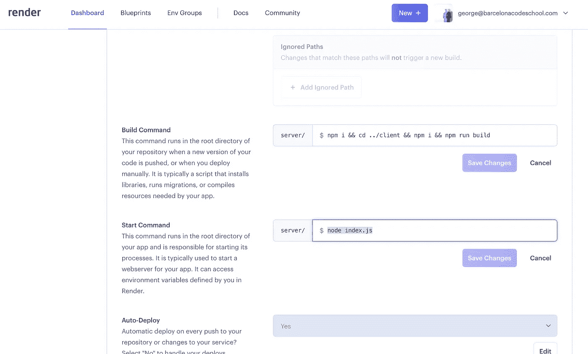
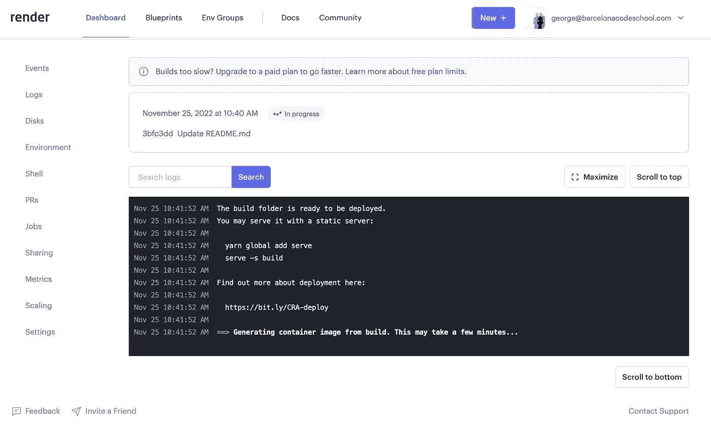
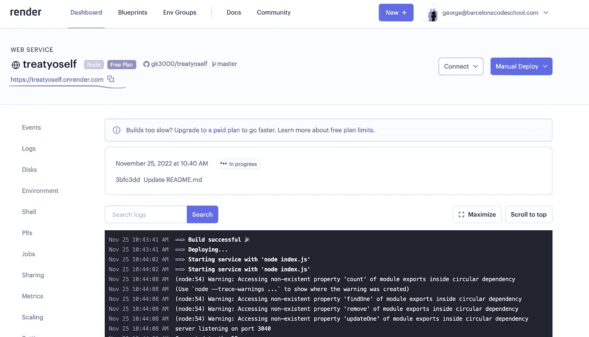

# 在 render.com 部署 MERN 全栈应用

> 原文：<https://javascript.plainenglish.io/deployment-of-mern-full-stack-app-on-render-com-f31820514b3a?source=collection_archive---------2----------------------->

随着最近 Heroku 的免费计划被否决，我们一直在寻找其他免费的替代方案，并找到了 Render.com。

让我们看看如何通过 Render.com 部署全栈 MERN 应用。

对于这篇文章，我们将假设我们的应用程序的结构如下:

```
root
        server
            index.js
            package.json
        client
            package.json
        package.json
```

`server`和`client`文件夹中的`package.json`文件分别管理服务器和客户端的包。在根文件夹中，我们需要另一个`package.json`文件来管理部署，类似于我们用 Heroku 🪦:处理它的方式

```
{
    "name": "nameofyourapp",
    "version": "1.0.0",
    "description": "some description",
    "main": "./server/index.js",
    "scripts": {
      "test": "echo \"Error: no test specified\" && exit 1",
      "start": "cd ./server && node index.js"
    },
    "engines": {
      "node": "16.x"
    },
    "keywords": [],
    "author": "",
    "license": "ISC",
    "dependencies": {
      "argon2": "^0.28.4",
      "cors": "^2.8.5",
      "dotenv": "^16.0.0",
      "express": "^4.17.2",
      "jsonwebtoken": "^8.5.1",
      "mongoose": "^6.2.1",
      "validator": "^13.7.0"
    }
  }
```

我们假设您的 express 服务器从`client/build`文件夹为客户的生产版本提供服务。

`"main"`键将拥有您的服务器的入口点文件的路径:

`"main": "./server/index.js",`

并且`start`脚本将执行命令进入`server`文件夹(从根目录)，安装软件包并启动主服务器的文件:

`"start": "cd ./server && node index.js"`

从 Render.com 的仪表板上点击“新建+”按钮，然后选择“Web 服务”。



通过链接到您的 GitHub 帐户并搜索 repo 的名称，连接到您想要使用的 GitHub 存储库。

一旦连接上，为这个项目提供一个名称，服务器所在的区域，选择你想要使用的分支，并指定根文件夹，如果服务器要为你的客户端的`build`服务，这个根文件夹应该是我们的`./server`。

构建命令可能是这样的:

```
npm i && cd ../client && npm i && npm run build
```

这意味着在我们的例子中，我们将从根文件夹(`/server`)安装服务器的所有包，然后转到`client`文件夹，安装包并创建一个生产版本。

对于开始命令，它可以是

```
node index.js
```

启动我们的服务器。



选择 free plan，并在页面底部用一个按钮创建项目。

等待渲染生成项目，下载文件并设置环境。



在页面顶部完成后，您将看到已部署应用程序的 URL。点击它检查是否一切顺利。



如果在构建过程中发生了什么，你会在日志中看到，修复错误，将代码推送到 GitHub，Render.com 会自动获取并重复回复尝试。

希望这有所帮助！

*更多内容请看*[***plain English . io***](https://plainenglish.io/)*。报名参加我们的* [***免费周报***](http://newsletter.plainenglish.io/) *。关注我们上*[***Twitter***](https://twitter.com/inPlainEngHQ)[***LinkedIn***](https://www.linkedin.com/company/inplainenglish/)*[***YouTube***](https://www.youtube.com/channel/UCtipWUghju290NWcn8jhyAw)**和* [***不和***](https://discord.gg/GtDtUAvyhW) *对成长黑客感兴趣？检查* [***电路***](https://circuit.ooo/) ***。*****