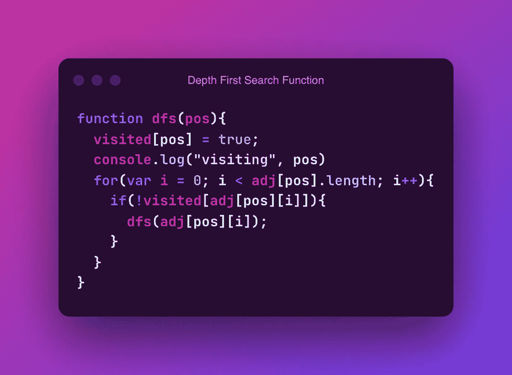

# JavaScript 中的深度优先搜索

> 原文：<https://javascript.plainenglish.io/depth-first-search-in-javascript-89b13fdc2d21?source=collection_archive---------7----------------------->

## 深度优先搜索的工作原理以及如何用 JavaScript 实现它


Photo by [Fotis Fotopoulos](https://unsplash.com/es/@ffstop?utm_source=unsplash&utm_medium=referral&utm_content=creditCopyText) on [Unsplash](https://unsplash.com/s/photos/programming?utm_source=unsplash&utm_medium=referral&utm_content=creditCopyText)

图搜索算法是竞争性编程和面试中常见问题的基础，并且经常在应用程序本身中使用。程序员可以使用几种算法来解决他们的特定问题，每种算法都有自己的实现和优点。本文将介绍深度优先搜索，也称为 DFS。DFS 是一种遍历图(或树)的递归算法。

深度优先搜索包括以下步骤:

1.  首先，当前节点被建立为已访问。可以使用各种数据结构，比如 HashMap 或二维数组，但是最常见和最直接的方法是使用一维数组。这是为了确保在循环图中，节点不会被重新访问。如果要重新访问节点，那么递归将永远继续下去。
2.  第二，遍历与当前节点相邻的每个点，只要它们以前没有被访问过。可以通过检查存储节点是否被访问过的数据结构来检查它们之前是否被访问过。有许多方法可以找到下一个要遍历的点。例如，可以迭代邻接矩阵，或者，如果图形是网格的形式，可以识别和遍历当前点周围的点。

运行深度优先搜索的时间复杂度是 O(节点+边)。时间复杂度是 O(节点+边)，因为每个顶点迭代一次，每个边迭代两次(尽管根据实现可以更少)。

根据 Brilliant.org 的说法，深度优先搜索的用途从拓扑排序到图中的循环检测，再到用单一解决方案解决难题。


Photo by [Richard Bell](https://unsplash.com/@maplerockdesign?utm_source=unsplash&utm_medium=referral&utm_content=creditCopyText) on [Unsplash](https://unsplash.com/s/photos/sudoku?utm_source=unsplash&utm_medium=referral&utm_content=creditCopyText)

当在树上实现深度优先搜索时，只要邻接数组不包括当前节点的父节点，就可以在不使用已访问数组的情况下实现，因为每个元素只能被访问一次。

让我们看看这个例子是如何在一个样本图上工作的:


Courtesy of visualgo.net

深度优先搜索和广度优先搜索一样，必须从单个节点开始。在这种情况下，节点将是节点 0。

1.  将 visited[0]设置为 true，因为当前正在访问节点 0
2.  穿过边缘。由于节点 1 没有被访问过，我们转到节点 1。
3.  我们将节点 1 设置为已访问。
4.  穿过边缘。这是一个有向图，下一条边是从 1 到 3，所以我们访问 3。
5.  我们将节点 3 设置为已访问。
6.  穿过边，我们访问节点 2 和节点 4
7.  我们将节点 2 设置为 visited，并遍历边，检查是否要转到节点 1，但是因为它已经被访问过了，所以无法访问
8.  我们访问节点 4 并将其设置为访问。

这在图表的其余部分继续进行。

要在 JavaScript 中实现这一点，首先需要定义一个被访问的数组。

```
var visited = new Array(nodeCount).fill(false);
```

然后，您需要为 DFS 定义一个函数，该函数将遍历一个点的边，检查连接到这些边的节点是否被访问，如果没有，则遍历它们。



现在，你必须在初始点上运行函数。

```
dfs(0);
```

总之，深度优先搜索是一种有用的算法，在竞争性编程问题中很流行，在现实生活中也有应用。在本教程中，我们回顾了深度优先搜索的步骤，并完成了一个 JavaScript 实现。

*更多内容请看*[***plain English . io***](https://plainenglish.io/)*。报名参加我们的* [***免费周报***](http://newsletter.plainenglish.io/) *。关注我们关于*[***Twitter***](https://twitter.com/inPlainEngHQ)[***LinkedIn***](https://www.linkedin.com/company/inplainenglish/)*[***YouTube***](https://www.youtube.com/channel/UCtipWUghju290NWcn8jhyAw)*[***不和***](https://discord.gg/GtDtUAvyhW) *。对增长黑客感兴趣？检查* [***电路***](https://circuit.ooo/) *。***