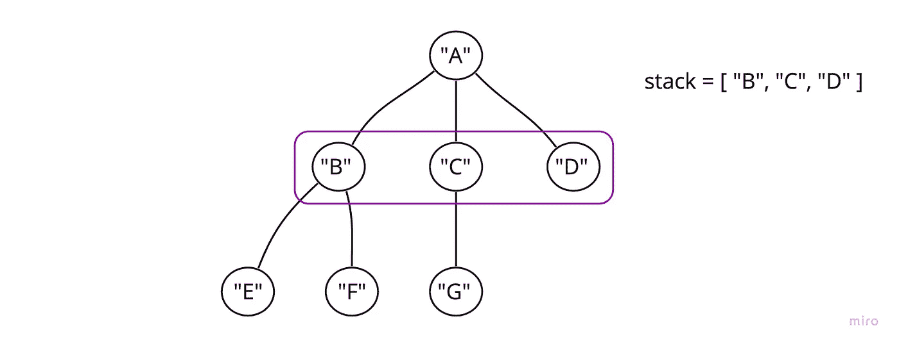

# 深度优先树遍历

> 原文：<https://javascript.plainenglish.io/depth-first-tree-traversal-93fa02da2f1f?source=collection_archive---------14----------------------->

## 这篇文章将涉及一个相当简单的算法专家问题——“深度优先搜索”

这篇文章将涉及一个相当简单的算法专家问题——“深度优先搜索”。

乍一看，我误以为这是一个 BST 深度优先搜索问题，但幸运的是，在开始之前，我注意到这是一个树遍历。

我对树很感兴趣，因为它们不像二叉树那样简单，但不知何故，它们看起来更直观。虽然这可能是因为我通常在二叉树中使用递归，在树中使用迭代。

帮助我回忆如何处理树或图遍历的是，深度优先搜索通常利用堆栈，而广度优先搜索利用队列。

**想清楚**

那么栈到底为什么要帮我遍历这个呢？

让我们一步一步来看。

我从根(“A”)开始，所以我将把它的孩子添加到堆栈中。

现在，我将通过从堆栈中弹出来移动到下一个节点。

现在将它的子元素添加到堆栈中。

现在我将访问“E”和“F”，同时弹出它们。

从这里很容易看出这是如何完成的，以及为什么栈如此适合深度优先搜索。LIFO(后进先出)过程自然会优先考虑深度。

**实施:**

在 AlgoExpert 上，我们将得到一个实现 DFS 方法的节点类。

我将给出我的完整解决方案(非常简单易懂),而不是分解这个过程。

我们返回的数组(如问题所指定的)将以正确的深度优先顺序包含所有节点名。

这一次就这样了！

虽然这是一个相对简单的问题，但我仍然喜欢花时间来强化该方法的应用。简单的遍历是许多其他更复杂问题的基础，深刻理解这些似乎是一个好主意。

*更多内容看* [***说白了就是***](https://plainenglish.io/) *。报名参加我们的* [***免费周报***](http://newsletter.plainenglish.io/) *。关注我们关于* [***推特***](https://twitter.com/inPlainEngHQ)[***领英***](https://www.linkedin.com/company/inplainenglish/)*和**[***不和***](https://discord.gg/GtDtUAvyhW) *。**