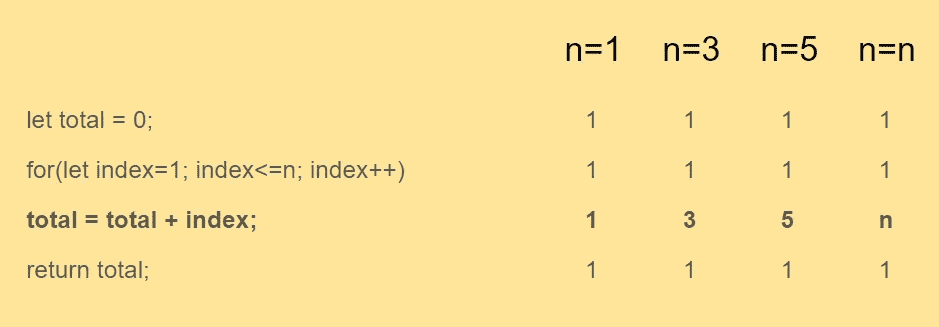
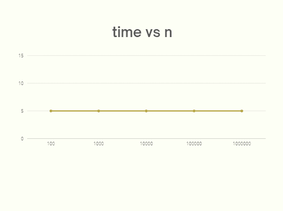
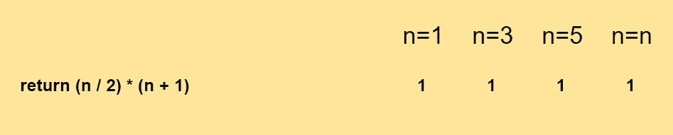

# 使用渐近分析导出常数时间复杂度 O(1)

> 原文：<https://javascript.plainenglish.io/derive-constant-time-complexity-o-1-using-asymptotic-analysis-e786df20fc7b?source=collection_archive---------6----------------------->

## JavaScript 算法基础第三部分:**计算常数时间复杂度**并找出如何导出 **O(1)**


Photo by [Markus Spiske](https://unsplash.com/@markusspiske?utm_source=medium&utm_medium=referral) on [Unsplash](https://unsplash.com?utm_source=medium&utm_medium=referral)

在上一篇文章中，我们了解了如何使用**渐近分析**来**推导算法的时间复杂度/大 O** 。并且，这种技术似乎是最可靠和最标准的方法**来推导任何算法的时间复杂度**。如果你还没有读过上一篇文章，这里有它的链接。

[推导算法的时间复杂度/大 O](https://medium.com/@code.ceeker/basics-of-javascript-algorithms-part-2-a1b5a3ffcb71)

现在，既然我们知道如何使用**渐近分析**来推导算法的**大 O** ，那么让我们使用这些知识来**计算恒定时间复杂度**并看看 **O(1)** 是如何推导出来的。让我们首先定义需要找到**最佳算法**的例题，并推导出它的**大 O** 。

## **例题**

编写一个函数，将一个数字作为输入，然后将所有数字相加得到该数字。举个例子，

如果输入是 3，那么我们应该得到结果 6(即 3+2+1)。同样，如果我们提供的输入为 5，那么我们应该得到的结果为 15(即 5 + 4 + 3 + 2 + 1)。

***请注意*** *，下面的函数不是一个常数时间算法，如果你想跳过这一部分那么你可以到"* ***【导出常数时间复杂度】*** *一节中进一步阐述。*

## **功能**

好了，下面是对上述问题最明显最简单的解决方法。

```
**function sum(n) {
  let total = 0;
  for(let index = 1; index <= n; index++) {
    total = total + index;
  }
  return total;
}**
```

上面的函数很好地解决了我们定义的问题，而且很容易理解。因此，如果我们将 **n** 作为 **3** 和 **5** 传递，它将分别产生结果 **6** 和 **15** ，这是预期的输出。现在，让我们找出它的时间复杂度。

为了找到时间复杂度，第一步**是定义函数。因此，我们将测试值为 **n = 1、n = 3 和 n = 5** 的函数。根据**渐近分析**，我们将**遍历我们代码**中的每个表达式，并且**找出它将执行**多少次。**



正如我们在上面的输出中看到的，对于给定的 **n** 值，for 循环内部的表达式执行 **n** 次。

因此，我们得到了上述函数的模式。让我们推导出数学方程式。

把时间看成 **T** 。寻找 **n** 输入的方程式:

```
**T = First Expression + Second Expression + Third Expression + Fourth Expression       // number of time each expression is executed****For n = 1,**
T = 1 + 1 + **1** + 1**For n = 3,**
T = 1 + 1 + **3** + 1**For n = 5,**
T = 1 + 1 + **5** + 1**Therefore, for n = n,**
T = 1 + 1 + **n** + 1
```

将所有常数相加，我们得到:

```
**T = n + 3**
```

因此，我们得到了我们的等式，即 **T = n + 3** 。我们知道，我们不必考虑方程中的具体值，所以我们可以忽略方程中的常数值。并且，我们得到:

```
T = **n** 
  = **O(n)**
```

这是一个线性方程。但是等等，我们在寻找常数 **O(1)** 的时间复杂度，这似乎不是上述解决方案的情况。如果我们看到增长最快的项，在这种情况下是 **n** ，那么上面的等式似乎是正确的。

但是，作为一名程序员，我们知道一个问题可以有多个解决方案。上述案例是上述问题的解决方案之一。这意味着我们可以找到更多的解决方案，它可以有一个**恒定的时间复杂度**或者可能又是一个**线性复杂度**或者更糟，一个不同的复杂度**既不是线性的也不是恒定的**。所以，让我们找到另一个解决方案。

## **导出常数时间复杂度**

对于恒定的时间复杂度， ***输入的数量不影响算法花费的时间*** 。所以在我们的例子中，不管 n 的值是多少，也就是说，1，3，5，T31。函数中的表达式将总是执行相同的次数。



## **功能**

看起来我们确实有一个不同的解决方案来解决上面的问题，它不使用循环。有一个**数学公式**，我们可以应用它来得到所需的结果。数学公式是什么？

```
For a given **n**, **F = (n / 2) * (1 + n)**
```

让我们用 n = 3 来测试一下。

```
F = (3/2) * (1 + 3)
  = (1.5) * (4)
  = **6**
```

所以，是的，我们可以看到上面的公式在解决我们的问题。如果我们把它转换成 JavaScript 代码。它看起来会像这样。

```
function sum(n) {
  **return (n/2) * (n+1);**
}
```

现在，让我们找出表达式执行的次数，以确定代码运行的频率。



它将运行一次，不管我们作为输入传递什么值，因为这里没有循环。因此，我们可以将函数方程写成:

```
**T = 1 
  = O(1)**
```

在我们的函数中没有运行 **(n)** 次的表达式，因此我们没有任何增长最快的术语。因此，我们得到了我们的**大 O** 的函数为 **O(1)** 。那就是**恒定时间复杂度**。这就是我们如何得到一个常数时间。类似地，使用**渐近分析**的相同方法，我们可以导出任何算法的**时间复杂度。**

感谢您的阅读。

*更多内容看* [***说白了。报名参加我们的***](https://plainenglish.io/) **[***免费周报***](http://newsletter.plainenglish.io/) *。关注我们关于* [***推特***](https://twitter.com/inPlainEngHQ) ，[***LinkedIn***](https://www.linkedin.com/company/inplainenglish/)*，*[***YouTube***](https://www.youtube.com/channel/UCtipWUghju290NWcn8jhyAw)*，以及* [***不和***](https://discord.gg/GtDtUAvyhW) *。对增长黑客感兴趣？检查出* [***电路***](https://circuit.ooo/) *。***