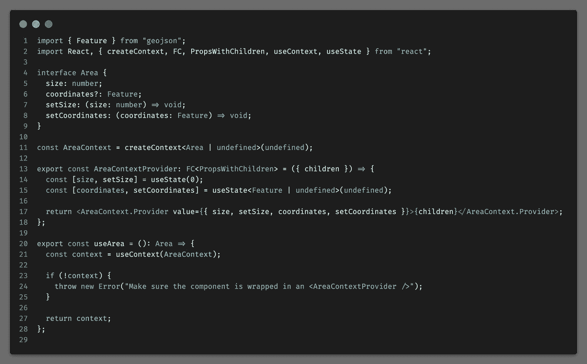

# 在 React 中设计更好的上下文

> 原文：<https://javascript.plainenglish.io/design-better-contexts-in-react-a405f13b4329?source=collection_archive---------5----------------------->

在 React 的生态系统中，上下文是一个强大的工具。它们被广泛用于跨组件树共享数据，而不需要将数据作为道具传递给每个组件。

从我使用各种代码库的经验来看，有些上下文设计错误，容易违反一致性模式。设计不一致的单元会导致用户通常不应该遇到的死角，或者在单元不应该支持的情况下导致单元的误用。

# 可改善环境的示例

这个例子实现了一种情况，可以在地图上画出一个区域，并计算出该区域的大小。该区域的大小和坐标在整个应用程序的多个组件中使用。我们决定将这些值存储在一个上下文中，使它们可以被访问。

上下文的第一个实现如下所示:

在这里，我们存储了面积和几个值，使这些值可以被`AreaContextProvider`的所有子节点访问。上下文还提供了操纵这些值的设置器。

我们通过实现一个自定义钩子来限制对上下文的访问，如果没有定义上下文，就会抛出一个错误。因为上下文本身不是从这个文件中导出的，并且我们的自定义提供程序总是创建一个上下文值，所以我们可以假设，如果上下文没有在钩子中定义，它就没有被正确地包装在上下文提供程序中。

上下文的值在`Map`组件中被修改，如下所示:

当在地图上绘制区域时，该组件接收一个事件，更新上下文中的坐标，并重新计算区域的大小。

## 实现有什么问题？

上下文为所有属性公开了一个 setter，因此为破坏数据的一致性打开了空间。

setters 也可以在整个应用程序中使用，并可能在其他地方用于即将到来的特性。随着应用程序的增长，开发人员可能会忘记保持所有值的同步。

例如，如果应该有一个新的特征来变形该区域，如果我们只是更新坐标而忘记重新计算大小，我们可能会产生不一致的状态。

通过将逻辑分布在几个地方，代码变得更难测试。我们不能创建一个小的内聚单元来测试该区域的功能。

# 让我们改进它

最好将逻辑集中在上下文中的区域周围，并且只暴露我们有意留下来进行更改的字段。

## 从重新安排测试开始

为了找到我们想要支持的案例，我们可以开始为上下文编写测试，并找出接口应该如何与应用程序的其余部分很好地交互。

编写测试当然是迭代发生的，但我将分享最终结果，以保持简短，因为本文并不主要关注编写测试。

这些是上下文需要支持的情况。

在这个过程中，我们首先重构了接口，并编写了创建和删除测试。这些案例已经得到了原始上下文的支持，只是由于接口的变化而需要进行重组。

面积计算应该添加到上下文中，因此这需要一个测试用例来支持，因为这对于面积实体的一致性是必要的。

我们已经知道，计算面积的方法已经从 react 代码中提取出来并进行了深入测试，因此我们编写了一个基本的集成级测试，以验证大小计算正确，并通过钩子公开。

## 最终的实现

*(接口和内部变量的命名仍有改进的潜力，但本文足以展示结构上的变化。)*

在这次重构中，我们将与区域相关的逻辑移得更近了。应用程序的其余部分可以通过清晰易懂的接口与逻辑进行交互。

区域的数据类型被分解为必要的值`coordinates`和`size`，因为如果我们有一个区域，我们需要这两个值。如果我们没有一个区域，整个物体可以是`undefined`。

方法名已经从简单的 setters 重新命名为对所支持用例的更加自文档化的描述。它应该可以稍微提高消费者代码的可读性(在我们的例子中是地图组件)。

新的上下文被关闭以进行修改，因此确保了数据的一致性。

应用程序的其他部分不需要知道面积是如何计算的，值是如何存储的。因为我们与干净的接口交互，所以很容易模仿钩子，并为需要与区域上下文交互的组件设计干净的测试。

我们现在可以轻松地更改上下文的实现，而不需要更改其他组件。例如，如果我们想直接将数据存储在一个 API 中，并在那里计算数据的大小，就可能会发生这种情况。

# 向右切分上下文

在上面的例子中，上下文的职责只是处理与区域的交互。

这是在应用程序的当前状态下，我们在一个上下文中可以想到的最小责任单位。上下文处理单个实体并确保其一致性。

围绕其他实体或其他功能的交互可能与该领域相关，但不会违反其一致性，可能应该在单独的上下文中实现。

如果上下文变得太大，试图覆盖太多的职责，它们将变得不可维护(软件的每个单元都是如此)。

# 包裹

上下文是状态管理库(如 redux)的常见替代品。在数据和逻辑密集型应用程序中，如果不谨慎设计，React 上下文往往会快速增长，并且变得更难维护。

注意可以修改应用程序状态的接口。公开 setters 时要小心，因为它们的公开包含产生数据一致性冲突的风险。

当考虑将哪些实体放在一个上下文中时，要有责任感。留意你的上下文的增长，如果必要的话，把它们分开。

每个软件的可维护性是通过管理软件单元的耦合和内聚来控制的。

*更多内容请看*[***plain English . io***](https://plainenglish.io/)*。报名参加我们的* [***免费周报***](http://newsletter.plainenglish.io/) *。关注我们关于*[***Twitter***](https://twitter.com/inPlainEngHQ)[***LinkedIn***](https://www.linkedin.com/company/inplainenglish/)*[***YouTube***](https://www.youtube.com/channel/UCtipWUghju290NWcn8jhyAw)*[***不和***](https://discord.gg/GtDtUAvyhW) *。对增长黑客感兴趣？检查* [***电路***](https://circuit.ooo/) *。***