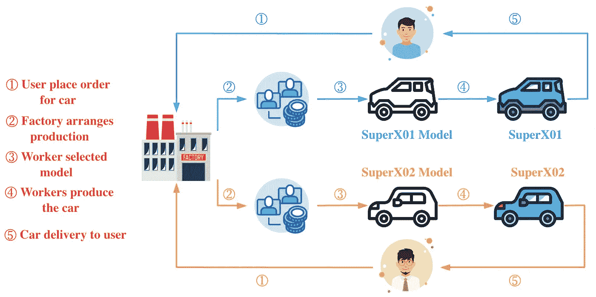
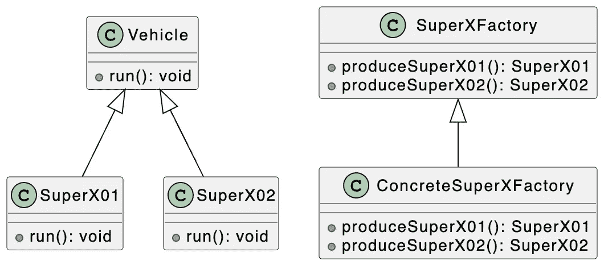
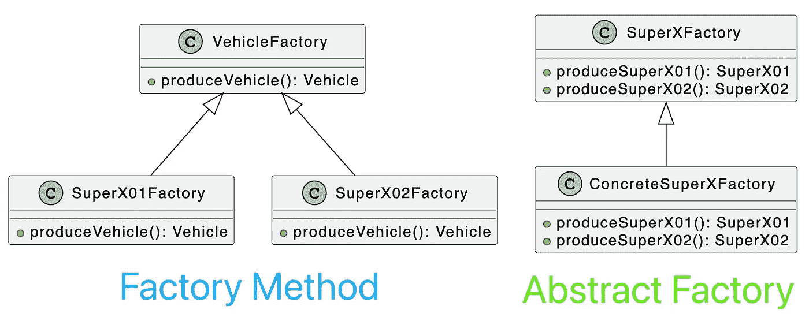

# 设计模式:TypeScript 中的抽象工厂模式

> 原文：<https://javascript.plainenglish.io/design-patterns-abstract-factory-pattern-in-typescript-84cd7b002964?source=collection_archive---------4----------------------->

## 掌握抽象工厂模式，轻松处理对象的创建。


Photo by [amin khorsand](https://unsplash.com/@hero92?utm_source=medium&utm_medium=referral) on [Unsplash](https://unsplash.com?utm_source=medium&utm_medium=referral)

欢迎来到 TypeScript 系列的**设计模式，该系列介绍了一些使用 TypeScript 进行 web 开发时有用的设计模式。**

以前的文章如下:

*   [打字稿中的策略模式](/design-patterns-strategy-pattern-in-typescript-54eda9b40f09)
*   [打字稿中的责任链模式](/design-patterns-chain-of-responsibility-pattern-in-typescript-dba6bdffe456)
*   [打字稿中的观察者模式](/design-patterns-observer-pattern-in-typescript-f6589f1ce4fc)
*   [TypeScript 中的模板方法模式](/design-patterns-template-method-pattern-in-typescript-ce0c8b158985)
*   [类型脚本中的适配器模式](/design-patterns-adapter-pattern-in-typescript-4b7ad3c1c234)
*   [TypeScript 中的工厂方法模式](/design-patterns-factory-method-pattern-in-typescript-c4c3047a6289)
*   [在 TypeScript 中抽象工厂模式](/design-patterns-abstract-factory-pattern-in-typescript-84cd7b002964)

设计模式对于 web 开发人员来说非常重要，通过掌握它们我们可以写出更好的代码。在本文中，我将使用**类型脚本**来介绍**抽象工厂模式。**

抽象工厂模式提供了一个接口，用于创建一系列相关或相互依赖的对象，而无需指定它们的具体类。

在 [**工厂方法模式**](/design-patterns-factory-method-pattern-in-typescript-c4c3047a6289) 中，特定的工厂负责生产特定的产品，每个特定的工厂对应一个特定的产品，工厂方法也是唯一的。一般来说，一个特定的工厂只有一个工厂方法或者一组重载的工厂方法。但有时我们需要一个能供应多种产品的工厂，而不是单一产品。



上图中，我模拟了用户的购车流程。Bytefer 向 SuperX 工厂订购了 SuperX01，工厂按照 SuperX01 对应的型号进行生产，生产完成后交付给 bytefer。Chris1993 向同一个 SuperX 工厂订购 SuperX02，工厂按照 SuperX02 对应的型号生产，生产完成后交付 chris1993。

让我们看看如何使用**抽象工厂**来描述车辆工厂生产给定型号汽车的过程。

为了更好地理解下面的代码，我们先来看看相应的 UML 图:



抽象工厂模式包括以下角色:

*   **产品(车辆)**:抽象产品
*   **混凝土产品(SuperX01)** :混凝土产品
*   **工厂(SuperXFactory)** :抽象工厂
*   **混凝土工厂(ConcreteSuperXFactory):** 混凝土工厂

接下来，我们定义一个抽象类`Vehicle`及其两个子类`SuperX01`和`SuperX02`来表示不同类型的车辆。

```
abstract class Vehicle {
  abstract run(): void;
}class SuperX01 extends Vehicle {
  run(): void {
    console.log("SuperX01 start");
  }
}class SuperX02 extends Vehicle {
  run(): void {
    console.log("SuperX02 start");
  }
}
```

然后，我们定义`SuperXFactory`类来表示车辆工厂。这个抽象工厂包含用于生产 SuperX01 和 SuperX02 模型车辆的抽象方法。

```
abstract class SuperXFactory {
  abstract produceSuperX01(): SuperX01;
  abstract produceSuperX02(): SuperX02;
}
```

基于`SuperXFactory`抽象类，我们定义`ConcreteSuperXFactory`工厂类用于生产 **SuperX01** 和 **SuperX02** 车型:

```
class ConcreteSuperXFactory extends SuperXFactory {
  produceSuperX01(): SuperX01 {
    return new SuperX01();
  } produceSuperX02(): SuperX02 {
    return new SuperX02();
  }
}
```

创建`ConcreteSuperXFactory`工厂类别后，我们可以开始生产车辆:

```
const superXFactory = new ConcreteSuperXFactory();const superX01 = superXFactory.produceSuperX01();
const superX02 = superXFactory.produceSuperX02();superX01.run();
superX02.run();
```

当您成功运行上述代码时，终端将输出以下结果:

```
SuperX01 start
SuperX02 start
```

我们在上一篇文章中已经介绍了 [**工厂方法模式**](/design-patterns-factory-method-pattern-in-typescript-c4c3047a6289) ，那么它和抽象工厂模式有什么区别呢？

抽象工厂模式与 [**工厂方法模式**](/design-patterns-factory-method-pattern-in-typescript-c4c3047a6289) 最大的区别在于**工厂方法模式针对的是一个产品层次结构，而抽象工厂模式需要面对多个产品层次结构，一个工厂层次结构可以负责多个不同的产品层次结构。**



产品对象的创建。当工厂层次结构可以创建属于不同产品层次结构的产品系列中的所有对象时，抽象工厂模式比工厂方法模式更简单、更有效。

如果你有任何问题，请随时给我留言。稍后我会继续介绍其他模式，如果你有兴趣，可以在 [Medium](https://medium.com/@bytefer) 或者 [Twitter](https://twitter.com/Tbytefer) 上关注我。

如果你想学习打字，那么不要错过**掌握打字**系列。

*   [**TypeScript 泛型中的 K、T、V 是什么？**](https://medium.com/frontend-canteen/what-are-k-t-and-v-in-typescript-generics-9fabe1d0f0f3)
*   [**使用 TypeScript 像 Pro 一样映射类型**](/using-typescript-mapped-types-like-a-pro-be10aef5511a)
*   [**使用 TypeScript 条件类型像亲**](/use-typescript-conditional-types-like-a-pro-7baea0ad05c5)
*   [**使用 TypeScript 交集类型像亲**](/using-typescript-intersection-types-like-a-pro-a55da6a6a5f7)
*   [**使用打字稿推断像亲**](https://levelup.gitconnected.com/using-typescript-infer-like-a-pro-f30ab8ab41c7)
*   [**使用 TypeScript 模板字面类型像亲**](https://medium.com/javascript-in-plain-english/how-to-use-typescript-template-literal-types-like-a-pro-2e02a7db0bac)
*   [**可视化打字稿:15 种最常用的实用类型**](/15-utility-types-that-every-typescript-developer-should-know-6cf121d4047c)
*   [**关于类型脚本类你需要知道的 10 件事**](https://levelup.gitconnected.com/10-things-you-need-to-know-about-typescript-classes-f58c57869266)
*   [](/purpose-of-declare-keyword-in-typescript-8431d9db2b10)**中‘declare’关键字的用途**
*   **[**不再混淆打字稿的‘任何’和‘未知’**](/no-more-confusion-about-typescripts-any-and-unknown-98c4b53f8924)**

**

[Bytefer](https://medium.com/@bytefer?source=post_page-----84cd7b002964--------------------------------)** 

## **掌握打字稿系列**

**[View list](https://medium.com/@bytefer/list/mastering-typescript-series-688ee7c12807?source=post_page-----84cd7b002964--------------------------------)****47 stories**************

***更多内容请看*[***plain English . io***](https://plainenglish.io/)*。报名参加我们的* [***免费周报***](http://newsletter.plainenglish.io/) *。关注我们关于*[***Twitter***](https://twitter.com/inPlainEngHQ)[***LinkedIn***](https://www.linkedin.com/company/inplainenglish/)*[***YouTube***](https://www.youtube.com/channel/UCtipWUghju290NWcn8jhyAw)*[***不和***](https://discord.gg/GtDtUAvyhW) *。对增长黑客感兴趣？检查* [***电路***](https://circuit.ooo/) *。*****