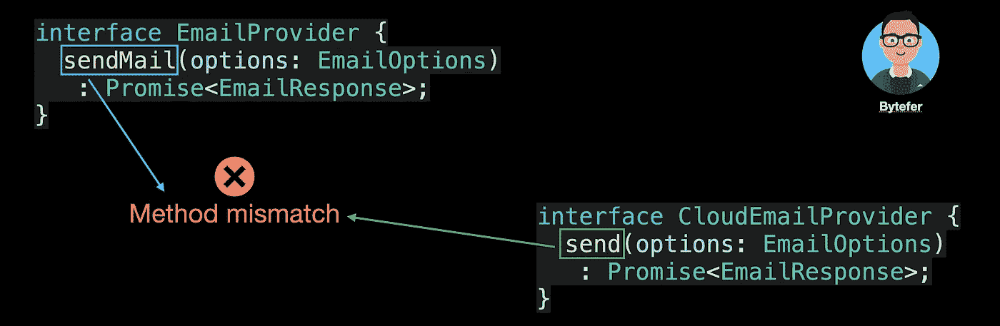

# 设计模式:TypeScript 中的适配器模式

> 原文：<https://javascript.plainenglish.io/design-patterns-adapter-pattern-in-typescript-4b7ad3c1c234?source=collection_archive---------0----------------------->

## 使用适配器模式轻松解决接口不兼容问题


Photo by [Call Me Fred](https://unsplash.com/@callmefred?utm_source=medium&utm_medium=referral) on [Unsplash](https://unsplash.com?utm_source=medium&utm_medium=referral)

欢迎来到 TypeScript 系列的**设计模式，这里介绍了一些使用 TypeScript 进行 web 开发时有用的设计模式。**

以前的文章如下:

*   [打字稿中的策略模式](/design-patterns-strategy-pattern-in-typescript-54eda9b40f09)
*   [打字稿中的责任链模式](/design-patterns-chain-of-responsibility-pattern-in-typescript-dba6bdffe456)
*   [打字稿中的观察者模式](/design-patterns-observer-pattern-in-typescript-f6589f1ce4fc)
*   [TypeScript 中的模板方法模式](/design-patterns-template-method-pattern-in-typescript-ce0c8b158985)
*   [类型脚本中的适配器模式](/design-patterns-adapter-pattern-in-typescript-4b7ad3c1c234)
*   [TypeScript 中的工厂方法模式](/design-patterns-factory-method-pattern-in-typescript-c4c3047a6289)
*   [在 TypeScript 中抽象工厂模式](/design-patterns-abstract-factory-pattern-in-typescript-84cd7b002964)

设计模式对于 web 开发人员来说非常重要，通过掌握它们我们可以写出更好的代码。在本文中，我将使用**类型脚本**来介绍**适配器模式。**

在 web 系统中，邮件服务是一种非常常用的服务。在 Node.js 平台上，我们可以使用一个 [nodemailer](https://github.com/nodemailer/nodemailer) 模块轻松实现发送邮件的功能。成功安装[节点邮件](https://github.com/nodemailer/nodemailer)模块后，您可以按照以下步骤发送邮件:

```
let transporter = nodemailer.createTransport(transport[, defaults]);
transporter.sendMail(data[, callback])
```

为了避免将邮件服务绑定到特定的服务提供者，在开发邮件服务之前，我们首先定义与邮件提供者相关的接口:

```
interface EmailProvider {
  sendMail(options: EmailOptions): Promise<EmailResponse>;
}interface EmailOptions {
  to: string | string[];
  subject: string;
  html: string;
  from?: string;
  text?: string;
}interface EmailResponse {}
```

有了这些接口，我们可以轻松地创建邮件服务:

```
class EmailService {
  constructor(public emailProvider: EmailProvider) {} async sendMail(options: EmailOptions): Promise<EmailResponse> {
    const result = await this.emailProvider.sendMail(options);
    return result;
  }
}
```

目前这个方案问题不大，但是如果有一天我们需要使用第三方邮箱云服务提供商。如**发送栅格**或**发送器**等。你会发现 SDK 用来发送邮件的方法的名字是`send`。所以我们继续定义一个`CloudEmailProvider`接口:

```
interface CloudEmailProvider {
  send(options: EmailOptions): Promise<EmailResponse>;
}
```

对比之前定义的`EmailProvider`界面，你会发现以下问题:



所以不能直接使用`EmailService`访问第三方邮箱云服务。要解决这个问题，有很多方法。让我们来介绍一下如何使用适配器模式来解决上述问题。

适配器模式的目的是允许两个由于接口不匹配而无法一起工作的对象一起工作。它就像胶水一样，将不同的东西转化，使它们能够一起工作。

适配器模式包含以下角色:

*   **客户端(EmailService)** :需要使用目标接口的对象；
*   **目标(EmailProvider)** :定义客户端期望的接口；
*   **Adapter(CloudEmailAdapter)**:将 Adaptee 接口适配到目标接口；
*   **Adaptee(CloudEmailProvider)**:定义需要适配的接口。

在了解了适配器模式之后，让我们创建`CloudEmailAdapter`类:

```
class CloudEmailAdapter implements EmailProvider {
  constructor(public emailProvider: CloudEmailProvider) {} async sendMail(options: EmailOptions): Promise<EmailResponse> {
    const result = this.emailProvider.send(options);
    return result;
  }
}
```

在上面的代码中，因为`EmailProvider`和`CloudEmailProvider`两个接口不匹配，所以我们引入了`CloudEmailAdapter`类来解决兼容性问题。

接下来，我们以 sendgrid 为例实现一个`SendgridEmailProvider`:

```
import { MailService } from "[@sendgrid/mail](http://twitter.com/sendgrid/mail)";class SendgridEmailProvider implements CloudEmailProvider {
  private sendgridMail: MailService; constructor(
    private config: {
      apiKey: string;
      from: string;
    }
  ) {
    this.sendgridMail = new MailService();
    this.sendgridMail.setApiKey(this.config.apiKey);
  } async send(options: EmailOptions): Promise<EmailResponse> {
    const result = await this.sendgridMail.send(options);
    return result;
  }
}
```

*提示:以上代码仅供演示，在实际项目中使用时需要做相应调整。*

既然已经定义了`SendgridEmailProvider`和`CloudEmailAdapter`类，让我们看看如何使用它们:

```
const sendgridMail = new SendgridEmailProvider({
  apiKey: "******",
  from: "[bytefer@gmail.com](mailto:bytefer@gmail.com)",
});const cloudEmailAdapter = new CloudEmailAdapter(sendgridMail);
const emailService = new EmailService(cloudEmailAdapter);emailService.sendMail({
  to: "******",
  subject: "Adapter Design Pattern",
  html: "<h3>Adapter Design Pattern</h3>",
  from: "[bytefer@gmail.com](mailto:bytefer@gmail.com)",
});
```

最后，让我们总结一下适配器模式的使用场景:

*   系统需要使用一个已有的类，而这个类的接口不符合系统的需要，即接口不兼容；
*   使用第三方提供的服务，但是服务接口定义和自己需要的接口定义不一样。

如果你有任何问题，请随时给我留言。稍后我会继续介绍其他模式，如果你有兴趣，可以在 [Medium](https://medium.com/@bytefer) 或 [Twitter](https://twitter.com/Tbytefer) 上关注我。

如果你想学习打字稿，那么就不要错过**掌握打字稿**系列。

*   [**TypeScript 泛型中的 K、T、V 是什么？**](https://medium.com/frontend-canteen/what-are-k-t-and-v-in-typescript-generics-9fabe1d0f0f3)
*   [**使用 TypeScript 像临一样映射类型**](/using-typescript-mapped-types-like-a-pro-be10aef5511a)
*   [**使用 TypeScript 条件类型像亲**](/use-typescript-conditional-types-like-a-pro-7baea0ad05c5)
*   [**使用 TypeScript 交集类型像亲**](/using-typescript-intersection-types-like-a-pro-a55da6a6a5f7)
*   [**使用打字稿像专家一样推断**](https://levelup.gitconnected.com/using-typescript-infer-like-a-pro-f30ab8ab41c7)
*   [**使用 TypeScript 模板字面类型像亲**](https://medium.com/javascript-in-plain-english/how-to-use-typescript-template-literal-types-like-a-pro-2e02a7db0bac)
*   [**打字稿可视化:15 种最常用的实用类型**](/15-utility-types-that-every-typescript-developer-should-know-6cf121d4047c)
*   [**关于打字稿类你需要知道的 10 件事**](https://levelup.gitconnected.com/10-things-you-need-to-know-about-typescript-classes-f58c57869266)
*   [**TypeScript 中‘declare’关键字的用途**](/purpose-of-declare-keyword-in-typescript-8431d9db2b10)
*   [**不再混淆打字稿的“任何”和“未知”**](/no-more-confusion-about-typescripts-any-and-unknown-98c4b53f8924)


[Bytefer](https://medium.com/@bytefer?source=post_page-----4b7ad3c1c234--------------------------------)

## 掌握打字稿系列

[View list](https://medium.com/@bytefer/list/mastering-typescript-series-688ee7c12807?source=post_page-----4b7ad3c1c234--------------------------------)47 stories

*更多内容请看*[***plain English . io***](https://plainenglish.io/)*。报名参加我们的* [***免费周报***](http://newsletter.plainenglish.io/) *。关注我们关于*[***Twitter***](https://twitter.com/inPlainEngHQ)[***LinkedIn***](https://www.linkedin.com/company/inplainenglish/)*[***YouTube***](https://www.youtube.com/channel/UCtipWUghju290NWcn8jhyAw)*[***不和***](https://discord.gg/GtDtUAvyhW) *。对增长黑客感兴趣？检查* [***电路***](https://circuit.ooo/) *。***