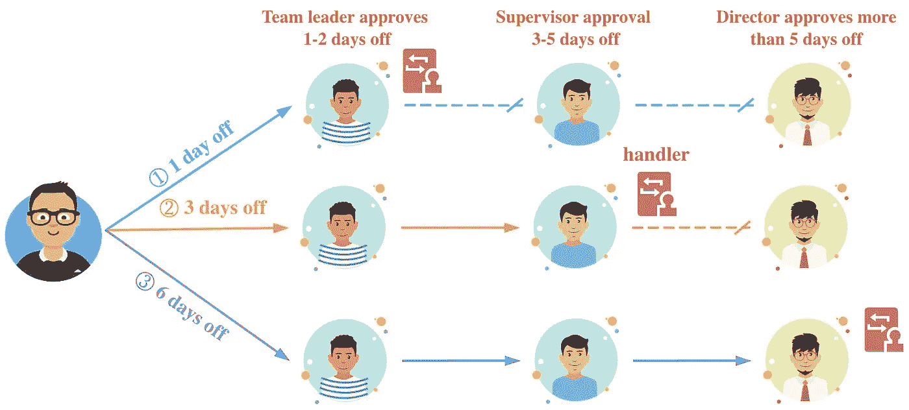
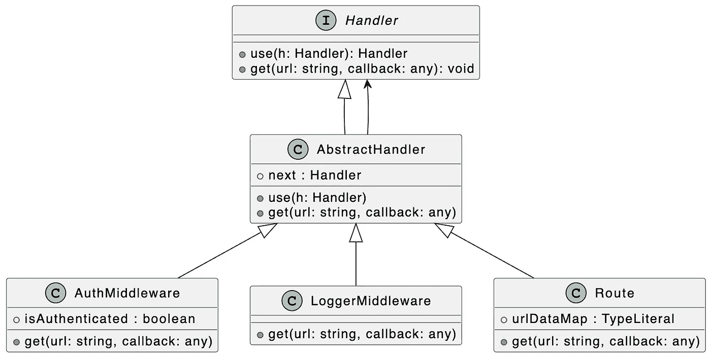
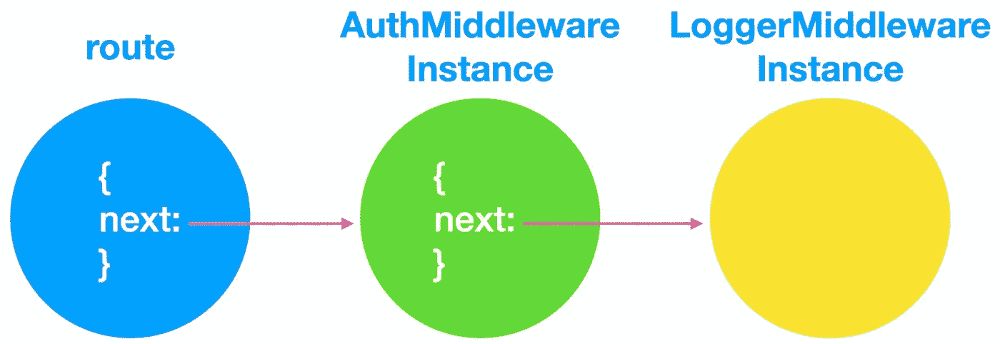
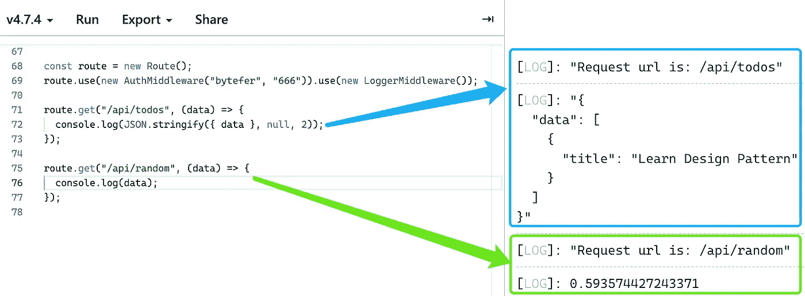

# 设计模式:TypeScript 中的责任链模式

> 原文：<https://javascript.plainenglish.io/design-patterns-chain-of-responsibility-pattern-in-typescript-dba6bdffe456?source=collection_archive---------2----------------------->


Photo by [Mike Alonzo](https://unsplash.com/es/@mikezo?utm_source=medium&utm_medium=referral) on [Unsplash](https://unsplash.com?utm_source=medium&utm_medium=referral)

欢迎来到 TypeScript 系列的**设计模式，该系列介绍了一些使用 TypeScript 进行 web 开发时有用的设计模式。**

以前的文章如下:

*   [打字稿中的策略模式](/design-patterns-strategy-pattern-in-typescript-54eda9b40f09)
*   [打字稿中的责任链模式](/design-patterns-chain-of-responsibility-pattern-in-typescript-dba6bdffe456)
*   [打字稿中的观察者模式](/design-patterns-observer-pattern-in-typescript-f6589f1ce4fc)
*   [TypeScript 中的模板方法模式](/design-patterns-template-method-pattern-in-typescript-ce0c8b158985)
*   [类型脚本中的适配器模式](/design-patterns-adapter-pattern-in-typescript-4b7ad3c1c234)
*   [TypeScript 中的工厂方法模式](/design-patterns-factory-method-pattern-in-typescript-c4c3047a6289)
*   [在 TypeScript 中抽象工厂模式](/design-patterns-abstract-factory-pattern-in-typescript-84cd7b002964)

设计模式对于 web 开发人员来说非常重要，通过掌握它们我们可以写出更好的代码。在本文中，我将使用**类型脚本**来介绍**责任模式链**。

责任链模式是一种通过给多个对象处理请求的机会来避免请求的发送者和接收者之间耦合的方法。在责任链模式中，许多对象通过从一个对象到下一个对象的引用连接起来，形成一个链。请求沿着链传递，直到链中的一个对象决定处理请求。



公司不同的岗位有不同的责任和权限。以我们公司的请假流程为例，我请假一天，只需要组长批准，不需要转给主管和总监。如果责任链中的一个环节不能处理当前请求，如果有下一个环节，请求将被转发到下一个环节进行处理。

在软件开发过程中，对于责任链来说，一个常见的应用场景就是中间件。让我们看看如何使用责任链来处理请求。

为了更好地理解下面的代码，我们先来看看相应的 UML 图:



在上图中，我们定义了一个`Handler`接口。该接口中定义了以下两种方法:

*   **use(h:Handler):Handler**=>用于注册 Handler(中间件)
*   **get(url: string，callback:(data:any)=>void):void**=>注册一个 get 请求处理程序

**处理器接口**

```
interface Handler {
  use(h: Handler): Handler;
  get(url: string, callback: (data: any) => void): void;
}
```

然后我们定义一个`AbstractHandler`抽象类，它封装了责任链的处理逻辑。也就是把不同的处理程序组合起来，形成一个引用链。

**AbstractHandler 抽象类**

```
abstract class AbstractHandler implements Handler {
  next!: Handler;
  use(h: Handler) {
    this.next = h;
    return this.next;
  } get(url: string, callback: (data: any) => void) {
    if (this.next) {
      return this.next.get(url, callback);
    }
  }
}
```

基于`AbstractHandler`抽象类，我们分别定义了`AuthMiddleware`和`LoggerMidddleware`。`AuthMiddleware`中间件用于处理用户认证，`LoggerMidddleware`中间件用于输出请求日志。

**认证中间件类**

```
class AuthMiddleware extends AbstractHandler {
  isAuthenticated: boolean;
  constructor(username: string, password: string) {
    super(); this.isAuthenticated = false;
    if (username === "bytefer" && password === "666") {
      this.isAuthenticated = true;
    }
  } get(url: string, callback: (data: any) => void) {
    if (this.isAuthenticated) {
      return super.get(url, callback);
    } else {
      throw new Error("Not Authorized");
    }
  }
}
```

**LoggerMiddleware 类**

```
class LoggerMiddleware extends AbstractHandler {
  get(url: string, callback: (data: any) => void) {
    console.log(`Request url is: ${url}`);
    return super.get(url, callback);
  }
}
```

使用`AuthMiddleware`和`LoggerMidddleware`中间件，让我们定义一个路由类来注册这些中间件。

**路线类别**

```
class Route extends AbstractHandler {
  urlDataMap: { [key: string]: any };
  constructor() {
    super();
    this.urlDataMap = {
      "/api/todos": [
        { title: "Learn Design Pattern" },
      ],
      "/api/random": () => Math.random(),
    };
  } get(url: string, callback: (data: any) => void) {
    super.get(url, callback); if (this.urlDataMap.hasOwnProperty(url)) {
      const value = this.urlDataMap[url];
      const result = typeof value === "function" ? value() : value;
      callback(result);
    }
  }
}
```

在定义了`Route`类之后，我们可以用下面的方法来使用它和注册中间件:

```
const route = new Route();
route.use(new AuthMiddleware("bytefer", "666"))
 .use(new LoggerMiddleware());route.get("/api/todos", (data) => {
  console.log(JSON.stringify({ data }, null, 2));
});route.get("/api/random", (data) => {
  console.log(data);
});
```



当您成功运行上述代码时，相应的输出如下图所示:



最后，让我们总结一下责任链模式的使用场景:

*   希望向多个对象之一提交请求，而不明确指定接收者。
*   可以处理一个请求的对象有多个，运行时自动确定哪个对象处理请求，客户端只需要向链提交请求即可。

如果你有任何问题，请随时给我留言。后面我会继续介绍其他模式，如果你有兴趣可以关注我的[中](https://medium.com/@bytefer)或者[推特](https://twitter.com/Tbytefer)。

如果你想学习打字，那么就不要错过**掌握打字**系列。

*   [**TypeScript 泛型中的 K、T、V 是什么？**](https://medium.com/frontend-canteen/what-are-k-t-and-v-in-typescript-generics-9fabe1d0f0f3)
*   [**使用 TypeScript 像 Pro 一样映射类型**](/using-typescript-mapped-types-like-a-pro-be10aef5511a)
*   [**使用 TypeScript 条件类型像亲**](/use-typescript-conditional-types-like-a-pro-7baea0ad05c5)
*   [**使用 TypeScript 交集类型像亲**](/using-typescript-intersection-types-like-a-pro-a55da6a6a5f7)
*   [**使用 TypeScript 推断像亲**](https://levelup.gitconnected.com/using-typescript-infer-like-a-pro-f30ab8ab41c7)
*   [**使用 TypeScript 模板字面类型像亲**](https://medium.com/javascript-in-plain-english/how-to-use-typescript-template-literal-types-like-a-pro-2e02a7db0bac)
*   [**可视化打字稿:15 种最常用的实用类型**](/15-utility-types-that-every-typescript-developer-should-know-6cf121d4047c)
*   [**关于打字班你需要知道的 10 件事**](https://levelup.gitconnected.com/10-things-you-need-to-know-about-typescript-classes-f58c57869266)
*   [](/purpose-of-declare-keyword-in-typescript-8431d9db2b10)**中‘declare’关键字的用途**
*   **[](/no-more-confusion-about-typescripts-any-and-unknown-98c4b53f8924)**不再混淆打字稿的“任何”和“未知”****

****

[Bytefer](https://medium.com/@bytefer?source=post_page-----dba6bdffe456--------------------------------)**** 

## ****掌握打字稿系列****

****[View list](https://medium.com/@bytefer/list/mastering-typescript-series-688ee7c12807?source=post_page-----dba6bdffe456--------------------------------)********47 stories****************************

*****更多内容请看*[***plain English . io***](https://plainenglish.io/)*。报名参加我们的* [***免费周报***](http://newsletter.plainenglish.io/) *。关注我们关于*[***Twitter***](https://twitter.com/inPlainEngHQ)[***LinkedIn***](https://www.linkedin.com/company/inplainenglish/)*[***YouTube***](https://www.youtube.com/channel/UCtipWUghju290NWcn8jhyAw)***，以及****[***不和***](https://discord.gg/GtDtUAvyhW) *对成长黑客感兴趣？检查* [***电路***](https://circuit.ooo/) ***。*********