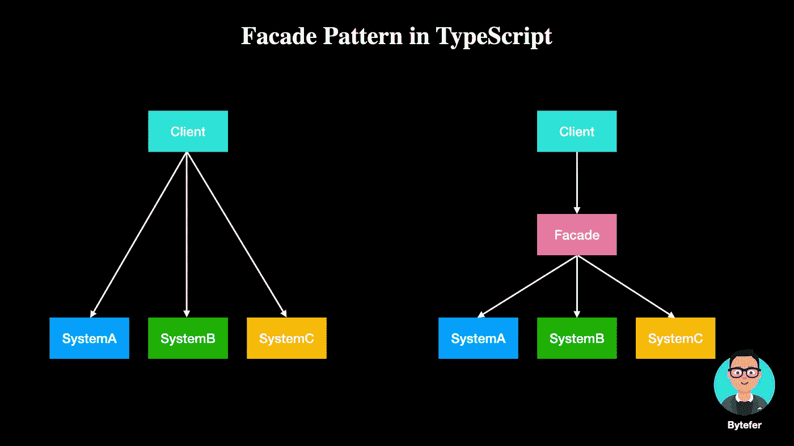
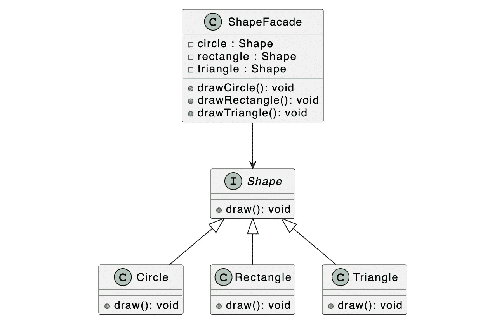
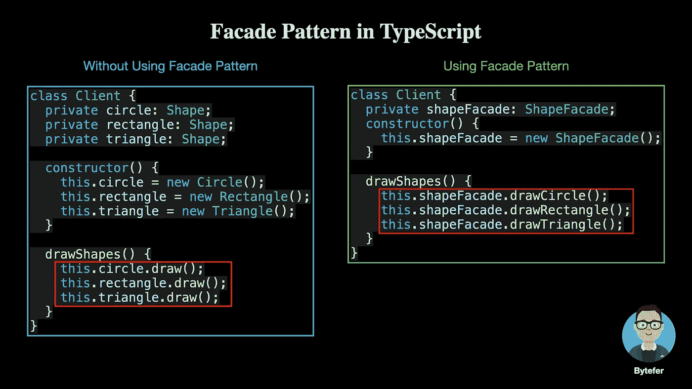

# 设计模式:TypeScript 中的外观模式

> 原文：<https://javascript.plainenglish.io/design-patterns-facade-pattern-in-typescript-53b23f009d9e?source=collection_archive---------3----------------------->

## Facade 模式为一组复杂的子系统接口提供了一个更高级别的统一接口，通过它可以更容易地访问子系统接口


Photo by [Pawel Czerwinski](https://unsplash.com/@pawel_czerwinski?utm_source=medium&utm_medium=referral) on [Unsplash](https://unsplash.com?utm_source=medium&utm_medium=referral)

欢迎来到 TypeScript 系列的**设计模式，这里介绍了一些使用 TypeScript 进行 web 开发时有用的设计模式。**

[](https://medium.com/frontend-canteen/9-design-patterns-every-engineer-should-know-f2423d36d468) [## 每个工程师都应该知道的 9 种设计模式

### 掌握这 9 种设计模式，写出更好的代码

medium.com](https://medium.com/frontend-canteen/9-design-patterns-every-engineer-should-know-f2423d36d468) 

设计模式对于 web 开发人员来说非常重要，通过掌握它们我们可以写出更好的代码。在本文中，我将使用**类型脚本**来介绍 **Facade 模式。**

facade 模式为一组复杂的子系统接口提供了一个更高级别的统一接口，通过它可以更容易地访问子系统接口。**通过引入一个新的 facade 类**，可以降低原有系统的复杂度，减少客户端类和子系统类之间的耦合。



Facade 模式要求子系统外部与其内部之间的通信通过统一的 Facade 对象来执行，Facade 类将客户端与子系统内部的复杂性分开，这样客户端只需要处理 Facade 对象，而不需要处理子系统内部的许多对象。

接下来，我将介绍如何使用 Facade 模式使访问子系统接口变得更容易。为了更好地理解下面的代码，我们先来看看相应的 UML 图:



外观模式包括以下角色:

*   **门面** : ShapeFacade
*   **子系统**:圆形、矩形、三角形

接下来，让我们定义`Shape`接口和实现该接口的三个类来表示不同的形状。

在定义了不同的形状类之后，让我们创建`ShapeFacade`类:

有了`ShapeFacade`类，客户端对象可以使用`ShapeFacade`对象来绘制不同的形状。

为了帮助你更好的理解 facade 模式的作用，我们用一张图来展示不使用 facade 模式和使用 facade 模式的区别:



web 项目中 facade 模式的一个常见用例是处理浏览器 web API 兼容性。例如，在不同的浏览器环境中处理事件监听:

```
function addHandler(element, type, handler) {
  if (element.addEventListener) {
    element.addEventListener(type, handler, false);
  } else if (element.attachEvent) {
    element.attachEvent("on" + type, handler);
  } else {
    element["on" + type] = handler;
  }
}
```

在上面的代码中，我们实现了向不同的浏览器添加事件侦听器的过程。代码实现起来也很简单，但是有一个问题，就是每次调用都需要判断，这显然是不合理的。对于以上问题，我们可以通过**懒加载函数**来解决。

所谓懒加载，就是第一次根据条件执行函数时，第二次调用函数时，不再判断条件，直接执行函数。

为了实现这个函数，我们可以在满足第一个条件判断中的判断条件的分支中覆盖被调用的函数:

```
function addHandler(element, type, handler) {
  if (element.addEventListener) {
    addHandler = function (element, type, handler) {
      element.addEventListener(type, handler, false);
    };
  } else if (element.attachEvent) {
    addHandler = function (element, type, handler) {
      element.attachEvent("on" + type, handler);
    };
  } else {
    addHandler = function (element, type, handler) {
      element["on" + type] = handler;
    };
  }
  // Ensure that the first call can perform monitoring normally
  return addHandler(element, type, handler);
}
```

除了使用上述方法，我们还可以使用自执行函数来实现延迟加载:

```
const addHandler = (function () {
  if (document.addEventListener) {
    return function (element, type, handler) {
      element.addEventListener(type, handler, false);
    };
  } else if (document.attachEvent) {
    return function (element, type, handler) {
      element.attachEvent("on" + type, handler);
    };
  } else {
    return function (element, type, handler) {
      element["on" + type] = handler;
    };
  }
})();
```

最后，让我们总结一下 facade 模式的使用场景:

*   客户端程序和多个子系统之间有很强的依赖性。facade 类的引入将子系统与客户端和其他子系统解耦，这可以提高子系统的独立性和可移植性。
*   在分层结构中，facade 模式可以用来定义系统中每一层的入口点。不是在层之间创建直接的连接，而是通过 facade 类建立连接，减少了层之间的耦合。

如果你有任何问题，请随时给我留言。稍后我会继续介绍其他模式，如果你有兴趣，可以在 [Medium](https://medium.com/@bytefer) 或者 [Twitter](https://twitter.com/Tbytefer) 上关注我。

如果你想学习打字，那么不要错过**掌握打字**系列。

[](https://medium.com/frontend-canteen/with-these-articles-you-will-not-be-confused-when-learning-typescript-d96a5c99e229) [## 有了 30+篇文章，学习 TypeScript 就不会迷茫了

### 通过生动的动画，让你轻松了解 TypeScript 的难点和核心知识！不断地…

medium.com](https://medium.com/frontend-canteen/with-these-articles-you-will-not-be-confused-when-learning-typescript-d96a5c99e229) 

*更内容于* [***普通英语***](https://plainenglish.io/) *。报名参加我们的* [***免费周报***](http://newsletter.plainenglish.io/) *。在*[***Twitter***](https://twitter.com/inPlainEngHQ)[***LinkedIn***](https://www.linkedin.com/company/inplainenglish/)*[***YouTube***](https://www.youtube.com/channel/UCtipWUghju290NWcn8jhyAw)*以及*[**T42 不和**](https://discord.gg/GtDtUAvyhW) *上跟随我们。对增长黑客感兴趣？查看* [***电路***](https://circuit.ooo/) *。**