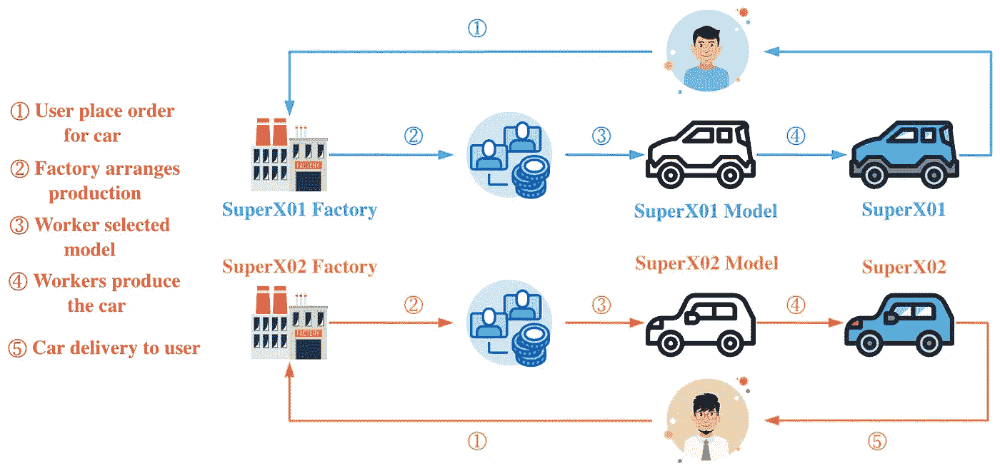

# 设计模式:TypeScript 中的工厂方法模式

> 原文：<https://javascript.plainenglish.io/design-patterns-factory-method-pattern-in-typescript-c4c3047a6289?source=collection_archive---------2----------------------->

## 掌握工厂方法模式，轻松处理对象的创建。


Photo by [amin khorsand](https://unsplash.com/@hero92?utm_source=medium&utm_medium=referral) on [Unsplash](https://unsplash.com?utm_source=medium&utm_medium=referral)

欢迎来到 TypeScript 系列的**设计模式，该系列介绍了一些使用 TypeScript 进行 web 开发时有用的设计模式。**

以前的文章如下:

*   [打字稿中的策略模式](/design-patterns-strategy-pattern-in-typescript-54eda9b40f09)
*   [打字稿中的责任链模式](/design-patterns-chain-of-responsibility-pattern-in-typescript-dba6bdffe456)
*   [打字稿中的观察者模式](/design-patterns-observer-pattern-in-typescript-f6589f1ce4fc)
*   [TypeScript 中的模板方法模式](/design-patterns-template-method-pattern-in-typescript-ce0c8b158985)
*   [类型脚本中的适配器模式](/design-patterns-adapter-pattern-in-typescript-4b7ad3c1c234)
*   [TypeScript 中的工厂方法模式](/design-patterns-factory-method-pattern-in-typescript-c4c3047a6289)
*   [在 TypeScript 中抽象工厂模式](/design-patterns-abstract-factory-pattern-in-typescript-84cd7b002964)

设计模式对于 web 开发人员来说非常重要，通过掌握它们我们可以写出更好的代码。在本文中，我将使用**类型脚本**来介绍**工厂方法模式。**

工厂方法模式，也称为工厂模式，也称为多态工厂模式，属于创造模式。

在工厂方法模式中，工厂父类负责定义创建产品对象的公共接口，而工厂子类负责生成特定的产品对象。**这样做的目的是延迟产品类到工厂子类的实例化。**即通过工厂子类来确定应该实例化哪个具体的产品类。



上图中，我模拟了用户的购车流程。Bytefer 和 Chris1993 年分别从 SuperX01 和 SuperX02 工厂订购了 SuperX01 和 SuperX02 型号，然后工厂生产相应的型号，生产完成后交付给用户。

让我们看看如何使用工厂法来描述在车辆工厂生产给定型号汽车的过程。

为了更好地理解下面的代码，我们先来看看相应的 UML 图:


工厂方法模式包括以下角色:

*   **产品(车辆)**:抽象产品
*   **混凝土产品(SuperX01)** :混凝土产品
*   **工厂(VehicleFactory)** :抽象工厂
*   **混凝土工厂(SuperX01Factory)** :混凝土工厂

接下来，我们定义一个抽象类`Vehicle`及其两个子类`SuperX01`和`SuperX02`来表示不同类型的车辆。

```
abstract class Vehicle {
  abstract run(): void;
}class SuperX01 extends Vehicle {
  run(): void {
    console.log("SuperX01 start");
  }
}class SuperX02 extends Vehicle {
  run(): void {
    console.log("SuperX02 start");
  }
}
```

然后，我们定义`VehicleFactory`类来表示车辆工厂。**抽象类包含一个抽象方法** `**produceVehicle**` **，也就是所谓的工厂方法**。

```
abstract class VehicleFactory {
  abstract produceVehicle(): Vehicle;
}
```

基于`VehicleFactory`抽象类，我们为生产 **SuperX01** 和 **SuperX02** 车型定义了`SuperX01Factory`和`SuperX02Factory`工厂类:

```
class SuperX01Factory extends VehicleFactory {
  produceVehicle(): Vehicle {
    return new SuperX01();
  }
}class SuperX02Factory extends VehicleFactory {
  produceVehicle(): Vehicle {
    return new SuperX02();
  }
}
```

创建了`SuperX01Factory`和`SuperX02Factory`工厂类之后，我们可以开始生产汽车了:

```
const superX01Factory = new SuperX01Factory();
const superX02Factory = new SuperX02Factory();const superX01Vehicle = superX01Factory.produceVehicle();
const superX02Vehicle = superX02Factory.produceVehicle();superX01Vehicle.run();
superX02Vehicle.run();
```

当您成功运行上述代码时，终端将输出以下结果:

```
SuperX01 start
SuperX02 start
```

最后，让我们总结一下工厂方法模式的使用场景:

*   在工厂方法模式中，抽象工厂类只需要提供一个创建产品的接口，它的子类确定要创建的具体对象，利用面向对象的多态性和 Liskov 替换原理，在程序运行时，子类对象会覆盖父类对象，使系统更容易扩展。

如果你有任何问题，请随时给我留言。后面我会继续介绍其他模式，如果你有兴趣，可以关注我的[中](https://medium.com/@bytefer)或者[推特](https://twitter.com/Tbytefer)。

如果你想学习打字稿，那么就不要错过**掌握打字稿**系列。

*   [**TypeScript 泛型中的 K、T、V 是什么？**](https://medium.com/frontend-canteen/what-are-k-t-and-v-in-typescript-generics-9fabe1d0f0f3)
*   [**使用 TypeScript 像 Pro 一样映射类型**](/using-typescript-mapped-types-like-a-pro-be10aef5511a)
*   [**使用 TypeScript 条件类型像亲**](/use-typescript-conditional-types-like-a-pro-7baea0ad05c5)
*   [**使用 TypeScript 交集类型像亲**](/using-typescript-intersection-types-like-a-pro-a55da6a6a5f7)
*   [**使用 TypeScript 推断像亲**](https://levelup.gitconnected.com/using-typescript-infer-like-a-pro-f30ab8ab41c7)
*   [**使用 TypeScript 模板字面类型像亲**](https://medium.com/javascript-in-plain-english/how-to-use-typescript-template-literal-types-like-a-pro-2e02a7db0bac)
*   [**可视化打字稿:15 种最常用的实用类型**](/15-utility-types-that-every-typescript-developer-should-know-6cf121d4047c)
*   [**关于打字班你需要知道的 10 件事**](https://levelup.gitconnected.com/10-things-you-need-to-know-about-typescript-classes-f58c57869266)
*   [](/purpose-of-declare-keyword-in-typescript-8431d9db2b10)**中‘declare’关键字的用途**
*   **[](/no-more-confusion-about-typescripts-any-and-unknown-98c4b53f8924)**不再混淆打字稿的“任何”和“未知”****

****

[Bytefer](https://medium.com/@bytefer?source=post_page-----c4c3047a6289--------------------------------)**** 

## ****掌握打字稿系列****

****[View list](https://medium.com/@bytefer/list/mastering-typescript-series-688ee7c12807?source=post_page-----c4c3047a6289--------------------------------)********47 stories****************************

*****更多内容请看*[***plain English . io***](https://plainenglish.io/)*。报名参加我们的* [***免费周报***](http://newsletter.plainenglish.io/) *。关注我们关于*[***Twitter***](https://twitter.com/inPlainEngHQ)[***LinkedIn***](https://www.linkedin.com/company/inplainenglish/)*[***YouTube***](https://www.youtube.com/channel/UCtipWUghju290NWcn8jhyAw)*[***不和***](https://discord.gg/GtDtUAvyhW) *。对增长黑客感兴趣？检查* [***电路***](https://circuit.ooo/) *。*******