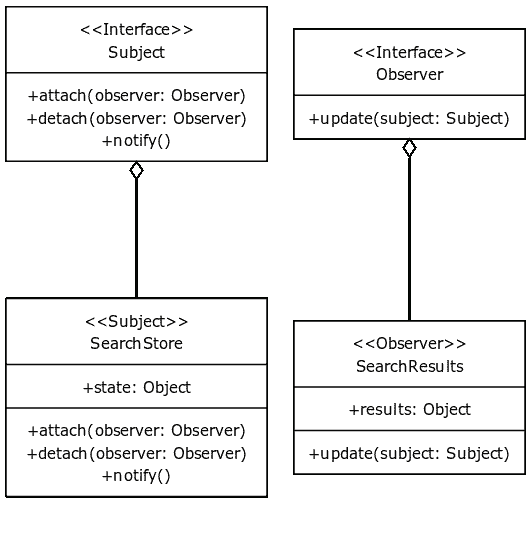

# TypeScript 中的设计模式:观察者模式

> 原文：<https://javascript.plainenglish.io/design-patterns-in-typescript-observer-pattern-cf0adb5e17be?source=collection_archive---------12----------------------->

## 了解如何在 TypeScript 中轻松实现观察者模式

在本系列中，我们将探讨各种设计模式，它们在 TypeScript 中的实现，以及它们如何改善开发人员的生活。

如果你没有读过本系列的前几篇文章，你可能想看看下面的列表，因为随着我们阅读本系列，模式的难度会增加。

[韦斯利·史密斯](https://medium.com/@WesleySmits?source=post_page-----cf0adb5e17be--------------------------------)

## 打字稿中的设计模式

[View list](https://medium.com/@WesleySmits/list/design-patterns-in-typescript-8130a1c7083f?source=post_page-----cf0adb5e17be--------------------------------)2 stories

观察者模式是一种行为设计模式，它允许您建立一个订阅模型来通知其他对象它们正在观察的对象所发生的事件。

> “主体只知道关于它的观察者的一件事，他们实现了一个特定的接口，他们对它是哪个类、它做什么或者它包含什么一无所知。”

## 真实世界的例子

这种模式非常类似于杂志订阅。订阅杂志的人不再需要定期去商店查看最新一期的杂志。该杂志的出版商持有一份所有订户的名单，并在有新的期刊时发送给订户。

## 观察者模式的结构

## 如何在 TypeScript 中实现观察者模式

为了在 TypeScript 中实现观察者模式，我们需要首先理解该模式是如何工作的。

1.  一个拥有某种有趣状态的物体叫做主体。这个主题还包含一个对这个状态感兴趣的订阅者列表。
2.  当这个状态改变时，主题在所有这些订阅者上调用 update()方法。

让我们开始定义两个接口来帮助我们更容易地设置模式。

这有助于我们实施正确的方法，但是每个主体都必须实现包含相同逻辑的 attach、detach 和 notify 方法。让我们也创建一个抽象类来编写这个逻辑。

这个实现非常简单。

*   我们跟踪观察器的数组(这些只是在我们的接口中定义了更新方法的类)
*   `attach()`方法检查传入的观察者是否已经在数组中，如果不是，它将把它推入数组。
*   `detach()`方法从数组中移除传入的观察者。
*   `notify()`方法将对每个观察者调用 update 方法，将对自身的引用作为参数传递。

## 使用观察者模式的优势

1.  主体只知道关于它的观察者的一件事，即他们实现了一个特定的接口，他们对它是哪个类、做什么或包含什么一无所知。
2.  **我们可以随时添加/删除/替换观察员**。由于主题保存了一个需要被通知的观察者的简单列表，所以它会毫无问题地通知列表中的任何东西。
3.  **我们从来不需要为了增加新的观察者而修改主题**。因为一个观察者调用公共的`attach()`方法，我们永远不需要触及这个主题。
4.  如果主题或观察者得到了另一种用法，**我们可以很容易地重用它们，因为这两者不是紧密耦合的。**
5.  **一改互不影响**。因为主体和观察者是松散耦合的，所以只要它们遵守其固有接口的规则，变化就不会相互影响。

## 结论

观察者模式是最容易理解的设计模式之一。这是一个关于设计模式如何改进你的代码的很好的介绍，我建议阅读更多关于这个主题的内容。

感谢阅读。如果你对此有想法，一定要留下评论。

如果你喜欢我的内容，并想支持我的努力，考虑通过[我的会员链接](https://medium.com/@WesleySmits/membership)成为一个媒体订阅者。这不会花费你任何额外的费用，但 Medium 会把部分收益给我，让我推荐你。

如果你愿意，你可以在 [LinkedIn](https://www.linkedin.com/in/wesley-robert-smits/) 或 [Twitter](https://twitter.com/iamwesleysmits) 上联系我！

 [## 通过我的推荐链接加入 Medium-Wesley Smits

### 阅读韦斯利·斯密特(以及媒体上成千上万的其他作家)的每一个故事。您的会员费直接支持…

medium.com](https://medium.com/@WesleySmits/membership) 

*更多内容请看*[***plain English . io***](https://plainenglish.io/)*。报名参加我们的* [***免费周报***](http://newsletter.plainenglish.io/) *。关注我们关于*[***Twitter***](https://twitter.com/inPlainEngHQ)[***LinkedIn***](https://www.linkedin.com/company/inplainenglish/)*[***YouTube***](https://www.youtube.com/channel/UCtipWUghju290NWcn8jhyAw)*[***不和***](https://discord.gg/GtDtUAvyhW) *。***