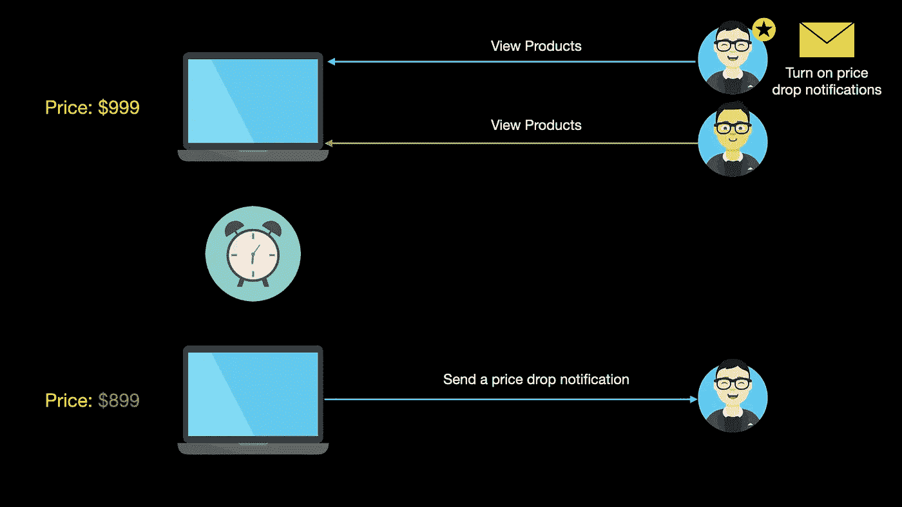
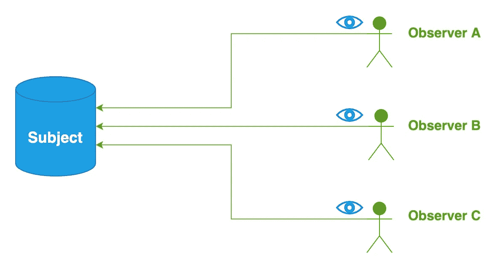
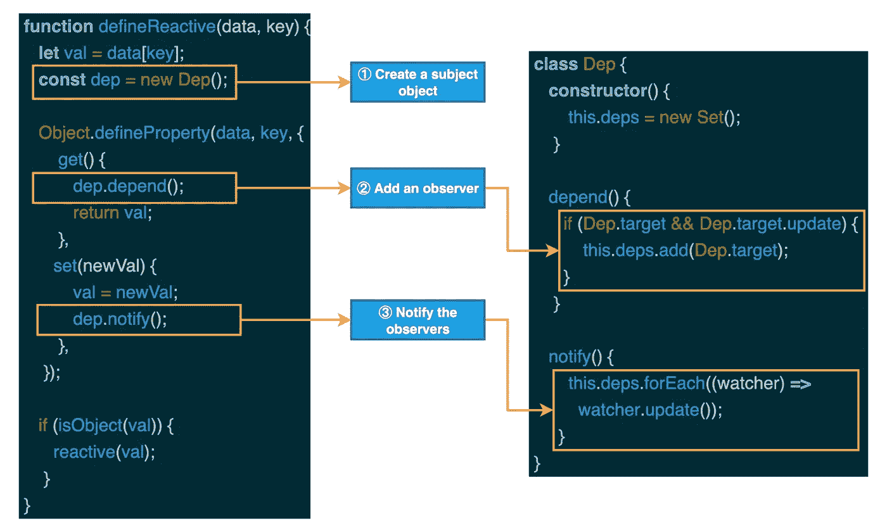

# 设计模式:JavaScript 中的观察者模式

> 原文：<https://javascript.plainenglish.io/design-patterns-observer-pattern-in-javascript-b9611827a876?source=collection_archive---------1----------------------->

## 使用主题在事件发生时通知观察者


Photo by [Daniel Lerman](https://unsplash.com/@dlerman6?utm_source=medium&utm_medium=referral) on [Unsplash](https://unsplash.com?utm_source=medium&utm_medium=referral)

早期很多网上商城运营不佳，没有提供价格下跌预警的功能。所以，这时候要想低价买到自己想要的产品，就需要经常逛网店，查看产品是否降价。这种方式很麻烦，很容易错过最佳购买时机。为了解决这一用户痛点，大多数网上商城不断升级系统，陆续上架了产品降价提醒功能。

以上场景很好理解，但现在问题来了。如果让你模拟实现单一产品的价格下跌预警功能，你会怎么做？给你一点时间考虑一下。让我也分析一下这个功能。

在单个产品降价提醒的场景中，主要包含两个角色:产品和用户。因为对产品感兴趣的用户可能不止一个，他们会开启降价提醒功能，所以产品要保存关注它的用户列表，当产品价格下降时，系统会获取关注该产品的用户列表，并逐一向他们推送消息。相关流程如下图所示。



基于上图中的流程信息，我们先定义一个`Product`类:

```
class Product {
  constructor(pid, name, price) {
    this.pid = pid;
    this.name = name;
    this.price = price;
  }
  userIds = [];

  addNotification(userId) {
    this.userIds.push(userId);
  }

  notifyAllUser(price) {
    this.userIds.forEach((userId) => {
      console.log(
        `Dear user ${userId},the product you are concerned about:
          ${this.name},Price drop of $${this.price - price}.`
      ); 
    });
  }
}

const laptop = new Product("A001", "Notebook", 999);
laptop.addNotification("U001");
laptop.addNotification("U002");
laptop.notifyAllUser(899);
```

当上述代码成功运行时，控制台将输出以下结果:

```
Dear user U001,the product you are concerned about:
            Notebook,Price drop of $100.
Dear user U002,the product you are concerned about:
            Notebook,Price drop of $100.
```

对于上面的例子，我们实际上在`Product`类的定义中使用了观察者模式的思想。**观察者模式定义了一对多的关系，允许多个观察者对象同时监听一个特定的对象。**



当这个对象的状态发生变化时，它会主动通知所有观察者对象，允许它们及时接收消息并执行相应的处理逻辑。

观察者模式主要由以下四个角色组成:

*   `Subject`:抽象类或接口，包含添加观察器、移除观察器和通知观察器的方法；
*   `Concrete Subject`:具体的 subject 类，实现抽象 subject 类或接口中定义的方法。
*   `Observer`:抽象类或接口，一般包含接收更新的抽象方法，在特定主体发生变化时被调用；
*   `Concrete Observer`:接收到更新后，实现抽象观察者中定义的抽象方法来处理具体的业务逻辑。

我将使用观察者模式来实现上面的价格下降提醒功能。首先，让我们重构`Product`类，并提取原始`Product`类中的所有逻辑:

```
class Product {
  constructor(pid, name, price) {
    this.pid = pid;
    this.name = name;
    this.price = price;
  }
}
```

然后，我们定义了`User`类(具体的观察者)，它包含一个用于接收价格下跌通知的`notify`方法。

```
class User {
  constructor(uid, name) {
    this.uid = uid;
    this.name = name;
  }

  notify(product, price) {
    console.log(
      `Dear user ${this.uid},the product you are concerned about:
        ${product.name},Price drop of $${product.price - price}.`
    ); 
  }
}
```

有了`User`类之后，再定义`ProductSubject`(具体科目)类。该类包含添加观察器、移除观察器和通知观察器的三种方法:

```
class ProductSubject  {
   observers = [];

  constructor(pid) {
    this.pid = pid;
  }

  addObserver(observer) {
    this.observers.push(observer);
  }

  deleteObserver(observer) {
    const n = this.observers.indexOf(observer);
    n != -1 && this.observers.splice(n, 1);
  }

  notifyObservers(product, price) {
    this.observers.forEach((observer) => observer.notify(product, price));
  }
}
```

接下来，我们来验证一下重构后的产品降价提醒的功能:

```
const laptop = new Product("A001", "Notebook", 999);
const productSubject = new ProductSubject(laptop.pid);
const u001 = new User("U001", "Bytefer");
const u002 = new User("U002", "Semlinker");
productSubject.addObserver(u001);
productSubject.addObserver(u002);

productSubject.notifyObservers(laptop, 899);
```

当上述代码成功运行时，控制台将输出以下结果:

```
Dear user U001,the product you are concerned about:
        Notebook,Price drop of $100.
Dear user U002,the product you are concerned about:
        Notebook,Price drop of $100.
```

在前端领域，观察者模式是一种非常常见的设计模式。比如在`[**MutationObserver**](https://developer.mozilla.org/en-US/docs/Web/API/MutationObserver)`、`[**IntersectionObserver**](https://developer.mozilla.org/en-US/docs/Web/API/IntersectionObserver)`、`[**PerformanceObserver**](https://developer.mozilla.org/en-US/docs/Web/API/PerformanceObserver)`、`[**ResizeObserver**](https://developer.mozilla.org/en-US/docs/Web/API/ResizeObserver)`、`[**ReportingObserver**](https://developer.mozilla.org/en-US/docs/Web/API/ReportingObserver/ReportingObserver)`中可以看到观察者模式，都是 Web APIs。此外，观察者模式还用于事件监听和数据响应(例如，当数据改变时自动更新页面)。

要实现页面自动更新，需要满足两个条件:**一是能够实现精准更新，二是能够检测到数据变化。**为了实现准确的更新，需要收集对数据变化感兴趣的更新函数(观察者)。在收集完成之后，当检测到数据改变时，可以通知相应的更新功能。

上面的描述可能很难理解，其实要实现自动更新，我们就是要让(1)创建一个 subject object，(2)添加一个 observer，(3)通知 observer 这三个步骤实现自动化，这是实现 responsive 的核心思想。接下来，为了方便你理解上面的内容，我来画个图。



如果你了解 Vue2 的数据响应原理，你就会熟悉上图中的代码，第二步也叫收集依赖关系。通过使用`[**Object.defineProperty**](https://developer.mozilla.org/en-US/docs/Web/JavaScript/Reference/Global_Objects/Object/defineProperty)` API，我们可以拦截对数据的读取和修改操作。

如果在函数体中读取了某些数据，则意味着该函数对数据的变化感兴趣。当读取数据时，会触发定义的`getter`函数，此时可以存储数据的观察者。当数据发生变化时，我们可以通知观察者列表中的所有观察者进行相应的更新操作。

好了，观察者模式到此为止。对于使用过 Vue 的开发者，如果有兴趣，可以回顾一下 Vue2 数据响应相关的代码。

稍后我会继续介绍其他模式，如果你有兴趣，可以关注我的[媒体](https://medium.com/@bytefer)或[推特](https://twitter.com/Tbytefer)。

想学习打字稿，千万不要错过**掌握打字稿**系列。

[](https://medium.com/frontend-canteen/with-these-articles-you-will-not-be-confused-when-learning-typescript-d96a5c99e229) [## 有了 40+篇文章，学习 TypeScript 就不会迷茫了

### 通过生动的动画，让你轻松了解 TypeScript 的难点和核心知识！不断地…

medium.com](https://medium.com/frontend-canteen/with-these-articles-you-will-not-be-confused-when-learning-typescript-d96a5c99e229) 

*更多内容请看*[***plain English . io***](https://plainenglish.io/)*。报名参加我们的* [***免费周报***](http://newsletter.plainenglish.io/) *。关注我们关于*[***Twitter***](https://twitter.com/inPlainEngHQ)[***LinkedIn***](https://www.linkedin.com/company/inplainenglish/)*[***YouTube***](https://www.youtube.com/channel/UCtipWUghju290NWcn8jhyAw)*[***不和***](https://discord.gg/GtDtUAvyhW) ***。*****

*****对缩放您的软件启动感兴趣*** *？检查* [***电路***](https://circuit.ooo/?utm=publication-post-cta) *。***