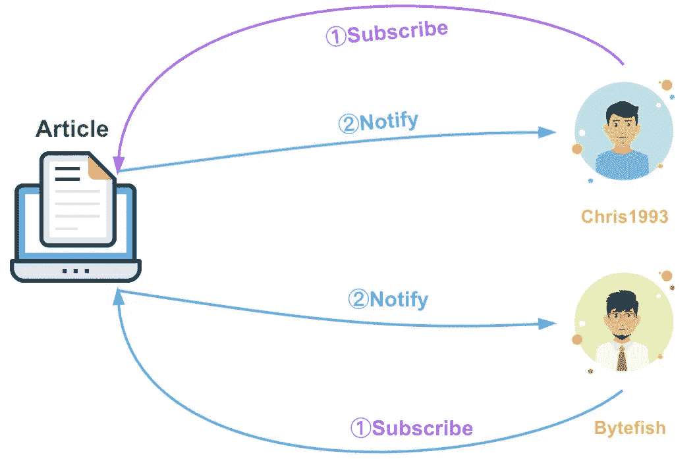
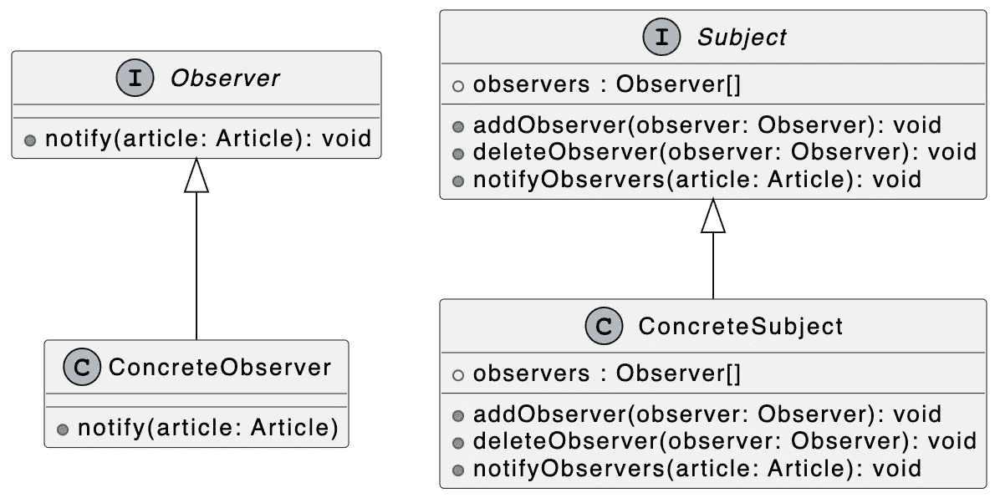
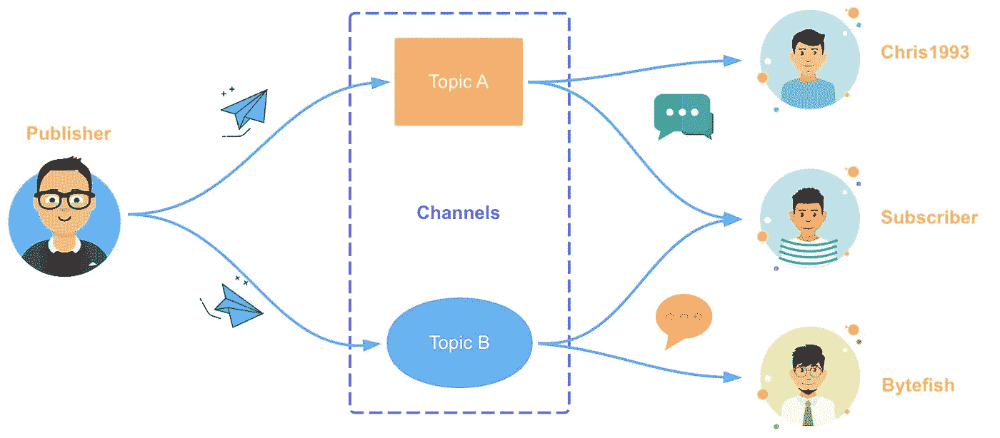

# 设计模式:TypeScript 中的观察者模式

> 原文：<https://javascript.plainenglish.io/design-patterns-observer-pattern-in-typescript-f6589f1ce4fc?source=collection_archive---------3----------------------->

## 掌握观察者模式和发布订阅模式的实现和应用场景。


Photo by [Maarten van den Heuvel](https://unsplash.com/@mvdheuvel?utm_source=medium&utm_medium=referral) on [Unsplash](https://unsplash.com?utm_source=medium&utm_medium=referral)

欢迎来到 TypeScript 系列的**设计模式，该系列介绍了一些使用 TypeScript 进行 web 开发时有用的设计模式。**

以前的文章如下:

*   [类型脚本中的策略模式](/design-patterns-strategy-pattern-in-typescript-54eda9b40f09)
*   [打字稿中的责任链模式](/design-patterns-chain-of-responsibility-pattern-in-typescript-dba6bdffe456)
*   [打字稿中的观察者模式](/design-patterns-observer-pattern-in-typescript-f6589f1ce4fc)
*   [TypeScript 中的模板方法模式](/design-patterns-template-method-pattern-in-typescript-ce0c8b158985)
*   [类型脚本中的适配器模式](/design-patterns-adapter-pattern-in-typescript-4b7ad3c1c234)
*   [TypeScript 中的工厂方法模式](/design-patterns-factory-method-pattern-in-typescript-c4c3047a6289)
*   [在 TypeScript 中抽象工厂模式](/design-patterns-abstract-factory-pattern-in-typescript-84cd7b002964)

设计模式对于 web 开发人员来说非常重要，通过掌握它们我们可以写出更好的代码。在本文中，我将使用**类型脚本**来介绍**观察者模式和发布-订阅模式。**

# **观察者模式**

观察者模式在 web 世界中被广泛使用，`MutationObserver`，`IntersectionObserver`，`PerformanceObserver`，`ResizeObserver`，`ReportingObserver`。这些 API 都可以看到观察者模式。此外，这种模式还用于事件监控和数据响应(比如当数据发生变化，页面自动更新时)。

观察者模式定义了一个**一对多**的关系，允许多个观察者对象同时监视一个主体-对象。当主客体的状态发生变化时，所有的观察者客体都会得到通知，这样它们就可以自动更新。

观察者模式中主要有两个角色:**主体和观察者**。



上图中，主体是我的文章，观察者是 chris1993 和 bytefish。因为观察者模式支持简单的广播通信，所以当新文章发布时，所有观察者都会自动得到通知。

为了更好地理解下面的代码，我们先来看看相应的 UML 类图:



在上图中，我们用`interface`分别定义了`Observer`和`Subject`接口，用于描述**观察者**和**主体**对象。

**观察者界面**

```
interface Observer {
  notify(article: Article): void;
}
```

**主题界面**

```
interface Subject {
  observers: Observer[];
  addObserver(observer: Observer): void;
  deleteObserver(observer: Observer): void;
  notifyObservers(article: Article): void;
}
```

然后，我们分别定义上述接口的实现类:`ConcreteObserver`和`ConcreteSubject`:

**具体观察者类**

```
class ConcreteObserver implements Observer {
  constructor(private name: string) {} notify(article: Article) {
    console.log(`"Article: ${article.title}" has been sent to  ${this.name}.`);
  }
}
```

**混凝土主体类**

```
class ConcreteSubject implements Subject{
  public observers: Observer[] = []; public addObserver(observer: Observer): void {
    this.observers.push(observer);
  } public deleteObserver(observer: Observer): void {
    const n: number = this.observers.indexOf(observer);
    n != -1 && this.observers.splice(n, 1);
  } public notifyObservers(article: Article): void {
    this.observers.forEach((observer) => observer.notify(article));
  }
}
```

让我们验证相应的功能:

```
const subject: Subject = new ConcreteSubject();
const chris1993 = new ConcreteObserver("Chris1993");
const bytefish = new ConcreteObserver("Bytefish");subject.addObserver(chris1993);
subject.addObserver(bytefish);subject.notifyObservers({
  author: "Bytefer",
  title: "Observer Pattern in TypeScript",
  url: "[https://medium.com](https://medium.com/***)/***",
});subject.deleteObserver(bytefish);
subject.notifyObservers({
  author: "Bytefer",
  title: "Adapter Pattern in TypeScript",
  url: "[https://medium.com](/***.com)/***",
});
```

当上述代码成功运行时，终端将输出以下结果:

```
"Article: Observer Pattern in TypeScript" has been sent to Chris1993.
"Article: Observer Pattern in TypeScript" has been sent to Bytefish.
"Article: Adapter Pattern in TypeScript" has been sent to Chris1993.
```

目前，我主要写两个主题，JavaScript 和 TypeScript，所以如果我想发表一篇新文章，只有对 JavaScript 或 TypeScript 感兴趣的读者才会收到通知。如果我们使用观察者模式，我们需要创建两个不同的主题，我们也可以使用**发布-订阅模式**。

# **发布-订阅模式**

在软件架构中，发布-订阅是一种消息传递范式，其中消息的发送者(称为发布者)不直接向特定的接收者(称为订阅者)发送消息。相反，发布的消息被分组到不同的类别中，并发送给不同的订户。同样，订阅者可以表达对一个或多个类别的兴趣，并且只接收感兴趣的消息，而不知道存在哪个发布者。

发布-订阅模型中有三个主要角色:发布者、通道和订阅者。



上图中，发布者为 Bytefer，通道中的 Topic A 和 Topic B 分别对应 JavaScript topic 和 TypeScript topic，订阅者为 chris1993、bytefish 等。

让我们基于发布-订阅模式实现一个 EventEmitter:

定义了`EventEmitter`类后，我们可以这样使用它:

```
const eventEmitter = new EventEmitter();eventEmitter.subscribe("ts", 
  (msg) => console.log(`Received：${msg}`));eventEmitter.publish("ts", "Observer pattern");
eventEmitter.unsubscribe("ts");
eventEmitter.publish("ts", "Pub-Sub pattern");
```

当上述代码成功运行时，终端将输出以下结果:`Received: Observer pattern`。

在事件驱动的架构中，发布-订阅模式扮演着重要的角色。该模式的具体实现可以作为事件总线，实现同一系统中不同组件或模块之间的消息通信。对于广泛使用的插件架构，可以用来实现不同插件之间的消息通信。

看完这篇文章，希望你对观察者模式和发布订阅模式有一定的了解。如果你有任何问题，请随时给我留言。稍后我会继续介绍其他模式，如果你有兴趣，可以在 [Medium](https://medium.com/@bytefer) 或者 [Twitter](https://twitter.com/Tbytefer) 上关注我。

如果你想学习打字，那么不要错过**掌握打字**系列。

*   [**TypeScript 泛型中的 K、T、V 是什么？**](https://medium.com/frontend-canteen/what-are-k-t-and-v-in-typescript-generics-9fabe1d0f0f3)
*   [**使用 TypeScript 像 Pro 一样映射类型**](/using-typescript-mapped-types-like-a-pro-be10aef5511a)
*   [**使用 TypeScript 条件类型像亲**](/use-typescript-conditional-types-like-a-pro-7baea0ad05c5)
*   [**使用 TypeScript 交集类型像亲**](/using-typescript-intersection-types-like-a-pro-a55da6a6a5f7)
*   [**使用打字稿推断像亲**](https://levelup.gitconnected.com/using-typescript-infer-like-a-pro-f30ab8ab41c7)
*   [**使用 TypeScript 模板字面类型像亲**](https://medium.com/javascript-in-plain-english/how-to-use-typescript-template-literal-types-like-a-pro-2e02a7db0bac)
*   [**可视化打字稿:15 种最常用的实用类型**](/15-utility-types-that-every-typescript-developer-should-know-6cf121d4047c)
*   [**关于类型脚本类你需要知道的 10 件事**](https://levelup.gitconnected.com/10-things-you-need-to-know-about-typescript-classes-f58c57869266)
*   [](/purpose-of-declare-keyword-in-typescript-8431d9db2b10)**中‘declare’关键字的用途**
*   **[**不再混淆打字稿的‘任何’和‘未知’**](/no-more-confusion-about-typescripts-any-and-unknown-98c4b53f8924)**

**

[Bytefer](https://medium.com/@bytefer?source=post_page-----f6589f1ce4fc--------------------------------)** 

## **掌握打字稿系列**

**[View list](https://medium.com/@bytefer/list/mastering-typescript-series-688ee7c12807?source=post_page-----f6589f1ce4fc--------------------------------)****47 stories**************

***更多内容请看*[***plain English . io***](https://plainenglish.io/)*。报名参加我们的* [***免费周报***](http://newsletter.plainenglish.io/) *。关注我们关于*[***Twitter***](https://twitter.com/inPlainEngHQ)[***LinkedIn***](https://www.linkedin.com/company/inplainenglish/)*[***YouTube***](https://www.youtube.com/channel/UCtipWUghju290NWcn8jhyAw)*[***不和***](https://discord.gg/GtDtUAvyhW) *。对增长黑客感兴趣？检查* [***电路***](https://circuit.ooo/) *。*****